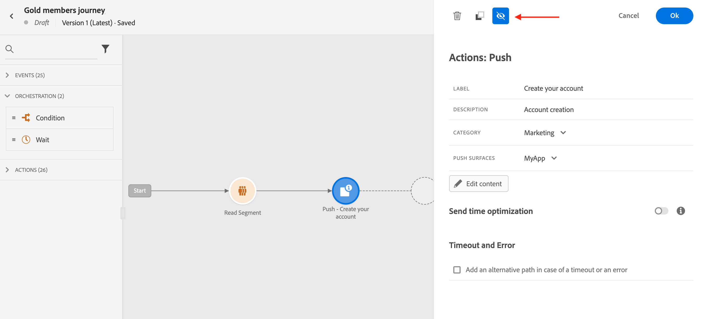
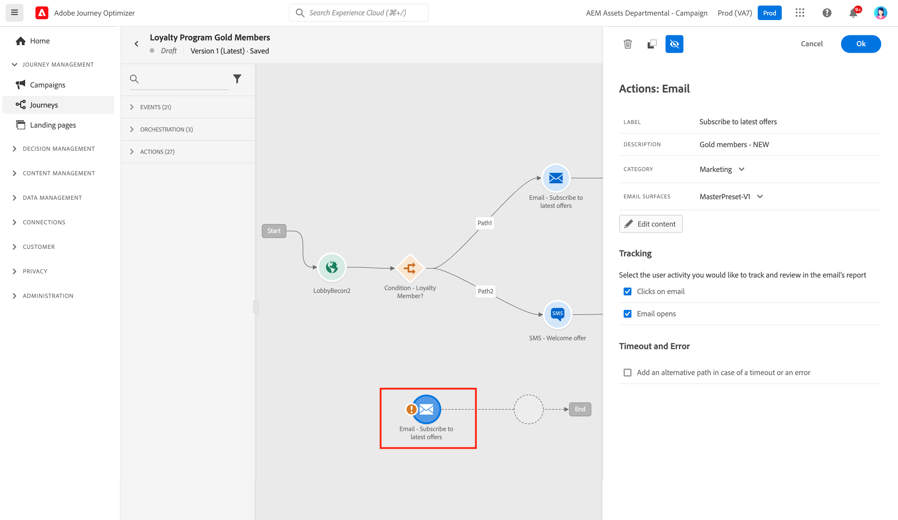
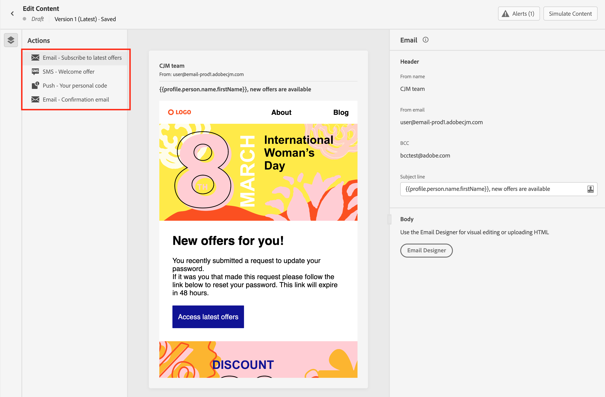
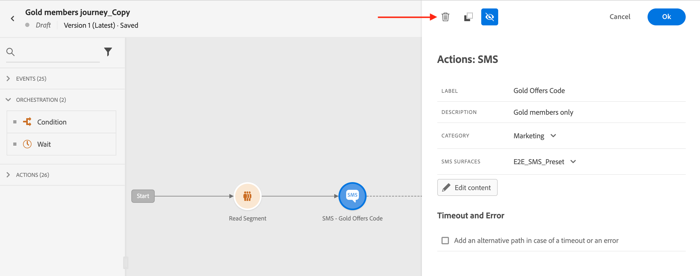

# Get started with messages {#get-started-contents-messages}

>[!CONTEXTUALHELP]
>id="ajo_journey_message"
>title="Message activity"
>abstract="Use the Message activity to send a push, SMS or email message."

Use [!DNL Journey Optimizer] to create and send personalized push notifications, SMS and email messages, and leverage multiple resources like assets and contents in a single place. 

[!DNL Journey Optimizer] messages are built in the context of journeys. You can:

* Use [!DNL Journey Optimizer] **email designing capabilities** to create or import responsive emails.

* Leverage **Adobe Experience Manager Assets Essentials** to enrich your emails, build and manage your own assets database.

* Find **Adobe Stock photos** to build your content and improve your email design.

* Enhance customers' experience by creating personalized **push notifications, SMS and email messages** based on their profile attributes.

* **Create messages** based on these contents, then publish them.

To add messages in your journeys, simply add a push, SMS or email activity in the canevas. 

>[!NOTE]
>
>Users can access, create, edit and/or publish messages depending on their product profile. Learn more about user permissions [in this section](../administration/permissions.md).

## Add messages in your journeys{#messages-in-journeys}

>[!CONTEXTUALHELP]
>id="ajo_message_category"
>title="Message category"
>abstract="Choose Marketing for commercial messages, or Transactional for non-commercial messages such as order confirmation, password reset notifications, or delivery information"

>[!CONTEXTUALHELP]
>id="ajo_message_surface"
>title="Message surface"
>abstract="A channel surface is an instance of that channel that has all the settings to deliver an action successfully via a campaign or a journey. It is defined by a system administrator."

Steps to add a message in a journey are detailed below.

1. Start your journey with an [Event](../building-journeys/general-events.md) or a [Read Segment](../building-journeys/read-segment.md) activity.

1. From the **Actions** section of the palette, drag and drop an **email**, an **SMS** or a **Push** activity into the canvas.  

   

1. Select the message and enter a label and a description.

1. Select the message **[!UICONTROL Category]**: choose **Marketing** for commercial messages, or **Transactional** for non-commercial messages such as order confirmation, password reset notifications, or delivery information.

   >[!NOTE]
   >
   >If you defined [frequency rules](../configuration/frequency-rules.md) for a specific channel and category, they are automatically applied to the message upon selecting that channel and category. Currently only the **[!UICONTROL Marketing]** category is available for frequency rules.

   

   >[!CAUTION]
   >
   >Marketing-type messages must include an [opt-out link](../messages/consent.md#opt-out-management). This is not required for transactional messages as these messages can be sent to profiles who unsubscribed from marketing communications.

1. Select the channel **[!UICONTROL Surface]** (i.e. message preset) to use to send your message. 

   A surface is a configuration which has been defined by a [System Administrator](../start/path/administrator.md). It contains all the technical parameters for sending the message, such as header parameters, subdomain, mobile apps, etc. [Learn more](../configuration/message-presets.md).

   >[!CAUTION]
   >
   >You must choose a valid channel surface for the selected message category and channel.
   
   You can access and modify the message's label, description and surface at any time using the **[!UICONTROL Properties]** button in the message interface.

1. Create the message content. 

   Learn detailed steps to create your message content in the following page:

   * [Create an email](create-email.md)
   * [Create a push notifications](create-push.md)
   * [Create an SMS message](create-sms.md)

## Enable Send-time optimization{#sto-in-journeys}

For email and push notifications, you can enable **[!UICONTROL Send-time optimization]**.
    
Use **[!UICONTROL Send-time optimization]** to schedule personalized send times for each user to grow the open and click rates of your messages. [Learn more](../messages/send-time-optimization.md).

## Advanced parameters{#sto-in-journeys}

Advanced parameters are read-only and hidden by default. 

To access advanced parameters, click the **[!UICONTROL Show read-only fields]** icon on the top of the messsage pane.

Advanced parameters are displayed at the bottom of the message pane. These parameters are defined by the [system administrator](../start/path/administrator.md) in the [surface](../configuration/message-presets.md) (or preset) associated to the message.

For push notifications, you can display the following parameters: Token, AppID, AppPlatform.

For email, you can display the primary email address.

For specific use, you can override these values in specific contexts. To force a value, click the **Enable parameter override** icon to the right of the field. This option may be useful for example to:

* Test an email, you can add your email address. After you have published the journey, the email is sent to you.
* Refer to the email address of the subscribers of a list. Learn more in [this use case](../building-journeys/message-to-subscribers-uc.md).

Click the same icon to reset to the default parameter.

## Browse messages

When multiple messages are used in a journey, you can switch from one to another from the **Edit Content** screen.

You can then [check alerts](alerts.md) and [simulate](../design/preview.md) each content from a single view.

## Duplicate a message {#duplicate-message}

You can copy an existing message from the journey canevas.

To perform this, follow the steps below:

1. Select the message you want to copy.

1. Use the **[!UICONTROL Copy]** button from the **[!UICONTROL Action]** pane.

   

1. Enter **crtl+V** to paste the message.

   The message is added to the journey canevas. All settings and configuration will be copied to the new message.

   

1. Rename the message to be able to differenciate the initial message from the copy, for example when editing messages, as below:

   

>[!NOTE]
>
>For emails, you can also turn an existing message to a template. [Learn more](../design/email-templates.md).

## Delete a message

To delete a message, use the trash icon on the top of the message activity pane.

Use the **[!UICONTROL Confirm]** button to validate.
