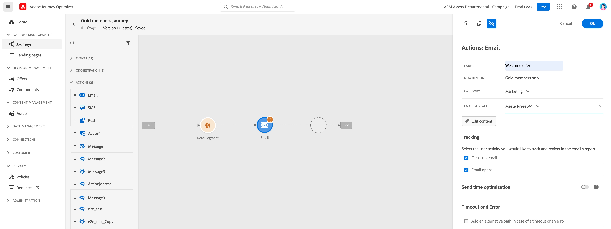

# Get started with messages {#get-started-contents-messages}

Use [!DNL Journey Optimizer] to create and send personalized push notifications, SMS and email messages, and leverage multiple resources like assets and contents in a single place. 

[!DNL Journey Optimizer] messages are built in the context of journeys <!--and campaigns-->. You can:

* Use [!DNL Journey Optimizer] **email designing capabilities** to create or import responsive emails.

* Leverage **Adobe Experience Manager Assets Essentials** to enrich your emails, build and manage your own assets database.

* Find **Adobe Stock photos** to build your content and improve your email design.

* Enhance customers' experience by creating personalized **push notifications, SMS and email messages** based on their profile attributes.

* **Create messages** based on these contents, then publish them.

To add messages in your journeys, simply add a push, SMS or email activity in the canevas. 

## Add an email{#add-an-email}

1. Start your journey with an [Event](../building-journeys/general-events.md) or a [Read Segment](../building-journeys/read-segment.md) activity.

1. From the **Actions** section of the palette, drag and drop an **email** activity into the canvas.  

   

1. Select the email, enter a label, a description, and define the message properties:

   * Select the **[!UICONTROL Message category]**: Marketing or Transactional.
   * Select the **[!UICONTROL Email surface]** (i.e. message preset) to use to send your message. 

      A surfaces is a message configuration which has been defined by an Administrator. It contains all the technical parameters for sending the email, such as header parameters, subdomain and frequency rules. [Learn more](../configuration/message-presets.md).

   * By default, message tracking is enabled and user activity is tracked. Learn more about email tracking in [this page](../design/message-tracking.md)

   

   * You can enable **[!UICONTROL Send-time optimization]** to schedule personalized send times for each user to grow the open and click rates of your messages. [Learn more](../building-journeys/journeys-message.md#send-time-optimization).

>[!NOTE]
>
>Users can access, create, edit and/or publish messages depending on their product profile. Learn more about user permissions [in this section](../administration/permissions.md).

1. Access the message list, then click **[!UICONTROL Create Message]**.

1. Define the message properties.

   
    
   * Enter a **[!UICONTROL Title]** (mandatory) and a **[!UICONTROL Description]**. 

   * Select the **[!UICONTROL Message category]**: Marketing or Transactional.

   * Select the channel(s) you want to use for that message: Email, Push notification and/or SMS. You must select at least one channel to be able to create the message.

   >[!NOTE]
   >
   >You can click the **[!UICONTROL Frequency rule]** link to view the frequency rules that will apply for the selected category and channel(s). Learn more on [frequency rules](../configuration/frequency-rules.md).
   
   * Select the **[!UICONTROL Preset]** to use for the message.
        
      Presets include all the parameters that are required for an email and/or push notification to be sent according to your brand. Learn more on [presets](../configuration/message-presets.md).

   >[!CAUTION]
   >
   >You must choose a valid message preset for the selected category and channel(s).

   Note that you can access and modify the message's title, description and preset at any time using the **[!UICONTROL Properties]** button in the message interface.

1. Click **[!UICONTROL Create]** to confirm message creation. Your message is added in the message list, in the **[!UICONTROL Draft]** status.

   One tab is available for each selected channel. Use these tabs to configure the content for each channel. You can remove a tab by selecting it and clicking the **[!UICONTROL Delete channel]** button on the right. 

   

   <!--
   >[!NOTE]
   >
   >If you enabled the **[!UICONTROL BCC email]** option in the preset, the BCC email address will display under the sender email. [Learn more](../configuration/email-settings.md#bcc-email)
   -->

   You can now create the content of the message and adapt settings. Detailed information about email and push notification configuration is available in the following sections:

   * [Create an email](create-email.md)
   * [Create a push notifications](create-push.md)
   * [Create an SMS message](create-sms.md)

   >[!NOTE]
   >   
   >You can personalize your messages using profiles' data using the expression editor. For more on personalization, refer to [this section](../personalization/personalize.md).

1. Control the rendering of your messages, and check personalization settings with test profiles, using the preview section on the left-hand side. For more on this, refer to [this section](../design/preview.md).

    

1. Check alerts in the upper section of the editor.  Some of them are simple warnings, but others can prevent you from publishing the message. Learn more in [this section](alerts.md).

1. You can now publish your message by clicking the **[!UICONTROL Publish]** button, or keep it as a draft and publish it later on. For more on how to publish messages, refer to [this section](publish-manage-message.md).

## Duplicate a message {#duplicate-message}

To create a message from an existing one, follow the steps below.

1. Open the message you want to copy.

1. Use the **[!UICONTROL Duplicate]** button from the message interface.

   

   All settings and configuration will be copied to the new message.

1. You can rename the message before confirming duplication.

   

1. A confirmation message displays at the bottom of the window once the new message is created.

You can also duplicate a message from the message list, using the dedicated icon from the quick actions menu.

The same confirmation process applies.

