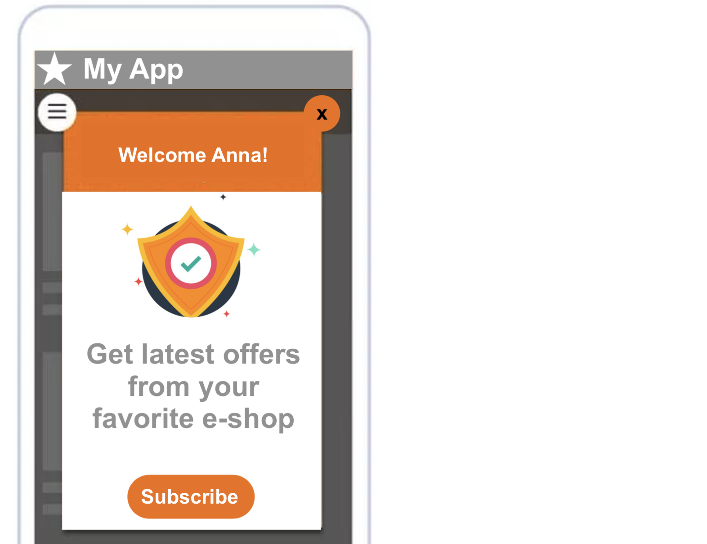
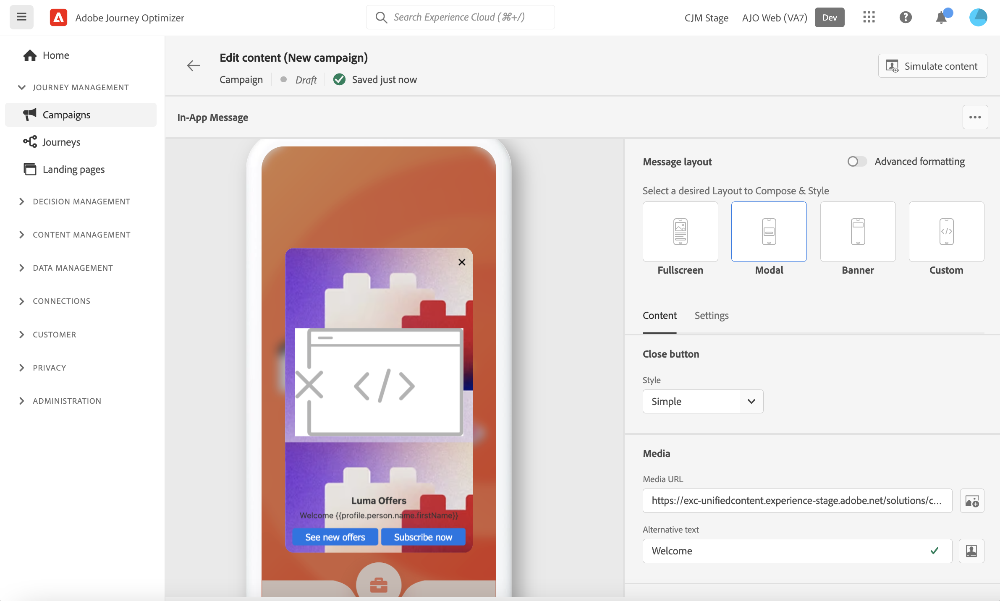

# Send an In-App notifications {#create-in-app}

The In-App Messaging channel allows you to display a message when the user is active within the mobile application. 

In-App messages are notifications you can send to users inside your app to direct them toward specific points of interest. In-app notifications can be used to propose a service, promote a new feature, a special offer, or onboard a new user. 

Use Journey Optimizer to create In-App notifications, and configure experience options, including the message layout and display, text, and button options.

## Prerequisites{#prerequisistes-in-app}

Before sending In-App messages, you need to configure your **[!UICONTROL App surfaces]** in Adobe Experience Platform Data Collection. [Learn more](../configuration/inapp-configuration.md)

In-App messages are created in the context of a campaign. Make sure you have the correct permissions on Journey Optimizer campaigns before starting. [Learn more](../campaigns/get-started-with-campaigns.md#campaign-prerequisites)

Once done, you can create, configure and sent your first In-App message. Learn how to achieve this in [this section](create-in-app.md).