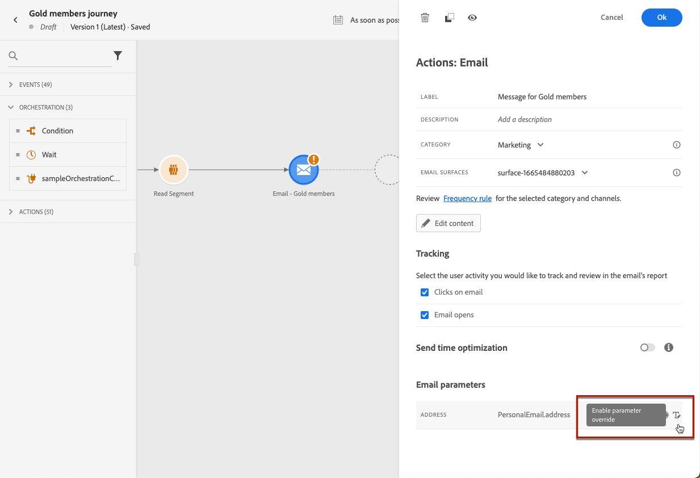

# Add messages in journeys{#messages-in-journeys}

>[!CONTEXTUALHELP]
>id="ajo_message_category"
>title="Message category"
>abstract="Choose Marketing for commercial messages, or Transactional for non-commercial messages such as order confirmation, password reset notifications, or delivery information"

>[!CONTEXTUALHELP]
>id="ajo_message_surface"
>title="Channel surface"
>abstract="A channel surface is an instance of that channel that has all the settings to deliver an action successfully via a campaign or a journey. It is defined by a system administrator."

In your journeys, use the channel actions to design and personalize the message you want to send to your audience. When you add an email, a SMS or a Push action to the journey canvas, you are creating a triggered send. When contacts reach that channel action, Adobe Journey Optimizer automatically sends the message.

>[!NOTE]
>You can also create campaigns to send scheduled messages. Learn more [in this section](../campaigns/get-started-with-campaigns.md).

To add messages in a journey, add a push, SMS or email activity in the journey canvas. 

1. Start your journey with an [Event](../building-journeys/general-events.md) or a [Read Segment](../building-journeys/read-segment.md) activity.

1. From the **Actions** section of the palette, drag and drop an **email**, an **SMS** or a **Push** activity into the canvas.  

   

1. Enter a label and a description.

1. Select the message **[!UICONTROL Category]**: choose **Marketing** for commercial messages, or **Transactional** for non-commercial messages such as order confirmation, password reset notifications, or delivery information.

   
   
   >[!CAUTION]
   >
   >* If you defined [frequency rules](../configuration/frequency-rules.md) for a specific channel and category, they are automatically applied to the message upon selecting that channel and category. Currently only the **[!UICONTROL Marketing]** category is available for frequency rules.
   >
   >* Marketing messages must include an [opt-out link](../privacy/opt-out.md#opt-out-management). This is not required for transactional messages as these messages can be sent to profiles who unsubscribed from marketing communications.

1. Select the channel **[!UICONTROL Surface]** (i.e. message preset) to use to send your message. 

   A surface is a configuration which has been defined by a [System Administrator](../start/path/administrator.md). It contains all the technical parameters for sending the message, such as header parameters, subdomain, mobile apps, etc. [Learn more](../configuration/channel-surfaces.md).

   >[!CAUTION]
   >
   >You must choose a valid channel surface for the selected message category and channel.
   
   You can access and modify the message's label, description and surface at any time using the **[!UICONTROL Properties]** button in the message interface.

1. Create the message content. 

   Learn detailed steps to create your message content in the following page:

   * [Create an email](create-email.md)
   * [Create a push notifications](create-push.md)
   * [Create an SMS message](create-sms.md)

## Enable Send-time optimization{#sto-in-journeys}

For email and push notifications, you can enable **[!UICONTROL Send-time optimization]**.
    
Use **[!UICONTROL Send-time optimization]** to schedule personalized send times for each user to grow the open and click rates of your messages. [Learn more](../messages/send-time-optimization.md).

## Advanced parameters{#adv-settings}

Advanced parameters are read-only and hidden by default. 

To access advanced parameters, click the **[!UICONTROL Show read-only fields]** icon on the top of the messsage pane. Click the same icon to hide advanced settings.

Advanced parameters are displayed at the bottom of the message pane. These parameters are defined by the [system administrator](../start/path/administrator.md) in the [channel surface](../configuration/channel-surfaces.md) (i.e. message preset) associated with the message.

For push notifications, you can display the following parameters: Token, AppID, AppPlatform.

>[!NOTE]
>
>If you overwrite one of these attributes, all three need to be overridden too. 

For email, you can display the [primary email address](../configuration/primary-email-addresses.md).

In specific contexts, you can override these values for specific use. To force a value, click the **[!UICONTROL Enable parameter override]** icon to the right of the field.

This option may be useful for example to:

* Test an email. You can add your email address; after you have published the journey, the email is sent to you.
* Refer to the email address of the subscribers of a list. Learn more in [this use case](../building-journeys/message-to-subscribers-uc.md).

>[!NOTE]
>
>Email address override should only be used for specific use cases. Most of the time, you do not need to change the email address because the value defined as the primary address in the **[!UICONTROL Execution fields]** is the one that should be used. [Learn more](../configuration/primary-email-addresses.md)

## Browse messages{#browse-message}

When multiple messages are used in a journey, you can switch from one to another from the **Edit Content** screen.

You can then [check alerts](alerts.md) and [simulate](../design/preview.md) each content from a single view.

## Duplicate a message {#duplicate-message}

You can copy an existing message from the journey canvas.

To perform this, follow the steps below:

1. Select the message you want to copy.

1. Use the **[!UICONTROL Copy]** button from the **[!UICONTROL Action]** pane.

   

1. Enter **crtl+V** to paste the message.

   The message is added to the journey canvas. All settings and configuration will be copied to the new message.

   

1. Rename the message to be able to differentiate the initial message from the copy, for example when editing messages, as below:

   

>[!NOTE]
>
>For emails, you can also turn an existing message to a template. [Learn more](../design/email-templates.md).

## Delete a message{#delete-message}

To delete a message, use the trash icon on the top of the channel action activity pane.

Use the **[!UICONTROL Confirm]** button to validate.
