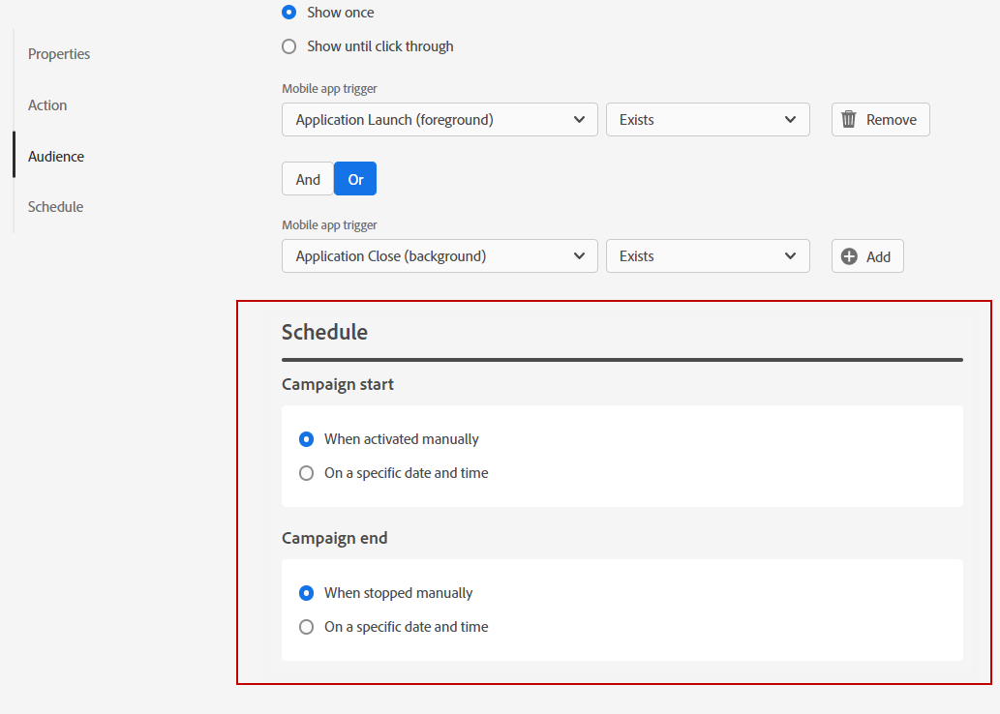

# Send your In-App messages{#in-app-send}

## Review and activate your In-App notification{#in-app-review}

Once your In-App message is created, and its content defined and personalized, you can review and activate it.

To perform this, follow the steps below:

1. Use the **[!UICONTROL Review to activate]** button to display a summary of your message.

    The summary allows you to modify your campaign if necessary, and to check if any parameter is incorrect or missing.

    

1. Check that your campaign is correctly configured, then click **[!UICONTROL Activate]**.

Your campaign is now activated. The In-App notification configured in the campaign is sent immediately, or on the specified date.

Once sent, you can measure the impact of your In-App messages within the Campaign report. For more on reporting, refer to [this section](../reports/campaign-global-report.md).

## Send the In-App message {#in-app-msg-send}

In-App messages are sent according to the campaign schedule.

Campaigns are designed to be executed on a specific date or on a recurring frequency. Learn how to configure the **[!UICONTROL Schedule]** of your campaign in [this section](../campaigns/create-campaign.md#schedule). 

## Display the notification{#in-app-display}

Once In-App messages are sent, In-App notifications are displayed in your user device according to the conditions defined in the campaign.

The events which trigger the notification are  selected from from the **[!UICONTROL Mobile app trigger]**
drop-down. 

You can also customize the frequency of your trigger at the campaign level.

Learn more about this configuration in [this section](create-in-app.md#create-in-app-in-a-campaign).