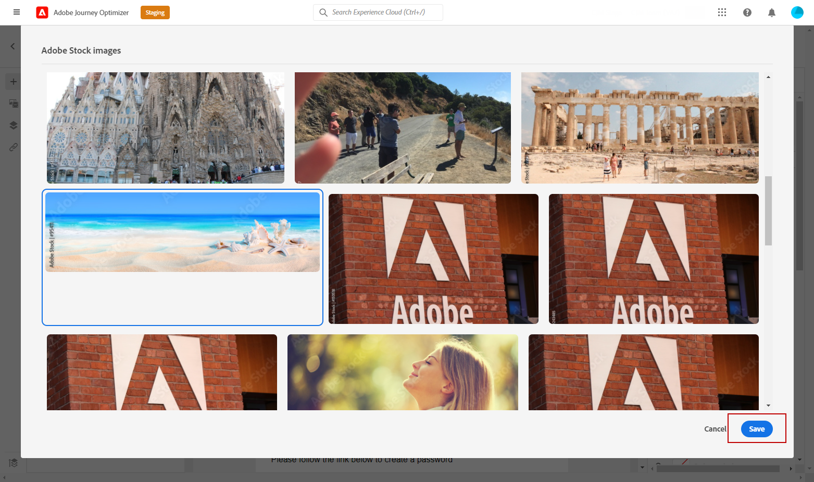
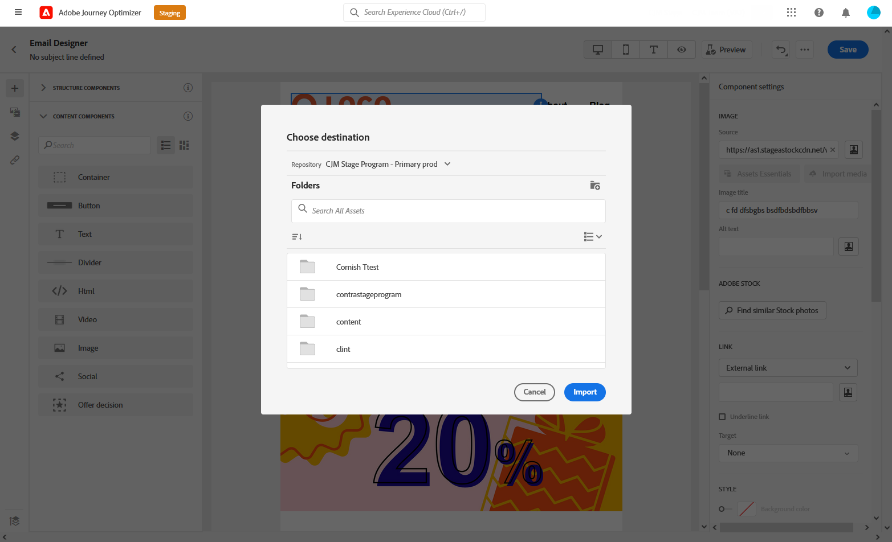
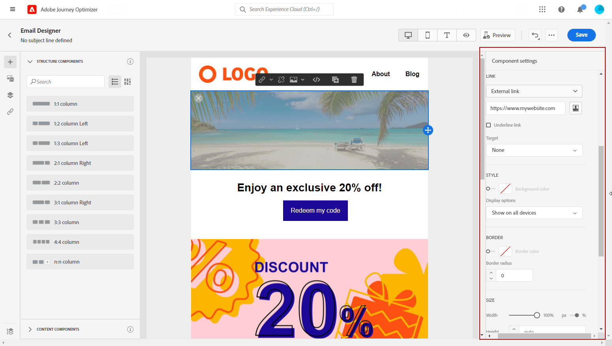

# Manage [!DNL Adobe Stock] images {#stock}

## Get started with [!DNL Adobe Stock] {#get-started-stock}

>[!NOTE]
>This feature is available in early access. Contact your Adobe Account Executive to activate it

[!DNL Adobe Stock] provides access to millions of high-quality, curated, royalty-free photos, videos, illustrations, and vector graphics. You can choose to purchase a credit pack to license assets or only buy one Standard or Extended license for the needed asset. Adobe Stock also provides a free collection of assets.

For more information on [!DNL Adobe Stock], refer to [Adobe Stock Get Started](https://helpx.adobe.com/stock/get-started.html).

With [!DNL Adobe Journey Optimizer], you can upload images to your emails directly from [!DNL Adobe Stock] and add it to your Assets folder. The **[!UICONTROL Find Similar Image]** option will help you find images that match the content, color, and composition of the asset used in your delivery.
[Learn more about email design](design-emails.md).

## Insert and import [!DNL Adobe Stock] images {#add-stock-image}

After editing and personalizing your email, you can add images from [!DNL Adobe Stock] to your template:

1. Drag and drop an Image **[!UICONTROL Content components]** to your email.

    

1. From the **[!UICONTROL Component settings]** menu, select **[!UICONTROL Find Adobe Stock photos]**.

    

1. Browse through the library or enter your search term in the field. Select the chosen image and click **[!UICONTROL Save]**.

    

1. To license and download your image, select your Image **[!UICONTROL Content components]** and click **[!UICONTROL License Adobe Stock image]**. You will be redirected to the [!DNL Adobe Stock] website.

    >[!NOTE]
    > If your image is already licensed, it will be represented by the  icon. In that case, you can skip forward to step 7.

    

1. From the [!DNL Adobe Stock] website, you will need to purchase your asset to be able to download the image and remove the watermark. 

    This purchase will depend on your Adobe Stock plan or subscription. For more on this, refer to this [page](https://stock.adobe.com/plans).
    
    >[!WARNING]
    > If an email including an unlicensed image is sent, the image will keep its unlicensed form with the watermark.

    

1. Once your purchase has been completed, you can now head back to your email in [!DNL Adobe Journey Optimizer] and select **[!UICONTROL Import stock image]** to import your licensed image to your assets. 

    

1. Select in which folder your asset will be stored. For more information on [!DNL Assets Essentials], refer to this [page](assets-essentials.md#get-started-assets-essentials).

    

1. After selecting your image from [!DNL Adobe Stock], use the **[!UICONTROL Find similar Stock photos]** option to locate assets that match the content, color, and composition of an image. 

    Note that this option is available for licensed/unlicensed Stock images and images from your Assets folder.

    

1. Further customize your image with the **[!UICONTROL Components settings]** menu. [Learn more about components settings](content-components.md)

    

Once your message has been created and personalized, you can publish it to make it available for execution. [Learn more](publish-manage-message.md)