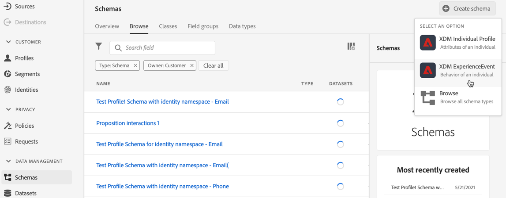
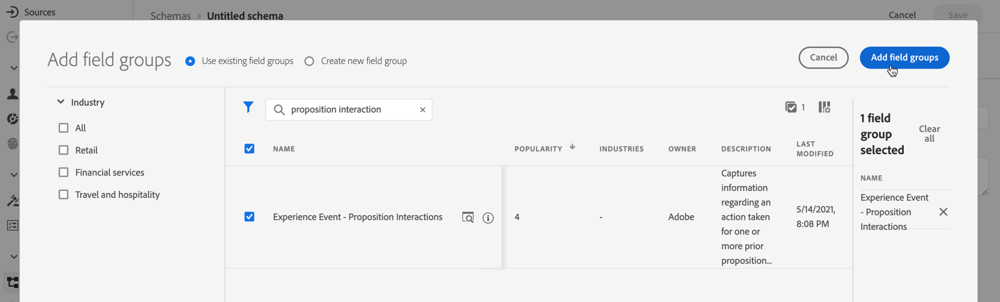
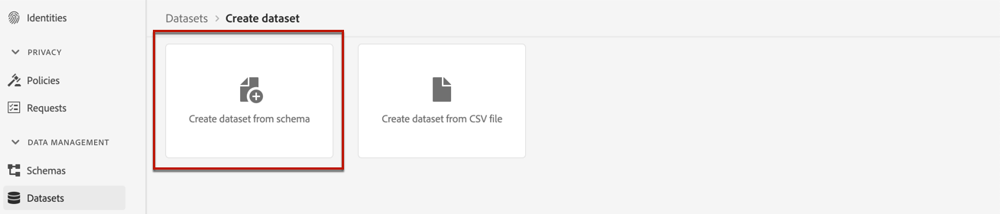

# Create a dataset to collect events {#create-dataset}

To collect experience events, you first need to create a dataset where these events will be sent.

Start by creating the schema that will be used in your dataset:

1. From the **[!UICONTROL Data Management]** menu, select **[!UICONTROL Schema]**.

1. Click **[!UICONTROL Create schema]**, in the top right, select **[!UICONTROL Experience Event]** and click **Next**.

    

    >[!NOTE]
    >
    >Learn more on XDM schemas and fields groups in the [XDM System overview documentation](https://experienceleague.adobe.com/docs/experience-platform/xdm/home.html){target="_blank"}.

1. Enter a name and description for your schema and click **Finish**.
    

1. From the **[!UICONTROL Field groups]** section on the left, select **[!UICONTROL Add]**.

    

1. In the **[!UICONTROL Search]** field, type "proposition interaction".

1. Select the **[!UICONTROL Experience Event - Proposition Interactions]** field group and click **[!UICONTROL Add field groups]**.

    

    >[!CAUTION]
    >
    >The schema that will be used in your dataset must have the **[!UICONTROL Experience Event - Proposition Interactions]** field group associated with it. Otherwise you will not be able to use it in your AI model.

1. Save the schema.

>[!NOTE]
>
>Learn more on building schemas in [Basics of schema composition](https://experienceleague.adobe.com/docs/experience-platform/xdm/schema/composition.html#understanding-schemas){target="_blank"}.

You're now ready to create a dataset using this schema. To do this, follow the steps below:

1. From the **[!UICONTROL Data Management]** menu, select **[!UICONTROL Datasets]** and go to the **[!UICONTROL Browse]** tab.

1. Click **[!UICONTROL Create dataset]** and select **[!UICONTROL Create dataset from schema]**.

    
    
1. Select the schema you just created from the list and click **[!UICONTROL Next]**.

1. Provide a unique name for the dataset in the **[!UICONTROL Name]** field and click **[!UICONTROL Finish]**.

    

>[!NOTE]
>
>This dataset can now be selected to collect event data when [creating an AI model](../ranking/create-ranking-strategies.md).
