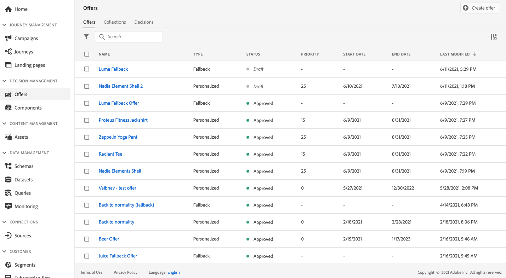
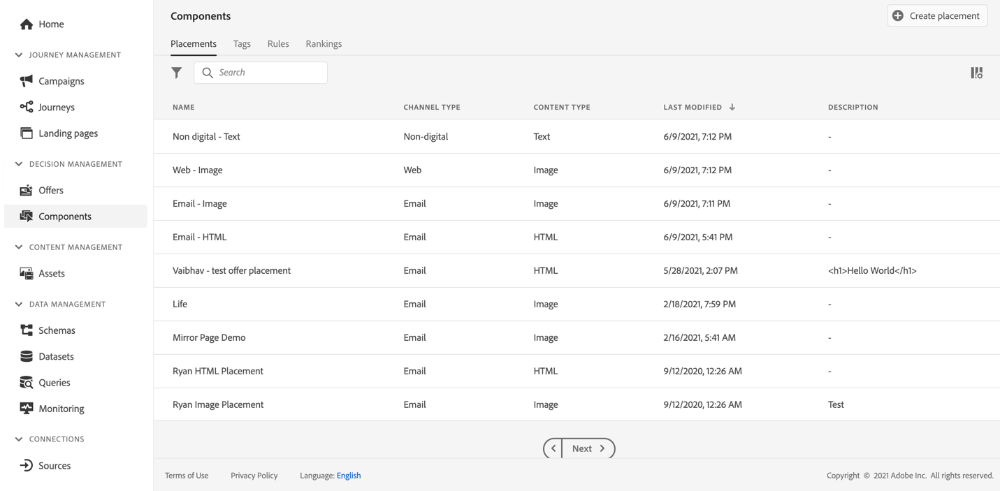
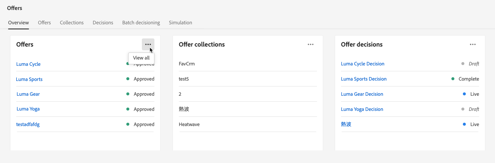
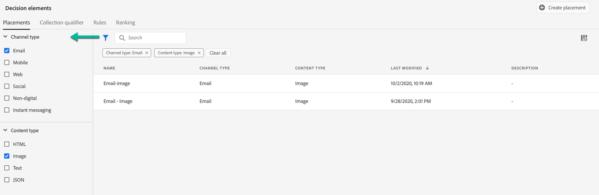
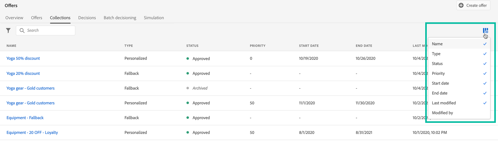
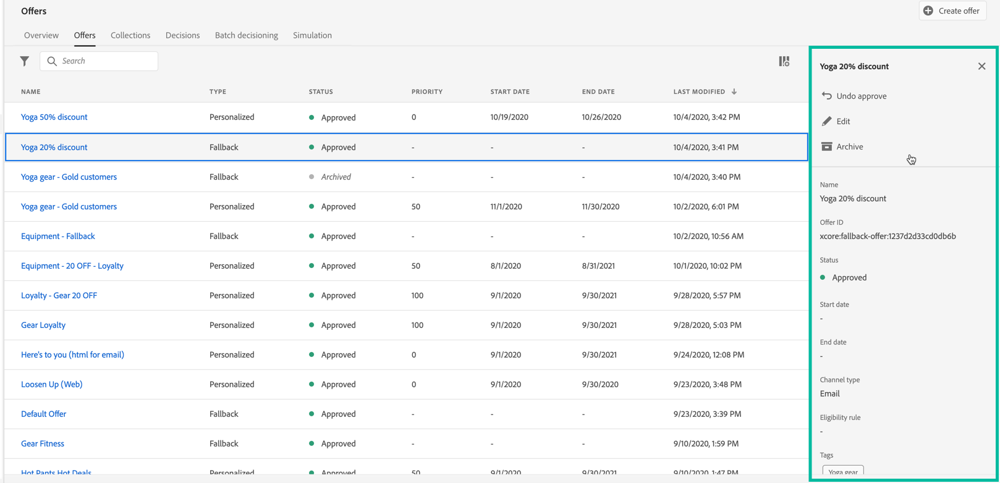
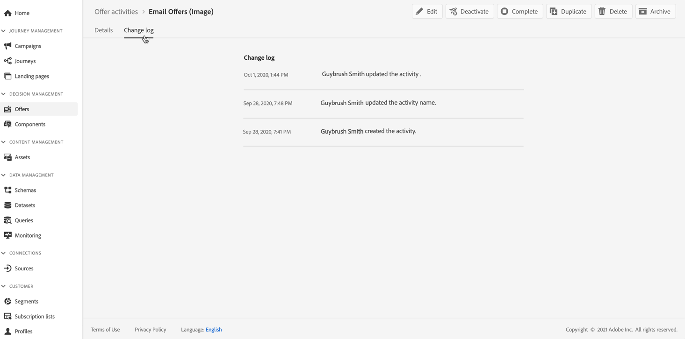

# User Interface {#user-interface}

The **[!UICONTROL Decision management]** section in the left rail provides two menus that give you access to decision managements capabilities: 

Use the **[!UICONTROL Offers]** menu to manage and deliver your offers:

* **[!UICONTROL Overview]**: New to [!DNL decision management]? Follow the on-screen steps to get started with setting up placements, offers, and collections. When already familiar with [!DNL decision management], get an overview on your most recent offers, collections and decisions. [Learn more](#overview)
* **[!UICONTROL Offers]**: Create and access your personalized and fallback offers. Learn how to create [offers](../offer-library/creating-personalized-offers.md) and [fallback offers](../offer-library/creating-fallback-offers.md)
* **[!UICONTROL Collections]**: Organize your offers into static and dynamic collections. [Learn more](../offer-library/creating-collections.md)
* **[!UICONTROL Decisions]**: Create and manage decisions to deliver your offers. [Learn more](../offer-activities/create-offer-activities.md)
* **[!UICONTROL Batch decisioning]**: Deliver offer decisions to all profiles in a given Adobe Experience Platform segment. [Learn more](../batch-delivery.md)
* **[!UICONTROL Simulation]**: Validate your decisioning logic by simulating which offers will be delivered to a test profile for a given placement. [Learn more](../offer-activities/simulation.md)

Use the **[!UICONTROL Components]** menu to create and manage components that are required to create offers and decisions:

* **[!UICONTROL Placements]**: Create and manage placements where your offers will display. [Learn more](../offer-library/creating-placements.md)
* **[!UICONTROL Collection qualifiers]**: Create and manage collection qualifiers (previously known as "tags") to organize and filter your offers. [Learn more](../offer-library/creating-tags.md)
* **[!UICONTROL Rules]**: Manage the conditions under which your offers are presented. [Learn more](../offer-library/creating-decision-rules.md)
* **[!UICONTROL Ranking]**: Create and manage ranking formulas to determine which offer should be presented first for a given placement. [Learn more](../ranking/create-ranking-formulas.md)

>[!NOTE]
>
>If you are experiencing issues accessing decision management or some of its features, check with an Admin user that you have been granted the required rights. See [Grant access to Decision Management](starting-offer-decisioning.md#granting-acess-to-decision-management).

## Overview {#overview}

When you are new to [!DNL decision management], the **[!UICONTROL Overview]** tab guides you through the main steps needed to start building your first offer decision. Follow the on-screen steps to start creating placements, offers, and collections. Once you are done with these first steps, you are prompted to created offer decisions.

>[!NOTE]
>
>The main steps to create offers and use them in a decision are presented in [this section](../offer-library/key-steps.md).

When you are more familiar with [!DNL decision management] and you have already created at least one offer decision, the **[!UICONTROL Overview]** tab displays your most recent offers, collections and decisions.

Click an offer or a decision to directly access the selected item's details.

Click the **[!UICONTROL View all]** button to access the offer, collection, or decision lists.

## Search and filter information {#search-and-filter-information}

Use the **search bar** to find a specific item.

**Filters** can also be accessed by clicking the filter icon on the top left of the list. They allows you to filter the displayed elements according to different criteria. You can, for example, filter the placements that have been created for the email communication channel and image-type contents.

## Customize displayed information {#customize-displayed-information}

Lists from Decision Management menus can be personalized using the configuration button on the top right of the lists.

This allows you to choose the information to display according to your needs.

Note that columns customization is saved for each user.

## Information pane {#information-pane}

In the different lists, select an element to display an information pane that will allow you to retrieve information and perform basic actions on the element. 

The offers and decisions lists also allow you to perform bulk actions on several elements. To do this, select the desired offers or decisions, then select the action you want to perform from the information pane. 

Note that you can also duplicate an existing offer or decisions in order to create a copy with the **[!UICONTROL Draft]** status. This can be performed either from the information pane or from an offer or a decision's detailed view.

## Offers and decisions change logs {#changes-logs}

The Offer Library allows you to visualize all the changes that have been made to an offer or a decision. To do this, open the offer or decision by clicking on its name in the list, then select the **[!UICONTROL Change log]** tab.

All the changes that have been made display in this screen, as well as the name of the user that performed the changes.

