# Create decisions {#create-offer-activities}

Decisions are containers for your offers that will leverage the Offer Decision Engine in order to pick the best offer to deliver, depending on the target of the delivery.

➡️ [Learn how to create offer activities in this video](#video)

The list of decisions is accessible in the **[!UICONTROL Offers]** menu > **[!UICONTROL Decisions]** tab. Filters are available to help you retrieve decisions according to their status or start and end dates.

Before creating a decision, make sure that the components below have been created in the Offer Library:

* [Placements](../offer-library/creating-placements.md)
* [Collections](../offer-library/creating-collections.md)
* [Personalized offers](../offer-library/creating-personalized-offers.md)
* [Fallback offers](../offer-library/creating-fallback-offers.md)

## Create the decision {#create-activity}

1. Access the decision list, then click **[!UICONTROL Create decision]**.

1. Specify the decision's name.

1. Define a start and end date and time if needed, then click **[!UICONTROL Next]**.

    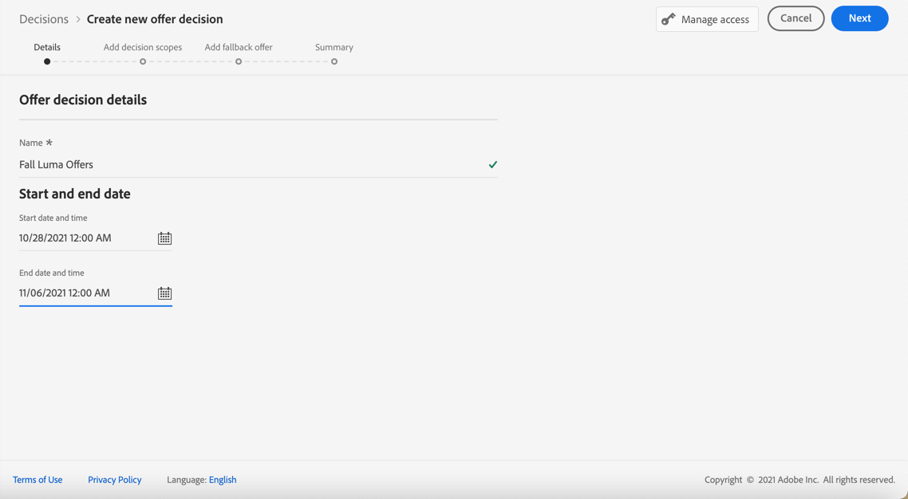

1. To assign custom or core data usage labels to the decision, select **[!UICONTROL Manage access]**. [Learn more on Object Level Access Control (OLAC)](../../administration/object-based-access.md)

## Define decision scopes {#add-decision-scopes}

1. Select a placement from the drop-down list. It will be added to the first decision scope in your decision.

    

1. Click **[!UICONTROL Add]** to select evaluation criteria for this placement.

    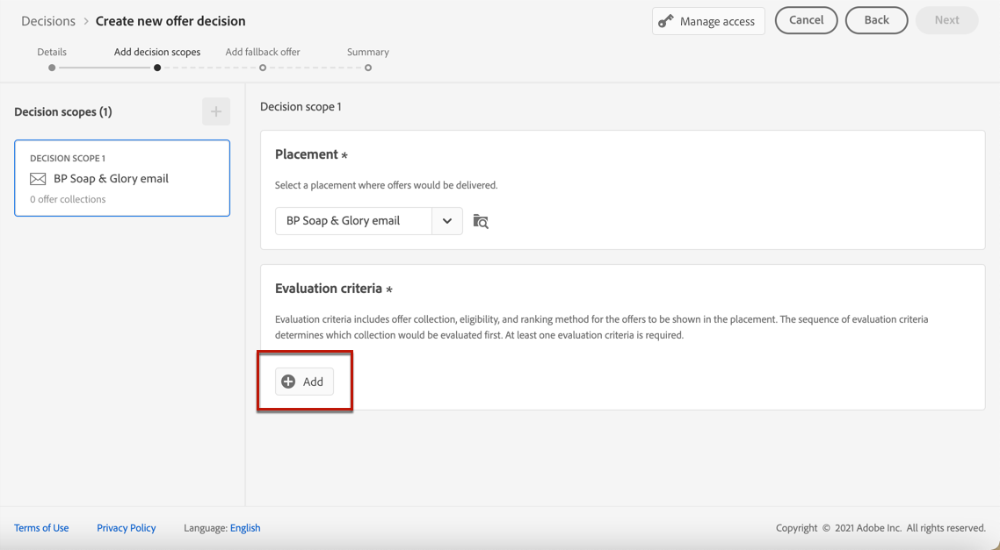

    Each criteria consists in an offer collection associated with an eligibility constraint and a ranking method to determine the offers to be shown in the placement.
    
    >[!NOTE]
    >
    >At least one evaluation criteria is required.

1. Select the offer collection that contains the offers to consider, then click **[!UICONTROL Add]**.

    

    >[!NOTE]
    >
    >You can click the **[!UICONTROL Open offer collections]** link to display the list of collections in a new tab, which enables you to browse the collections and the offers they contain.

    The selected collection is added to the criteria.

    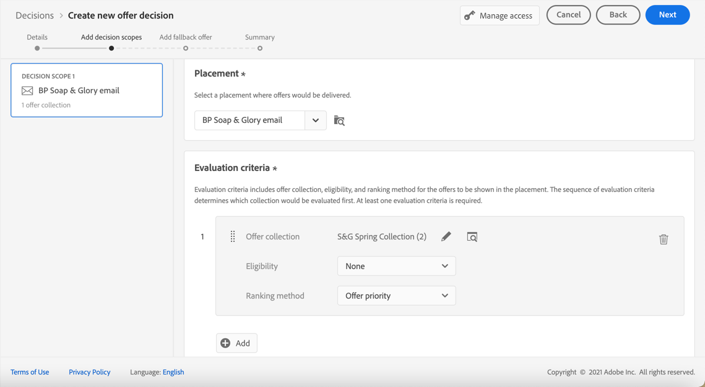

1. Use the **[!UICONTROL Eligibility]** field to restrict the selection of offers for this placement.

    This constraint can be applied by using a **decision rule**, or one or several **Adobe Experience Platform audiences**. Both are detailed in [this section](../offer-library/add-constraints.md#segments-vs-decision-rules).

    * To restrict the selection of the offers to the members of an Experience Platform audience, select **[!UICONTROL Audiences]**, then click **[!UICONTROL Add audiences]**.

        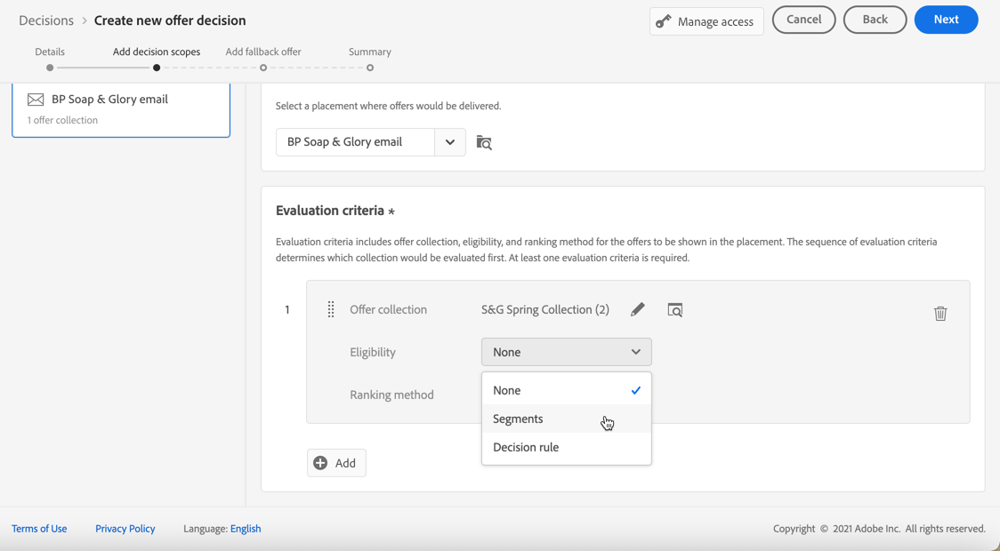
    
        Add one or several audiences from the left pane, and combine them using the **[!UICONTROL And]** / **[!UICONTROL Or]** logical operators.

        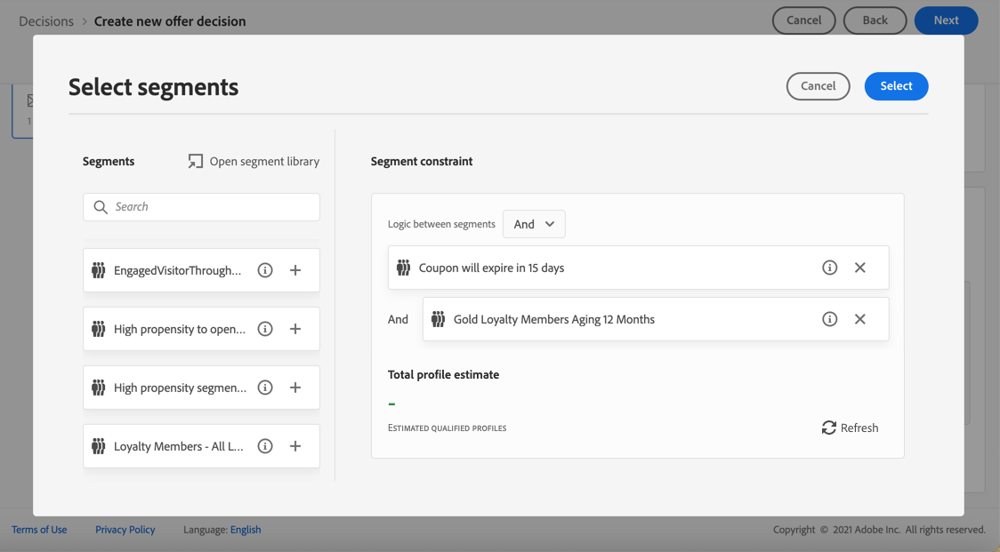

        Learn how to work with audiences in [this section](../../audience/about-audiences.md).

    * If you want to add a selection constraint with a decision rule, use the **[!UICONTROL Decision rule]** option and select the rule of your choice.

        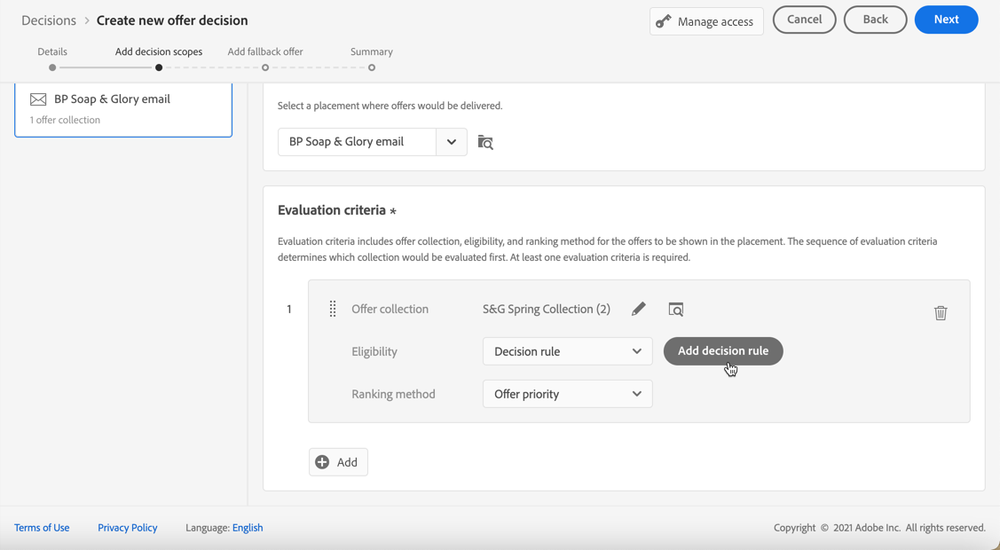

        Learn how to create a decision rule in [this section](../offer-library/creating-decision-rules.md).

1. When you select audiences or decision rules, you can see information on the estimated qualified profiles. Click **[!UICONTROL Refresh]** to update data.

    >[!NOTE]
    >
    >Profile estimates are unavailable when rule parameters include data not in the profile such as context data. For example, an eligibility rule that requires the current weather to be ≥80 degrees.

    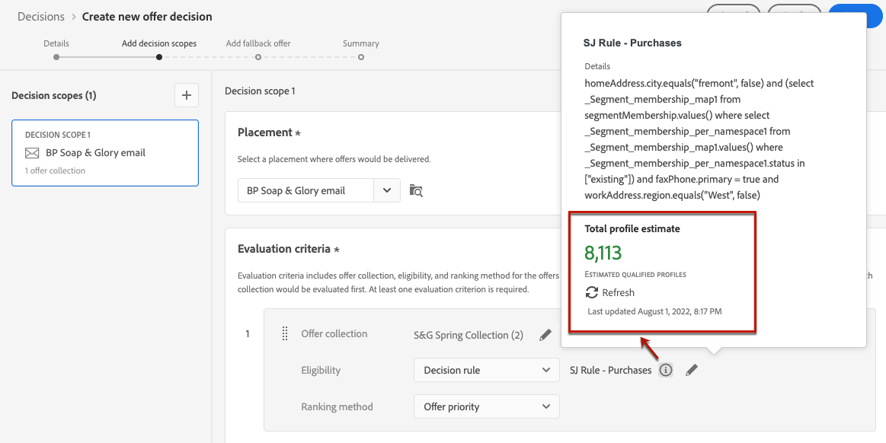

1. Define the ranking method you want to use to select the best offer for each profile. [Learn more](../offer-activities/configure-offer-selection.md).

    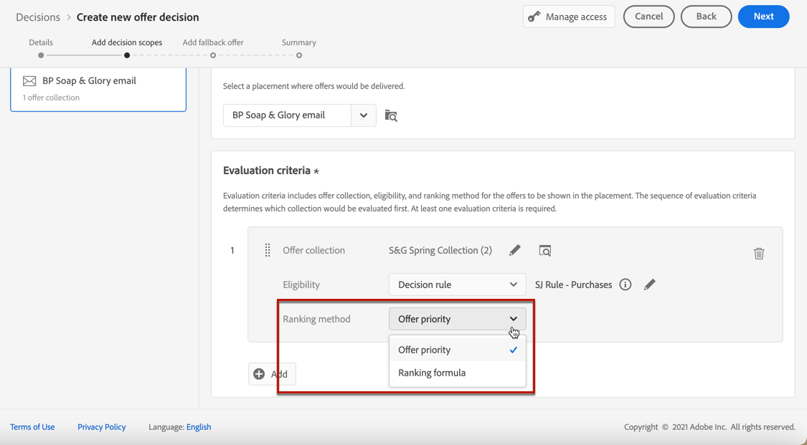

    * By default, if multiple offers are eligible for this placement, the **[!UICONTROL Offer priority]** method uses the value defined in the offers: the offer with the highest priority score will be delivered to the user.

    * If you want to use a specific calculated score to choose which eligible offer to deliver, select **[!UICONTROL Formula]** or **[!UICONTROL AI model]**. [Learn more](../offer-activities/configure-offer-selection.md).

1. Click **[!UICONTROL Add]** to define more criteria for the same placement.

    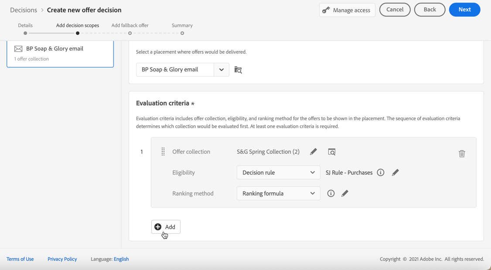

1. When you add several criteria, they will be evaluated in a specific order. The first collection that was added to the sequence will be evaluated first, and so on. [Learn more](#evaluation-criteria-order)
    
    To change the default sequence, you can drag and drop the collections to reorder them as wanted.

    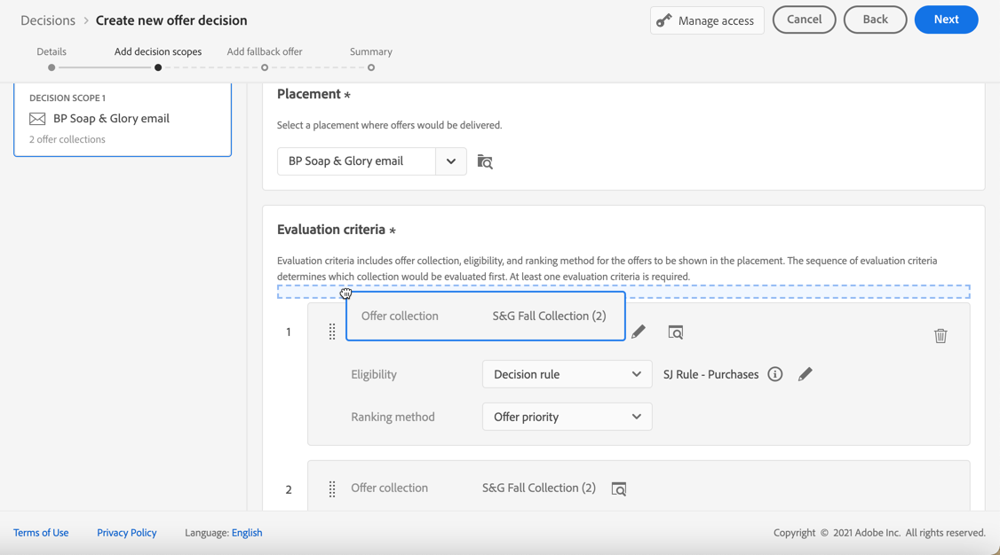
    
1. You can also evaluate several criteria at the same time. To do so, drag and drop the collection on top of another.

    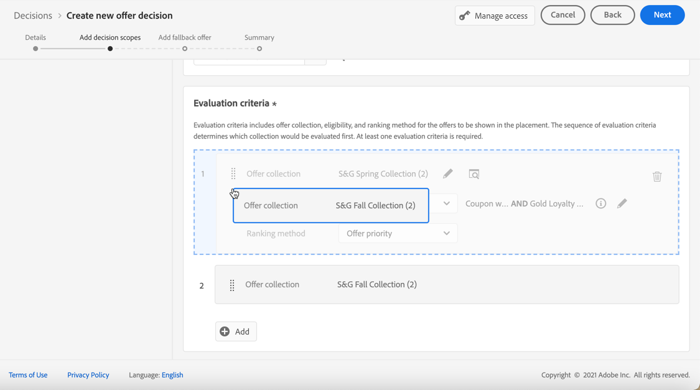

    They now have the same rank and thus will be evaluated at the same time. [Learn more](#evaluation-criteria-order)

    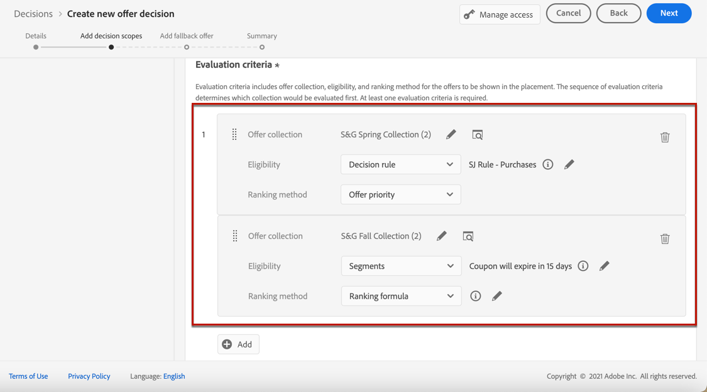

1. To add another placement for your offers as part of this decision, use the **[!UICONTROL New scope]** button. Repeat the steps above for each decision scope.

    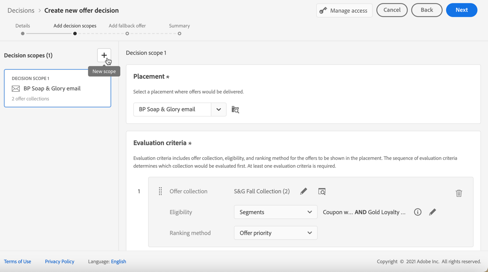

    >[!NOTE]
    >
    >When adding multiple decision scopes, the evaluation criteria order will be impacted. [Learn more](#multiple-scopes)

### Evaluation criteria order {#evaluation-criteria-order}

As described above, an evaluation criteria consists of a collection, eligibility constraints, and a ranking method. You can set the sequential order you want for the evaluation criteria to be evaluated, but you can also combine multiple evaluation criteria so they are evaluated together and not separately.

#### With one scope {#one-scope}

Inside a single decision scope, multiple criteria and their grouping determine the priority of the criteria and ranking of eligible offers. The first criteria has the highest priority and the criteria combined within the same 'group' have the same priority.

For example, you have two collections, one in evaluation criteria A and one in evaluation criteria B. The request is for two offers to be sent back. Let's say there are two eligible offers from evaluation criteria A and three eligible offers from evaluation criteria B.

* If the two evaluation criteria are **not combined** and/or in sequential order (1 and 2), the top two eligible offers from the evaluation criteria will be returned in the first row. If there are not two eligible offers for the first evaluation criteria, the decision engine will move on to the next evaluation criteria in sequence to find as many offers are still needed, and ultimately will return a fallback if needed.

    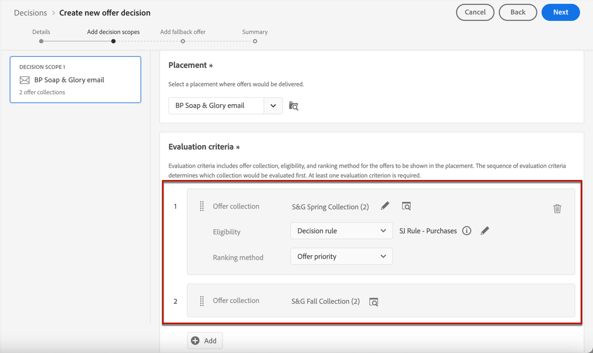

* If the two collections are **evaluated at the same time**, as there are two eligible offers from evaluation criteria A and three eligible offers from evaluation criteria B, the five offers will all be stack ranked together based on the value determined by the respective ranking methods. Two offers are requested, therefore the top two eligible offers from these five offers will be returned.

    

+++ **Example with multiple criteria**

Now let's consider an example where you have multiple criteria for a single scope divided into different groups.

You defined three criteria. Criteria 1 and Criteria 2 are combined together in Group 1 and Criteria 3 is independent (Group 2).

The eligible offers for each criteria and their priority (used in the ranking function evaluation) are as follows:

* Group 1:
    * Criteria 1 - (Offer 1, Offer 2, Offer 3) - Priority 1
    * Criteria 2 - (Offer 3, Offer 4, Offer 5) - Priority 1

* Group 2:
    * Criteria 3 - (Offer 5, Offer 6) - Priority 0

The highest priority criteria offers is evaluated first and added to the ranked offers list.

**Iteration 1:**

Criteria 1 and Criteria 2 offers are evaluated together (Offer 1, Offer 2, Offer 3, Offer 4, Offer 5). Let's say the result is:

Offer 1 - 10
Offer 2 - 20
Offer 3 - 30 from Criteria 1, 45 from Criteria 2. The highest of both will be considered, so 45 is taken into account.
Offer 4 - 40
Offer 5 - 50

The ranked offer are now as follows: Offer 5, Offer 3, Offer 4, Offer 2, Offer 1.

**Iteration 2:**

Criteria 3 offers are evaluated (Offer 5, Offer 6). Let's say the result is:

* Offer 5 - Will not be evaluated since it already exists in the result above.
* Offer 6 - 60

The ranked offers are now as follows: Offer 5 , Offer 3, Offer 4, Offer 2, Offer 1, Offer 6.

+++

#### With multiple scopes {#multiple-scopes}

**If duplication is off**

When you add several decision scopes to a decision, and if duplication is not allowed accross placements, the eligible offers are selected sequentially in the order of the decision scopes in the request.

>[!NOTE]
>
>The **[!UICONTROL Allow Duplicates across placements]** parameter is set at the placement level. If duplication is set to false for any placement in a decisioning request, all placements in the request will inherit the false setting. [Learn more on duplication parameter](../offer-library/creating-placements.md)

Let's take an example where you added two decision scopes such as:

* Scope 1: There are four eligible offers (Offer 1, Offer 2, Offer 3, Offer 4) and the request is for two offers to be sent back.
* Scope 2: There are four eligible offers (Offer 1, Offer 2, Offer 3, Offer 4) and the request is for two offers to be sent back.

+++ **Example 1**

The selection is as follows:

1. The top two eligible offers from Scope 1 will be returned (Offer 1, Offer 2).
1. The remaining top two eligible offers from Scope 2 will be returned (Offer 3, Offer 4).

+++

+++ **Example 2**

In this example, Offer 1 reached its frequency cap limit. [Learn more on frequency capping](../offer-library/add-constraints.md#capping)

The selection is as follows:

1. The remaining top two eligible offers from Scope 1 will be returned (Offer 2, Offer 3).
1. The remaining eligible offer from Scope 2 will be returned (Offer 4).

+++

+++ **Example 3**

In this example, Offer 1 and Offer 3 reached their frequency cap limit. [Learn more on frequency capping](../offer-library/add-constraints.md#capping)

The selection is as follows:

1. The remaining top two eligible offers from Scope 1 will be returned (Offer 2, Offer 4).
1. There are no remaining eligible offers for Scope 2, so the [fallback offer](#add-fallback) is returned.

+++

**If duplication is on**

When duplication is allowed accross all placements, the same offer can be proposed multiple times across different placements. If enabled, the system will consider the same offer for multiple placements. [Learn more on duplication parameter](../offer-library/creating-placements.md)

Let's take the same example as above where you added two decision scopes such as:

* Scope 1: There are four eligible offers (Offer 1, Offer 2, Offer 3, Offer 4) and the request is for two offers to be sent back.
* Scope 2: There are four eligible offers (Offer 1, Offer 2, Offer 3, Offer 4) and the request is for two offers to be sent back.

+++ **Example 1**

The selection is as follows:

1. The top two eligible offers from Scope 1 will be returned (Offer 1, Offer 2).
1. The same top two eligible offers from Scope 2 will be returned (Offer 1, Offer 2).

+++

+++ **Example 2**

In this example, Offer 1 reached its frequency cap limit. [Learn more on frequency capping](../offer-library/add-constraints.md#capping)

The selection is as follows:

1. The remaining top two eligible offers from Scope 1 will be returned (Offer 2, Offer 3).

1. The same remaining top two eligible offers from Scope 2 will be returned (Offer 2, Offer 3).

+++

+++ **Example 3**

In this example, Offer 1 and Offer 3 reached their frequency cap limit. [Learn more on frequency capping](../offer-library/add-constraints.md#capping)

The selection is as follows:

1. The remaining top two eligible offers from Scope 1 will be returned (Offer 2, Offer 4).

1. The same remaining top two eligible offers from Scope 2 will be returned (Offer 2, Offer 4).

+++

## Add a fallback offer {#add-fallback}

Once you defined the decision scopes, define the fallback offer that will be presented as a last resort to the customers that do not match the offers eligibility rules and constraints.

To do so, select it from the list of available fallback offers for the placements defined in the decision, then click **[!UICONTROL Next]**.

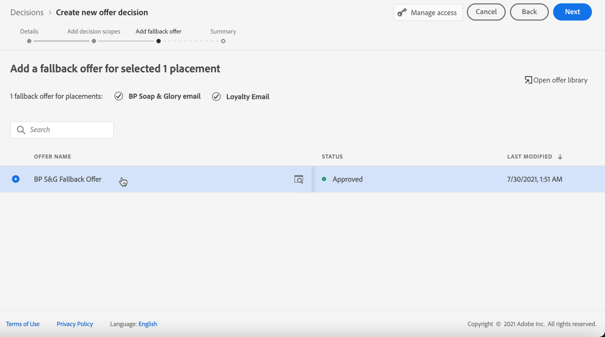

>[!NOTE]
>
>You can click the **[!UICONTROL Open offer library]** link to display the list of offers in a new tab.

## Review and save the decision {#review}

If everything is configured properly, a summary of the decision properties displays. 

1. Make sure the decision is ready to be used to  present offers to customers. All the decision scopes and the fallback offer it contains are displayed.

    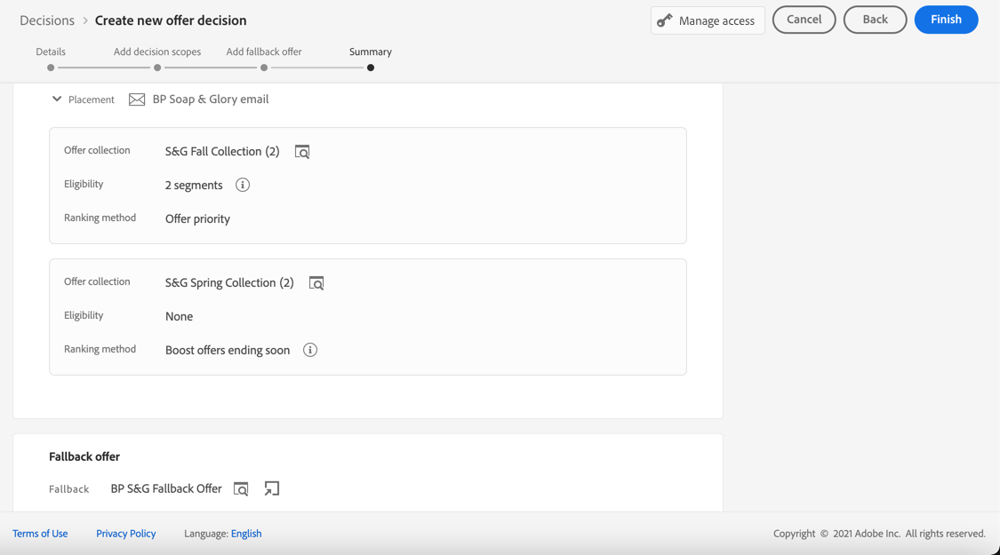

1. You can expand or collapse each placement. You can preview the available offers, eligibility and ranking details for each placement. You can also display information on the estimated qualified profiles. Click **[!UICONTROL Refresh]** to update data.

    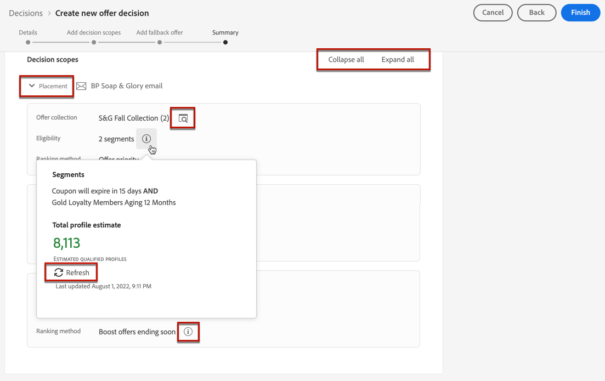

1. Click **[!UICONTROL Finish]**.
1. Select **[!UICONTROL Save and activate]**.

    
    
    You can also save the decision as draft, in order to edit and activate it later on.

The decision displays in the list with the **[!UICONTROL Live]** or **[!UICONTROL Draft]** status, depending on whether you activated it or not in the previous step. 

It is now ready to be used to deliver offers to customers.

## Decision list {#decision-list}

From the decision list, you can select the decision to display its properties. From there you can also edit it, change its status (**Draft**, **Live**, **Complete**, **Archived**), duplicate the decision, or delete it.

Select the **[!UICONTROL Edit]** button to go back to the decision edition mode, where you can modify the decision's [details](#create-activity), [decision scopes](#add-decision-scopes) and [fallback offer](#add-fallback).

>[!IMPORTANT]
>
>If changes are made to an offer decision which is being used in a journey’s message, you need to unpublish the journey and republish it.  This will ensure that the changes are incorporated into the journey's message and that the message is consistent with the latest updates.

Select a live decision and click **[!UICONTROL Deactivate]** to set the decision status back to **[!UICONTROL Draft]**.

To set again the status to **[!UICONTROL Live]**, select the **[!UICONTROL Activate]** button that is now displayed.

The **[!UICONTROL More actions]** button enables the actions described below.

* **[!UICONTROL Complete]**: sets the decision's status to **[!UICONTROL Complete]**, meaning the decision cannot be called anymore. This action is only available for activated decisions. The decision is still available from the list, but you cannot set its status back to **[!UICONTROL Draft]** or **[!UICONTROL Approved]**. You can only duplicate, delete or archive it.

* **[!UICONTROL Duplicate]**: creates a decision with the same properties, decision scopes and fallback offer. By default, the new decision has the **[!UICONTROL Draft]** status.

* **[!UICONTROL Delete]**: removes the decision from the list.

    >[!CAUTION]
    >
    >The decision and its content will not be accessible anymore. This action cannot be undone.
    >
    >If the decision is used in another object, it cannot be deleted.

* **[!UICONTROL Archive]**: sets the decision status to **[!UICONTROL Archived]**. The decision is still available from the list, but you cannot set its status back to **[!UICONTROL Draft]** or **[!UICONTROL Approved]**. You can only duplicate or delete it.

You can also delete or change the status of multiple decisions at the same time by selecting the corresponding checkboxes.

If you want to change the status of several decisions whith different statuses, only the relevant statuses will be changed.

Once a decision has been created, you can click its name from the list.

This enables you to access detailed information for that decision. Select the **[!UICONTROL Change log]** tab to [monitor all the changes](../get-started/user-interface.md#changes-log) that have been made to the decision.

## How-to video{#video}

Learn how to create offer activities in decision management.

>[!VIDEO](https://video.tv.adobe.com/v/329606?quality=12)

