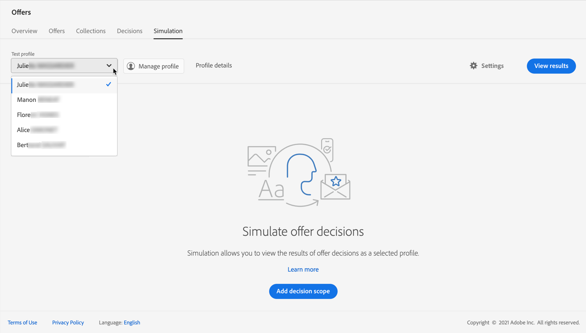
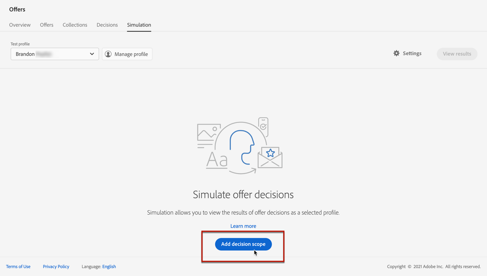
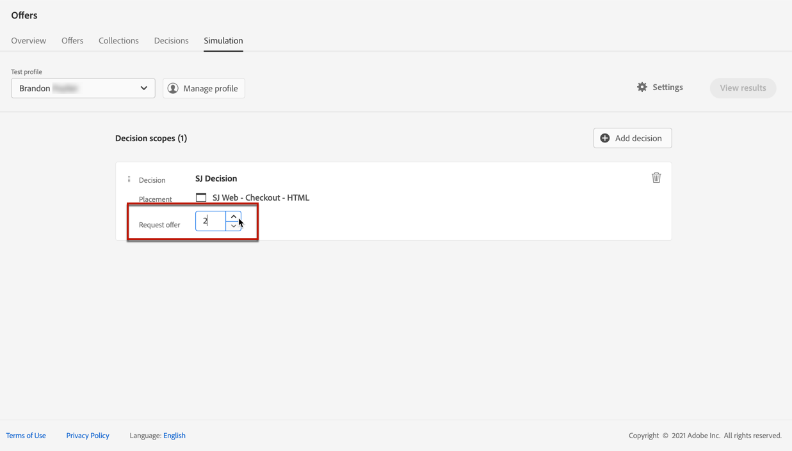
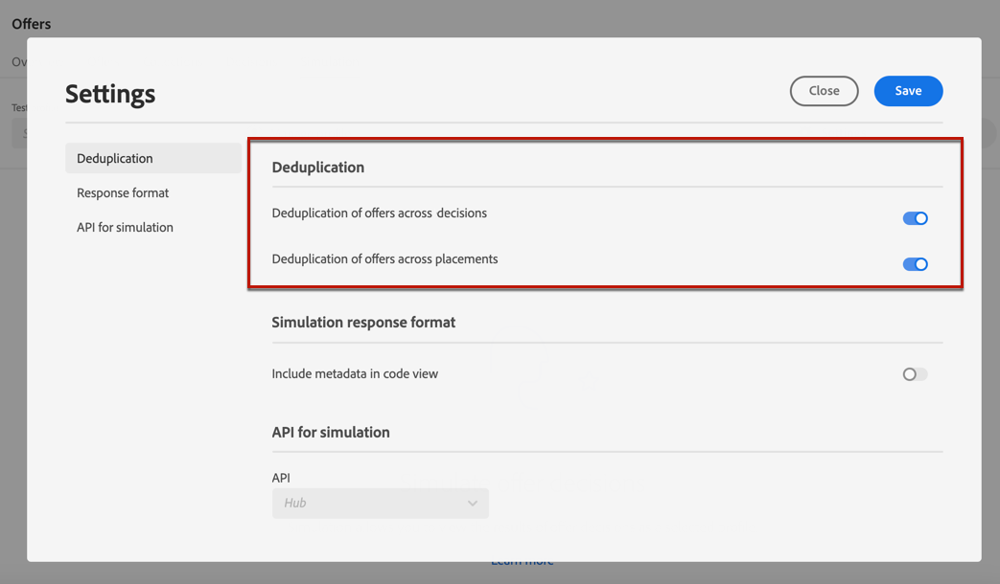
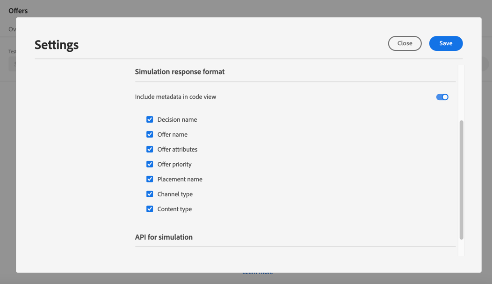
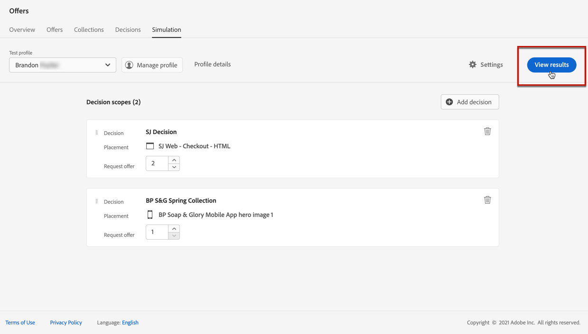
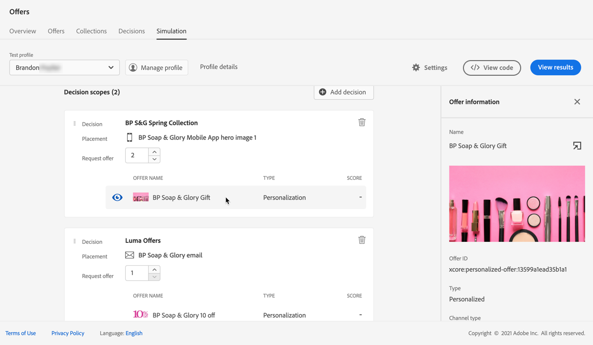

# Create simulations

## About simulation

To validate your decisioning logic, you can simulate which offers will be delivered to a test profile for a given placement.

<!--Simulation allows you to view the results of offer decisions as a selected profile.-->

This enables you to test and refine various versions of your offers with no impact on the targeted recipients.

>[!NOTE]
>
>This capability simulates a single request to the [!DNL Decisions] API. Learn more on [Deliver offers using the Decisions API](../api-reference/decisions-api/deliver-offers.md).

To access this feature, select the **[!UICONTROL Simulation]** tab from the **[!UICONTROL Decision management]** > **[!UICONTROL Offers]** menu.

<!--
➡️ [Discover this feature in video](#video)
-->

## Select test profiles

First you need to select the test profiles that you are going to use for simulation.

1. Click **[!UICONTROL Manage profile]**.

    

1. Select the identity namespace you want to use to identify test profiles. In this example, we will use the **Email** namespace.

    >[!NOTE]
    >
    >An identity namespace defines the context of an identifier such as an email address or CRM ID. Learn more about Adobe Experience Platform identity namespaces [in this section](../../get-started-identity.md){target="_blank"}.

1. Enter the identity value and click **[!UICONTROL View]** to list the available profiles.

    

1. Add other profiles if you want to test different profile data, and save your selection.

    

1. Once added, all profiles are listed in the drop-down list under **[!UICONTROL Test profile]**. You can switch between the saved test profiles to display the results for each selected profile.

    

1. You can click the **[!UICONTROL Profile details]** link to display the selected profile data.

<!--Learn more on [selecting test profiles](preview.md#select-test-profiles)-->

## Add decision scopes

Now select the offer decisions that you want to simulate on your test profiles.

1. Select **[!UICONTROL Add decision scope]**.

    

1. Select a placement from the list.

    

1. The available decisions are displayed.

    * You can use the search field to refine the selection.
    * You can click the **[!UICONTROL Open offer decisions]** link to open the list of all the decisions that you created. Learn more on [decisions](create-offer-activities.md).
    
    Select the decision of your choice and click **[!UICONTROL Add]**.

    

1. The decision scope you just defined displays in the main workspace.

    You can adjust the number of offers that you want to request. For example, if you select 2, the best 2 offers will display for this decision scope.

    

    >[!NOTE]
    >
    >You can request up to 30 offers.

1. Repeat the steps above to add as many decisions as you need.

    

    >[!NOTE]
    >
    >Even if you define several decision scopes, only one API request is simulated.

## Define simulation settings

1. Click **[!UICONTROL Settings]**.

    

1. In the **[!UICONTROL Deduplication]** section, you can choose to allow duplicate offers accross decisions and/or placements. It means that multiple decisions/placements may get assigned the same offer.

    

    >[!NOTE]
    >
    >By default, all Deduplication flags are enabled for simulation, which means that the decision engine allows duplicates and thus can make the same proposition accross multiple decisions/placements. Learn more on the [!DNL Decisions] API request properties in [this section](../api-reference/decisions-api/deliver-offers.md).

1. In the **[!UICONTROL Response format]** section, you can choose to include metadata in the code view. Check the corresponding option, and select the metadata of your choice. They will be displayed in the request and response payloads when selecting **[!UICONTROL View code]**. Learn more in the [View simulation results](#simulation-results) section.

    

    >[!NOTE]
    >
    >When turning on the option, all items are selected by default.

1. Click **[!UICONTROL Save]**.

<!--

In the **[!UICONTROL API for simulation]** section, select the API you want to use: **[!UICONTROL Hub]** or **[!UICONTROL Edge]**.
Hub and Edge are two different end points for simulation data.

In the **[!UICONTROL Context data]** section, you can add as many elements as needed.

    >[!NOTE]
    >
    >This section is hidden if you select Edge API in the section above. Hub allows the use of Context Data, Edge does not.

Context data allows the user to add contextual data that could affect the simulation score.
For instance, let's say the customer has an offer for a discount on ice cream. In the rules for that offer, it can have logic that would rank it higher when the temperature is above 80 degrees. In simulation, the user could add context data: temperature=65 and that offer would rank lower, of they could add temperature=95 and that would rank higher.

-->

## View simulation results {#simulation-results}

Once you added a decision scope and selected a test profile, you can view the results.

1. Click **[!UICONTROL View results]**.

    

1. The best available offer(s) are displayed according to the selected profile for each decision.

    Select an offer to display its details.

    

1. Click **[!UICONTROL View code]** to display the request and response payloads.

    To use the request payload outside of [!DNL Journey Optimizer] - for troubleshooting purpose for example, you can copy it by clicking the corresponding button on top of the code view.

    >[!NOTE]
    >
    >You can only copy the request payload.

1. Select another profile from the list to display the results of the offer decisions for a different test profile.

1. You can add, remove or update the decision scopes as many times as needed.

>[!NOTE]
>
>Each time you change profiles or update decision scopes, you need to refresh the results using the **[!UICONTROL View results]** button.

<!--Questions

* Is it recommended to first select profiles or first add decision scopes?
* What does Request offer changes?
* Nothing displays when I click View results? Can't see any score...
* What's the typical example? i.e. how many decisions do you select, and how do you compare scores?
* What do you learn from simulation? i.e. if I selected 2 decisions and I compare the scores, which one is better or should I use for my customers?
* Is there a way to create relevant test profiles?
* Error on Profile details link.
* Is there a tutorial planned to be released?
* Why still a big red frame when no profile is found?

## Tutorial video {#video}

>[!NOTE]
>
>This video applies to the Offer Decisioning application service built on Adobe Experience Platform. However, it provides generic guidance to use Offer in the context of Journey Optimizer.

>[!VIDEO](https://video.tv.adobe.com/v/329606?quality=12)
-->
