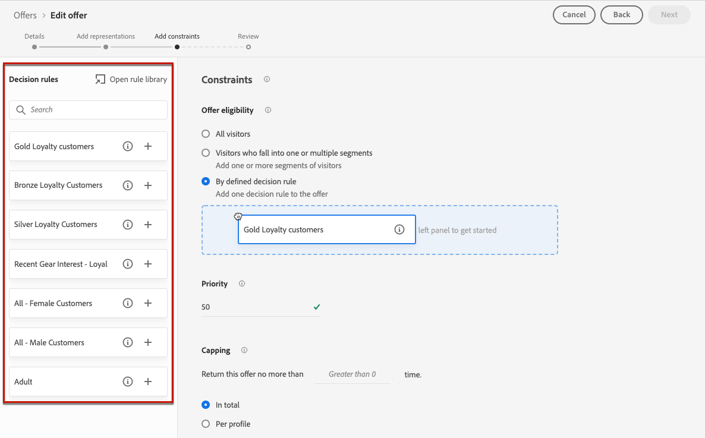

# Add constraints to an offer {#add-constraints}

>[!CONTEXTUALHELP]
>id="od_offer_constraints"
>title="About offer constraints"
>abstract="With constraints, you can specify how the offer is prioritized and presented to the user compared to other offers."

>[!CONTEXTUALHELP]
>id="ajo_decisioning_constraints"
>title="About offer constraints"
>abstract="With constraints, you can specify how the offer is prioritized and presented to the user compared to other offers."

>[!CONTEXTUALHELP]
>id="od_offer_priority"
>title="About offer priority"
>abstract="In this field, you can specify priority settings for the offer. Priority is a number used to rank offers that meet all constraints such as eligibility, dates, and capping."

>[!CONTEXTUALHELP]
>id="ajo_decisioning_priority"
>title="Priority"
>abstract="The priority helps define the priority of the offer compared to other ones if the user qualifies for more than one offer. The higher an offer's priority will be, the higher its priority will be compared to other offers."

Constraints allow you to define the conditions under which an offer will be displayed.

1. Configure the **[!UICONTROL Offer eligibility]**. [Learn more](#eligibility)

   

1. Define the **[!UICONTROL Priority]** of the offer compared to other ones if the user qualifies for more than one offer. The higher an offer's priority will be, the higher its priority will be compared to other offers.

   

1. Specify the offer's **[!UICONTROL Capping]**, meaning the number of times the offer will be presented. [Learn more](#capping)

   

1. Click **[!UICONTROL Next]** to confirm all the constraints you defined.
        
For example, if you set the following constraints:

* The offer will be considered for users that match the "Gold Loyalty Customers" decision rule only.
* The offer's priority is set to "50", meaning the offer will be presented before offers with a priority between 1 and 49, and after the ones with a priority of at least 51.
* The offer will be presented only once per user accross all placements.

## Eligibility {#eligibility}

>[!CONTEXTUALHELP]
>id="ajo_decisioning_eligibility"
>title="Eligibility"
>abstract="Offer eligibility allows you to restrict the offer to specific profiles that you define using segments or decision rules."

>[!CONTEXTUALHELP]
>id="od_offer_eligibility"
>title="About offer eligibility"
>abstract="In this section, you can use decision rules to determine which users are eligible to the offer."
>additional-url="https://video.tv.adobe.com/v/329373" text="Watch demo video"

The **[!UICONTROL Offer eligibility]** section allows you to restrict the offer to specific profiles that you define using segments or decision rules.

>[!NOTE]
>
>Learn more on using **segments** versus **decision rules** in [this section](#segments-vs-decision-rules).

* By default, the **[!UICONTROL All visitors]** option is selected, meaning that any profile will be eligible to be presented the offer.

    

* You can also limit the presentation of the offer to the members of one or several [Adobe Experience Platform segments](../../segment/about-segments.md).

    To do this, activate the **[!UICONTROL Visitors who fall into one or multiple segments]** option, then add one or several segments from the left pane and combine them using the **[!UICONTROL And]** / **[!UICONTROL Or]** logical operators.
    
    

* If you want to associate a specific [decision rule](../offer-library/creating-decision-rules.md) to the offer, select **[!UICONTROL By defined decision rule]**, then drag the desired rule from the left pane into the **[!UICONTROL Decision rule]** area.

    

    >[!CAUTION]
    >
    >Event-based offers are currently not supported in [!DNL Journey Optimizer]. If you create a decision rule based on an [event](https://experienceleague.adobe.com/docs/experience-platform/segmentation/ui/segment-builder.html?lang=en#events){target="_blank"}, you will not be able to leverage it in an offer.

### Using segments vs decision rules {#segments-vs-decision-rules}

To apply a constraint, you can restrict the selection of offers to the members of one or several **Adobe Experience Platform segments**, or you can use a **decision rule**, both solutions corresponding to different usages.

Basically, the output of a segment is a list of profiles, whereas a decision rule is a function executed on demand against a single profile during the decisioning process. The difference between those two usages are detailed below.

* **Segments**

    On one hand, segments are a group of Adobe Experience Platform profiles that match a certain logic based on profile attributes and experience events. However, Offer Management does not recompute the segment, which may not be up-to-date when presenting the offer.

    Learn more on segments in [this section](../../segment/about-segments.md).

* **Decision rules**
    
    On the other hand, a decision rule is based on data available in Adobe Experience Platform and determines to whom an offer can be shown. Once selected in an offer or a decision for a given placement, the rule is executed every single time a decision is made, which ensures that each profile gets the latest and the best offer.

    Learn more on decision rules in [this section](creating-decision-rules.md).

## Frequency capping {#capping}

>[!CONTEXTUALHELP]
>id="od_offer_globalcap"
>title="About offer capping"
>abstract="In this field, you can specify how many times the offer can be presented."

>[!CONTEXTUALHELP]
>id="ajo_decisioning_capping"
>title="Capping"
>abstract="Capping is used as a constraint to define the maximum number of times an offer can be presented."

Capping is used as a constraint to define the maximum number of times an offer can be presented.

Limiting the number of times users get specific offers allows you to avoid over-solicitating your customers and thus to optimize each touchpoint with the best offer.

To set capping, follow the steps below.

1. Define the number of times the offer can be presented.

    

    >[!NOTE]
    >
    >The number must be an integer greater than 0.

1. Specify if you want the capping to be applied accross all users or to one specific profile:

    

    * Select **[!UICONTROL In total]** to define how many times an offer can be proposed across the combined target audience, meaning across all users.

        For example, if you are an electronics retailer having a 'TV doorbuster deal', you want the offer to be only returned 200 times across all profiles.

    * Select **[!UICONTROL Per profile]** to define how many times an offer can be proposed to the same user.

        For example, if you are a bank with a 'Platinum credit card' offer, you don't want this offer to be shown more than 5 times per profile. Indeed, you believe that if the user has seen the offer 5 times and not acted on it, they have a higher chance to act on the next best offer.

1. If you have defined several [representations](#representations) for your offer, specify whether you want to apply capping **[!UICONTROL Across all placements]** or **[!UICONTROL For each placement]**.

    

    * **[!UICONTROL Across all placements]**: capping counts will total all decisions across the placements associated with the offer.
    
        For example, if an offer has an **Email** placement and a **Web** placement, and you set the capping at **2 per profile across all placements**, then each profile could receive the offer up to 2 times in total, regardless of the placement mix.

    * **[!UICONTROL For each placement]**: capping counts will apply decision counts for each placement separately.
    
        For example, if an offer has an **Email** placement and a **Web** placement, and you set the capping at **2 per profile for each placement**, then each profile could receive the offer up to 2 times for the email placement, and an additional 2 times for the web placement.

1. Once saved and approved, if the offer has been presented the number of times you have specified in this field according to the criteria you defined, its delivery will stop.

The number of times an offer is proposed is calculated at email preparation time. For example, if you prepare an email with a number of offers, those numbers count towards your max cap regardless of whether or not the email is sent.

<!--If an email delivery is deleted or if the preparation is done again before being sent, the capping value for the offer is automatically updated.-->

>[!NOTE]
>
>Capping counters will reset when the offer expires or 2 years after the offer start date, whichever comes first. Learn how to define an offer's date in [this section](creating-personalized-offers.md#create-offer).

### Impact of changing dates on capping {#capping-change-date}

>[!CONTEXTUALHELP]
>id="ajo_decisioning_offer_change_date"
>title="Changing the date may have an impact on capping"
>abstract="If capping is applied to this offer, it may be impacted when you change the start or end date."

You must proceed with care when changing the date of an offer, because this can have an impact on capping if the following conditions are met:

* The offer is [approved](#review).
* [Capping](#capping) is already applied to the offer.
* Capping is defined per profile.

>[!NOTE]
>
>Learn how to define an offer's date in [this section](creating-personalized-offers.md#create-offer).

Frequency capping per profile stores the capping counts on each profile. When you change the start and end date of an approved offer, the capping count for some profiles could be impacted according to the different scenarios described below.

Here are the possible scenarios when **changing an offer start date**:

| Scenario: If... | What happens: then... | Possible impact on the capping count |
|--- |--- |--- |
| ... the offer start date is updated before the original offer start date has begun, | ... the capping count will begin on the new start date. | No |
| ... the new start date is before the current end date, | ... the capping will continue with a new start date and the previous capping count for each profile will carry forward. | No |
| ... the new start date is after the current end date, | ... the current capping will expire and the new capping count will start again from 0 for all profiles on the new start date. | Yes |

Here are the possible scenarios when **extending an offer end date**:

| Scenario: If... | What happens: then... | Possible impact on the capping count |
|--- |--- |--- |
| ... a decisioning request occurs before the original offer end date, | ... the capping count will be updated and the previous capping count for each profile will carry forward. | No |
| ... no decisioning request occurs before the original end date, | ... the capping count will reset on the original end date for each profile. The new capping count will then start again from 0 for any new decisioning requests that will occur after the original end date. | Yes |

**Example**

Let's say you have an offer with an original start date set to **January, 1**, expiring on **January, 31**.

1. Profiles X, Y and Z are presented the offer.
1. On **January, 10**, the offer's end date is changed to **February, 15**.
1. **From January 11 to January 31**, only profile Z is presented the offer.       
    
    * Because a decisioning request occurred before the original end date **for profile Z**, the offer's end date can be extended to **February, 15**.
    * However, as no activity occurred before the original end date for **profiles X and Y**, their counters will expire and their capping counts will be reset to 0 on **January, 31**.

