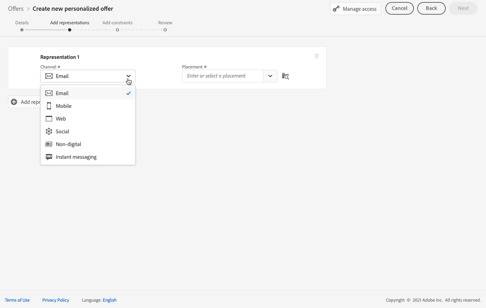
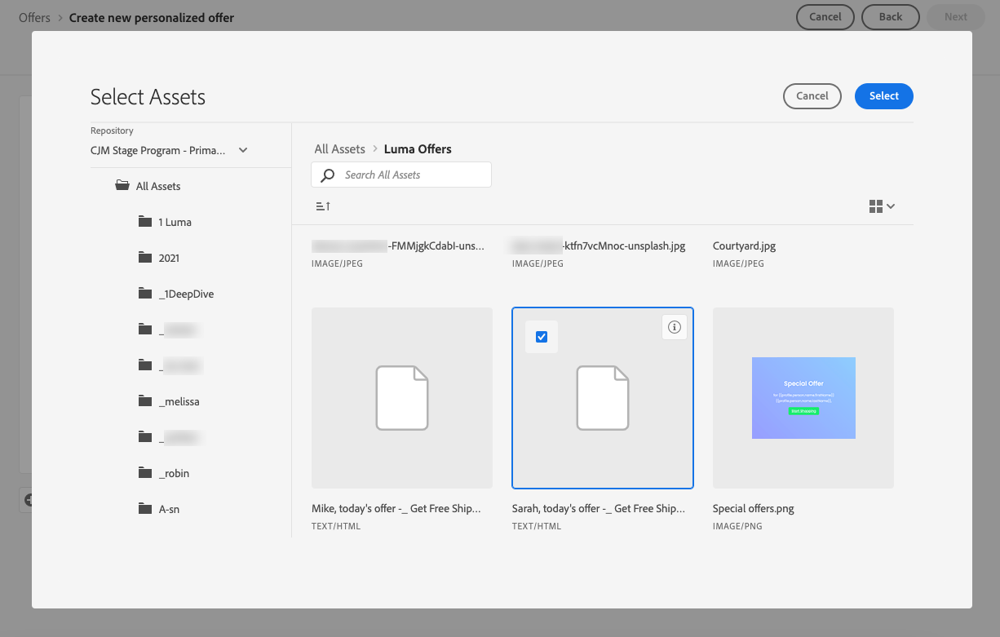
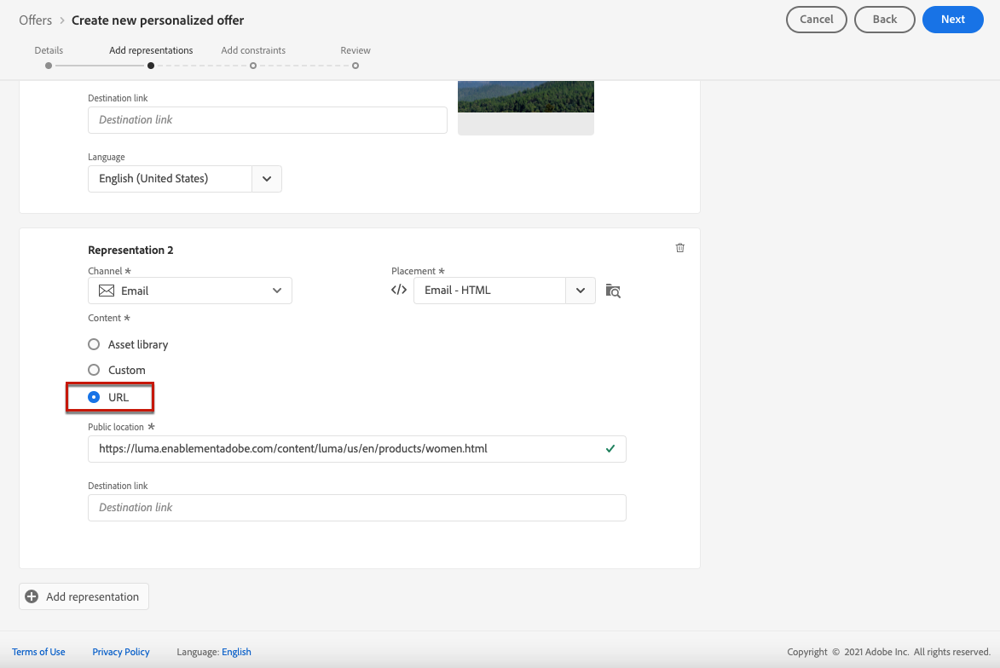
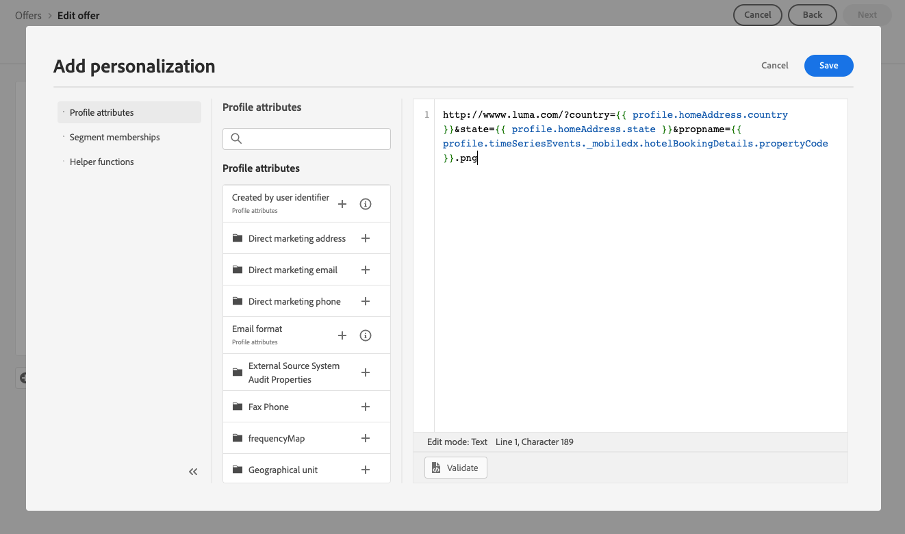

# Add representations to an offer {#add-representations}

>[!CONTEXTUALHELP]
>id="ajo_decisioning_representation"
>title="Representations"
>abstract="Add representations to define where your offer will display in the message. The more representations an offer has, the more opportunities exist to use the offer in different placement contexts."

An offer can be displayed at different places in a message: in a top banner with an image, as text in a paragraph, as an HTML block, etc. The more representations an offer has, the more opportunities exist to use the offer in different placement contexts.

## Configure the offer's representations {#representations}

To add one or multiple representations to your offer and configure them, follow the steps below.

1. For the first representation, start by selecting the **[!UICONTROL Channel]** that will be used.

    

    >[!NOTE]
    >
    >Only the available placements for the selected channel display in the **[!UICONTROL Placement]** drop-down list.

1. Select a placement from the list.

    You can also use the button next to the **[!UICONTROL Placement]** drop-down list to browse all the placements.

    

    There you can still filter the placements according to their channel and/or content type. Choose a placement and click **[!UICONTROL Select]**.

    

1. Add content to your representation. Learn how in [this section](#content).

1. When you add content such as an image or URL, you can specify a **[!UICONTROL Destination link]**: the users who click the offer will be directed to the corresponding page.

    

1. Finally, select the language of your choice to help identify and manage what to display to the users.

1. To add another representation, use the **[!UICONTROL Add representation]** button and add as many representations as needed.

    

1. Once you added all your representations, select **[!UICONTROL Next]**.

## Define content for your representations {#content}

You can add different types of content to a representation.

>[!NOTE]
>
>Only content corresponding to the placement's content type is available for use.

### Add images {#images}

If the selected placement is image-type, you can add content coming from the **Adobe Experience Cloud Asset** library, a centralized repository of assets provided by [!DNL Adobe Experience Manager Assets].

>[!NOTE]
>
> To work with [Adobe Experience Manager Assets Essentials](https://experienceleague.adobe.com/docs/experience-manager-assets-essentials/help/introduction.html){target="_blank"}, you need to deploy [!DNL Assets Essentials] for your organization and make sure that users are a part of the **Assets Essentials Consumer Users** or/and **Assets Essentials Users** Product profiles. Learn more on [this page](https://experienceleague.adobe.com/docs/experience-manager-assets-essentials/help/get-started-admins/deploy-administer.html){target="_blank"}.
    
1. Choose the **[!UICONTROL Asset library]** option.

1. Select **[!UICONTROL Browse]**.

    

1. Browse the assets to select the image of your choice

1. Click **[!UICONTROL Select]**.

    

### Add HTML or JSON files {#html-json}

If the selected placement is HTML-type, you can also add HTML or JSON content coming from the [Adobe Experience Cloud Asset library](https://experienceleague.adobe.com/docs/experience-manager-assets-essentials/help/introduction.html){target="_blank"}).

For example, you created an HTML email template in [Adobe Experience Manager](https://experienceleague.adobe.com/docs/experience-manager.html){target="_blank"} and you want to use that file for your offer content. Instead of creating a new file, you can simply upload the template into the **Asset Library** to be able to reuse it in your offer's representations.

To reuse your content in a representation, browse the **Asset Library** as described in [this section](#images) and select the HTML or JSON file of your choice.



### Add URLs {#urls}

To add content from an external public location, select **[!UICONTROL URL]**, then enter the URL address of the content to add.

You can personalize URLs using the Expression editor. Learn more on [personalization](../../personalization/personalize.md#use-expression-editor).



For example, you want to personalize the image that is shown as an offer. You want users who favor city vacations to see the NYC skyline and users who favor beach vacations to see the Hawaii northshore.

Use the Expression Editor to retrieve Profile attributes stored in the Adobe Experience Platform using union schemas. [Learn more](https://experienceleague.adobe.com/docs/experience-platform/profile/union-schemas/union-schemas-overview.html){target="_blank"}



If you specify a **[!UICONTROL Destination link]**, you can also personalize the URL to which the users who click the offer will be directed.

### Add custom text {#custom-text}

You can also insert text-type content when selecting a compatible placement.

1. Select the **[!UICONTROL Custom]** option and click **[!UICONTROL Add content]**.
    
    
    
    >[!NOTE]
    >
    >This option is not available for image-type placements.

1. Type the text that will display in the offer.

    

    You can personalize your content using the Expression editor. Learn more on [personalization](../../personalization/personalize.md#use-expression-editor).

    

    >[!NOTE]
    >
    >Only the **[!UICONTROL Profile attributes]**, **[!UICONTROL Audiences]** and **[!UICONTROL Helper functions]** sources are available for Decision Management.

## Personalize representations based on context data{#context-data}

When context data is passed in the [Edge decisioning](../api-reference/offer-delivery-api/edge-decisioning-api.md) call, you can leverage these data to personalize representations dynamically. For instance, you can tailor the representation of an offer based on real-time factors such as current weather conditions at the moment the decision is made.

To do this, incorporate the context data variable directly within the representation content by using the `profile.timeSeriesEvents.` namespace.

Here is a syntax example used to personalize an offer's representation based on users' operating systems:

```
 iosandroid 
```

The corresponding Edge decisioning request including the context data is as follows:
 
```
{
    "body": {
        "xdm": {
            "identityMap": {
                "Email": [
                    {
                        "id": "xyz@abc.com"
                    }
                ]
            },
            "device": {
                "model": "Apple"
            }
        },
        "extra": {
            "query": {
                "decisionScopes": [
                    "eyJ4ZG06..."
                ]
            }
        }
    }
}
```
