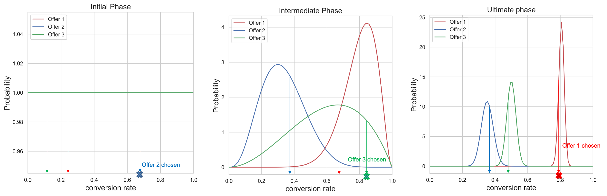
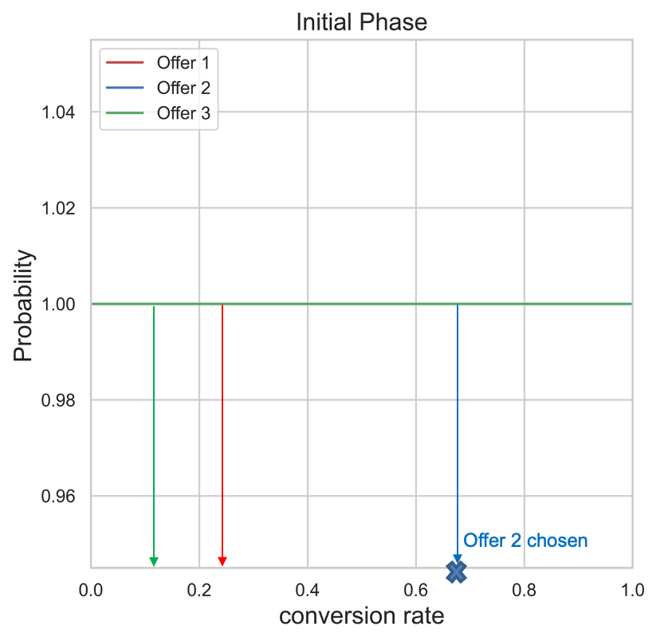
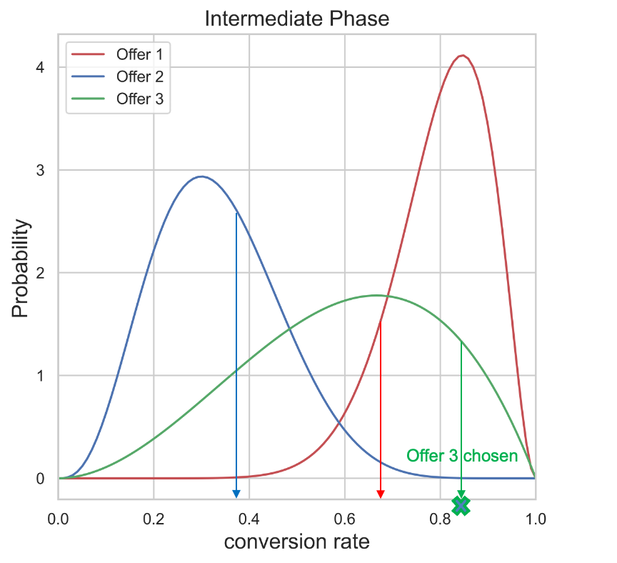
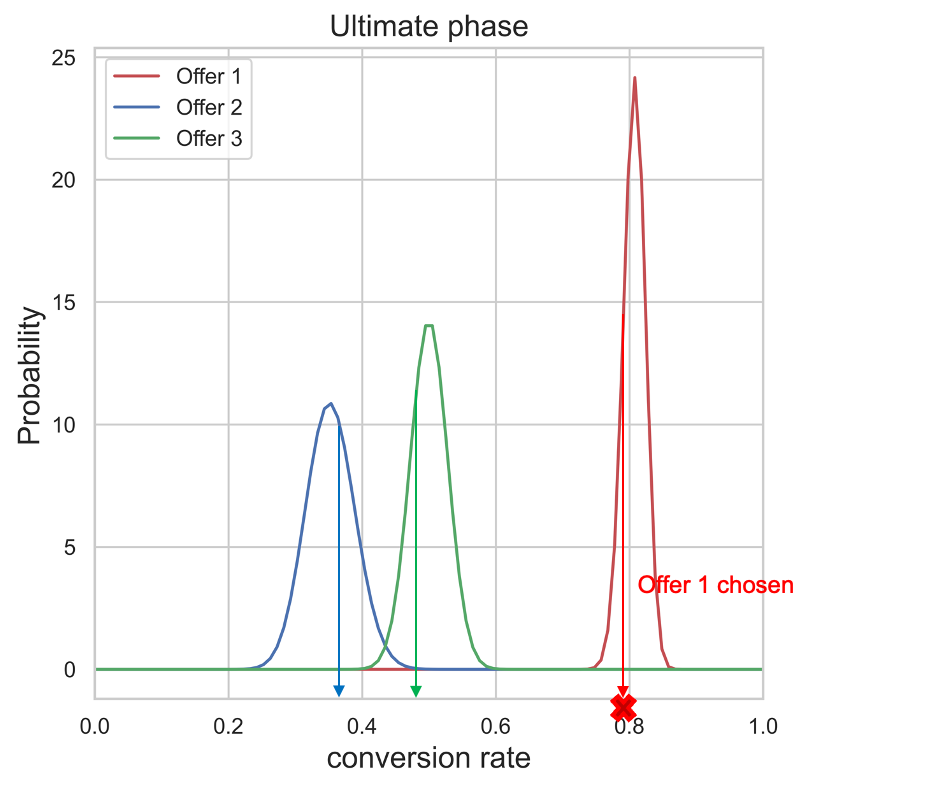
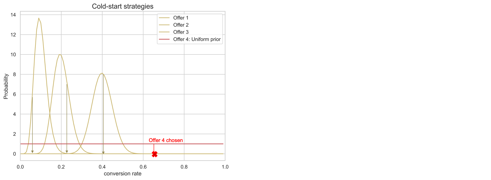

# AI models {#ai-models}

## Get started with AI ranking models {#get-started-with-ai-rankings}

You can use a trained model system that ranks offers to display for a given profile.

>[!CAUTION]
>
>The use of AI models is currently available in early access to select users only.

This feature enables you to create different **AI models** based on your business goals. Using these different goal-based strategies in a decision, the trained model system will help you understand how the different AI models are impacting your goals.

For example, you can select an AI model for the email channel and another one for the push channel. For each channel, the trained model system will leverage multiple data points to determine which offer should be presented first for a given placement, rather than taking into account the offers’ priority scores or a [ranking formula](create-ranking-formulas.md).

Once an AI model has been created, assign it to a placement in a decision. Learn more in [Configure offers selection in decisions](../offer-activities/configure-offer-selection.md).

>[!NOTE]
>
>Currently in [!DNL Journey Optimizer] the only supported model type for AI ranking is **auto-optimization**.

## Auto-optimization model {#auto-optimization}

An Auto-Optimization model aims to serve offers that maximize the return (KPIs) set by business clients. These KPIs could be in the form of conversion rates, revenue, etc. At this point, Auto-optimization focuses on optimizing offer clicks with offer conversion as our target. Auto-optimization is non-personalized and optimizes based on “global” performance of the offers.

### Thompson Sampling

The algorithm that underlies Auto-Optimization is Thompson sampling. In this section, we discuss the intuition behind Thompson sampling.

**Learn more on Thompson Sampling**:
* [An Empirical Evaluation of Thompson Sampling](https://proceedings.neurips.cc/paper/2011/file/e53a0a2978c28872a4505bdb51db06dc-Paper.pdf){target="_blank"}
* [Analysis of Thompson Sampling for the Multi-armed Bandit Problem](http://proceedings.mlr.press/v23/agrawal12/agrawal12.pdf){target="_blank"}

Thompson sampling, or Bayesian bandits, is a Bayesian approach to the multi-armed bandit problem.  The basic idea is to treat the average reward 𝛍 from each offer as a **random variable** and use the data we have collected so far, to update our “belief” about the average reward. This “belief” is represented mathematically by a **posterior probability distribution** – essentially a range of values for the average reward, along with the plausibility (or probability) that the reward has that value for each offer. Then, for every decision, we will **sample a point from each of these posterior reward distributions** and select the offer whose sampled reward had the highest value.  

This process is illustrated in the figure below, where we have 3 different offers. Initially we have no evidence from the data and we assume all offers have a uniform posterior reward distribution. We draw a sample from each offer's posterior reward distribution. The sample selected from offer 2's distribution has the highest value. This is an example of **exploration**. After showing Offer 2, we collect any potential reward (for example conversion/no-conversion) and update the posterior distribution of offer 2 using Bayes Theorem as explained below.  We continue this process and update the posterior distributions each time an offer is shown and the reward is collected. In the second figure, offer 3 is selected– despite Offer 1 having the highest average reward (its posterior reward distribution is furthest to the right), the process of sampling from each distribution has led to us choosing an apparently suboptimal offer 3. In doing so, we give ourself the opportunity to learn more about Offer 3’s true reward distribution. 

As more samples are collected, the confidence increases, and a more accurate estimate of the possible reward is obtained (corresponding to narrower reward distributions). This process of updating our beliefs as more evidence becomes available is known as **Bayesian Inference**. 

Eventually, if one offer (e.g. Offer 1) is a clear winner, its posterior reward distribution will be separated from others. At this point, for each decision, the sampled reward from Offer 1 is likely to be the highest, and we will choose it with a higher probability. This is **exploitation** – we have a strong belief that Offer 1 is the best, and so it's being chosen to maximize rewards.

For every decision, we sample a point from the posterior reward distributions. The offer with highest sample value (conversion rate) will be chosen. In the initial phase, all offers have uniform distribution since we don't have any evidence about the conversion rates of the offers from the data. As we collect more samples, the posterior distributions get narrower and more accurate. Ultimately, the offer with highest conversion rate will be chosen every time.

<!-->

-->

+++**Technical Details**

To calculate/update distributions, we use **Bayes Theorem**. For each offer ***i***, we want to calculate their ***P(𝛍i | data)***, i.e., for each offer ***i***, how likely a reward value **𝛍i** is, given the data we have collected so far for that offer.

From Bayes Theorem:

***Posterior = Likelihood * Prior***

The **prior probability** is the initial guess about the probability for producing an output. The probability, after some evidence has been collected, is known as the **posterior probability**.  

Auto Optimization is designed to consider binary rewards (click/no-click). In this case, the likelihood represents the number of successes from N trials and is modeled by a **Binomial distribution**. For some likelihood functions, if you choose a certain prior, the posterior ends up being in the same distribution as the prior. Such a prior then is called a **conjugate prior**. This kind of prior makes the calculation of posterior distribution very simple. The **Beta distribution** is a conjugate prior to the binomial likelihood (binary rewards), and so is a convenient and sensible choice for the prior and posterior probability distributions.The Beta distribution takes two parameters, ***α*** and ***β***. These parameters can be thought of as the count of successes and failures and the mean value given by: 

The Likelihood function as we explained above is modeled by a Binomial distribution, with s successes (conversions) and f failures (no-conversions) and q is a [random variable](https://en.wikipedia.org/wiki/Random_variable){target="_blank"} with a [beta distribution](https://en.wikipedia.org/wiki/Beta_distribution){target="_blank"}.

The prior is modeled by Beta distribution and the posterior distribution takes the following form:

The posterior is calculated by simply adding the number of successes and failures to the existing parameters ***α***, ***β***.  

For auto-optimization, as shown in example above, we start with a prior distribution ***Beta(1, 1)*** (uniform distribution) for all offers and after getting s successes and f failures for a given offer, the posterior becomes a Beta distribution with parameters ***(s+α, f+β)*** for that offer. 

### Cold-start problem

The "cold-start" problem occurs when a new offer is added to a campaign, and there is no data available about the new offer's conversion rate. During this period, we have to come up with a strategy regarding how often this new offer is chosen so that the performance drop is minimized, while we collect information about conversion rate of this new offer. There are multiple solutions available to tackle this problem. The key is to find a balance between the exploration of this new offer while we don't sacrifice the exploitation much. Currently we use "uniform distribution" as our initial guess about the new offer's conversion rate (prior distribution). Basically we give all conversion rate values equal probability of occurrence. 

Consider a campaign with 3 offers. While the campaign is live, offer 4 is added to the campaign. Initially we have no data about the conversion rate of the offer 4 and we have to deal with the cold-start problem. We use uniform distribution as our initial guess about conversion rate of offer 4, while we collect data for this new offer. As explained in Thompson Sampling section, to choose which offer is going to be shown to a user, we sample points from the posterior rewards distributions of the offers and select the offer with the highest sample value. In the example above, offer 4 is chosen and later based on the reward collected, the posterior distribution of this offer is updated as explained in Thompson Sampling section.

### Lift Measurement

“Lift” is the metric used to measure the performance of any strategy deployed in ranking service, in comparison with baseline strategy (serving offers just randomly). 

For example, if we’re interested in measuring the performance of a Thompson Sampling (TS) strategy used in ranking service, and the KPI is conversion rate (CVR), the “lift” of the TS strategy against baseline strategy is defined as:

### Re-training frequency

We ran several statistical tests to make a data-driven decision about finding a robust value for re-training frequency and the look-back window for auto-optimization. In the initial implementation of ranking service, a look-back window of 15 days and a re-training frequency of 2 hours is used to build the Thompson Sampling model. 

### Terminology

The following terms are useful when discussing Auto-Optimization: 

* **Multi-armed bandit**: A [multi-armed bandit](https://en.wikipedia.org/wiki/Multi-armed_bandit){target="_blank"} approach to optimization balances exploratory learning and exploitation of that learning.

* **Thomson-sampling**: Thompson sampling is an algorithm for online decision problems where actions are taken sequentially in a manner that must balance between exploiting what is known to maximize immediate performance and investing to accumulate new information that may improve future performance.

* [**Beta distribution**](https://en.wikipedia.org/wiki/Beta_distribution){target="_blank"}: Set of continuous [probability distributions](https://en.wikipedia.org/wiki/Probability_distribution){target="_blank"} defined on the interval [0, 1] [parameterized](https://en.wikipedia.org/wiki/Statistical_parameter){target="_blank"} by two positive [shape parameters](https://en.wikipedia.org/wiki/Shape_parameter){target="_blank"}. 
