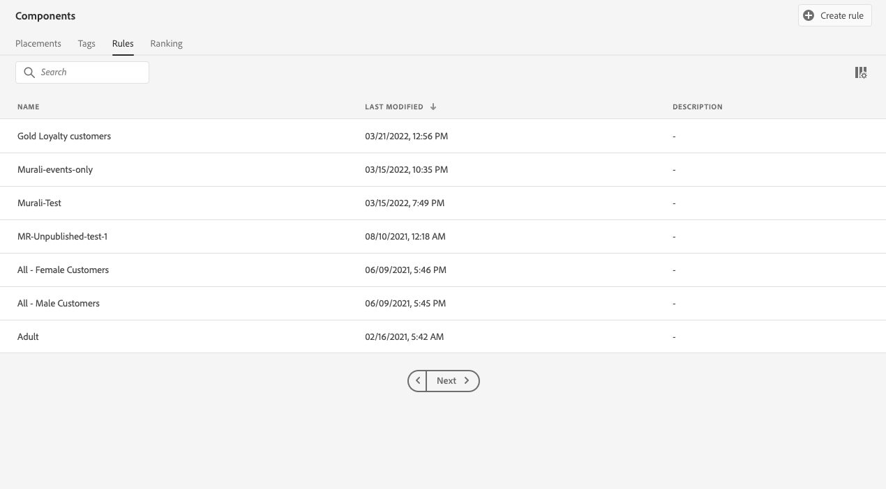
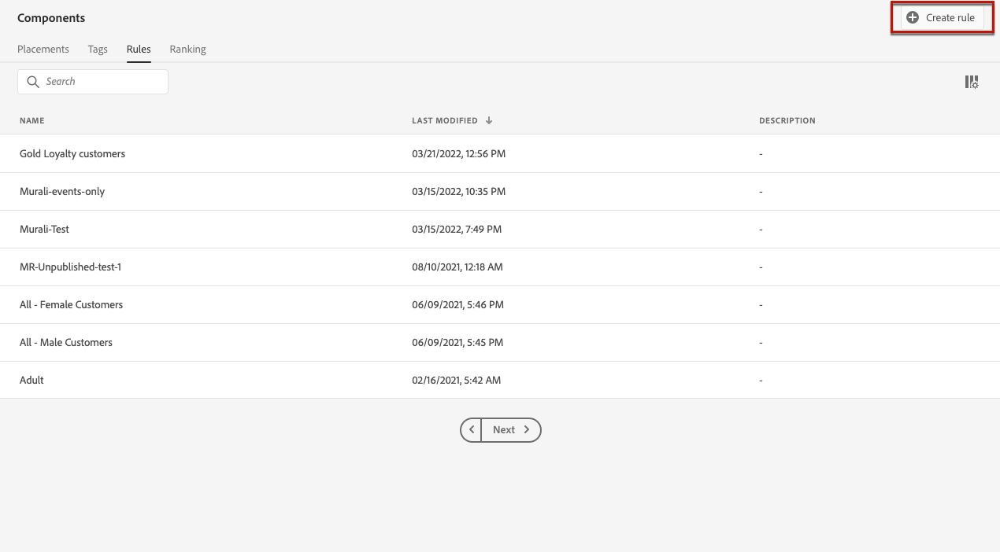
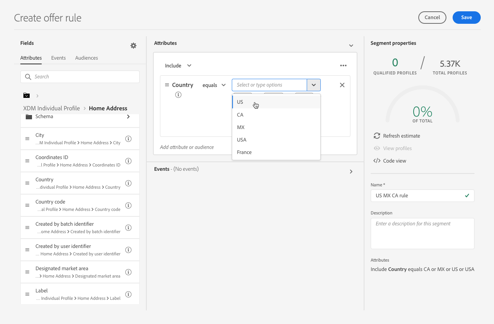
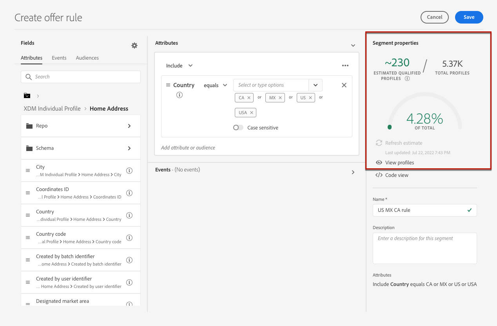
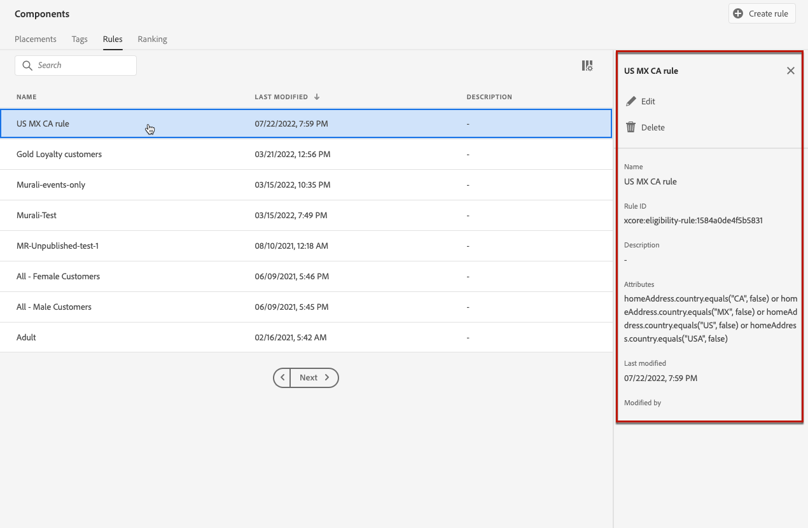

# Create decision rules {#create-decision-rules}

You can create offer decision rules based on data available in Adobe Experience Platform. Decision rules determine to whom an offer can be shown.

For example, you can specify that you only want a 'Women's Winter Clothing Offer' to be shown when (Gender = 'Female') and (Region = 'Northeast').

➡️ [Discover this feature in video](#video)

The list of created decision rules is accessible in the **[!UICONTROL Components]** menu.

To create a decision rule, follow these steps:

1. Go to the **[!UICONTROL Rules]** tab, then click **[!UICONTROL Create rule]**.

    

1. Name your rule and provide a description, then configure the rule according to your needs.
    
    To do this, the Adobe Experience Platform **Segment Builder** is available to help you build the rule's conditions. [Learn how to build segment definitions](../../audience/creating-a-segment-definition.md)
    
    <!--In this example, the rule will target customers that have the "Gold" loyalty level.-->

    

    >[!NOTE]
    >
    >The Segment Builder provided to create decision rules presents some specificities compared to the one used with the **[!UICONTROL Segmentation]** service. However, the global process described in the [Segment Builder](../../audience/creating-a-segment-definition.md) documentation is still valid to build offers decisions rules. Learn more in the [Adobe Experience Platform Segmentation Service documentation](https://experienceleague.adobe.com/docs/experience-platform/segmentation/ui/segment-builder.html).

1. As you are adding and configuring new fields in the workspace, the **[!UICONTROL Audience properties]** pane displays information on the estimated profiles belonging to the audience. Click **[!UICONTROL Refresh estimate]** to update data.

    

    >[!NOTE]
    >
    >Profile estimates are unavailable when rule parameters include data not in the profile such as context data. For example, an eligibility rule that requires the current weather to be ≥80 degrees.
    
1. Click **[!UICONTROL Save]** to confirm.

1. Once the rule is created, it displays in the **[!UICONTROL Rules]** list. You can select it to display its properties, and edit or delete it.

    

>[!CAUTION]
>
>Event-based offers are currently not supported in [!DNL Journey Optimizer]. If you create a decision rule based on an [event](https://experienceleague.adobe.com/docs/experience-platform/segmentation/ui/segment-builder.html#events){target="_blank"}, you will not be able to leverage it in an offer.

## Tutorial video {#video}

>[!VIDEO](https://video.tv.adobe.com/v/329373?quality=12)
