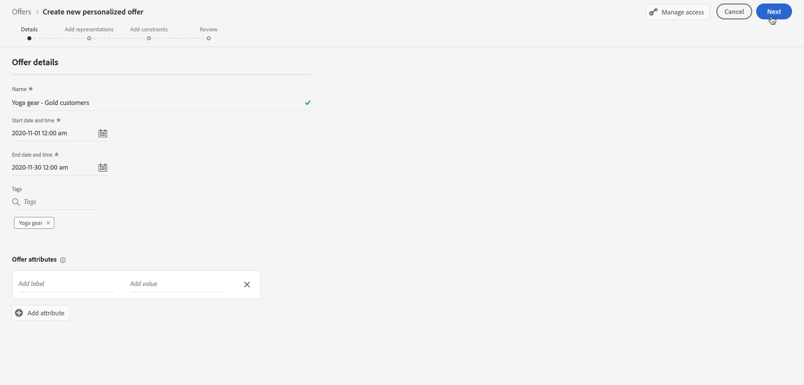
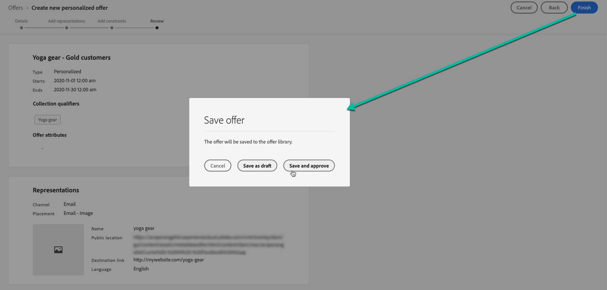
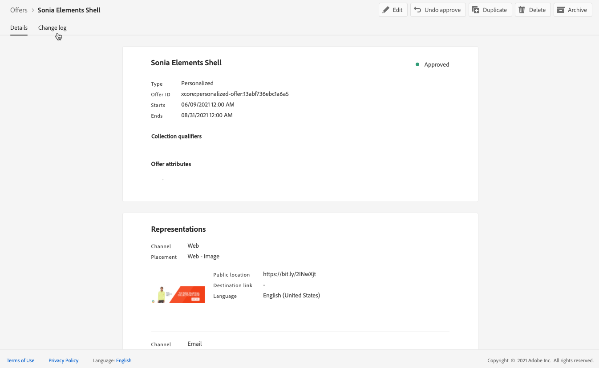

# Create personalized offers {#create-personalized-offers}

Before creating an offer, make sure that you created:

* A **placement** in which the offer will be displayed. See [Create placements](../offer-library/creating-placements.md)
* If you want to add an eligibility condition: a **decision rule** that will define the condition under which the offer will be presented. See [Create decision rules](../offer-library/creating-decision-rules.md).
* One or several **tags** that you may want to associate to the offer. See [Create tags](../offer-library/creating-tags.md).

➡️ [Discover this feature in video](#video)

The list of personalized offers is accessible in the **[!UICONTROL Offers]** menu.

## Create the offer {#create-offer}

>[!CONTEXTUALHELP]
>id="od_offer_attributes"
>title="About offer attributes"
>abstract="With offer attributes, you can associate key value pairs with the offer for reporting and analysis purposes."
>additional-url="https://video.tv.adobe.com/v/329375" text="Watch demo video"

To create an **offer**, follow these steps:

1. Click **[!UICONTROL Create offer]**, then select **[!UICONTROL Personalized offer]**.

    

1. Specify the offer's name as well as its start and end date and time. Outside of these dates, the offer won’t be selected by the Decisioning engine.

    

>[!CAUTION]
>
>Updating the start/end dates can have an impact on capping. [Learn more](#capping-change-date)

1. You can also associate one or several existing **[!UICONTROL tags]** to the offer, allowing you to search and organize the Offer Library more easily. [Learn more](../offer-library/creating-tags.md).

1. The **[!UICONTROL Offer attributes]** section allows you to associate key-value pairs with the offer for reporting and analysis purposes.

## Configure the offer's representations {#representations}

An offer can be displayed at different places in a message: in a top banner with an image, as text in a paragraph, as an HTML block, etc. The more representations an offer has, the more opportunities exist to use the offer in different placement contexts.

To add one or multiple representations to your offer and configure them, follow the steps below.

1. For the first representation, start by selecting the **[!UICONTROL Channel]** that will be used.

    

    >[!NOTE]
    >
    >Only the available placements for the selected channel display in the **[!UICONTROL Placement]** drop-down list.

1. Select a placement from the list.

    You can also use the button next to the **[!UICONTROL Placement]** drop-down list to browse all the placements.

    

    There you can still filter the placements according to their channel and/or content type. Choose a placement and click **[!UICONTROL Select]**.

    

1. Add content to your representation. Learn how in [this section](#content).

1. When you add content such as an image or URL, you can specify a **[!UICONTROL Destination link]**: the users who click the offer will be directed to the corresponding page.

    

1. Finally, select the language of your choice to help identify and manage what to display to the users.

1. To add another representation, use the **[!UICONTROL Add representation]** button and add as many representations as needed.

    

1. Once you added all your representations, select **[!UICONTROL Next]**.

## Define content for your representations {#content}

You can add different types of content to a representation.

>[!NOTE]
>
>Only content corresponding to the placement's content type is available for use.

### Add images {#images}

If the selected placement is image-type, you can add content coming from the **Adobe Experience Cloud Asset** library, a centralized repository of assets provided by [!DNL Adobe Experience Manager Assets Essentials].

>[!NOTE]
>
> To work with [Adobe Experience Manager Assets Essentials](https://experienceleague.adobe.com/docs/experience-manager-assets-essentials/help/introduction.html?lang=en){target="_blank"}, you need to deploy [!DNL Assets Essentials] for your organization and make sure that users are a part of the **Assets Essentials Consumer Users** or/and **Assets Essentials Users** Product profiles. Learn more on [this page](https://experienceleague.adobe.com/docs/experience-manager-assets-essentials/help/deploy-administer.html){target="_blank"}.
    
1. Choose the **[!UICONTROL Asset library]** option.

1. Select **[!UICONTROL Browse]**.

    

1. Browse the assets to select the image of your choice

1. Click **[!UICONTROL Select]**.

    

### Add URLs {#urls}

To add content from an external public location, select **[!UICONTROL URL]**, then enter the URL address of the content to add.

### Add custom text {#custom-text}

You can also insert text-type content when selecting a compatible placement.

1. Select the **[!UICONTROL Custom]** option and click **[!UICONTROL Add content]**.
    
    
    
    >[!NOTE]
    >
    >This option is not available for image-type placements.

1. Type the text that will display in the offer.

    

    You can personalize your content using the Expression Editor. Learn more on [personalization](../../personalization/personalize.md#use-expression-editor).

    

    >[!NOTE]
    >
    >Only the **[!UICONTROL Profile attributes]**, **[!UICONTROL Segment memberships]** and **[!UICONTROL Helper functions]** sources are available for Decision Management.

## Add eligibility rules and constraints {#eligibility}

>[!CONTEXTUALHELP]
>id="od_offer_constraints"
>title="About offer constraints"
>abstract="With constraints, you can specify how the offer is prioritized and presented to the user compared to other offers."
>additional-url="https://video.tv.adobe.com/v/329375" text="Watch demo video"

>[!CONTEXTUALHELP]
>id="od_offer_eligibility"
>title="About offer eligibility"
>abstract="In this section, you can use decision rules to determine which users are eligible to the offer."
>additional-url="https://video.tv.adobe.com/v/329373" text="Watch demo video"

>[!CONTEXTUALHELP]
>id="od_offer_priority"
>title="About offer priority"
>abstract="In this field, you can specify priority settings for the offer. Priority is a number used to rank offers that meet all constraints such as eligibility, dates, and capping."
>additional-url="https://video.tv.adobe.com/v/329375" text="Watch demo video"

>[!CONTEXTUALHELP]
>id="od_offer_globalcap"
>title="About offer capping"
>abstract="In this field, you can specify how many times the offer can be presented across all users."
>additional-url="https://video.tv.adobe.com/v/329375" text="Watch demo video"

Eligibility rules and constraints allow you to define the conditions under which an offer will be displayed.

1. Configure the **[!UICONTROL Offer eligibility]**. [Learn more](#eligibility)

   

1. Define the **[!UICONTROL Priority]** of the offer compared to other ones if the user qualifies for more than one offer. The higher an offer's priority will be, the higher its priority will be compared to other offers.

   

1. Specify the offer's **[!UICONTROL Capping]**, meaning the number of times the offer will be presented. [Learn more](#capping)

   

1. Click **[!UICONTROL Next]** to confirm all the constraints you defined.
        
For example, if you set the following constraints:

* The offer will be considered for users that match the "Gold Loyalty Customers" decision rule only.
* The offer's priority is set to "50", meaning the offer will be presented before offers with a priority between 1 and 49, and after the ones with a priority of at least 51.
* The offer will be presented only once per user accross all placements.

### Eligibility {#eligibility}

The **[!UICONTROL Offer eligibility]** section allows you to restrict the offer to specific profiles that you define using segments or decision rules.

>[!NOTE]
>
>Learn more on using **segments** versus **decision rules** in [this section](#segments-vs-decision-rules).

* By default, the **[!UICONTROL All visitors]** option is selected, meaning that any profile will be eligible to be presented the offer.

    

* You can also limit the presentation of the offer to the members of one or several [Adobe Experience Platform segments](../../segment/about-segments.md).

    To do this, activate the **[!UICONTROL Visitors who fall into one or multiple segments]** option, then add one or several segments from the left pane and combine them using the **[!UICONTROL And]** / **[!UICONTROL Or]** logical operators.
    
    

* If you want to associate a specific [decision rule](../offer-library/creating-decision-rules.md) to the offer, select **[!UICONTROL By defined decision rule]**, then drag the desired rule from the left pane into the **[!UICONTROL Decision rule]** area.

    

    >[!CAUTION]
    >
    >Event-based offers are currently not supported in [!DNL Journey Optimizer]. If you create a decision rule based on an [event](https://experienceleague.adobe.com/docs/experience-platform/segmentation/ui/segment-builder.html?lang=en#events){target="_blank"}, you will not be able to leverage it in an offer.

### Using segments vs decision rules {#segments-vs-decision-rules}

To apply a constraint, you can restrict the selection of offers to the members of one or several **Adobe Experience Platform segments**, or you can use a **decision rule**, both solutions corresponding to different usages.

Basically, the output of a segment is a list of profiles, whereas a decision rule is a function executed on demand against a single profile during the decisioning process. The difference between those two usages are detailed below.

* **Segments**

    On one hand, segments are a group of Adobe Experience Platform profiles that match a certain logic based on profile attributes and experience events. However, Offer Management does not recompute the segment, which may not be up-to-date when presenting the offer.

    Learn more on segments in [this section](../../segment/about-segments.md).

* **Decision rules**
    
    On the other hand, a decision rule is based on data available in Adobe Experience Platform and determines to whom an offer can be shown. Once selected in an offer or a decision for a given placement, the rule is executed every single time a decision is made, which ensures that each profile gets the latest and the best offer.

    Learn more on decision rules in [this section](../offer-library/creating-decision-rules.md).

### Frequency capping {#capping}

>[!CONTEXTUALHELP]
>id="ajo_decisioning_capping"
>title="About offer capping"
>abstract="In this field, you can specify how many times the offer can be presented."

Capping is used as a constraint to define the maximum number of times an offer can be presented. Limiting the number of times users get specific offers allows you to avoid over-solicitating your customers and thus to optimize each touchpoint with the best offer.

To set capping, define the number of times the offer can be presented and define the following criteria:

>[!NOTE]
>
>The number must be greater than O.

1. Specify if you want the capping to be applied accross all users or to one specific profile:

    * Select **[!UICONTROL In total]** to define how many times an offer can be proposed across the combined target audience, meaning across all users.

        For example, electronics retailer sets a frequency cap for their 'TV doorbuster deal' offer to only be returned 200 times across all profiles.  

    * Select **[!UICONTROL Per profile]** to define how many times an offer can be proposed to the same user.

        For example, a bank sets a frequency cap for the 'Platinum credit card' offer to be shown 5 times per profile. They do this because they believe if the user has seen the offer 5 times and not acted on it, they have a higher chance to act on the next best offer.

1. If you have defined several representations for your offer, specify if you want to apply capping to **[!UICONTROL All placements]** or **[!UICONTROL Per placement]**.

1. Once saved and approved, if the offer has been delivered the number of times you have specified in this field according to the criteria you defined, its delivery will stop.

    The number of times an offer is proposed is calculated at email preparation time. For example, if you prepare an email with a number of offers, those numbers count towards your max cap regardless of whether or not the email is sent.?

>[!NOTE]
>
>If an email delivery is deleted or if the preparation is done again before being sent, the capping value for the offer is automatically updated.

### Impact of changing the offer date on capping {#capping-change-date}

Once an offer is approved, changing its start/end date can have an impact if capping was applied this offer.

Frequency capping per profile stores the capping counts on each profile. Changing the start and end date of an approved offer will update the profile capping count start and end dates. Changing these dates could impact the capping count for some profiles. Below describes the different scenarios:

Changing an offer start date:
* if offer start date is updated before the original offer start date has begun, cap counting will begin at new start date.
* if new start date is before current end date, capping will continue to work with a new start date and counts would carry forward from earlier capping.
* if new start date is after current end date, current capping will expire and new capping will start at 0 for all users on the new start date.

Changing an offer end date:
* If a decisioning request occurs before the original offer end date, then capping will be updated and previous counts will carry forward.
* If no decisioning request occurs before the original end date, the count will reset. New capping count will start for any new decisioning requests after original end date.  

## Review the offer {#review}

Once eligibility rules and constraints have been defined, a summary of the offer properties displays.

1. Make sure everything is configured properly.

1. When your offer is ready to be presented to users, click **[!UICONTROL Finish]**.

1. Select **[!UICONTROL Save and approve]**.

    

    You can also save the offer as a draft, in order to edit and approve it later on. 

The offer displays in the list with the **[!UICONTROL Approved]** or **[!UICONTROL Draft]** status, depending on whether you approved it or not in the previous step.

It is now ready to be delivered to users.

## Offer list {#offer-list}
    
From the offer list, you can select the offer to display its properties. You can also edit it, change its status (**Draft**, **Approved**, **Archived**), duplicate the offer, or delete it.

Select the **[!UICONTROL Edit]** button to go back to the offer edition mode, where you can modify the offer's [details](#create-offer), [representations](#representations), as well as edit the [eligibility rules and constraints](#eligibility). 

Select an approved offer and click **[!UICONTROL Undo approve]** to set the offer status back to **[!UICONTROL Draft]**.

To set again the status to **[!UICONTROL Approved]**, select the corresponding button that is now displayed.

The **[!UICONTROL More actions]** button enables the actions described below.

* **[!UICONTROL Duplicate]**: creates an offer with the same properties, representations, eligibility rules and constraints. By default, the new offer has the **[!UICONTROL Draft]** status.
* **[!UICONTROL Delete]**: removes the offer from the list.

    >[!CAUTION]
    >
    >The offer and its content will not be accessible anymore. This action cannot be undone.
    >
    >If the offer is used in a collection or a decision, it cannot be deleted. You must remove the offer from any objects first.

* **[!UICONTROL Archive]**: sets the offer status to **[!UICONTROL Archived]**. The offer is still available from the list, but you cannot set its status back to **[!UICONTROL Draft]** or **[!UICONTROL Approved]**. You can only duplicate or delete it.

You can also delete or change the status of multiple offers at the same time by selecting the corresponding checkboxes.

If you want to change the status of several offers whith different statuses, only the relevant statuses will be changed.

Once an offer has been created, you can click its name from the list.

This enables you to access detailed information for that offer. Select the **[!UICONTROL Change log]** tab to [monitor all the changes](../get-started/user-interface.md#monitoring-changes) that have been made to the offer.

## Tutorial video {#video}

>[!NOTE]
>
>This video applies to the Offer Decisioning application service built on Adobe Experience Platform. However, it provides generic guidance to use Offer in the context of Journey Optimizer.

>[!VIDEO](https://video.tv.adobe.com/v/329375?quality=12)
