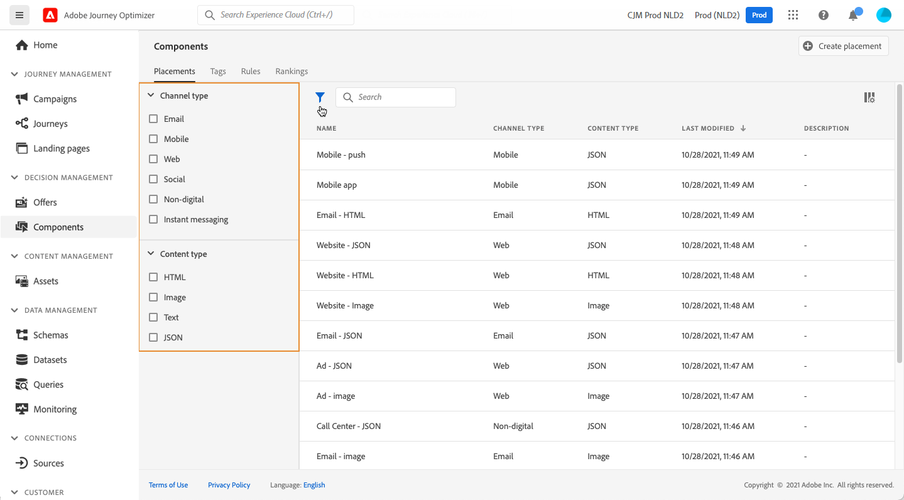
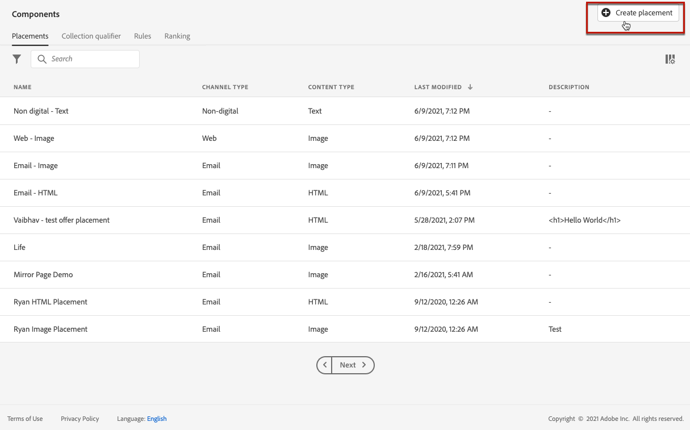
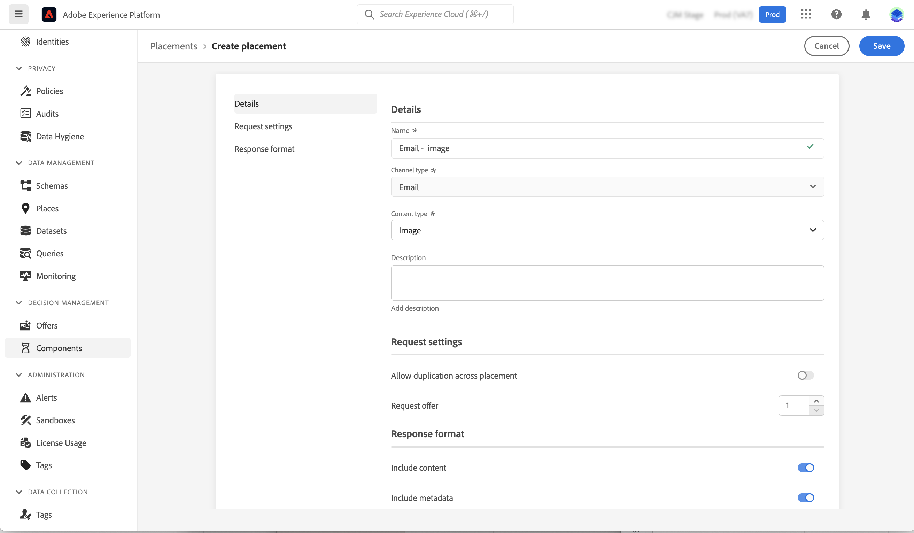
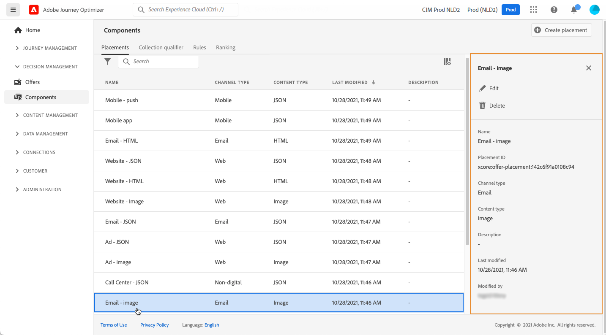

# Create placements {#create-placements}

>[!CONTEXTUALHELP]
>id="ajo_decisioning_placement"
>title="Placement"
>abstract="A placement is a container that is used to showcase offers. It helps ensure that the right offer content shows up in the right location within your message. Placements are created from the "Components" menu."

A placement helps ensure that the right offer content shows up in the right location within your message. When you add content to an offer, you will be asked to select a placement in which that content can be shown.

➡️ [Learn how to create placements in this video](#video)

In the example below, there are three placements, corresponding to different types of content (image, text, HTML).

The list of placements is accessible in the **[!UICONTROL Components]** menu. Filters are available to help you retrieve placements according to a specific channel or content.

To create a placement, follow these steps:

1. Click **[!UICONTROL Create placement]**.

    

1. Define the placement's properties:

    * **[!UICONTROL Name]**: The name of the placement. Make sure to define a meaningful name to retrieve it more easily.
    * **[!UICONTROL Channel type]**: The channel for which the placement will be used.
    * **[!UICONTROL Content type]**: The type of content that the placement will be allowed to display: Text, HTML, Image Link, or JSON.
    * **[!UICONTROL Description]**: A description of the placement (optional).

    

1. The **[!UICONTROL Request settings]** and **[!UICONTROL Response format]** sections provide additional parameters:

    * **[!UICONTROL Allow Duplicates across placements]**: Control whether the same offer can be proposed multiple times across different placements. If enabled, the system will consider the same offer for multiple placements. By default, the parameter is set to false.

        If this option is set to false for any placement in a decisioning request, all placements in the request will inherit the "false" setting.

    * **[!UICONTROL Request offer]**: By default, one offer of the decision scope is returned for each profile. You can adjust the number of returned offers using this option. For example, if you select 2, the best 2 offers will display for the selected decision scope.

    * **[!UICONTROL Include content]** / **[!UICONTROL Include metadata]**: specify if the offer's content and metadata should be returned in the API response. You can include all metadata or specific fields only. By default, Include metadata value is set to true.

    These parameters can also be set directly into your API request if you are working with the [Decisioning API](https://experienceleague.adobe.com/docs/journey-optimizer/using/offer-decisioning/api-reference/offer-delivery-api/decisioning-api.html). However, configuring them in the user interface can help you save time as you will not have to pass them in each API request. Note that if you configure the parameters both in user interface and the API request, values from the API request will prevail over the ones from the interface.
    
    >[!NOTE]
    >
    >If you are working with the [Edge Decisioning API](https://experienceleague.adobe.com/docs/journey-optimizer/using/offer-decisioning/api-reference/offer-delivery-api/edge-decisioning-api.html?), you cannot set these parameters into your request. You need to define them in this screen.
    >
    >If you are working with the [Batch Decisioning API](../api-reference/offer-delivery-api/batch-decisioning-api.md), you can set these parameters either in this screen or in your API request. If there is a mismatch of parameter values between the screen and the APi request, the request values will be used.

1. Click **[!UICONTROL Save]** to confirm.

1. Once the placement is created, it displays in the placements list. You can select it to display its properties and edit it.

    

## How-to video{#video}

Learn how to create placements in decision management.

>[!VIDEO](https://video.tv.adobe.com/v/329372?quality=12)

