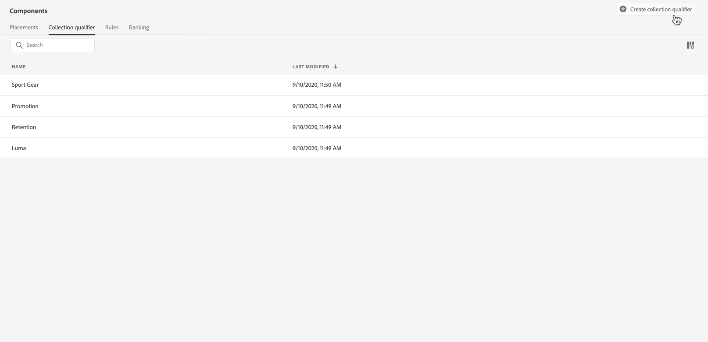
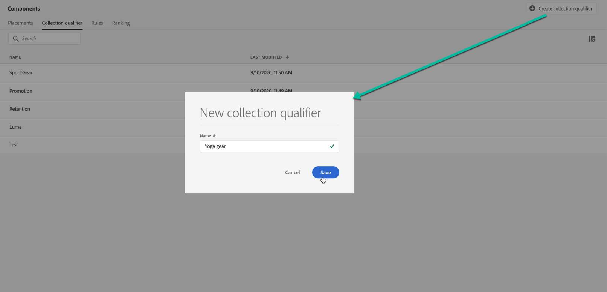
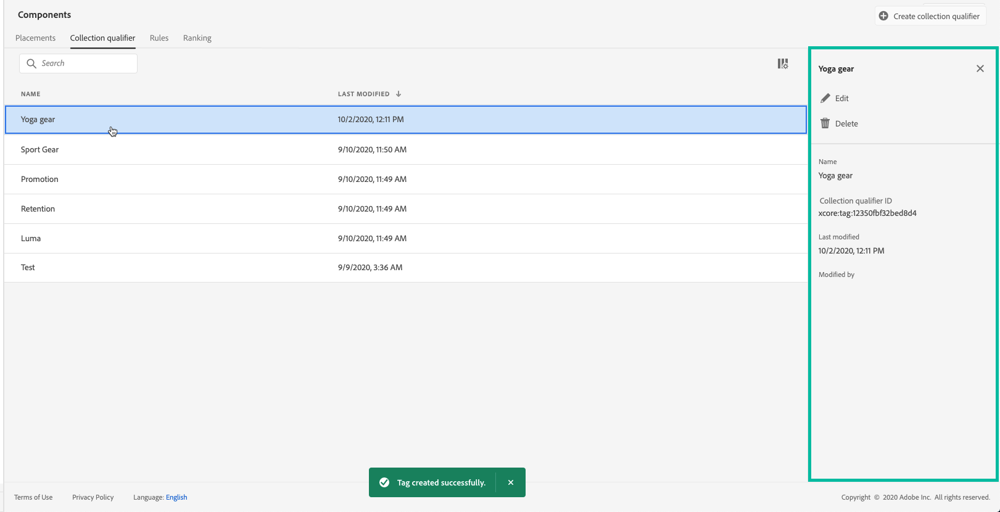

# Create collection qualifiers {#create-tags}

>[!CONTEXTUALHELP]
>id="ajo_decisioning_offer_tags"
>title="Collection qualifiers"
>abstract="Associate one or several collection qualifiers to the offer to keep your Offer Library organized and locate offers more easily. Collection qualifiers are created from the "Component" menu."

Associating collection qualifiers (previously known as "tags") to your offers make it easier to keep them organized. For example, you could label your Black Friday offers with the "Black Friday" collection qualifier. You can then use the search functionality in the Offer Library to easily locate all of the offers with that collection qualifier.

Collection qualifiers can also be used to group offers together into offer collections. See [Create collections](../offer-library/creating-collections.md).

➡️ [Discover this feature in video](#video)

The list of created collection qualifiers is accessible in the **[!UICONTROL Components]** menu.

To create a collection qualifier, follow these steps:

1. Go to the **[!UICONTROL Collection qualifiers]** tab, then click **[!UICONTROL Create collection qualifier]**.

1. Specify the collection qualifier's name, then click **[!UICONTROL Save]**.

    

1. Once the collection qualifier is created, it displays in the list. You can select it to display its properties and edit or suppress it.

    

## How-to video {#video}

>[!VIDEO](https://video.tv.adobe.com/v/329374?quality=12)
