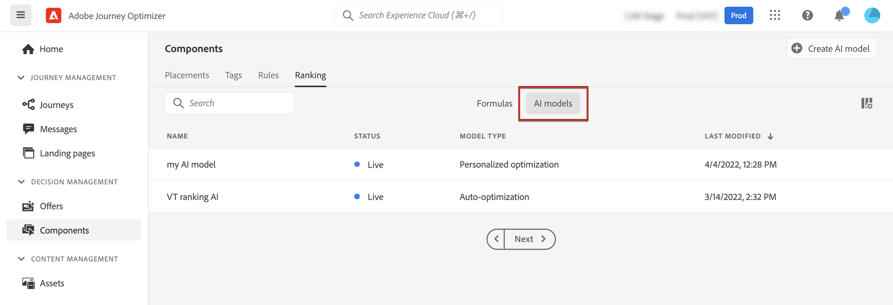
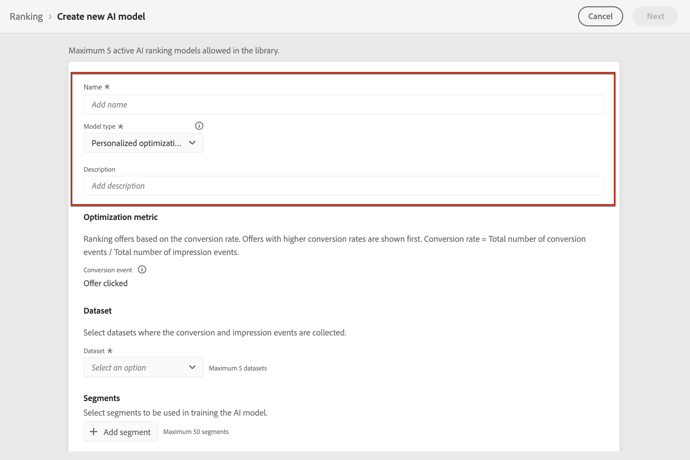
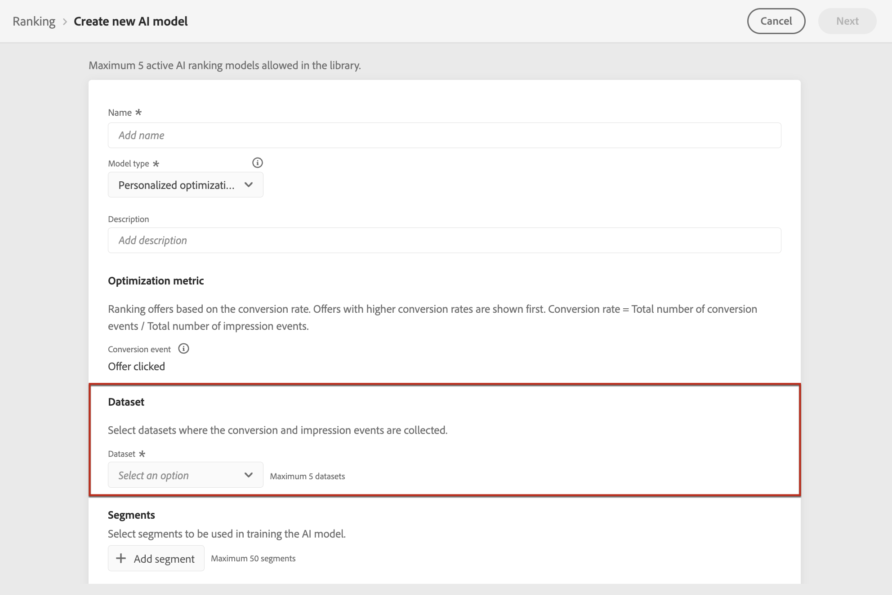
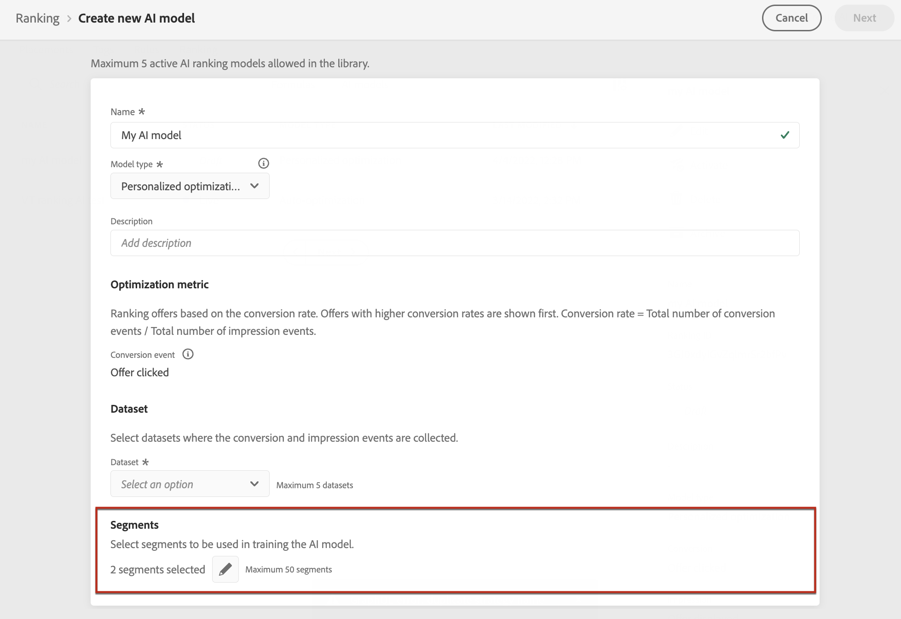
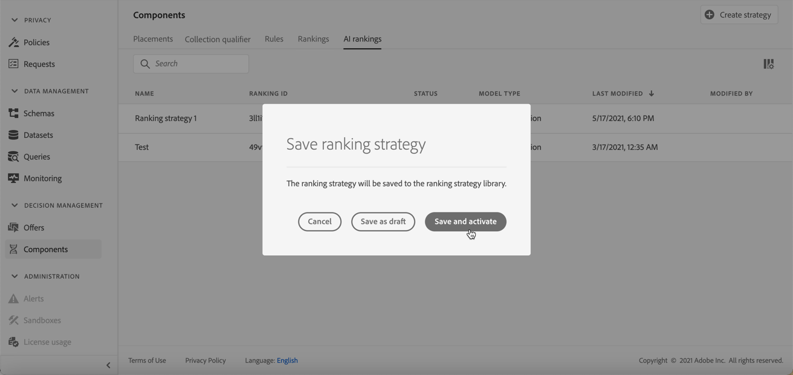

# Create AI models {#ai-rankings}

[!DNL Journey Optimizer] enables you to create **AI models** to rank offers based on your business goals.

>[!CAUTION]
>
>To create, edit, or delete AI models, you must have the **Manage Ranking Strategies** permission. [Learn more](../../administration/high-low-permissions.md#manage-ranking-strategies)

## Create an AI model {#create-ranking-strategy}

To create an AI model, follow the steps below:

1. Create a dataset where conversion events will be collected. [Learn how](../data-collection/create-dataset.md)

1. In the **[!UICONTROL Components]** menu, access the **[!UICONTROL Ranking]** tab, then select **[!UICONTROL AI models]**.

    

    All the AI models created so far are listed.

1. Click the **[!UICONTROL Create AI model]** button.

1. Specify a unique name and a description for the AI model, then select the type of AI model you want to create:
    
    * **[!UICONTROL Auto-optimization]** optimizes offers based on past offer performance. [Learn more](auto-optimization-model.md)
    * **[!UICONTROL Personalized]** optimizes and personalizes offers based on audiences and offer performance. [Learn more](personalized-optimization-model.md)

    

    >[!NOTE]
    >
    >The **[!UICONTROL Optimization metric]** section provides information on the conversion event used by the AI model to calculate offers' ranking.
    >
    >[!DNL Journey Optimizer] rank offers based on the **conversion rate** (Conversion rate = Total number of conversion events / Total number of impression events). The conversion rate is calculated using two types of metrics:
    >* **Impression events** (offers that are displayed)
    >* **Conversion events** (offers that result in clicks via email or web).
    >
    >These events are automatically captured using the Web SDK or the Mobile SDK that has been provided. Learn more on this in [Adobe Experience Platform Web SDK overview](https://experienceleague.adobe.com/docs/experience-platform/edge/home.html).

1. Select the dataset(s) where the conversion and impression events are collected. Learn how to create such dataset in [this section](../data-collection/create-dataset.md). <!--This dataset needs to be associated with a schema that must have the **[!UICONTROL Proposition Interactions]** field group (previously known as mixin) associated with it.-->

    
    
    >[!CAUTION]
    >
    >Only the datasets created from schemas associated with the **[!UICONTROL Experience Event - Proposition Interactions]** field group (previously known as mixin) are displayed in the drop-down list.

1. If you are creating a **[!UICONTROL Personalized optimization]** AI model, select the audience(s) to use to train the AI model.

    

    >[!NOTE]
    >
    >You can select up to 5 audiences.

1. Save and activate the AI model.

    

<!--At this point, you must have:

* created the AI model,
* defined which type of event you want to capture - offer displayed (impression) and/or offer clicked (conversion),
* and in which dataset you want to collect the event data.-->

Now each time an offer is displayed and/or clicked, you want the corresponding event to be automatically captured by the **[!UICONTROL Experience Event - Proposition Interactions]** field group using the [Adobe Experience Platform Web SDK](https://experienceleague.adobe.com/docs/experience-platform/edge/web-sdk-faq.html#what-is-adobe-experience-platform-web-sdk%3F){target="_blank"} or Mobile SDK.

To be able to send in event types (offer displayed or offer clicked), you must set the correct value for each event type in an experience event that is sent into Adobe Experience Platform. [Learn how](../data-collection/schema-requirement.md)

## How-to video {#video}

Learn how to create a personalized optimization model and how to apply it to a decision.

>[!VIDEO](https://video.tv.adobe.com/v/3419954?quality=12)
