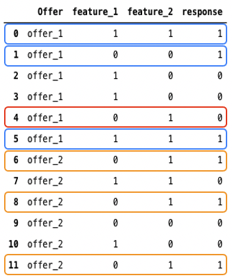

# Personalized optimization model {#personalized-optimization-model}

## Overview {#overview}

By leveraging the state-of-the-art technologies in supervised machine learning and deep learning, Auto-personalization allows a business user (marketer) to define business goals and utilizes their customer data to train business-oriented models to serve personalized offers and maximize KPIs.

## Key Model Assumptions and Limitations {#key}

In order to maximize the advantage of using auto-personalization, there are some key assumptions and limitations to be aware of. 

* **Offers are different enough so that users will have different preferences among the offers in consideration**. If offers are too similar, a resulting model will have less impact as the responses are seemingly random.
For example if a bank has two credit cards offers with the only difference being color, then it may not matter which card is recommended, but if each card has different terms, this provides rationale for why certain customers would choose one and provide enough difference between offers to build a more impactful model.
* **User traffic composition is stable**. If user traffic composition changes dramatically during model training and predicting, model performance could degrade. For example, suppose in model training phase, only data for users in segment A is available, but the trained model is used to generate predictions for users in segment B, then model performance could be impacted.
* **Offers performances do not change dramatically over a short period of time** as this model updates weekly and changes to performance are conveyed as the model updates. For example, a product was very popular before, but a public report identifies the product to be harmful to our health, and this product becomes unpopular extremely fast. In this scenario, the model could continue to predict this product until the model updates with changes in user behavior.  

## How It Works {#how}

The model learns complex feature interactions between offers, users' information and contextual information to recommend personalized offers to end users. Features are inputs into the model.

There are 3 types of features:

| Feature types | How to add features to models |
|--------------|----------------------------|
| Segments| 0-50 segments can be added as features when creating the Ranking AI model|
| Decisioning objects (placementID, activityID, decisionScopeID)| Part of the decision management feedback Experience Events sent to AEP|
| Context data| Part of the decisioning feedback Experience Events sent to AEP. Available context data to add to schema: Commerce Details, Channel Details, Application Details, Web Details, Environment Details, Device Details, placeContext|

The model has two phases:

* In the **offline model training** phase, a model is trained by learning and memorizing feature interactions in historical data. 
* In the **online inference** phase, candidates offers are ranked based on real-time scores generated by the model. Unlike traditional collaborative filtering techniques, which is hard to include features for users and offers, auto-personalization is a deep learning based recommendation method, and is able to include and learn complex and nonlinear feature interaction patterns. 

Here is a simplified example to illustrate the basic idea behind auto-personalization. Suppose we have a dataset which stores historical interactions between users and offers, which is shown in Figure 1. There are:
* Two offers, offer_1 and offer_2,
* Two features, feature_1 and feature_2,
* A response column.

The value of feature_1, feature_2 and response is either 0 or 1. When we look at the blue boxes and orange boxes in Figure 1, we can find that for offer_1, the responses are more likely to be 1 when feature_1 and feature_2 have same values, while for offer_2, the labels are more likely to be 1 when feature_1 is 0 and feature_2 is 1. We can also see that in the red box, offer_1 is served when feature_1 is 0 and feature_2 is 1, and response is 0. Based on the pattern we see in orange boxes, when feature_1 is 0 and feature_2 is 1, offer_2 is probably a better recommendation.

Basically, this is the idea of learning and memorizing historical feature interactions and applying them to generate personalized predictions. 

## Cold-start Problem {#cold-start}

Cold-start problem occurs when there isn't enough data to make recommendation. For auto-personalization, there are two types of cold-start problems.

* **After creating a new ranking strategy with no historical data**, offers will be randomly served for a period of time to collect data, and the data will be used to train the first model.
* **After the first model is released**, 10% of total traffic will be allocated for random serving while 90% of traffic will be used for model recommendations. Therefore, if new offers were added to the ranking strategy, they would be delivered as part of the 10% of traffic. The data collected on those offers would determine the number of times it is selected among the 90% of traffic as the model continues to get updated.  

## Re-training {#re-training}

Models will be re-trained to learn latest feature interactions and mitigate model performance degradation weekly.
