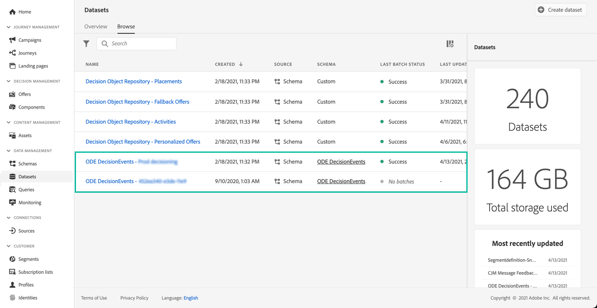

# Get started with Decision management events {#monitor-offer-events}

Each time Decision management makes a decision for a given profile, information related to these events are automatically sent to Adobe Experience Platform. 

This allows you yo gain insights on your decisions, for example, to know which offer was presented to a given profile. You can export these data to analyze them into your own reporting system, or leverage Adobe Experience Platform [Query Service](https://experienceleague.adobe.com/docs/experience-platform/query/home.html) in combination with other tools for enhanced analysis and reporting purposes.

## Key information available in datasets {#key-information}

Each event that is sent when a decision is made contains four key data points that you can leverage for analysis and reporting purposes:

* **[!UICONTROL Fallback]**: Name and ID of the fallback offer, if no personalized offer was selected,
* **[!UICONTROL Placement]**: Name, ID and channel of the placement used to deliver the offer,
* **[!UICONTROL Selections]**: Name and ID of the offer selected for the profile,
* **[!UICONTROL Activity]**: Name and ID of the decision.

Additionally, you can also leverage the **[!UICONTROL identityMap]** and **[!UICONTROL Timestamp]** fields to retrieve information on the profile and the time at which the offer was delivered.

For more information on all the XDM fields that are sent with each decision, refer to [this section](xdm-fields.md).

## Access datasets {#access-datasets}

The datasets containing Decision management events are accessible from Adobe Experience Platform **[!UICONTROL Datasets]** menu. One dataset is automatically created on provisioning for each of your instances.

These datasets are based on the **[!UICONTROL ODE DecisionEvents]** schema, which contains all the XDM fields that are required to send information from Decision Management to Adobe Experience Platform.  

>[!NOTE]
>
>Note that ODE DecisionEvents datasets are **non-profile datasets**, meaning that they cannot be ingested into Experience Platform for use by Real-time Customer Profile.
