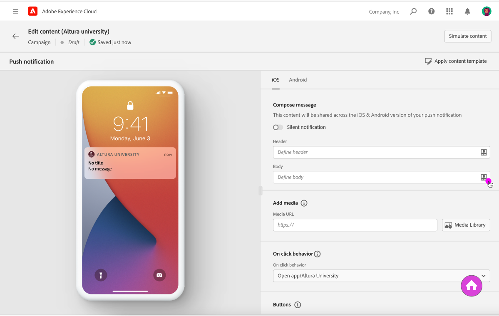
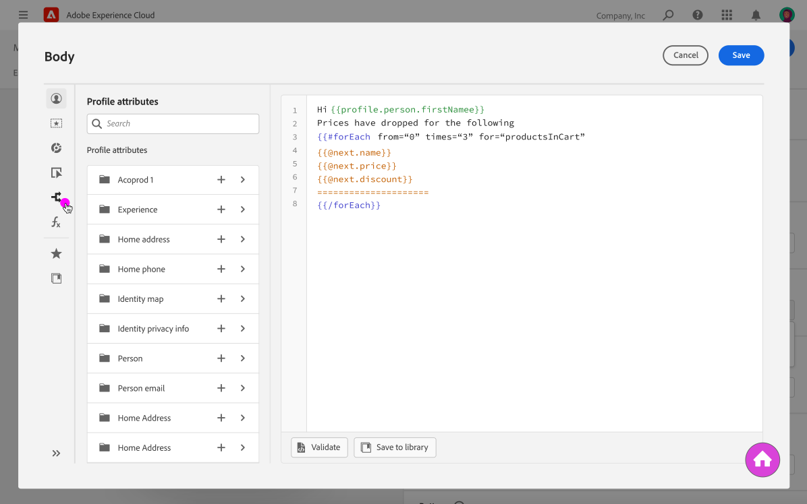

# Work with the conditions library {#work-conditions-library}

The conditions library allows you to design and store conditions in order to build conditional content. It is accessible from the Expression Editor.

To access the conditions library, follow these steps:

1. Open the Expression Editor from any field where you can perform personalization. [Learn more on personalization contexts](personalization-contexts.md)

    

1. Click the **[!UICONTROL Conditions]** menu to access the library.

    

1. All the conditions created so far display in the left pane.

    To see how a condition has been built, click the ellipse button then select **[!UICONTROL Open]**. You can also get more details by selecting **[!UICONTROL More info]**.

    

For more information on how to create conditions and use them to build conditional content, refer to these section:

* [Create conditions](create-conditions.md)
* [Build conditional content](build-conditional-content.md)
