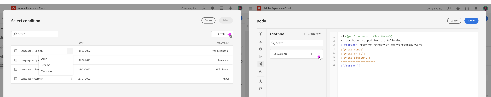

# Manage conditions {#conditions}

## About conditions {#about-conditions}

With Journey Optimizer, you can create conditions, which are sets of rules that define which content should be displayed in your messages, depending on various criteria like profiles' attributes, segment membership or contextual events.

Conditions are created using the conditions library, which is accessible either:

* From the Email Designer, when enabling conditional content in the email body ([learn more](build-conditional-content.md#emails)),
* In any field where you can build expressions using the Expression Editor.

## Create a condition {#create-condition}

The steps to create a condition are as follows:

1. Access the condition library from the Expression Editor or the Email Designer, then click **[!UICONTROL Create new]**.

    

1. Build your condition according to your needs. To do this, drag and drop and arrange the desired attributes from the left menu into the workspace. 

    Available attributes are:

    * **[!UICONTROL Profile attributes]**: lists all the references associated to the profile schema described in Adobe Experience Platform Data Model (XDM) documentation.
    * **[!UICONTROL Segment memberships]**: lists all the segments created in Adobe Experience Platform Segmentation service. More information on segmentation available here.
    * **[!UICONTROL Contextual attributes]**: when the Message is used in a journey, contextual journey fields are available through this menu.

    

1. Once the condition is ready, click the **[!UICONTROL Save to conditions library]** button. Give a name and a description (optional) to the condition, then click **[!UICONTROL Save]**.

    

1. The condition is saved to the library. You can now use it to add conditional content into your messages based on it. [Learn how to build conditional content](build-conditional-content.md)

You can edit a condition at any time. To do this, open it then make the desired changes.

>[!IMPORTANT]
>
>Making changes to the condition will not affect the places where it is already being used.
