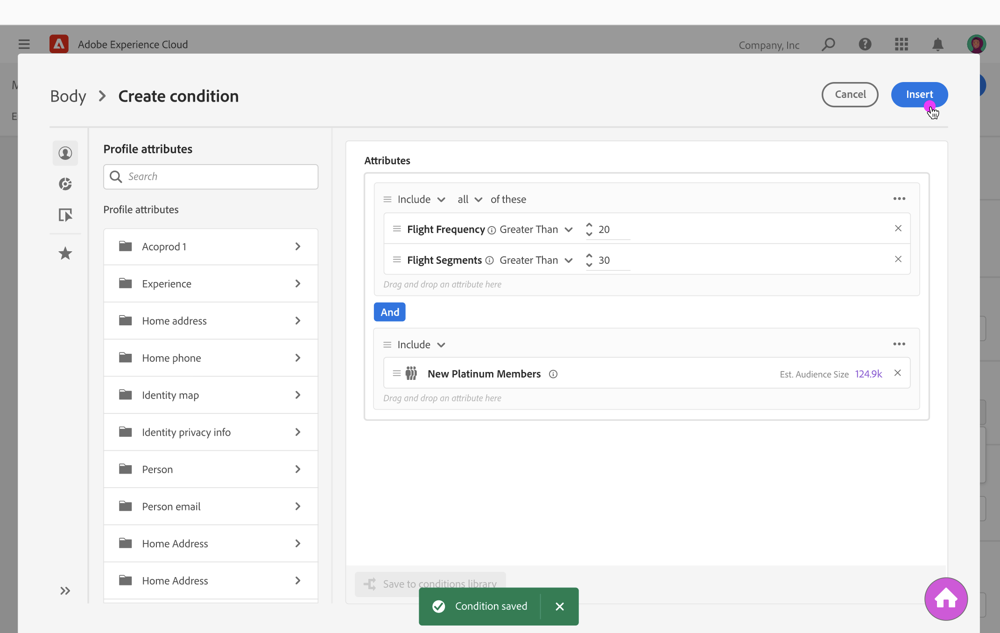
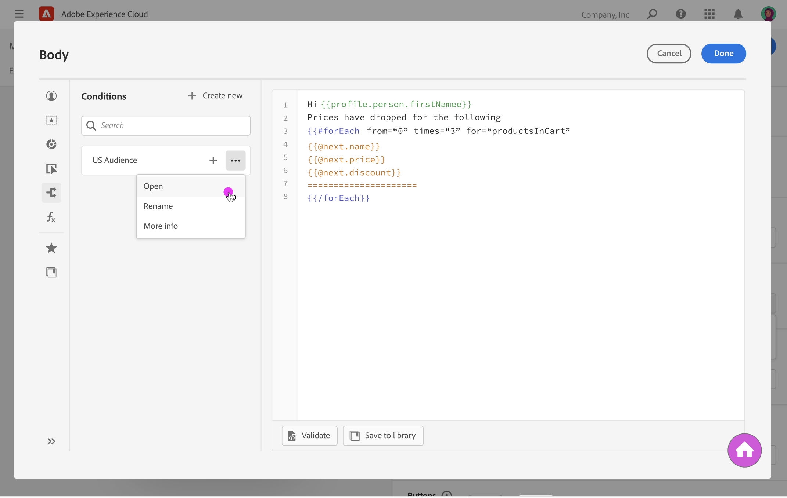

# Create conditions {#conditions}

With Journey Optimizer, you can create conditions, which are sets of rules that will define the conditions under which some content should be displayed in your messages.

Once created, these conditions can be leveraged in messages to build conditional content depending on these rules.

The steps to create a condition are as follows:

1. Access the condition library from the Expression Editor or the Email Designer, then click **[!UICONTROL Create new]**.

1. Build your condition according to your needs. To do this, drag and drop and arrange the desired attributes from the left menu. 

    Available attributes are:

    * **[!UICONTROL Profile attributes]**: lists all the references associated to the profile schema described in Adobe Experience Platform Data Model (XDM) documentation.
    * **[!UICONTROL Segment memberships]**: lists all the segments created in Adobe Experience Platform Segmentation service. More information on segmentation available here.
    * **[!UICONTROLContextual attributes]**: when the Message is used in a journey, contextual journey fields are available through this menu. Learn more in this section.

    

1. Once the condition is ready, click the **[!UICONTROL Save to conditions library]** button.

1. Give a name and a description to the condition, then click **[!UICONTROL Save]**.

    

1. The condition is saved to the library. You can now use it to add conditional content to your expression or email body. [Learn how to build conditional content](build-conditional-content.md)

    

Note that you can edit a condition at any time. To do this, open the condition from the list, then make the desired changes.

>[!IMPORTANT]
>
>Making changes to the condition will not affect the places where it is already being used.

