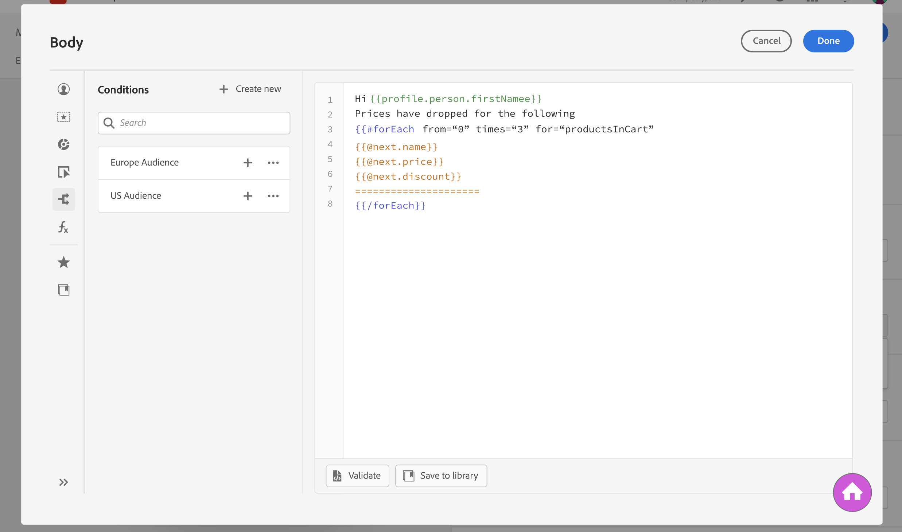
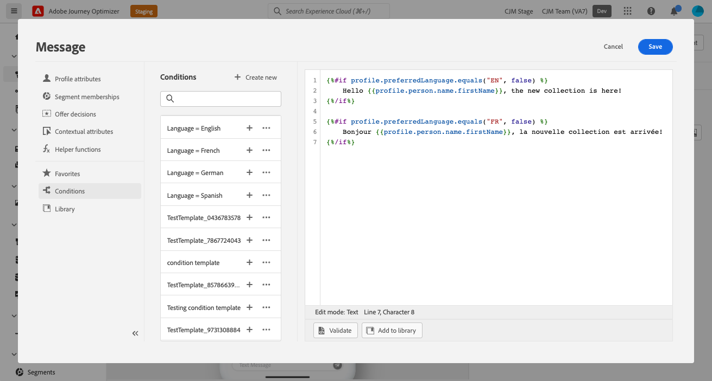
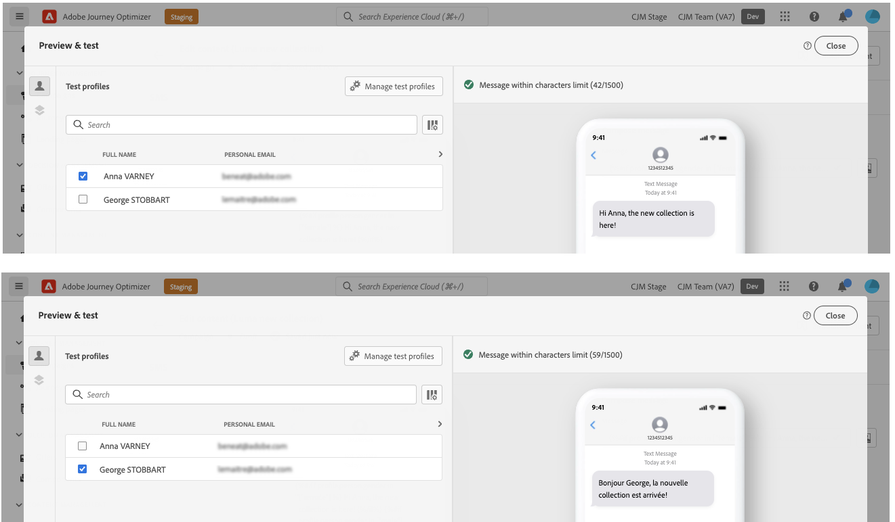
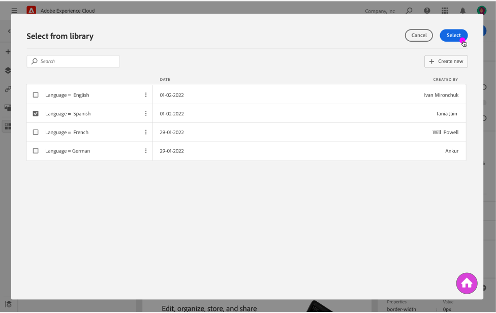

# Create dynamic content {#dynamic-content}

Adobe Journey Optimizer allows you to leverage conditional rules created in the library to add dynamic content into your messages.

Dynamic content can be created into any field where you can add personalization using the Expression Editor. This includes subject line, links, push notifications content, or text-type offers' representations. [Learn more on personalization contexts](personalization-contexts.md)

Additionally, you can use conditional rules into the Email Designer to create multiple variants of a content component.

## Add dynamic content into expressions {#perso-expressions}

The steps to add dynamic content in expressions are as follows:

1. Navigate to the field where you want to add dynamic content, then open the Expression Editor.

1. Select the **[!UICONTROL Conditions]** menu to display the list of available conditional rules. Click the + button next to a rule to add it into the current expression.

    You can also create a new rule by selecting **[!UICONTROL Create new]**. [Learn how to create conditions](create-conditions.md)

    

1. Add between the `{%if}` and `{%/if}` tags the content that you want to display if the conditional rule is met. You can add as many rules as needed to create several variants of an expression.

    In the example below, two variants have been created for an SMS content, depending on the recipient's preferred language.

    

1. Once your content is ready, you can preview the different variants using the **[!UICONTROL Simulate content]** button. [Learn how to test and preview messages](../design/preview.md)

    

## Add dynamic content into emails {#emails}

>[!CONTEXTUALHELP]
>id="ac_conditional_content"
>title="Conditional content"
>abstract="Use conditional rules to create multiple variants of a content component. If none of the conditions are met when sending the message, the content from the Default variant will display."

>[!CONTEXTUALHELP]
>id="ac_conditional_content_select"
>title="Conditional content"
>abstract="Use a conditional rule saved into the library or create a new one."

The steps to create variants of a content component in the Email Designer are as follows:

1. In the Email Designer, select a content component, then click **[!UICONTROL Enable conditional content]**.

    

1. The **[!UICONTROL Conditional Content]** pane displays on the left. In this pane, you can create multiple variants of the selected content component using conditions.
    
    Configure your first variant by selecting the **[!UICONTROL Apply condition]** button.

    

1. The conditions library display. Select the conditional rule to associate to the variant, then click **[!UICONTROL Select]**. In this example, we want to adapt the component text depending on the recipient's preferred language.

    

    You can also create a new rule by clicking **[!UICONTROL Create new]**. [Learn how to create conditions](create-conditions.md)

1. The conditional rule is associated to the variant. For better readability, we recommend renaming the variant by clicking the ellipse menu.

    Now configure how the component should display if the rule is met when sending the message. In this example, we want to display the text in French if it is the recipient's preferred language.

    

1. Add as many variants as needed for the content component. You can switch at any time between the different variants to check how the content component will display depending on the conditional rules.

    >[!NOTE]
    >If none of the rules defined in the variants are met when sending the message, the content component will display the content defined in the **[!UICONTROL Default variant]**.
    >
    >Conditional content will be evaluated against associated rules in the order in which the variants are displayed. The default variant is always displayed if no other conditions are met. 
