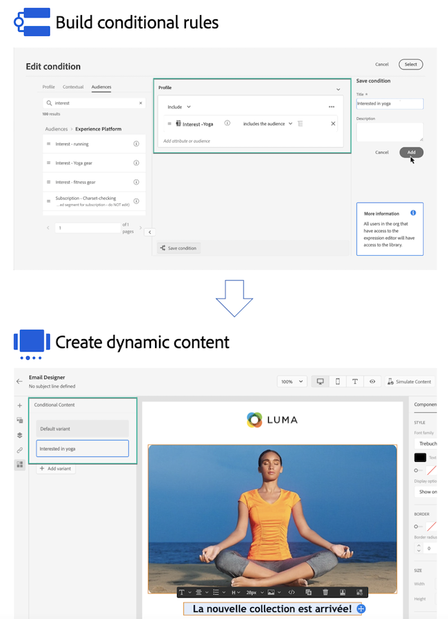

# Get started with dynamic content {#start-dynamic-content}

>[!CONTEXTUALHELP]
>id="ajo_conditions_list"
>title="Conditions"
>abstract="Conditional rules allow you to display multiple content variants in your messages based on profile attributes, contextual events or audience segments." 

Dynamic content allows you to adapt the content of your messages based on **conditional rules** that can be made up of profile attributes, contextual events or audience segments. Conditional rules are created using a visual rule builder within the Expression Editor, where you can store them for further reuse across your journeys and campaigns.

Conditional rules can be leveraged into the Email Designer and the expression editor to **create dynamic content** which will adapt to the profiles targeted in your messages. 

* [Learn how to work with conditional rules](create-conditions.md)
* [Learn how to create dynamic content](dynamic-content.md)
