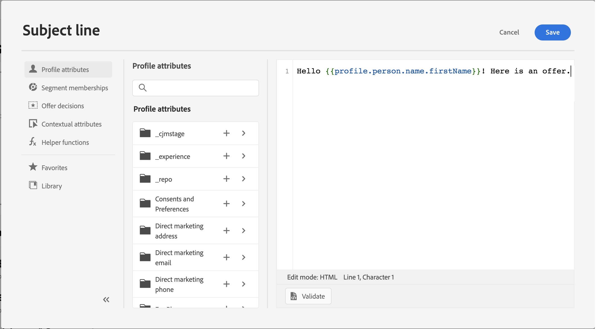
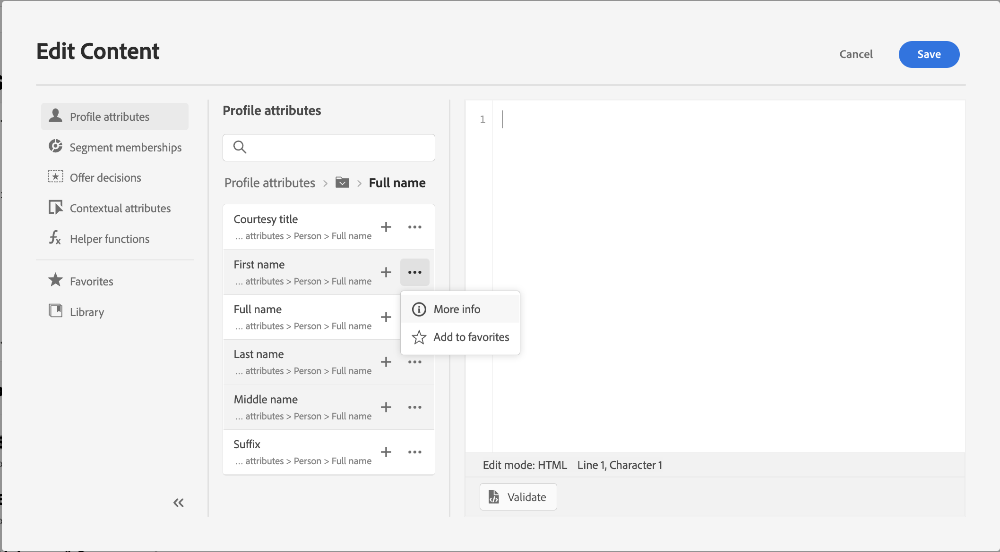
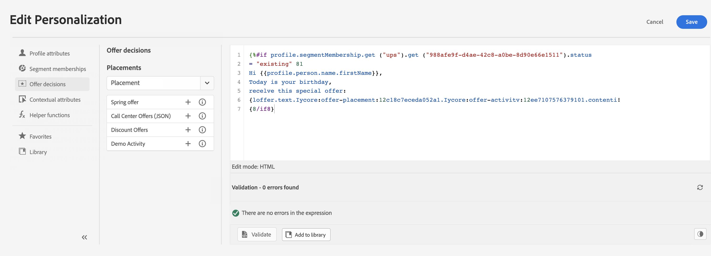

# Get started with the Expression editor {#build-personalization-expressions}

>[!CONTEXTUALHELP]
>id="ajo_perso_editor"
>title="About the Expression editor"
>abstract="The Expression editor allows you to select, arrange, customize and validate all the data to create a customized personalization for your content."

The Expression editor is the centerpiece of the personalization in [!DNL Journey Optimizer]. It is available in every context where you need to define personalization like emails, push and offers.

In the expression editor interface, you will select, arrange, customize and validate all the data to create a customized personalization for your content.

 

## Available personalization sources {#sources}

The left part of the screen displays a domain selector that lets you select the source for personalization. Available sources are:

* **[!UICONTROL Profile attributes]** : lists all the references associated to the profile schema described in [Adobe Experience Platform Data Model (XDM) documentation](https://experienceleague.adobe.com/docs/experience-platform/xdm/home.html){target="_blank"}.
* **[!UICONTROL Segment memberships]** : lists all the segments created in Adobe Experience Platform Segmentation service. More information on segmentation available [here](https://experienceleague.adobe.com/docs/experience-platform/segmentation/home.html){target="_blank"}.
* **[!UICONTROL Offer decisions]** : lists all the offers associated to a specific placement. Select the placement then insert the offers in your content. For a complete documentation on how to manage offers, refer to [this section](../offers/get-started/starting-offer-decisioning.md).
* **[!UICONTROL Contextual attributes]** : when a channel action activity (Email, push, SMS) is used in a journey, contextual journey fields are available through this menu. Learn more in [this section](personalization-use-case.md).
* **[!UICONTROL Helper functions]** : lists all the helper functions available to perform operations on data, such as calculations, data formatting or conversions, conditions, and manipulate them in the context of personalization. Learn more in [this section](functions/functions.md).

## Add personalization attributes {#add}

Click the + button to add an attribute into your personalization expression.

The ellipsis menu next to the "+" icon allows you to get more details for each variable and to add your most frequently used attributes to favorites. [Learn how to add attributes to favorites](personalization-favorites.md)

Additionally, you can define default fallback text that will display if a string-type profile attribute is empty. To do this, click the ellipsis button next to the attribute and select **[!UICONTROL Insert with fallback text]**. Write the text that should display by default if the attribute's value is empty for a profile then click **[!UICONTROL Add]**.

In the following example, the expression editor lets you select the profiles that have their birthday today then complete the customization by inserting a specific offer corresponding to this day.

 

Once your personalization expression is ready, you need to have it validated by the Expression editor. Learn more in [this section](personalization-validation.md).
