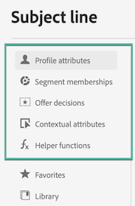

# Build personalization expressions {#}

The expression editor is the centerpiece of the personalization in [!DNL Journey Optimizer].

It is available in every context where you need to define personalization like emails, push and offers.

In the expression editor interface, you will select, arrange, customize and validate all the data to create a customized personalization for your content.

 

The left part of the screen displays a domain selector that lets you select the source for personalization. 

 

Available sources are:

* **[!UICONTROL Profile attributes]** : lists all the references associated to the profile schema described in [Adobe Experience Platform Data Model (XDM) documentation](https://experienceleague.adobe.com/docs/experience-platform/xdm/home.html){target="_blank"}.
* **[!UICONTROL Segment memberships]** : lists all the segments created in the Adobe Experience Platform Segmentation service. More information on segmentation available [here](https://experienceleague.adobe.com/docs/experience-platform/segmentation/home.html){target="_blank"}.
* **[!UICONTROL Offer decisions]** : lists all the offers associated to a specific placement. Select the placement then insert the offers in your content. For a complete documentation on how to manage offers, refer to [this section](../deliver-personalized-offers.md).
* **[!UICONTROL Contextual attributes]** : when the **Message** is used in a journey, contextual journey fields are available through this menu. Learn more in [this section](personalization-use-case.md).
* **[!UICONTROL Helper functions]** : lists all the helper functions available to perform operations on data, such as calculations, data formatting or conversions, conditions, and manipulate them in the context of personalization. Learn more in [this section](functions/functions.md).

On selection, the reference is added in the editor. 

>[!NOTE]
>
>The info icon next to "+" icon opens up a tooltip providing more details for each variable.

In the following example, the expression editor lets you select the profiles that have their birthday today then complete the customization by inserting a specific offer corresponding to this day.

 

### Add to favorites{#fav}

Adding different attributes to your favorites menu provides quick access to your most frequency used items. To add an attribute to your favorites click the ellipse menu and choose **[!UICONTROL Add to favorites]**.

To access items you have favorited use the **[!UICONTROL Favorites]** menu option in the drop-down menu.

From this list you can quickly add the personalization object to your current expression.

If you wish to no longer see an item in your favorites list you can remove from favorites.

