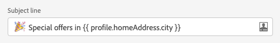
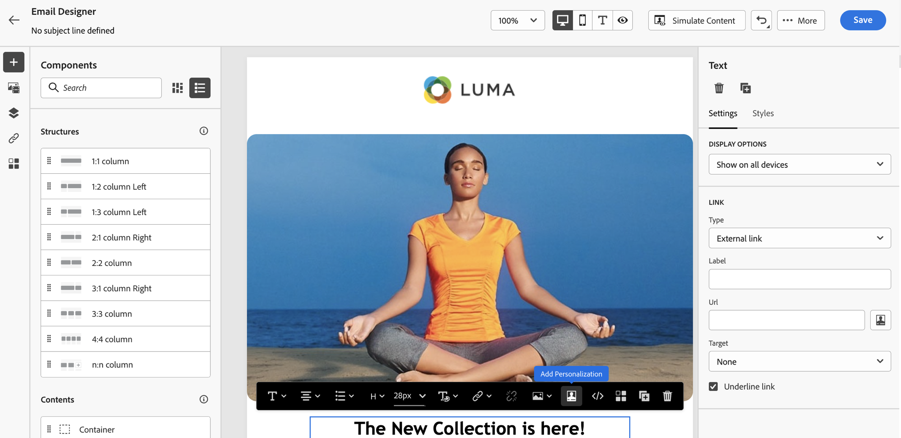
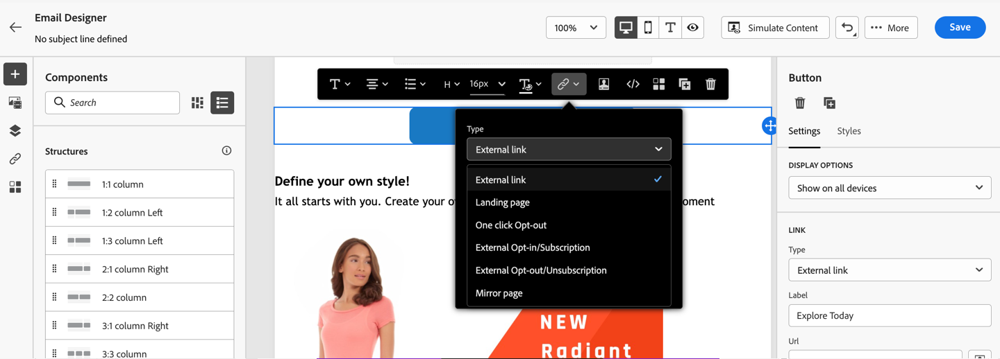
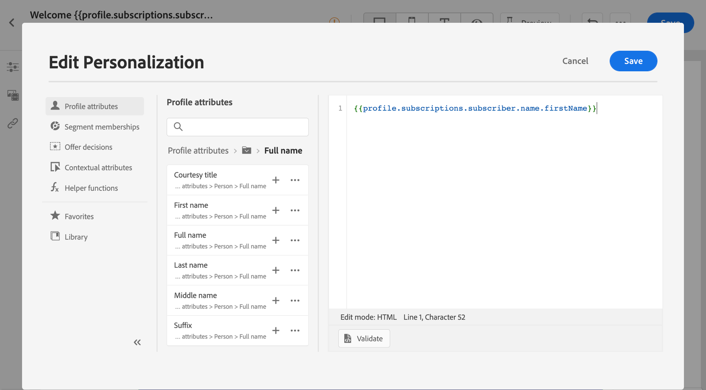
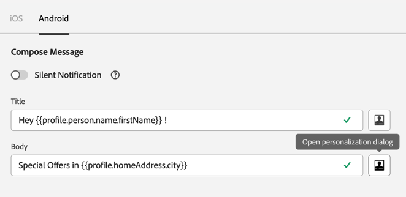

# Personalization contexts{#personalization-areas}

The content and display of messages delivered by [!DNL Journey Optimizer] can be personalized in several different ways.

In every fields with the editor icon, you can open the personalization editor (also known as Expression Editor) and define personalization.

## Personalize your emails

When you create an email, you can add personalization in the **[!UICONTROL Subject line]** field of the message.

In the Email designer, you can personalize the content:

* In the **message**: click inside a text block, click the **Personalize** icon from the contextual toolbar and select **Insert personalization** field. For more on the Email Designer interface, see this [section](../design-emails.md).
    
    

* For a **link**: select some text or image inside a text block, click the **Insert link** icon from the contextual toolbar. In the window, you can add a personalization block by clicking on the **Add personalization** icon.

    

In both cases, you access the personalization editor.

## Personalize your push notifications

You can also personalize your **Push notifications** in the following fields:

* **Title**
* **Body**
* **Custom sound**
* **Badges**
* **Custom data**

Learn more about Push notification configuration in [this section](../push-gs.md).

## Personalize your offers {#personalize-offers}

You can also access the personalization editor when adding text-type content to your offers' representations.

Learn more on managing content with Decision management in [this section](../offers/offer-library/creating-personalized-offers.md#custom-text).