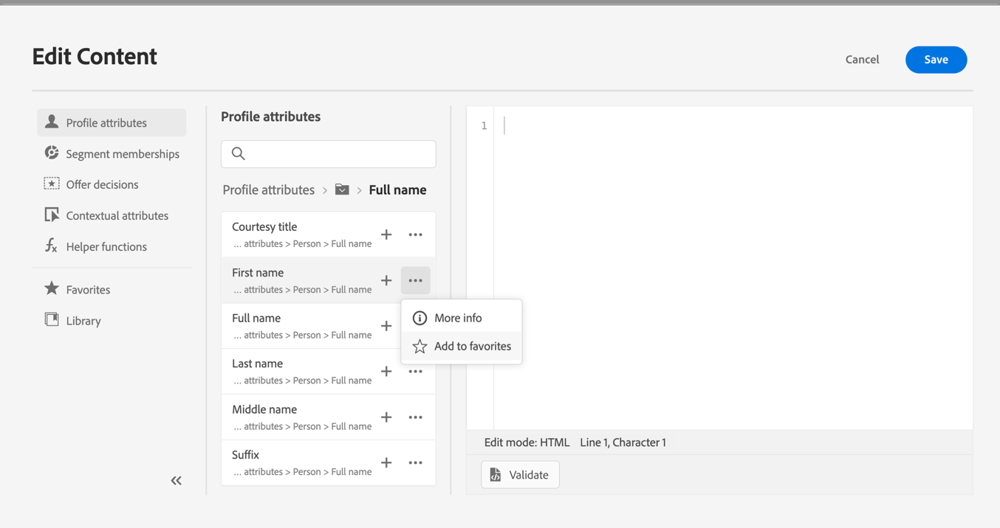
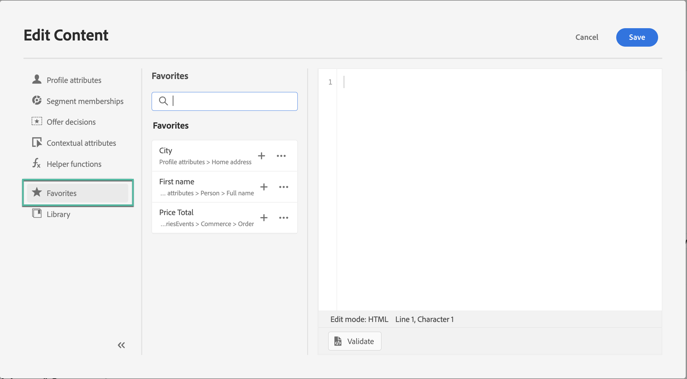
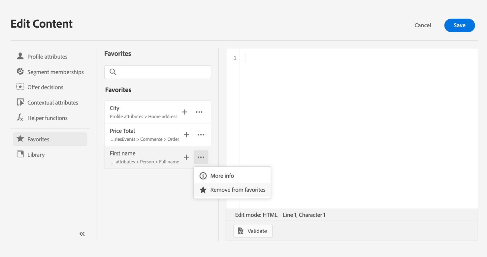

# Add attributes to favorites {#fav}

Adding different attributes to your favorites menu provides quick access to your most frequency used items. To add an attribute to your favorites click the ellipse menu and choose **[!UICONTROL Add to favorites]**.

To access items you have favorited, use the **[!UICONTROL Favorites]** menu in the left pane.

From this list you can quickly add the personalization object to your current expression.

If you wish to no longer see an item in your favorites list you can remove from favorites.

