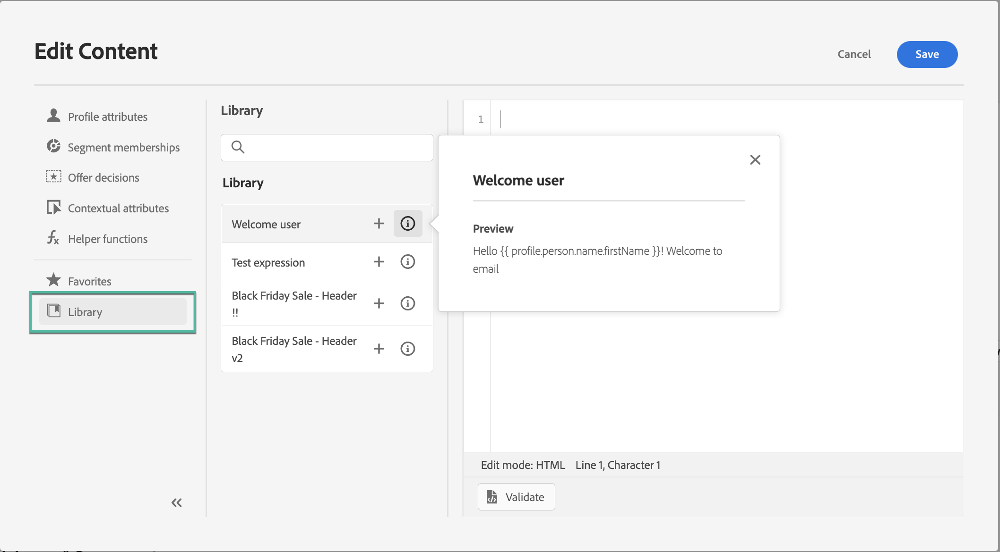
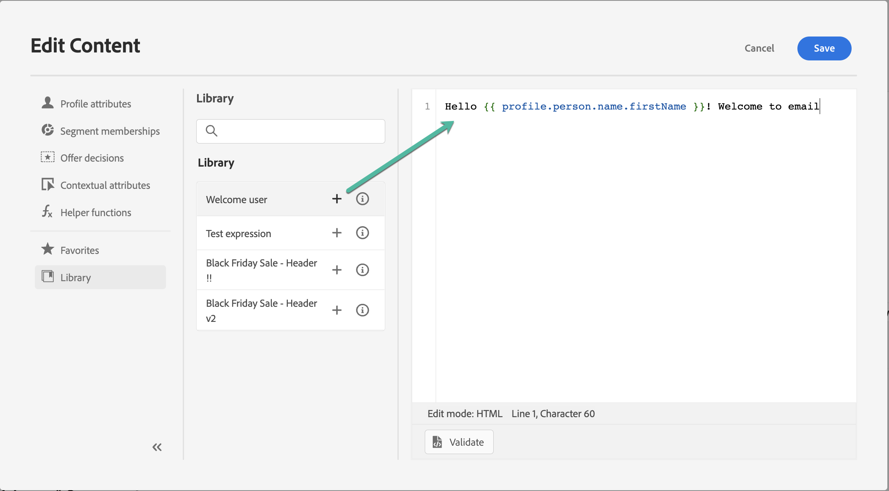
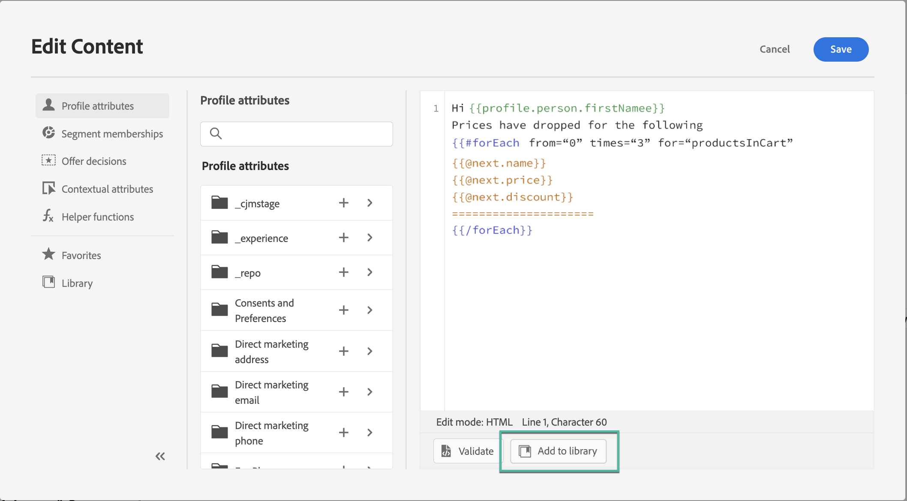
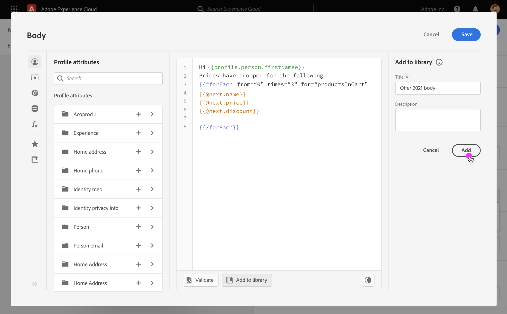

# Work with saved expressions {#expression-library}

>[!CONTEXTUALHELP]
>id="ajo_perso_library"
>title="About the Expression Library"
>abstract="[!DNL Journey Optimizer] provides a library where you can access saved personalization expressions that have been configured by Admin users. "

[!DNL Journey Optimizer] provides a library where you can access previously saved personalization expressions that have been added by Admin users. 

➡️ [Learn how to work with saved expressions in this video](#video-preview)

To access the saved expressions, click the **[!UICONTROL Library]** button in the left pane. The list displays all the expressions that have been saved by Admin users (see [Save expressions to the library](#save-expressions)).

    >[!NOTE]
    >
    >You can use the info button to get more information about the contents of a saved expression. If you have the appropriate permissions to manage library items, the information button will appear in the ellipse menu.
    
    

Click the + to insert the expression into the editor. You can then customize and validate your personalization content as usual. [Learn more](../personalization/personalization-build-expressions.md)

    

## Save an expression to the library {#save-expressions}

[!DNL Journey Optimizer] allows Admin users to save personalization expressions to the library. These expressions will then be available to all users to build personalization contents.

To save an expression to the library, follow these steps:

1. In the editor interface, build the expression then click **[!UICONTROL Add to library]**. 

    >[!NOTE]
    >
    >If the button is not visible, check in the Admin Console that you have the required permissions (see [Permissions levels](../administration/high-low-permissions.md)).

    

1. In the right pane, enter a title and a description for the expression to help users find it more easily, then click **[!UICONTROL Add]**.

    

1. The expression is added to the library. Users will now be able to use it to build their personalization content.

>[!NOTE]
>
>* You save up to 40 expressions in the library.
>
>* Expressions cannot exceed 200KB.
>
>* Saved expressions are sorted by creation date: recently added expression will be shown first in the list.

To edit an existing expression, add it to the editor, then modify it according to your needs. Click **[!UICONTROL Add to library]** to validate the syntax and save the expression.

To delete an expression, click the ellipse button then click **[!UICONTROL Delete]**.

## How-to video{#video-preview}

Learn how to use saved personalization library items in a message and how to create and manage personalization library items.

>[!VIDEO](https://video.tv.adobe.com/v/340941?quality=12)
