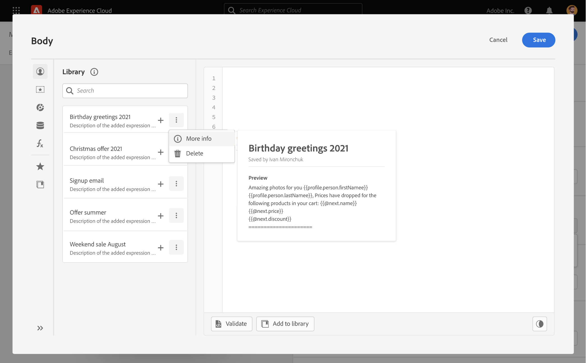
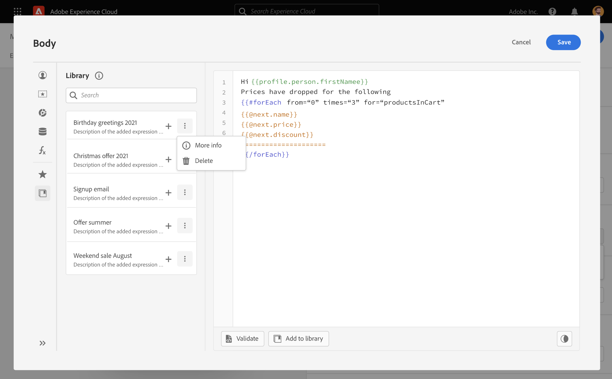
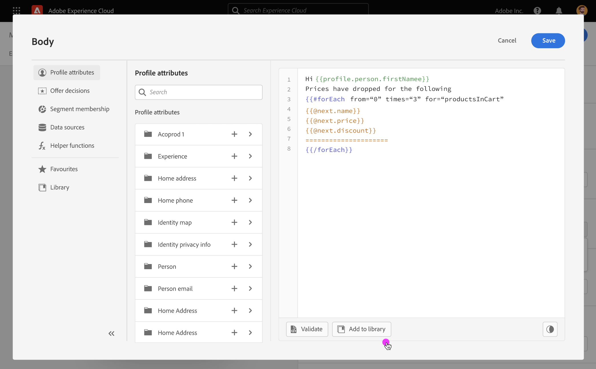

# Work with predefined expressions {#expression-library}

>[!CONTEXTUALHELP]
>id="ajo_perso_library"
>title="About the Expression Library"
>abstract="The Expression Library provides predefined personalization expressions that have been configured by Admin users."

[!DNL Journey Optimizer] provides a library where you can access predefined personalization expressions that have been configured by Admin users. 

1. To access the library, click the **[!UICONTROL xxxx]** button in the left pane. The list displays all the expressions that have been saved by Admin users (see [Save expressions to the library](#save-expressions)).

    You can use the ellipse button menu to get more information about an expression.

    

1. Click an expression to insert it into the editor.

    

1. Customize and validate your personalization content as usual. [Learn more](../personalization/personalization-build-expressions.md)

## Save an expression to the library {#save-expressions}

[!DNL Journey Optimizer] allows Admin users to save personalization expressions to the library. These expressions will then be available to all users to build personalization contents.

To save an expression to the library, follow these steps:

1. In the editor interface, build the expression then click **[!UICONTROL Add to library]**. 

    >[!NOTE]
    >
    >If the button is not visible, check in the Admin Console that you have the required permissions (see [Permissions levels](../administration/high-low-permissions.md)).

    

1. In the right pane, give a title and description to the expression to help users find it more easily, then click **[!UICONTROL Add]**.

    

1. The expression is added to the library. Users will now be able to use it to build their personalization content.

    -- ADD SCREENSHOT --

To edit an existing expression, add it to the editor, then modify it according to your needs. Click **[!UICONTROL Add to library]** to validate the syntax and save the expression.

To delete an expression, click the ellipse button then click **[!UICONTROL Delete]**.
