# Personalization use case: order status notification {#personalization-use-case}

In this use case, you will see how to use multiple types of personalization in a single push notification message. Three types of personalization will be used:

* **Profile**: message personalization based on a profile field
* **Offer decision**: personalization based on decision management variables
* **Context**: personalization based on contextual data from the journey

The goal of this example is to push an event to [!DNL Journey Optimizer] every time a customer order is updated. A push notification is then sent to the customer with information on the order and a personalized offer.

For this use case, the following prerequisites are needed:

* configure an order event including the order number, status and item name. Refer to this [section](../event/about-events.md).
* create a decision, refer to this [section](../offers/offer-activities/create-offer-activities.md).

## Step 1 - Create the journey {#create-journey}

1. Click the **[!UICONTROL Journeys]** menu and create a new journey.

   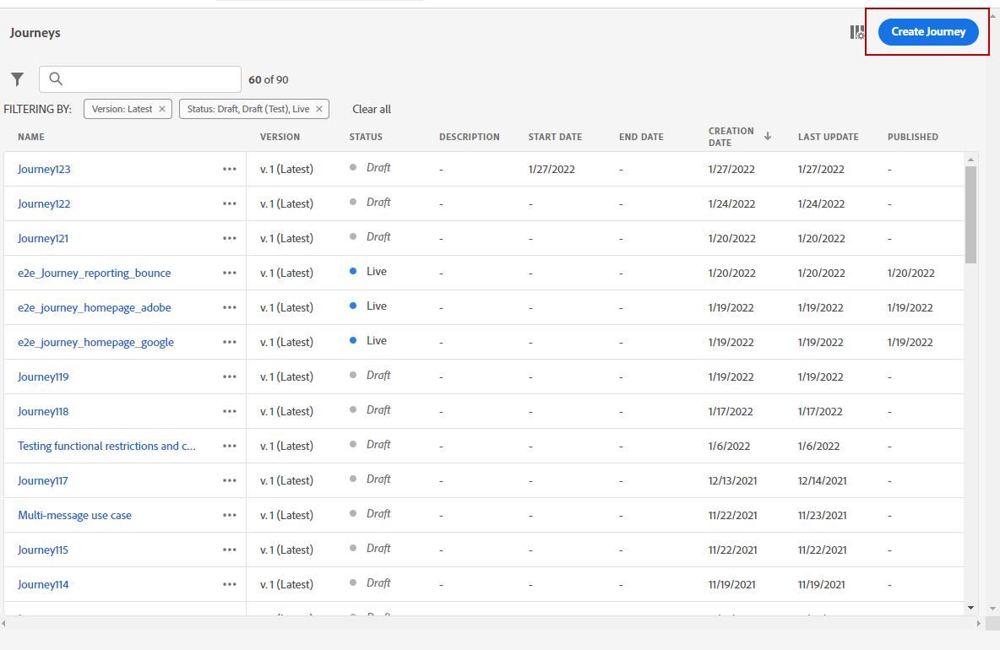

1. Add your entry event, and a **Push** action activity.

   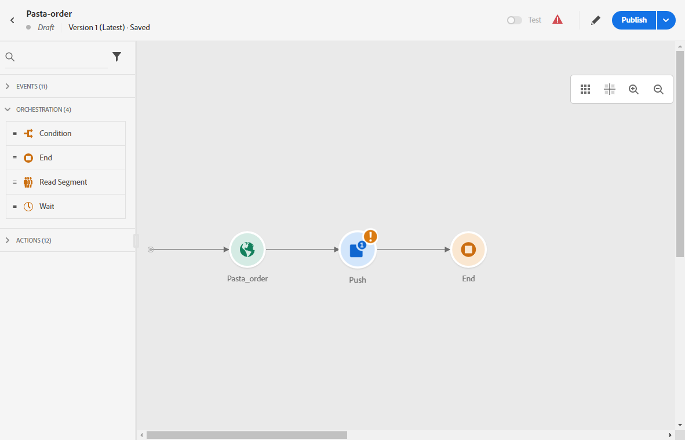

1. Configure and design your push notification message. Refer to this [section](../push/create-push.md).

## Step 2 - Add personalization on profile {#add-perso}

1. In the **Push** activity, click **Edit content**.

1. Click the **Title** field.

   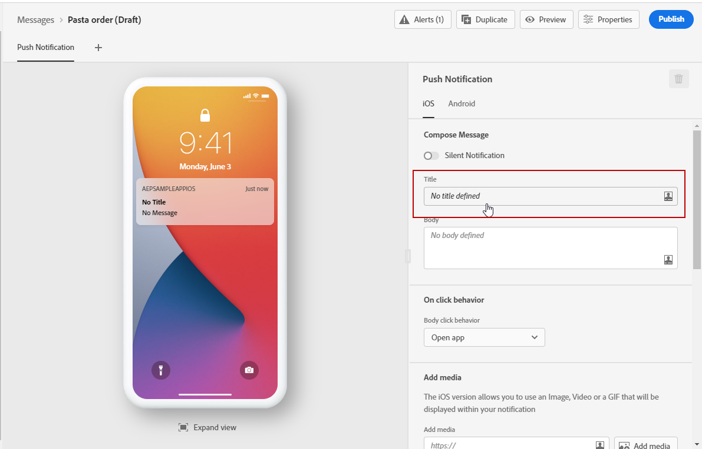

1. Enter the subject and add profile personalization. Use the search bar to find the profile's first name field. In the subject text, place the cursor where you want to insert the personalization field, and click the **+** icon. Click **Save**.

   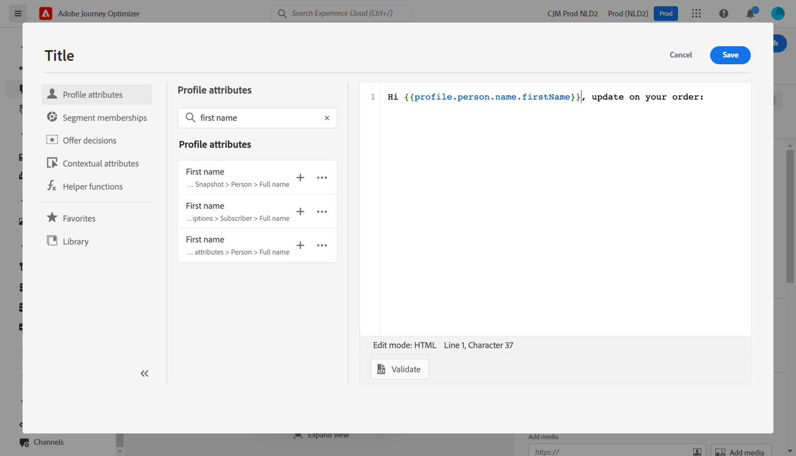

## Step 3 - Add personalization on contextual data {#add-perso-contextual-data}

1. In the **Push** activity, click **Edit content** and click the **Title** field.

   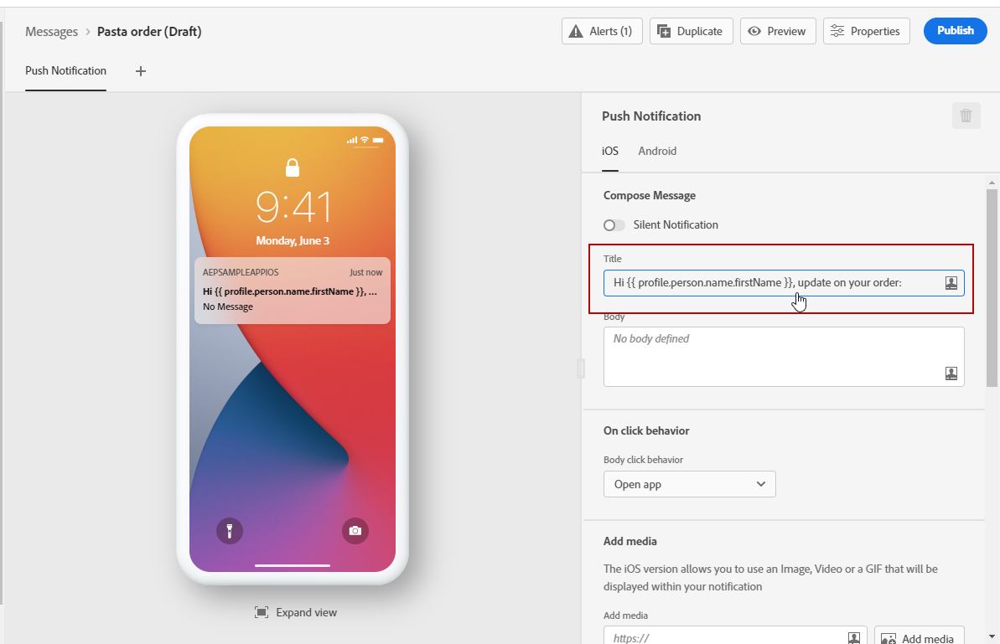

1. Select the **Contextual attributes** menu. Contextual attributes are only available if a journey has passed contextual data to the message. Click **Journey Orchestration**. The following contextual information appears:

   * **Events**: this category regroups all fields from the event(s) placed before the channel action activity in the journey.
   * **Journey Properties**: the technical fields related to the journey for a given profile, for example the journey ID or the specific errors encountered. Learn more in [Journey Orchestration documentation](../building-journeys/expression/journey-properties.md).

   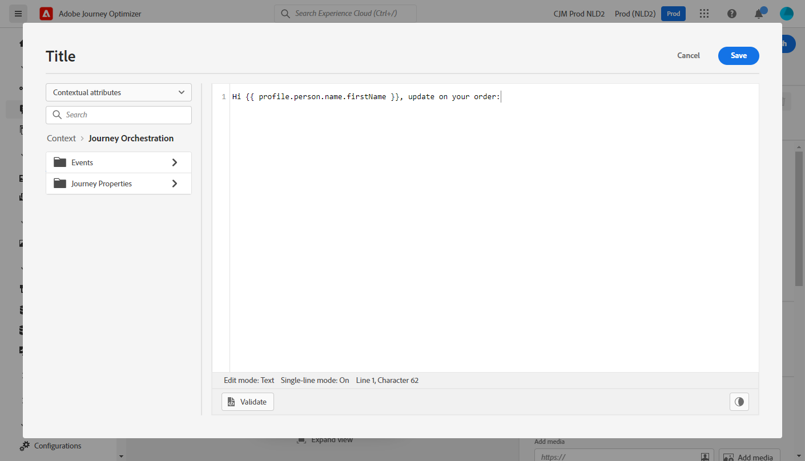

1. Expand the **Events** item, and look for the order number field related to your event. You can also use the search box. Click the **+** icon to insert the personalization field in the subject text. Click **Save**.

   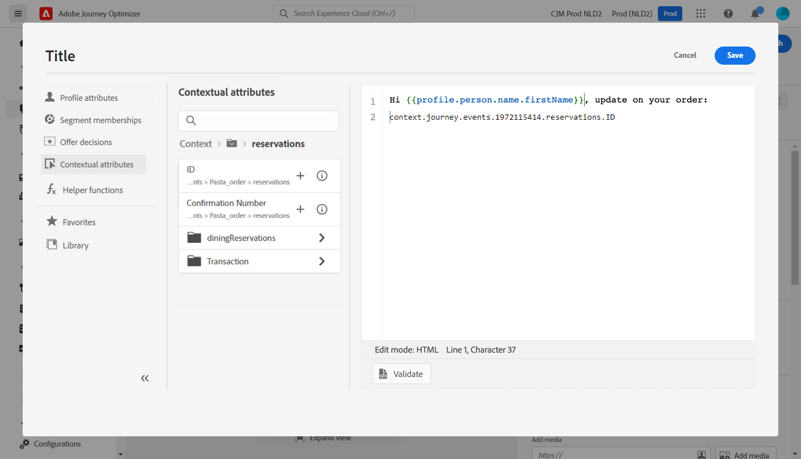

1. Now click the **Body** field.

   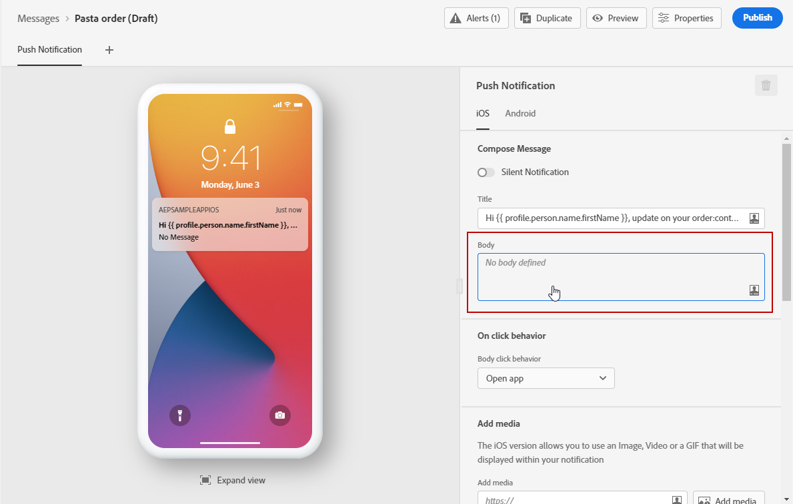

1. Type the message and insert, from the **[!UICONTROL Contextual attributes]** menu, the order item name and the order progress. 

   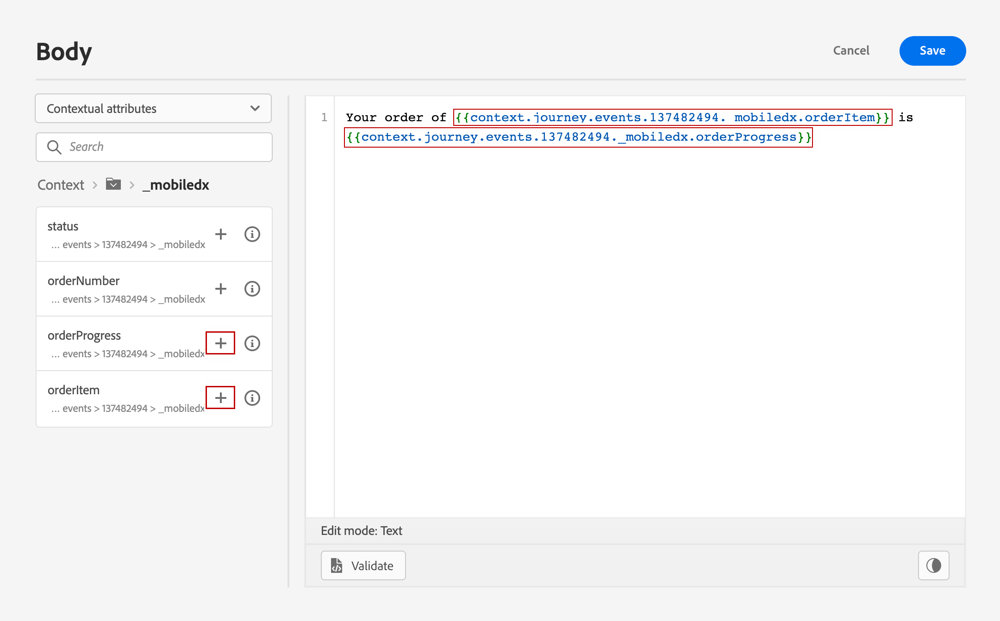

1. From the left menu, select **Offer decisions** to insert a decisioning variable. Select the placement and click the **+** icon next to the decision to add it to the body.  

   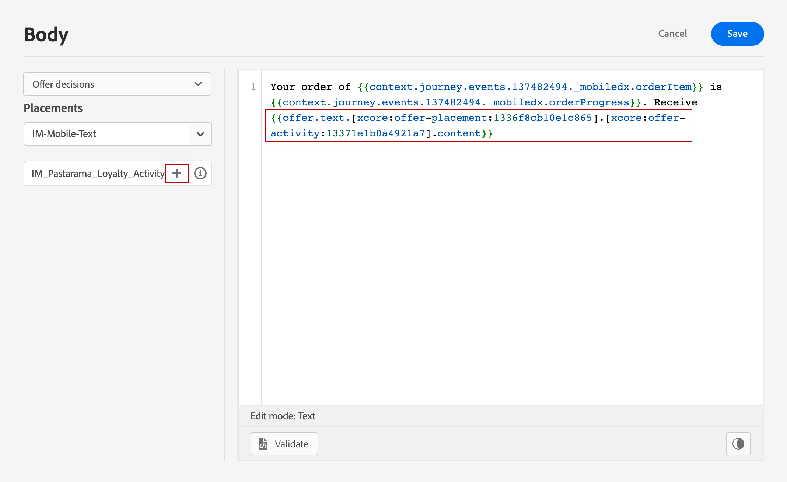

1. Click validate to make sure that there are no errors, and click **Save**.

   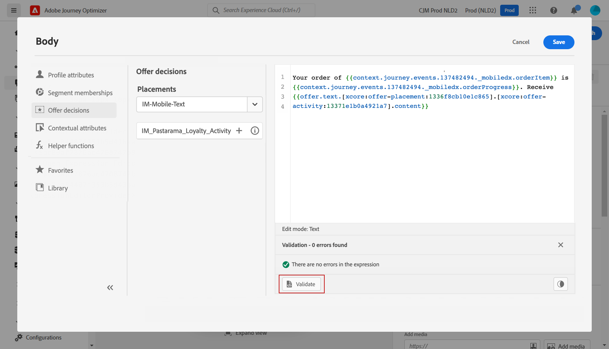

## Step 4 - Test and publish the journey {#test-publish}

1. Click the **Test** button, then click **Trigger an event**.

   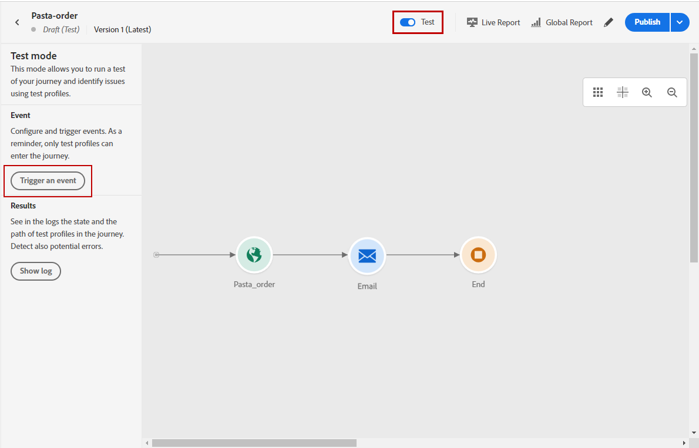

1. Enter the different values to pass in the test. Test mode only works with test profiles. The profile identifier needs to correspond to a test profile. Click **Send**.

   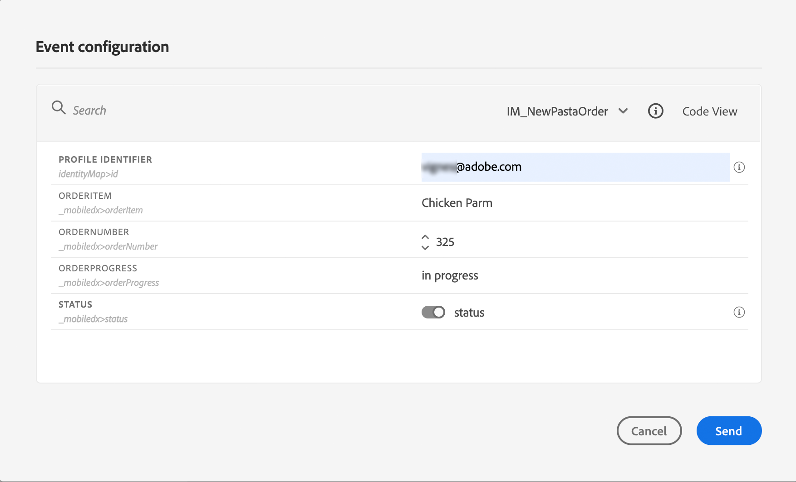

   The push notification is sent and displayed on the test profile's mobile phone.

    

1. Verify that there is no error and publish the journey.
