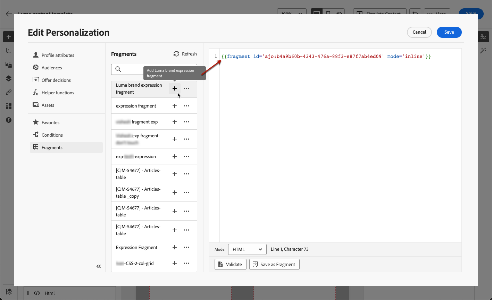
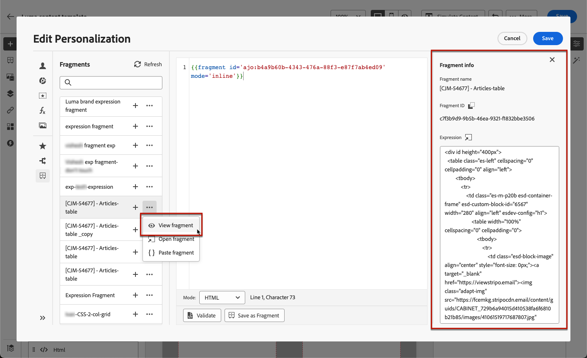
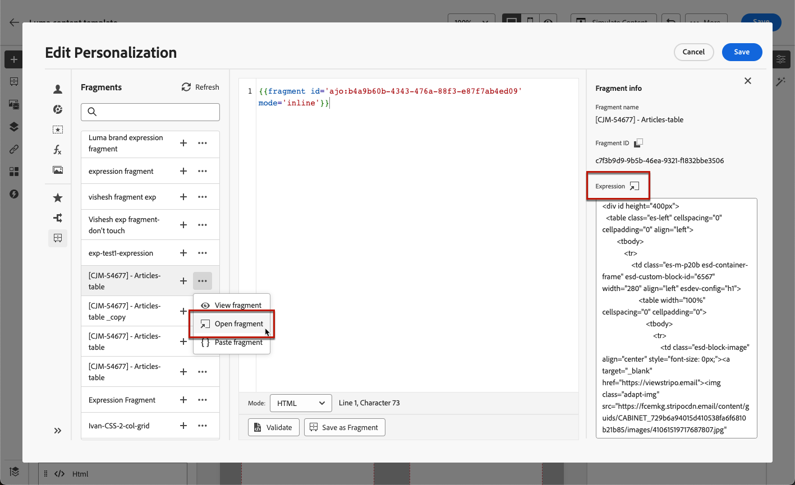
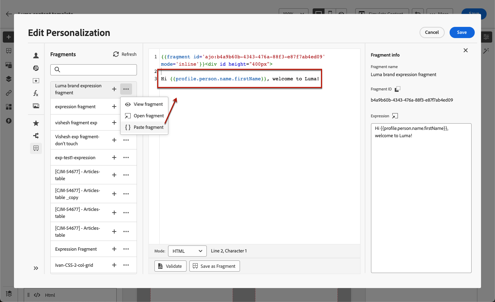

# Leverage expression fragments {#use-expression-fragments}

When using the Expression editor, you can leverage all the expression fragments that have been created or saved to the current sandbox.

Learn how to create and manage fragments in [this section](../content-management/fragments.md).

➡️ [Learn how to manage, author and use fragments in this video](../content-management/fragments.md#video-fragments)

## Use an expression fragment {#use-expression-fragment}

To add expression fragments to your content, follow the steps below.

1. Open the [Expression editor](personalization-build-expressions.md) and select the **[!UICONTROL Fragments]** button on the left pane.

    

    The list displays all the expression fragments that have been created or saved as fragments on the current sandbox. [Learn more](../content-management/fragments.md#create-expression-fragment)

    >[!NOTE]
    >
    >Fragments are sorted by creation date: recently added expression fragments are shown first in the list.

1. You can also refresh the list. 
    
    >[!NOTE]
    >
    >If some fragments were modified or added while you are editing your content, the list will be updated with the latest changes.

1. Click the + icon next to an expression fragment to insert the corresponding fragment ID into the editor.

    

    Once the fragment ID has been added, if you open the corresponding expression fragment and [edit it](../content-management/fragments.md#edit-fragments) from the interface, the changes are synchronized. They are automatically propagated to all **[!UICONTROL Draft]** journeys/campaigns containing that fragment ID.

    >[!NOTE]
    >
    >The changes are not propagated to content used in **[!UICONTROL Live]** journeys or campaigns.

1. Click the **[!UICONTROL More actions]** button next to a fragment.

1. From the contextual menu that opens, select **[!UICONTROL View fragment]** to get more information about that fragment. The **[!UICONTROL Fragment ID]** is also displayed and can be copied from here.

    

1. You can open the expression fragment in another window to edit its content and properties - either using the **[!UICONTROL Open fragment]** option in the contextual menu or from the **[!UICONTROL Fragment info]** pane. [Learn how to edit a fragment](../content-management/fragments.md#edit-fragments)

    

1. You can then customize and validate your content as usual using all the personalization and authoring capabilities of the [Expression editor](personalization-build-expressions.md).

>[!NOTE]
>
>If you create an expression fragment that contains multiple line breaks and use it in [SMS](usi..ng/sms/create-sms.md#sms-content) or [push](../push/design-push.md) content, the line breaks are preserved. Thus make sure to preview and test your [SMS](../sms/send-sms.md) or [push](../push/send-push.md) messsage before sending it.

## Break inheritance {#break-inheritance}

When adding a fragment ID to the Expression editor, the changes made to the original expression fragment are synchronized.

However, you can also paste the content of an expression fragment into the editor. From the contextual menu, select **[!UICONTROL Paste fragment]** to insert that content.

In that case, the inheritance from the original fragment is broken. The content of the fragment is copied into the editor, and the changes are not synchronized anymore.

It becomes a standalone element that is no longer linked to the original fragment; you can edit it as any other element in your code.

