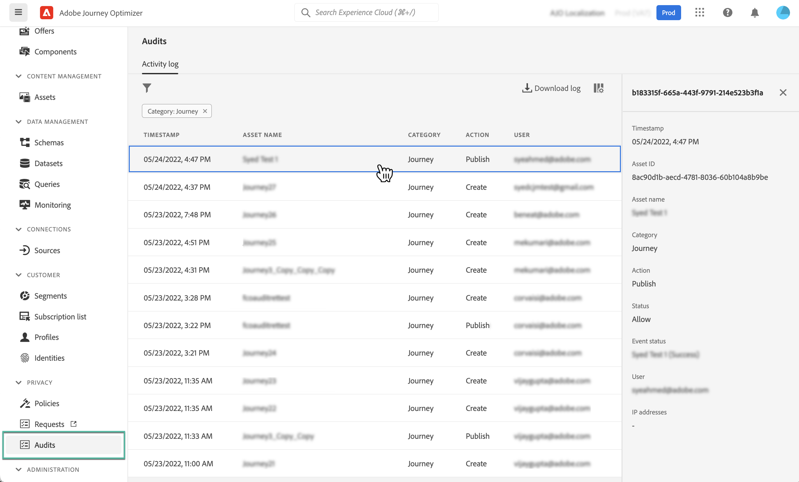

# Audit actions on Journey Optimizer resources {#track-changes}

## About audit logs {#audit-logs}

>[!IMPORTANT]
>
>To view and export audit log, you must have the **[!DNL View User Activity Log]** permission granted. [Learn more](../administration/ootb-product-profiles.md)

With Journey Optimizer, you can identify actions performed by users in the system on various services and capabilities like journeys, messages, landing pages etc.

This allows you to increase the visibility of activities performed in the system, troubleshoot issues, and help your business comply with regulations and corporate data stewardship policies.

Each action is recorded with metadata in "audit logs" which are accessible in Adobe Experience Platform. For more on audit logs, including how to view and manage them in UI or API, refer to [Adobe Experience Platform documentation](https://experienceleague.adobe.com/docs/experience-platform/landing/governance-privacy-security/audit-logs/overview.html).

## Event types captured by audit logs {#events}

The following table outlines which actions on which Journey Optimizer resources are recorded by audit logs.

>[!NOTE]
>
>The full list of actions captured in the Audit logs is available in [Adobe Experience Plaform documentation](https://experienceleague.adobe.com/docs/experience-platform/landing/governance-privacy-security/audit-logs/overview.html#category).

| Resource | Action            |
|-----------|------------------|
| AJO campaign | Create / Delete / Update / Activate / Stop |
| AJO channel general setting | Create / Delete / Update |
| AJO IP pool | Create / Delete / Update |
| AJO landing page | Create / Delete / Update / Publish / Unpublish |
| AJO landing page HTML template | Create / Delete / Update |
| AJO landing page preset | Create / Delete / Update |
| AJO landing page subdomain | Create / Delete / Update |
| AJO message | Create / Delete / Update / Publish |
| AJO message preset | Create / Delete / Update |
| AJO PTR record | Create / Delete / Update |
| AJO saved expression template | Create / Delete / Update |
| AJO SMS API credentials | Create / Delete / Update |
| AJO subdomain | Create / Delete / Update |
| AJO suppression list | Create / Delete / Download CSV |
| Field group | Create / Delete / Update |
| Journey | Create / Delete / Update / Stop / Publish |
| Journey custom action | Create / Delete / Update |
| Journey datasource | Create / Delete / Update |
| Journey event | Create / Delete / Update |
| Message frequency rule | Create / Delete / Update |
| Ranking strategy | Create / Delete / Update |
