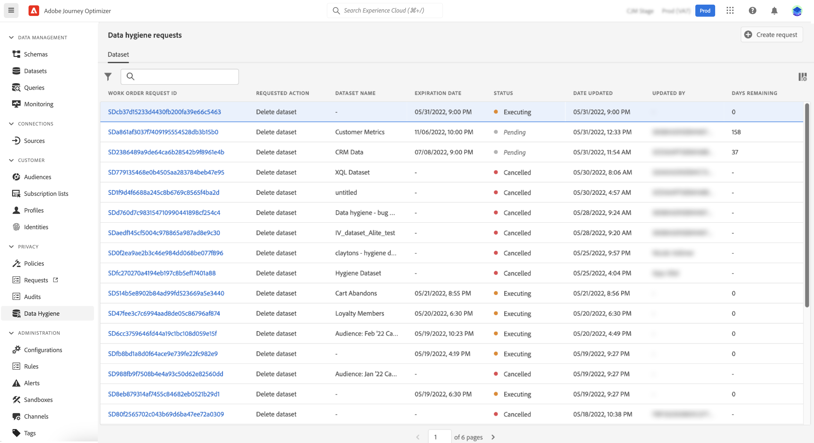

# Perform data hygiene operations {#data-hygiene}

>[!AVAILABILITY]
>
>Data Hygiene capabilities are currently only available for organizations that have purchased the **Healthcare Shield** and **Privacy and Security Shield** add-on offerings.

As data is continuously ingested into Adobe Experience Platform, it becomes crucial to ensure your data is used as intended, updated when necessary, and deleted per organizational policies.

These tasks can be accomplished using the **[!UICONTROL Data Hygiene]** menu, which allows you to configure and schedule data hygiene operations, ensuring that your records are properly maintained.

For more information on the Privacy Service and how to perform data hygiene operations, refer to Adobe Experience Platform documentation:

* [Privacy Service overview](https://experienceleague.adobe.com/docs/experience-platform/privacy/home.html)
* [Data Hygiene in Adobe Experience Patform](https://experienceleague.adobe.com/docs/experience-platform/hygiene/home.html)
