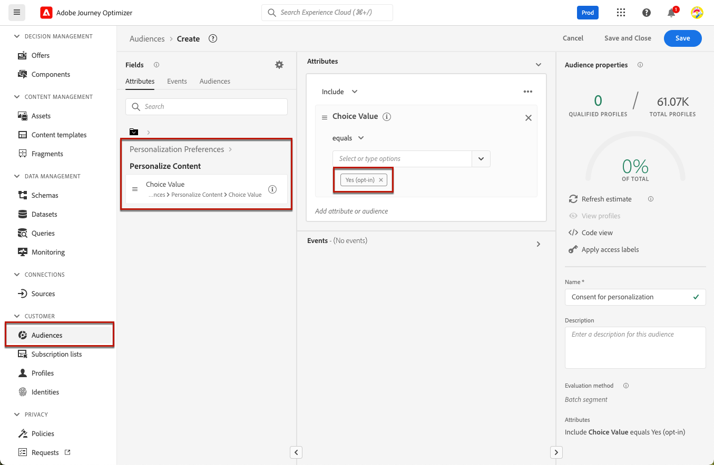
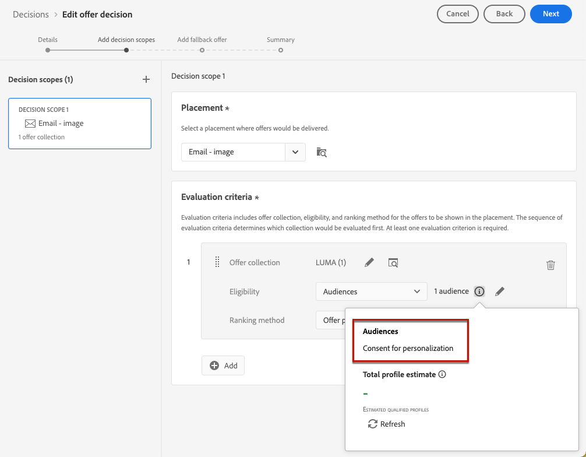
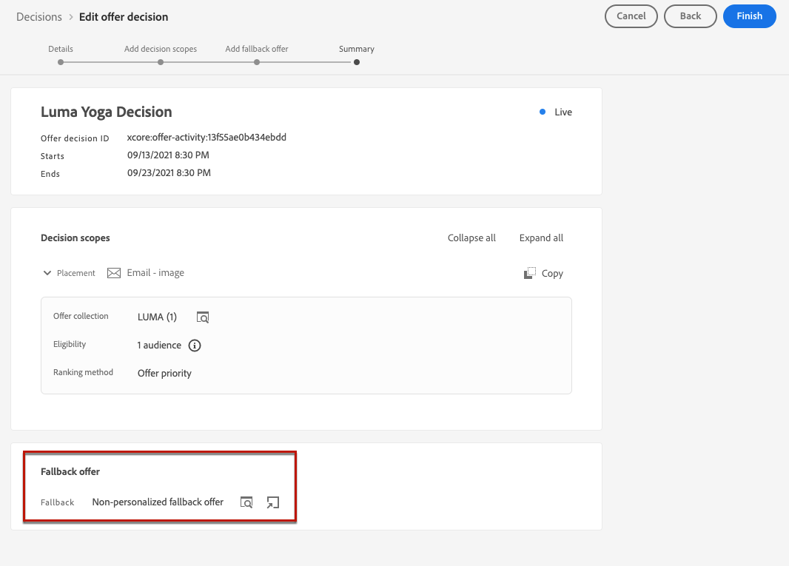
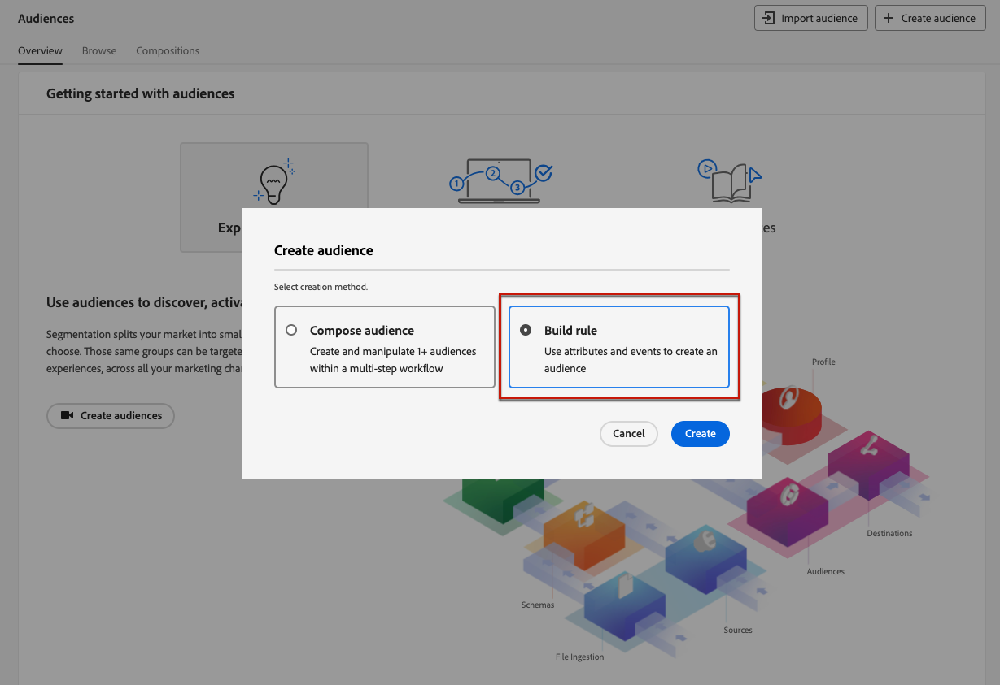
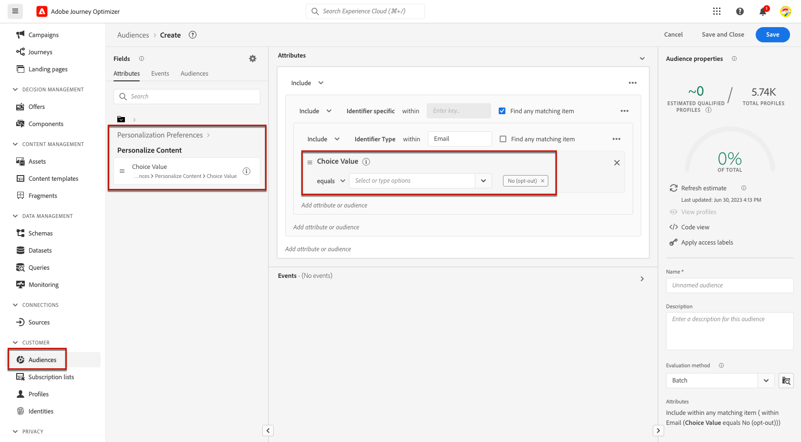
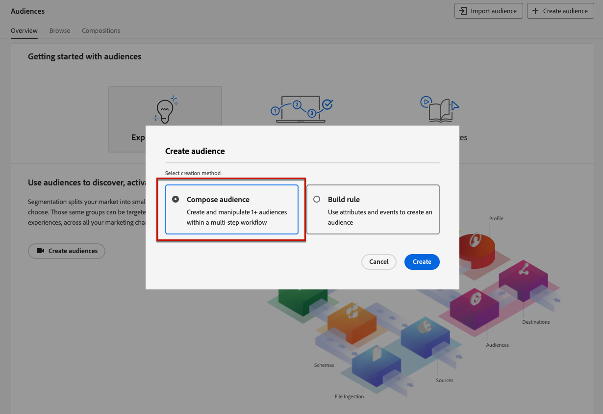
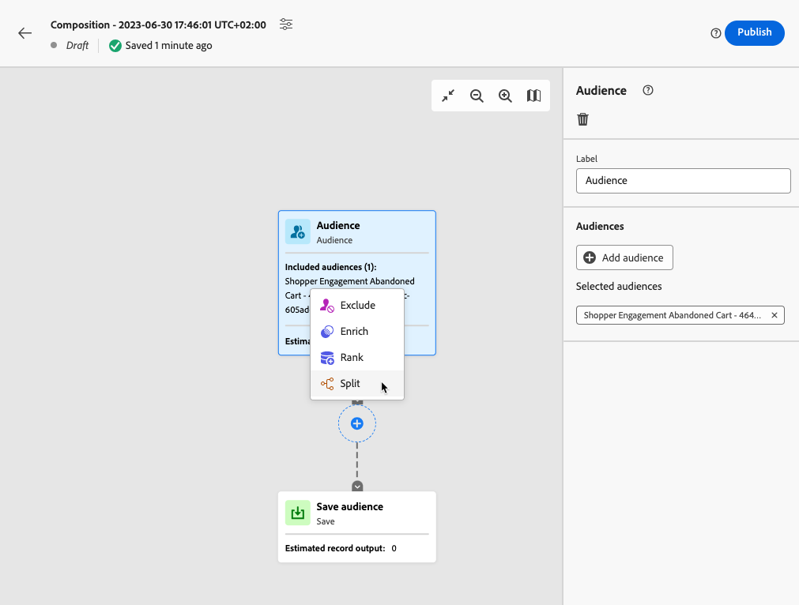
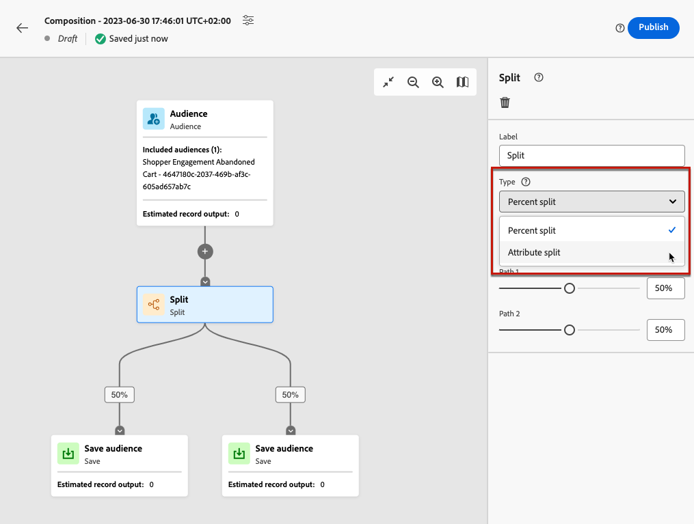
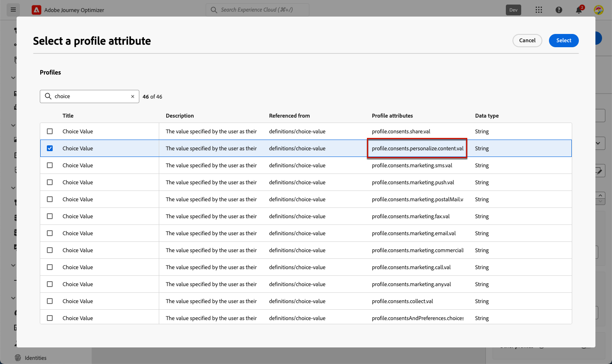
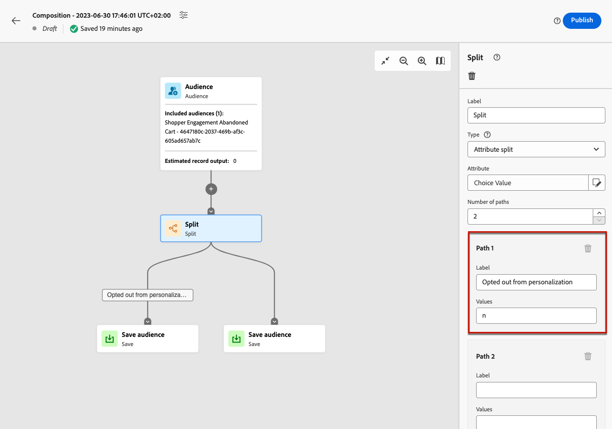

# Manage opt-out {#consent}

Providing to recipients the capability to unsubscribe from receiving communications from a brand is a legal requirement, as well as ensuring this choice is honored. Learn more about the applicable legislation in the [Experience Platform documentation](https://experienceleague.adobe.com/docs/experience-platform/privacy/regulations/overview.html#regulations){target="_blank"}.

**Why is it important?**

* Failing to comply with these regulations introduces regulatory legal risks for your brand.
* It helps you avoid sending unsolicited communications to your recipients, which could make them mark your messages as spam and harm your reputation.

## Manage unsubscriptions in journeys and campaigns {#opt-out-ajo}

When sending messages from journeys or campaigns, you must always ensure that customers can unsubscribe from future communications. Once unsubscribed, the profiles are automatically removed from the audience of future marketing messages. 

While **[!DNL Journey Optimizer]** provides ways of managing opt-out in emails and SMS messages, push notifications do not require any action on your side, as recipients can unsubscribe through their devices themselves. For example, upon downloading or when using your app, they can select to stop notifications. Similarly, they can change the notification settings through the mobile operating system.

Learn how to manage opt-out in Journey Optimizer email and SMS messages in these sections: 

<table style="table-layout:fixed"><tr style="border: 0;">
<td>

<a href="../email/email-opt-out.md"><strong>Email opt-out management</strong>

</td>
<td>

<a href="../sms/sms-opt-out.md"><strong>SMS opt-out management</strong></a>

</td>
</tr></table>

>[!NOTE]
>
>In [!DNL Journey Optimizer], consent is handled by the Experience Platform [Consent schema](https://experienceleague.adobe.com/docs/experience-platform/xdm/field-groups/profile/consents.html){target="_blank"}. By default, the value for the consent field is empty and treated as consent to receive your communications. You can modify this default value while onboarding to one of the possible values listed [here](https://experienceleague.adobe.com/docs/experience-platform/xdm/data-types/consents.html#choice-values){target="_blank"}.

## Implement personalization consent {#opt-out-personalization}

Your customers can also opt out from being presented personalized contents. Once a profile has opted out from personalization, you need to ensure that their data is not used for personalization and you must replace any personalized content with a fallback variant.

### In Decision Management {#opt-out-decision-management}

When leveraging offers, personalization preferences are not automatically implemented in [decision scopes](../offers/offer-activities/create-offer-activities.md#add-decision-scopes) used from a [decisioning](../offers/api-reference/offer-delivery-api/decisioning-api.md) API request or [edge decisioning](../offers/api-reference/offer-delivery-api/edge-decisioning-api.md) API request. In this case, you need to manually enforce personalization consent. To do so, follow the steps below.

>[!NOTE]
>
>Decision scopes used in [!DNL Journey Optimizer] authored channels satisfy this requirement from the journey or campaign they belong to.

1. Create an [Adobe Experience Platform audience](../audience/access-audiences.md) using the [Segmentation Service](https://experienceleague.adobe.com/docs/experience-platform/segmentation/ui/overview.html){target="_blank"} and use a profile attribute such as **[!UICONTROL Personalize Content = Yes (opt-in)]** to target users who have consented to personalization.

    

1. When creating a [decision](../offers/offer-activities/create-offer-activities.md), add a decision scope and define an eligibility constraint based on this audience for each evaluation criteria collection that contains personalized offers.

    

1. Create a [fallback offer](../offers/offer-library/creating-fallback-offers.md) that does not include personalized content.

1. [Assign](../offers/offer-activities/create-offer-activities.md#add-fallback) the non-personalized fallback offer to the decision.

    

1. [Review and save](../offers/offer-activities/create-offer-activities.md#review) the decision.

If a user has:

* consented for personalization, the decision scope will determine the best offer for that profile.

* not consented for personalization, the corresponding profile will not be eligible for any of the offers that are in the evaluation criteria and will therefore receive the non-personalized fallback offer.

>[!NOTE]
>
>Consent for having profile data used in [data modeling](../offers/ranking/ai-models.md) is not supported yet in [!DNL Journey Optimizer].

## In the Expression editor {#opt-out-expression-editor}

The [Expression editor](../personalization/personalization-build-expressions.md) itself does not perform any consent checks or enforcement as it is not involved in the delivery of messages.

However, the use of right-based acces control labels allows to restrict which fields can be used for personalization. The [message preview](../email/preview.md#preview-email) and [email rendering service](../email/preview.md#email-rendering) will mask the fields identified with sensitive information.

>[!NOTE]
>
>Learn more on Object level access control (OLAC) in [this section](../administration/object-based-access.md).

In [!DNL Journey Optimizer] campaigns, the consent policy is enforced as follows:

* You can include consent policy definitions as part of the audience creation to ensure that the audience selected for the campaign has already **filtered out profiles that do not match the consent criteria**.

* [!DNL Journey Optimizer] will perform a general consent check at the channel level to **ensure that profiles have opted in** to receive marketing communications on the corresponding channel.

    >[!NOTE]
    >
    >The [!DNL Journey Optimizer] campaign object itself does not perform any additional consent policy enforcement checks at this time. 

To manually enforce personalization consent in campaigns, follow one of the options below.

### Using the segment rule builder

You can use the segment rule builder to create an audience containing opt-out profiles.

1. Create an [Adobe Experience Platform audience](../audience/access-audiences.md) using the [Segmentation Service](https://experienceleague.adobe.com/docs/experience-platform/segmentation/ui/overview.html){target="_blank"}.

    

1. Select a profile attribute such as **[!UICONTROL Personalize Content = No (opt-out)]** to exclude users who have not consented to personalization.

    

1. Click **[!UICONTROL Save]**.

You can now use this audience to filter out the profiles that have not given consent to personalization from your campaigns.

### Using a split activity in a composition workflow

You can also add a personalization consent check to an audience by adding a split activity to a composition workflow.

1. Create an audience using the **[!UICONTROL Compose Audience]** option. [Learn more on creating a composition workflow](../audience/create-compositions.md)

    

1. Add your starting audience using the dedicated button on the right.

1. Click the **+** icon and select a **[!UICONTROL Split]** activity to create a split audience. [Learn more on the Split activity](../audience/composition-canvas.md#split)

    

1. In the right pane, select **[!UICONTROL Attribute split]** as the split type.

    

1. Click the pencil icon next to the **[!UICONTROL Attribute]** field  to bring up the **[!UICONTROL Select a profile attribute]** window.

1. Search for the personalization consent attribute (`profile.consents.personalize.content.val`) and select it.

    

1. **[!UICONTROL Path 1]** will be the non-personalized audience. Choose a relevant label.

1. Choose the appropriate value from this [list](https://experienceleague.adobe.com/docs/experience-platform/xdm/data-types/consents.html#choice-values){target="_blank"}.

    In this case we will use `n` to signify that users do not consent to the use of their data for personalization.

    

1. You can create a separate path for other choice values. You can also choose to delete the remaining paths and turn on **[!UICONTROL Other profiles]** to include all other profiles that did not have a choice value of `n`.

1. Once finished, click **[!UICONTROL Save Audience]** for each path to save the result of your workflow into a new audience. One audience will be saved into Adobe Experience Platform for each path.

1. Once finished, publish the composition workflow.

You can now use this audience to filter out the profiles that have not given consent to personalization from your campaigns.

>[!NOTE]
>
>If you create an audience that has not given consent for personalization and you then select this audience in a campaign, the personalization tools will remain available. It is up to your marketing users to understand that if they are working with an audience that should not receive personalization, they should not use personalization tools.
