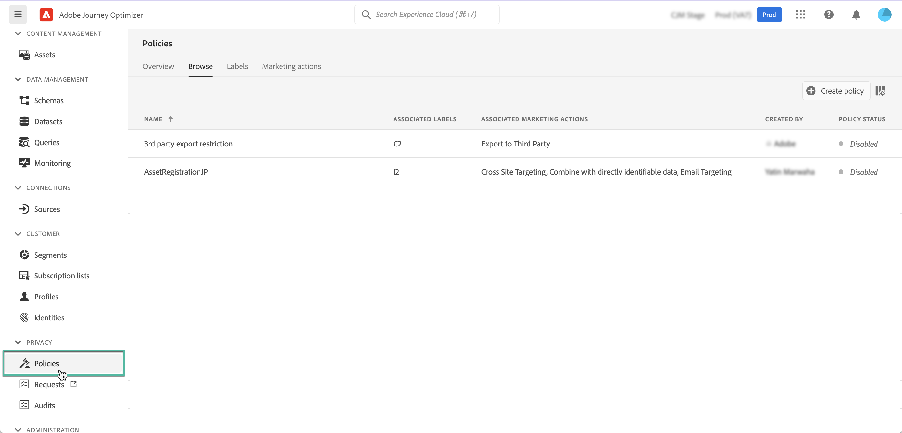

# Data usage policies {#Policies}

With Adobe Experience Platform **Data Governance service**, you can enforce data usage restrictions through the use of labels, marketing actions, and policies.

To do this, Data Governance service allows you to apply data usage labels to datasets and fields, categorizing each according to related data usage policies.

Data usage policies are rules that describe the kinds of marketing actions that you are allowed to, or restricted from, performing on data within Experience Platform. They are accessible from the **[!UICONTROL Policies]** menu.

For more information on the Data Governance framework and how to work with labels and policies, refer to Adobe Experience Platform documentation:

* [Data Governance service overview](https://experienceleague.adobe.com/docs/experience-platform/data-governance/home.html)
* [Data usage labels overview](https://experienceleague.adobe.com/docs/experience-platform/data-governance/labels/overview.html?lang=en)
* [Data usage policies](https://experienceleague.adobe.com/docs/experience-platform/data-governance/policies/overview.html)
