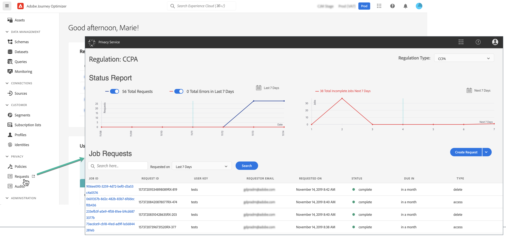

# Privacy requests {#track-changes}

Adobe Experience Platform **Privacy Service** provides a RESTful API and user interface to help you manage customer data requests. With Privacy Service, you can submit requests to access and delete personal customer data from Adobe Experience Cloud applications, facilitating automated compliance with legal and organizational privacy regulations.

Privacy requests can be created and managed from the **[!UICONTROL Requests]** menu.

For more information on the Privacy Service and how to create and manage privacy requests, refer to Adobe Experience Platform documentation:

* [Privacy Service overview](https://experienceleague.corp.adobe.com/docs/experience-platform/privacy/home.html)
* [Managing privacy jobs in the Privacy Service UI](https://experienceleague.corp.adobe.com/docs/experience-platform/privacy/ui/user-guide.html)
