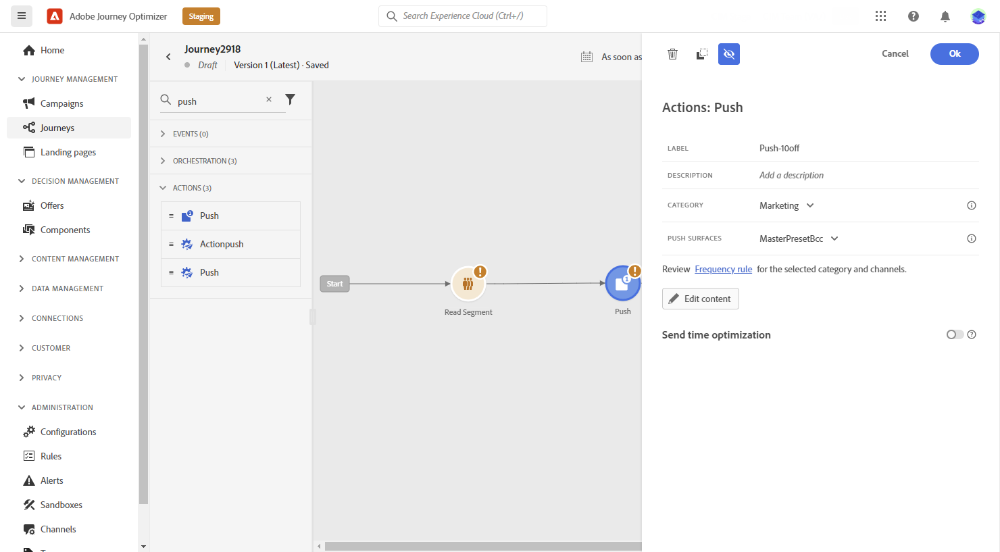
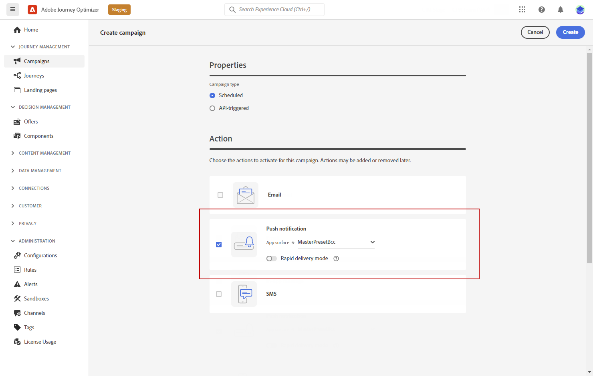
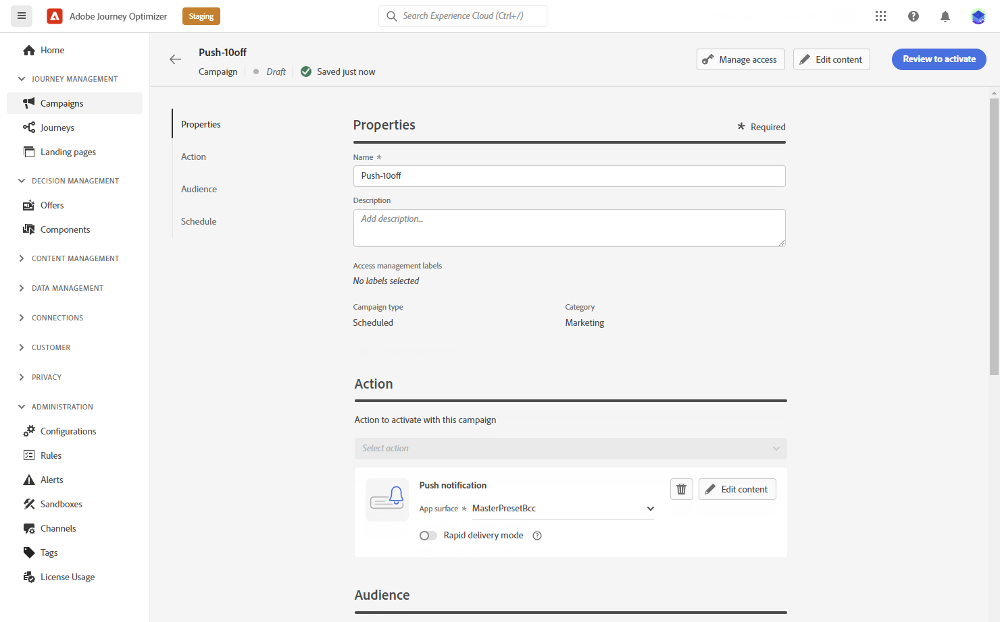
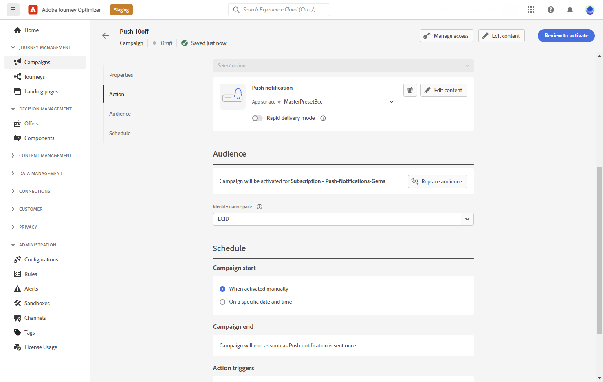

# Create a push notification {#create-push-notification}

>[!CONTEXTUALHELP]
>id="ajo_message_push"
>title="Push message creation"
>abstract="Add your push message and start personalizing it with the Expression editor."

## Create the push notification {#create}

To create a push notification, follow the steps below:

1. Add a Push action in a journey or a campaign:

>[!BEGINTABS]
>[!TAB Add a Push to a Journey]

1. Open your journey then drag and drop a Push activity from the Actions section of the palette.

    

1. Provide basic information on your message (label, description, category), then choose the message surface to use.

    

    For more information on how to configure a journey, refer to [this page](../building-journeys/journey-gs.md)

>[!TAB Add a Push to a Campaign]

1. Create a new scheduled or API-triggered campaign, select **[!UICONTROL Push notification]** as your action and choose the **[!UICONTROL App surface]** to use. [Learn more on Push configuration](push-configuration.md).

    

1. Click **[!UICONTROL Create]**.

1. From the **[!UICONTROL Properties]** section, edit your Campaign's **[!UICONTROL Title]** and **[!UICONTROL Description]**.

    

1. Click the **[!UICONTROL Select audience]** button to define the audience to target from the list of available Adobe Experience Platform segments. [Learn more](../segment/about-segments.md).

1. In the **[!UICONTROL Identity namespace]** field, choose the namespace to use in order to identify the individuals from the selected segment. [Learn more](../event/about-creating.md#select-the-namespace).

    

1. Campaigns are designed to be executed on a specific date or on a recurring frequency. Learn how to configure the **[!UICONTROL Schedule]** of your campaign in [this section](../campaigns/create-campaign.md#schedule). 

1. From the **[!UICONTROL Action triggers]** menu, choose the **[!UICONTROL Frequency]** of your push notification:

    * Once
    * Daily
    * Weekly
    * Monthly

>[!ENDTABS]

1. From the journey or campaign configuration screen, click the **[!UICONTROL Edit content]** button to configure the push content. [Design a push notification](design-push.md)

1. Once your message content has been defined, you can use test profiles to preview and test it. If you inserted personalized content, you can check how this content is displayed in the message, leveraging test profile data.

    To do this, click the **[!UICONTROL Simulate content]** tab. [Learn how to preview and test your messages](../design/preview.md).

    >[!IMPORTANT]
    >
    >Check alerts in the upper section of the editor.  Some of them are simple warnings, but others can prevent you from using the message. [Learn how to check alerts on your messages](../messages/alerts.md).

    

1. When your push is ready, complete the configuration of your [journey](../building-journeys/journey-gs.md) or [campaign](../campaigns/create-campaign.md) to send it.

    To track the behavior of your recipients through push openings and/or interactions, make sure that the dedicated options in the tracking section are enabled in the [email activity](../building-journeys/journeys-message.md) or [campaign](../campaigns/create-campaign.md). 

**Related topics**

* [Configure push channel](push-gs.md)
* [Create a new message](../messages/get-started-content.md)
* [Add a message in a journey](../building-journeys/journeys-message.md)
