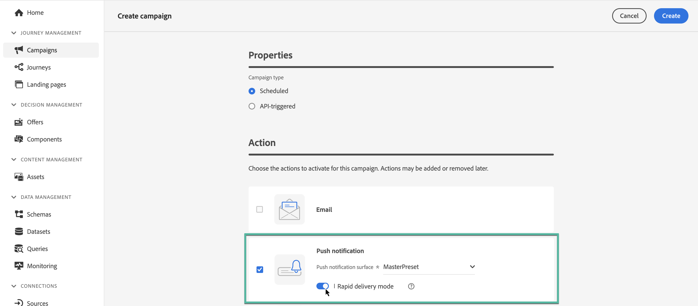

# Create a push notification {#create-push-notification}

>[!CONTEXTUALHELP]
>id="ajo_message_push"
>title="Push message creation"
>abstract="Add your push message and start personalizing it with the Expression editor."

## Create the push notification in a journey or campaign {#create}

To create a push notification, follow the steps below:

>[!BEGINTABS]

>[!TAB Add a Push to a Journey]

1. Open your journey then drag and drop a Push activity from the Actions section of the palette.

    

1. Provide basic information on your message (label, description, category), then choose the message surface to use. The **[!UICONTROL Surface]** field is pre-filled, by default, with the last surface used for that channel by the user.

    

    >[!NOTE]
    >
    >If you are sending a push notification from a journey, you can leverage Adobe Journey Optimizer's Send-Time Optimization feature to predict the best time to send the message to maximize engagement based on historical open and click rates. [Learn how to work with Send-Time Optimization](../building-journeys/journeys-message.md#send-time-optimization)  

    For more information on how to configure a journey, refer to [this page](../building-journeys/journey-gs.md)

1. From the journey configuration screen, click the **[!UICONTROL Edit content]** button to configure the push content. [Design a push notification](design-push.md)

1. Once your message content has been defined, you can use test profiles to preview and test it. 

1. When your push is ready, complete the configuration of your [journey](../building-journeys/journey-gs.md) to send it.

    To track the behavior of your recipients through push openings and/or interactions, make sure that the dedicated options in the tracking section are enabled in the [email activity](../building-journeys/journeys-message.md).

>[!TAB Add a Push to a Campaign]

1. Create a new scheduled or API-triggered campaign, select **[!UICONTROL Push notification]** as your action and choose the **[!UICONTROL App surface]** to use. [Learn more on Push configuration](push-configuration.md).

    

1. Click **[!UICONTROL Create]**.

1. From the **[!UICONTROL Properties]** section, edit your Campaign's **[!UICONTROL Title]** and **[!UICONTROL Description]**.

    

1. Click the **[!UICONTROL Select audience]** button to define the audience to target from the list of available Adobe Experience Platform audiences. [Learn more](../audience/about-audiences.md).

1. In the **[!UICONTROL Identity namespace]** field, choose the namespace to use in order to identify the individuals from the selected audience. [Learn more](../event/about-creating.md#select-the-namespace).

    

1. Click **[!UICONTROL Create experiment]** to start configuring your content experiment and create treatments to measure their performance and identify the best option for your target audience. [Learn more](../campaigns/content-experiment.md)

1. Campaigns are designed to be executed on a specific date or on a recurring frequency. Learn how to configure the **[!UICONTROL Schedule]** of your campaign in [this section](../campaigns/create-campaign.md#schedule). 

1. From the **[!UICONTROL Action triggers]** menu, choose the **[!UICONTROL Frequency]** of your push notification:

    * Once
    * Daily
    * Weekly
    * Monthly

1. From the campaign configuration screen, click the **[!UICONTROL Edit content]** button to configure the push content. [Design a push notification](design-push.md)

1. Once your message content has been defined, you can use test profiles to preview and test it. 

1. When your push is ready, complete the configuration of your [campaign](../campaigns/create-campaign.md) to send it.

    To track the behavior of your recipients through push openings and/or interactions, make sure that the dedicated options in the tracking section are enabled in the [campaign](../campaigns/create-campaign.md).

>[!ENDTABS]

**Related topics**

* [Configure push channel](push-gs.md)
* [Add a message in a journey](../building-journeys/journeys-message.md)

## Rapid delivery mode {#rapid-delivery}

>[!CONTEXTUALHELP]
>id="ajo_campaigns_rapid_delivery"
>title="Rapid delivery mode"
>abstract="Rapid delivery mode lets you perform high speed message sending on Push channel to an audience size of under 30M."

Rapid delivery mode, previously known as Burst mode in journeys, is a [!DNL Journey Optimizer] add-on that allows very fast push message sending in large volumes though campaigns.

Rapid delivery is used when delay in message delivery is business-critical, when you want to send an urgent push alert on mobile phones, for example a breaking news to users who have installed your news channel app.

For more information on performances when using Rapid delivery mode, refer to [Adobe Journey Optimizer product description](https://helpx.adobe.com/legal/product-descriptions/adobe-journey-optimizer.html).

### Prerequisites {#prerequisites}

Rapid delivery messaging comes with the following requirements:

* Rapid delivery is available for **[!UICONTROL Scheduled]** campaigns only, and is not available for API-triggered campaigns,
* No personalization is allowed in the push message,
* The target audience must contain less than 30M profiles,
* You can execute up to 5 campaigns simultaneously using the Rapid delivery mode.

### Activate Rapid delivery mode

1. Create a push notification campaign and toggle on the **[!UICONTROL Rapid delivery]** option.

1. Configure the message content and select the audience to target. [Learn how to create a campaign](#create)
    
    >[!IMPORTANT]
    >
    >Ensure that the message content does not include any personalization, and that the audience contains less than 30M profiles.

1. Review and activate your campaign as usual. Note that, in test mode, messages are not sent via the Rapid delivery mode.