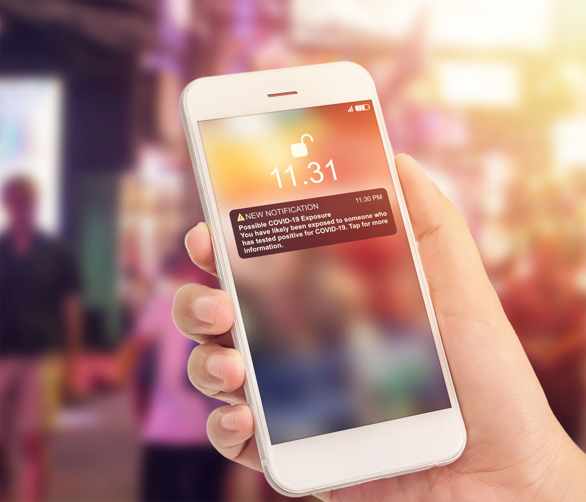

# Get started with push notification {#gs-push-notification}

>[!IMPORTANT]
>
>If this is your first time creating an Push Notification, make sure the Push channel has been configured. [Learn more](push-gs.md).

Push notifications help you reach your mobile app users at any time - especially when they are not actively using your app. Push notifications may help you achieve a variety of use cases such as providing updates about your service, ask a user to take action, alert the user to a new deal, etc. Device platforms require opt-in before end-users may receive or view your notifications. User opt-in may be received as early as after the app is launched for the first time post-install, or in a subsequent session or workflow as appropriate. 

[!DNL Journey Optimizer] supports push notifications and helps you send highly relevant notifications at industry-leading throughput rates. Push notifications may include personalization and Journey-based context in order to leverage data insights your brand has with Adobe Experience Cloud.

Push notifications can be created:

* In a **Journey**: Once you added a Push activity in your journey, and defined basic settings, use the **[!UICONTROL Actions: Push]** right pane to create the content for the Push notifications. 

    For more information on how to configure your journey, refer to this [page](../building-journeys/journey-gs.md).

* In a **Campaign**: Once you created a campaign, select Push notification as your action and define basic settings. 

    For more information on how to configure your campaign, refer to this [page](../campaigns/create-campaign.md#configure).

Use the dedicated tabs to define the push notification settings for **iOS** and **Android** operating systems.

>[!NOTE]
>
>While **[!DNL Journey Optimizer]** provides ways of managing opt-out in emails and SMS messages, push notifications do not require any action on your side, as recipients can unsubscribe through their devices themselves. For example, upon downloading or when using your app, they can select to stop notifications. Similarly, they can change the notification settings through the mobile operating system.

<table style="table-layout:fixed"><tr style="border: 0;">
<td>

<a href="create-push.md"><strong>Create a push notification</strong>

</td>
<td>

<a href="design-push.md"><strong>Design your push notification</strong></a>

</td>
<td>

<a href="send-push.md"><strong>Send your push notification</strong></a>

</td>
<td>

<a href="push-gs.md"><strong>Configure push notifications</strong></a>

</td>
</tr></table>
