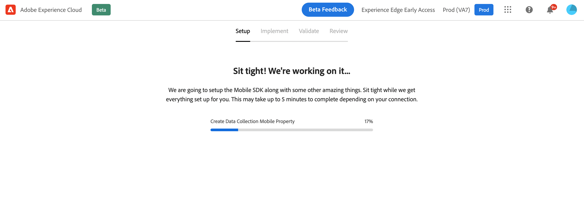
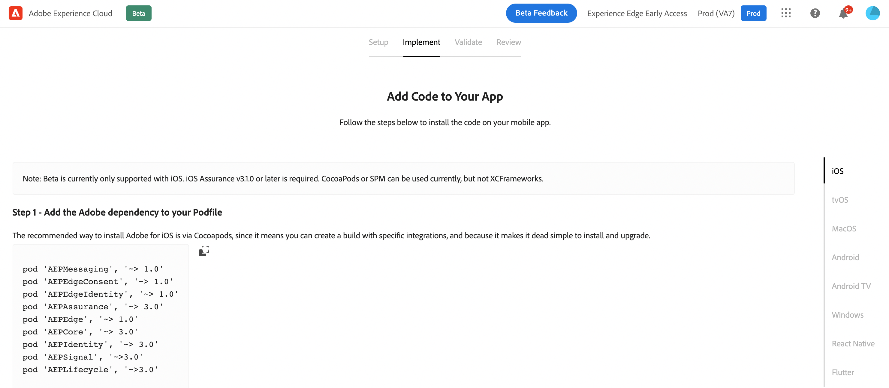
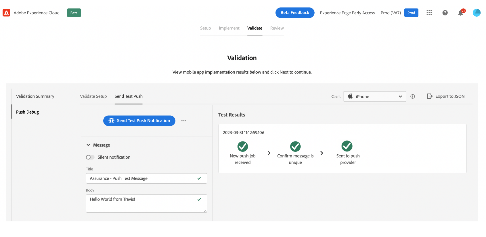
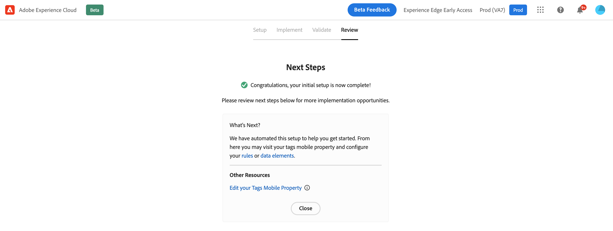

# Mobile onboarding quick start workflow {#mobile-wf}

The new **mobile onboarding quick start workflow** is a new product feature to rapidly configure the Mobile SDK, start collecting and validating mobile event data, and send push notifications with Journey Optimizer. 

This capability is accessible via the **Adobe Experience Platform Data Collection** home page to all customers as a public Beta.

## Get started{#gs-mobile-wf}

This new workflow automates Data Collection setup by reducing the total clicks and accelerating the mobile configuration for Journey Optimizer. This quick start workflow takes you through four easy steps to [set up](##setup-mobile-wf), [implement](#implement-mobile-wf), [validate](#valid-mobile-wf), and [review](#review-mobile-wf) your mobile configuration. 

Below are a few additional features:
 
* Easy four step workflow and user interface.
* Delivers a basic setup to start collecting mobile event data via the Mobile SDK in minutes.
* Ability to test and validate a basic mobile push event leveraging Assurance.
* Auto creates and configures all necessary Data Collection, and Journey Optimizer assets. 
* In product guidance and tooltips.
* Provides a natural transition for more advanced implementation if needed.

## Set up {#setup-mobile-wf}

The first step of this workflow auto creates and configures all necessary Data Collection, and Journey Optimizer assets, such as Mobile Properties, Mobile Extensions, Journey Optimizer Extension, Rules, Data Elements, etc.

## Implement{#implement-mobile-wf}

Next step provides step-by-step guidance to install the code to your app.

## Validate{#valid-mobile-wf}

Review and check the implementation to validate it. 

## Review {#review-mobile-wf}

Automated setup is done. You can now visit your tag mobile property and configure your rules or data element, and  start sending push notifications with Adobe Journey Optimizer.

**Related topics**

* [Get started with push notification](get-started-push.md)
* [Push notification data flow and components](push-gs.md)
* [Configure the push channel](push-configuration.md)
* [Push notification report](../reports/journey-global-report.md#push-global)
* [Create a push notification](create-push.md)
