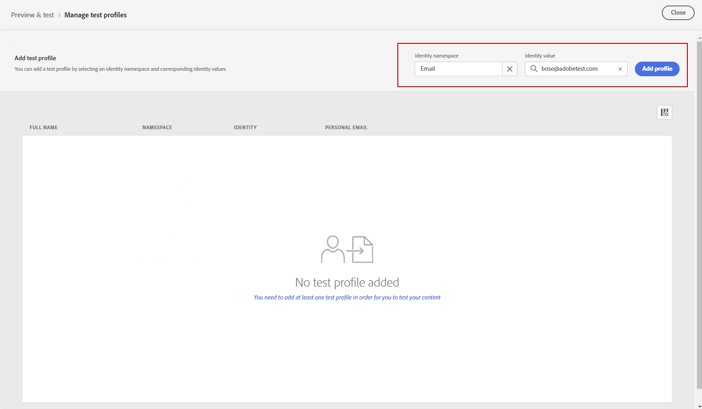
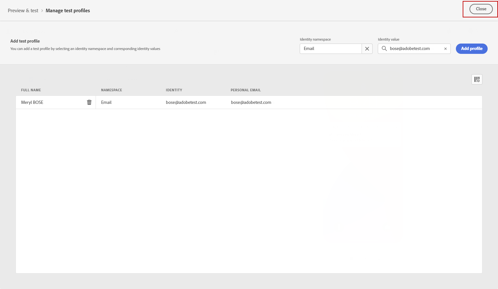

# Send your push notification {#send-push}

## Preview your push notification {#preview-push}

Once your message content has been defined, you can use test profiles to preview and test it. If you inserted personalized content, you can check how this content is displayed in the message, leveraging test profile data.

1. Click **[!UICONTROL Simulate content]**.

1. Click **[!UICONTROL Manage test profiles]** to add a test profile.

1. Find your test profile with the **[!UICONTROL Identity namespace]** and **[!UICONTROL Identity value]** fields. Then, click **[!UICONTROL Add profile]**.

    

1. Apply the same steps as described above to select a test profile, and 

    

1. In the push preview, test profile data is leveraged in the message content.

    Select the type of device to preview content: **[!UICONTROL iOS]** or **[!UICONTROL Android]**.

    

## Validate your Push notification {#push-validate}

>[!NOTE]
>
> For better deliverability, you should always use the phone numbers in the formats supported by the provider. For example, Twilio and Sinch only support phone numbers in E.164 format.

You must also check alerts in the upper section of the editor.  Some of them are simple warnings, but others can prevent you from using the message. Two types of alerts can happen:

* **Warnings** refer to recommendations and best practices.

* **Errors** prevent you from testing or activating the journey as long as they are not resolved, such as:

    * **[!UICONTROL The push version of the message is empty]**: this error is displayed when the push notification body or title is missing. Learn how to define push notification content in [this section](create-push.md).

    * **[!UICONTROL Surface doesn't exist]**: you cannot use your message if the surface you have selected is deleted after the message creation. If this error occurs, select another surface in the message **[!UICONTROL Properties]**. Learn more on channel surfaces in [this section](../configuration/channel-surfaces.md).

    * **[!UICONTROL Push iOS/Android payload has exceeded limit of 4KB]**: the push notification size cannot exceed 4KB. To respect this limit, try to reduce the use of images or emojis. Learn how to manage your push notification content in [this section](../push/create-push.md).

When your Push notification is ready, complete the configuration of your [journey](../building-journeys/journey-gs.md) or [campaign](../campaigns/create-campaign.md) to send it.

