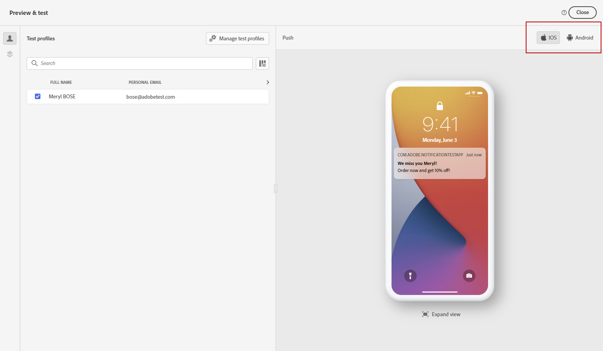
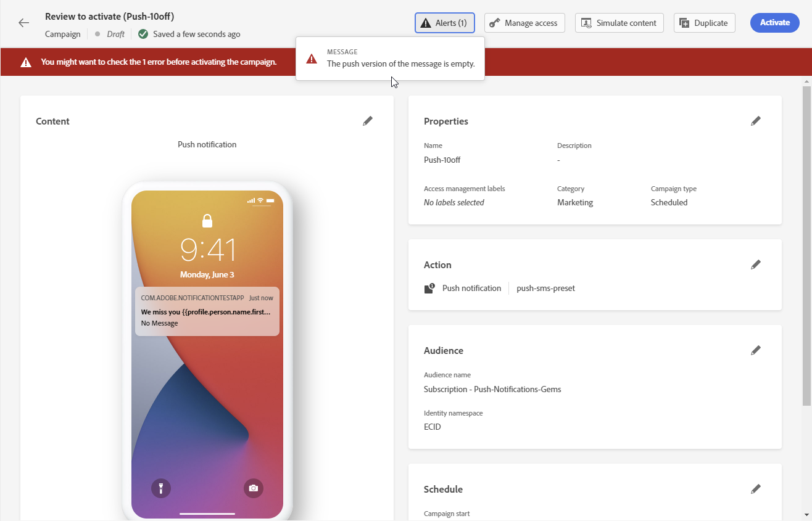

# Check and send your push notification {#send-push}

## Preview your push notification {#preview-push}

Once your message content has been defined, you can use test profiles to preview its content. If you inserted personalized content, you can check how this content is displayed in the message, using test profile data.

To do this, click **[!UICONTROL Simulate content]** then add a test profile. You can then select the type of device to preview content: **[!UICONTROL iOS]** or **[!UICONTROL Android]**.

Detailed information on how to select test profiles and preview your content is available in the [Content Management](../content-management/preview-test.md) section.

## Validate your push notification {#push-validate}

You must check alerts in the upper section of the editor. Some of them are simple warnings, but others can prevent you from sending the message. Two types of alerts can happen: warnings and errors.

* **Warnings** refer to recommendations and best practices.

* **Errors** prevent you from testing or activating the journey as long as they are not resolved, such as:

    * **[!UICONTROL The push version of the message is empty]**: this error is displayed when the push notification body or title is missing. Learn how to define push notification content in [this section](create-push.md).

    * **[!UICONTROL Surface doesn't exist]**: you cannot use your message if the surface you have selected is deleted after the message creation. If this error occurs, select another surface in the message **[!UICONTROL Properties]**. Learn more on channel surfaces in [this section](../configuration/channel-surfaces.md).

    * **[!UICONTROL Push iOS/Android payload has exceeded limit of 4KB]**: the push notification size cannot exceed 4KB. To respect this limit, try to reduce the use of images or emojis. Learn how to manage your push notification content in [this section](../push/create-push.md).

    

>[!NOTE]
>
> For better deliverability, you should always use the phone numbers in the formats supported by the provider. For example, Twilio and Sinch only support phone numbers in E.164 format.

## Send your push notification{#push-send}

When your push message is ready, complete the configuration of your [journey](../building-journeys/journey-gs.md) or [campaign](../campaigns/create-campaign.md) to send it.

**Related topics**

* [Configure push channel](push-configuration.md)
* [Push notification report](../reports/journey-global-report.md#push-global)
* [Create a push notification](create-push.md)
* [Add a message in a journey](../building-journeys/journeys-message.md)
* [Add a message in a campaign](../campaigns/create-campaign.md)

