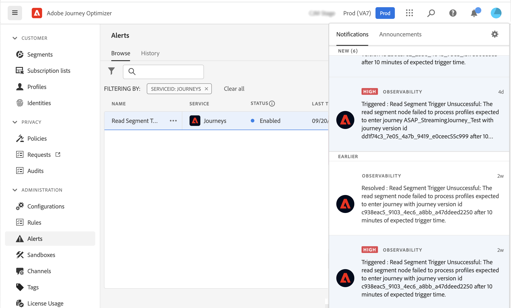

# Get Started with Alerts {#alerts}

Journey Optimizer leverages Adobe Experience Platform alerting capabilities. This allows you to access system alerts through the user interface. You can view the available alerts and subscribe to them. When a certain set of conditions in your operations is reached (such as a potential problem when the system breaches a threshold), alert messages are delivered to any users in your organization who have subscribed to them. These messages can repeat over a pre-defined time interval until the alert has been resolved.

Learn more on alerts in Adobe Experience Platform [documentation](https://experienceleague.adobe.com/docs/experience-platform/observability/alerts/overview.html).
To learn how to subscribe to alerts and configure them, refer to this [page](https://experienceleague.adobe.com/docs/experience-platform/observability/alerts/ui.html).

In the left menu, under **Administration**, click **Alerts**. A pre-configured alert for Journey Optimizer is available. This alert will warn you if a read segment node has not processed any profile during the defined time frame.

If such an unexpected behavior occurs, an alert notification is sent to subscribers of the alert through email, in the top right corner of the interface.

When [viewing alert rules in the Platform UI](https://experienceleague.adobe.com/docs/experience-platform/observability/alerts/ui.html), you can subscribe to each rule individually. When subscribing to alerts through [I/O Event notifications](https://experienceleague.adobe.com/docs/experience-platform/observability/alerts/subscribe.html), however, alert rules are organized into different subscription packages. The I/O event subscription name corresponding to the Read segment alert is: "Journey read segment Delays, Failures and Errors".

>[!WARNING]
>
>These alerts apply only to live journeys. Alerts will not be triggered for journeys in test mode.
