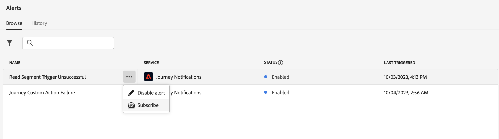
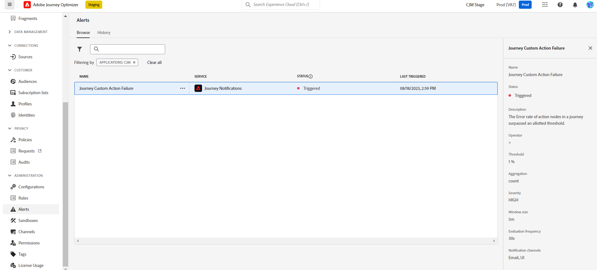
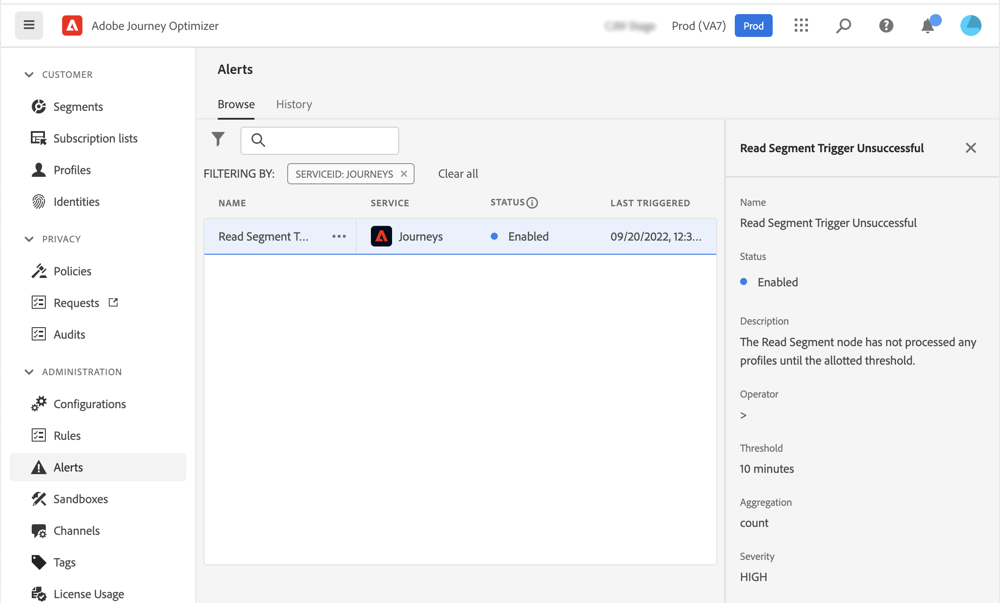

# Get Started with Alerts {#alerts}

## Access and subscribe alerts {#alerting-capabilities} 

When a failure happens, you can get system alerts in Journey Optimizer notification center (in-app alerts), and/or receive an email. 

From the **Alerts** menu, you can view the available alerts, and subscribe to them. When a certain set of conditions in your operations is reached (such as a potential problem when the system breaches a threshold), alert messages are delivered to any users in your organization who subscribed to them. 

<!--These messages can repeat over a pre-defined time interval until the alert has been resolved.-->

Learn more about alerts in Adobe Experience Platform in [Adobe Experience Platform documentation](https://experienceleague.adobe.com/docs/experience-platform/observability/alerts/overview.html){target="_blank"}. 

In the left menu, under **Administration**, click **Alerts**. Two pre-configured alerts for Journey Optimizer are available: the [Journey Custom Action Failure](#alert-custom-actions) alert and the [Read Segment Trigger Unsuccessful](#alert-read-audiences) alert. These alerts are detailed below.

You can subscribe to each alert individually from the user interface, by selecting the **Subscribe** option from the **Alerts** dashboard. Use the same method to unsubscribe. 

You can also subscribe to alerts through [I/O Event notifications](https://experienceleague.adobe.com/docs/experience-platform/observability/alerts/subscribe.html){target="_blank"}. Alert rules are organized into different subscription packages. Event subscriptions corresponding to the specific Journey Optimizer alerts are detailed below. 

If an unexpected behavior occurs, an alert notification is sent to the subscribers. Based on the user preferences, alerts are sent by email, and/or directly within Journey Optimizer notification center, in the top right corner of the user interface. By default, only in-app alerting is enabled. To enable email alerting, refer to [Adobe Experience Platform documentation](https://experienceleague.adobe.com/docs/experience-platform/observability/alerts/ui.html#enable-email-alerts){target="_blank"}.

When an alert is resolved, subscribers receive a "Resolved" notification.

>[!CAUTION]
>
>Adobe Journey Optimizer specific alerts apply only to **live** journeys. Alerts are not triggered for journeys in test mode.

## Journey Custom Action Failure {#alert-custom-actions}

This alert warns you if a custom action fails. We consider there is a failure where there has been more than 1% of errors on a specific custom action over the last 5 minutes. This is evaluated every 30 seconds.

Alerts on custom actions are resolved when, over the last 5 minutes:

* there has not been any error on that custom action (or errors below the 1% threshold),

* or, no profile has reached that custom action.

The I/O event subscription name corresponding to the custom action alert is **Journey Custom Action Failure**.

## Read Segment Trigger Unsuccessful {#alert-read-audiences}

This alert warns you if a **Read Audience** activity has not processed any profile 10 mins after scheduled time of execution. This failure can be caused by technical issues, or because the audience is empty.

Alerts on **Read Audience** activities only apply to recurring journeys. **Read Audience** activities in live journeys that have a schedule to run **Once** or **As soon as possible** are ignored.

Alerts on **Read Audience** are resolved when a profile enters the **Read Audience** node.

The I/O event subscription name corresponding to the **Read Segment Trigger Unsuccessful** alert is **Journey read segment Delays, Failures and Errors**.
