# Campaign global report {#campaign-global-report}

>[!CONTEXTUALHELP]
>id="ajo_campaign_global_report"
>title="Campaign global report"
>abstract="The Campaign global report allows to measure the impact of your campaigns over a selected time period. Your report is divided into different widgets detailing your campaign's success and errors. Each reporting dashboard can be modified by resizing or removing widgets."

Global reports, accessible from the **All time** tab, display events that occurred at least two hours ago and cover events over a selected time period. In comparison, Live reports focus on events that took place within the past 24 hours, with a minimum time interval of two minutes from the event occurrence. 

Campaign global report can be accessed directly from your Campaign with the **[!UICONTROL View report]** button.

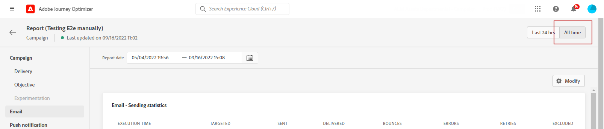

The Campaign **[!UICONTROL Global report]** page will be displayed with the following tabs:

* [Campaign](#campaign-global)
* [Email](#email-global)
* [In-app](#inapp-global)
* [Push](#push-global)
* [SMS](#sms-global)
* [Web](#web-tab)
* [Direct mail](#direct-mail-global)

The Campaign **[!UICONTROL Global report]** is divided into different widgets detailing your campaign's success and errors. Each widget can be resized and deleted if needed. For more information on this, refer to this [section](../reports/global-report.md#modify-dashboard).

For a detailed list of every metric available in Adobe Journey Optimizer, refer to [this page](global-report.md#list-of-components-global.md)

## Campaign tab {#campaign-global}

### Delivery {#delivery-global}

>[!CONTEXTUALHELP]
>id="ajo_campaign_delivery_global"
>title="Campaign's statistics"
>abstract="The Campaign's Statistics widget details the main information relative to your campaign such as Entered profiles and Actions delivered."

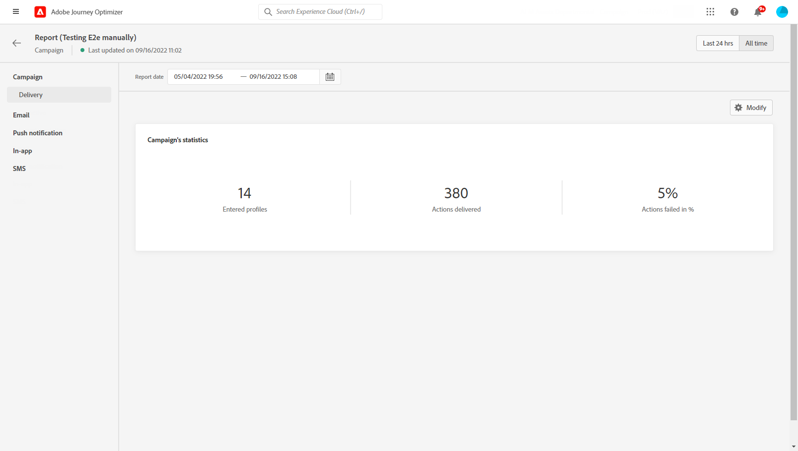

The **[!UICONTROL Campaign's Statistics]** KPIs serve as a comprehensive dashboard, offering a detailed breakdown of key metrics related to your campaign. This includes essential information such as the number of profiles and the actions delivered, providing a thorough understanding of your campaign's performance and engagement.

+++ Learn more on Campaign's Statistics metrics

* **[!UICONTROL Audience]**: Number of targeted profiles.

* **[!UICONTROL Actions delivered]**: Total number of unique times an action has been delivered.

* **[!UICONTROL Actions failed in %]**: Percentage of unique times an action failed compared to the total number of unique times an action has been delivered.

+++

<!--
### Objectives report {#objectives-global}

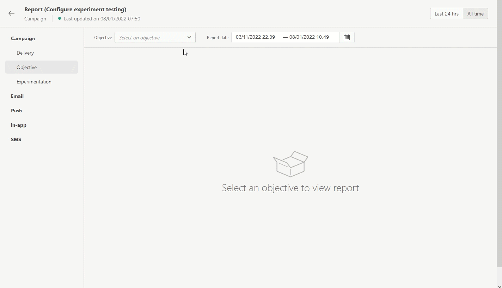

The **[!UICONTROL Objectives]** tab allows you to better fine-tune your deliveries' reports by targeting one specific metric.

The **[!UICONTROL Objectives]** listed are linked to **[!UICONTROL Datasets]** that define a connection to a system in order to retrieve additional information. A list of built-in **[!UICONTROL Objectives]** is available but you can add your own by adding new **[!UICONTROL Dataset]**. For the detailed procedure, refer to this [section](../campaigns/reporting-configuration.md).

After selecting the Objectives you want to target on, the two **[!UICONTROL Performance overview]** and **[!UICONTROL Campaign objective]** widgets will provide a detailed summary of your delivery performance. 

With the **[!UICONTROL Campaign objective]** widget, you can also choose to compare your main objective with another metric.
-->

### Experimentation report {#experimentation-global}

>[!CONTEXTUALHELP]
>id="ajo_campaigns_content_experiment_click"
>title="Success metric"
>abstract="The total value of the Success metric, previously selected when creating your Experiments, divided by the number of profiles."

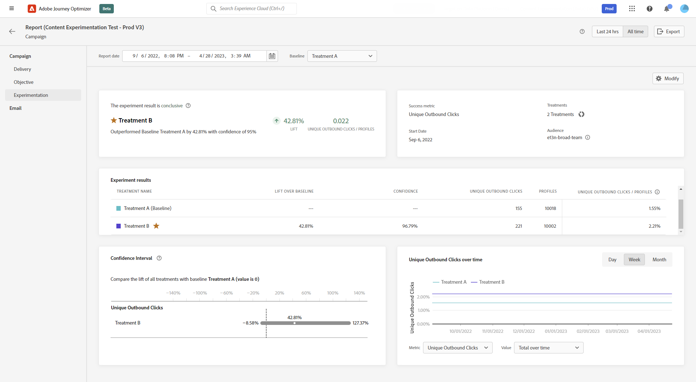

The **[!UICONTROL Experimentation]** tab provides key insights into the performance of each variant, and identifies the most successful one.

Note that defining the best performer might take some time, it will be represented by this icon 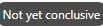.

+++Learn more on the different metrics and widgets available for the Experimentation report.

The **[!UICONTROL Experiment result]** widget details the performance of each variant. You can change your baseline by selecting one of the treatment from the **[!UICONTROL Baseline]** the drop-down. The best treatment will be represented with a star icon.

For a deep-dive in these results and how to interpret them, refer to [this page](../campaigns/get-started-experiment.md#interpret-results).

The table presents the following metrics:

* **[!UICONTROL Lift over baseline]**: Measure of the percentage improvement in conversion rate of a given treatment over the baseline.

* **[!UICONTROL Confidence]**: Evidence that a given treatment is the same as the baseline treatment. [Learn more](../campaigns/experiment-calculations.md#understand-confidence)

* **[!UICONTROL Unique outbound clicks]**: Total count of clicks across outbound channels.

* **[!UICONTROL Profiles]**: Number of profiles targeted for this treatment.

* **[!UICONTROL Unique outbound clicks/profiles]**: Total value of the Success metric, previously selected when creating your Experiments, divided by the number of profiles.

The **[!UICONTROL Confidence interval]** graph measures uncertainty around improvement. It details the percentage difference in performance between the baseline and the best performing treatment. [Learn more](../campaigns/experiment-calculations.md#confidence-intervals). 

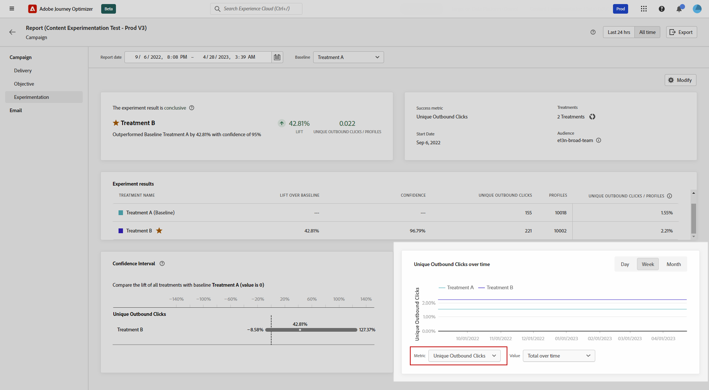

The last widget provides data related to the **[!UICONTROL Success metric]** you previously selected for your Treatments. You have the option to select a different targeted metric from the **[!UICONTROL Metric]** drop-down menu to track alternative data.
    
>[!CAUTION]
>
>When working with experimentation filtered metrics, please note that changing the Metric selection from the drop-down on the comparison page for experimentation will not retain the filter value. For example, switching from "Clicks" to "Unique clicks" will lead to the loss of the applied filter, rendering the comparison inaccurate or invalid.

+++

## Email tab {#email-global}

### Email - Sending Statistics {#sending-statistics-email}

>[!CONTEXTUALHELP]
>id="ajo_campaign_global_email_sending_statistics"
>title="Email - Sending statistics"
>abstract="The Email - Sending statistics table summarizes essential data about your Email such as Targeted or Delivered."

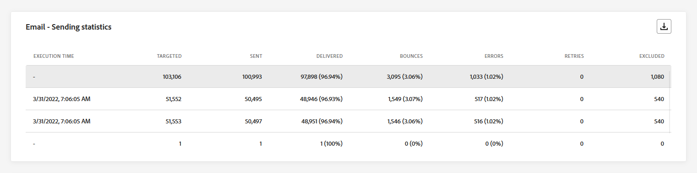

The **[!UICONTROL Email Sending Statistics]** table provides a comprehensive summary of essential data regarding your email campaigns. It details key metrics such as the size of the targeted audience and number of emails successfully delivered, offering valuable insights into the effectiveness and reach of your emails.

+++ Learn more on Email Sending Statistics metrics

* **[!UICONTROL Targeted]**: Total number of emails processed during the sending process.

* **[!UICONTROL Sent]**: Total number of sends for your email.

* **[!UICONTROL Delivered]**: Number of emails successfully sent, in relation to the total number of sent messages.

* **[!UICONTROL Delivery Rate]**: Percentage of emails successfully sent.

* **[!UICONTROL Bounces]**: Total of errors cumulated during the sending process and automatic return processing in relation to the total number of sent messages.

* **[!UICONTROL Bounce Rate]**: Percentage of emails that bounced compared to emails sent.

* **[!UICONTROL Errors]**: Total number of errors that occurred during the sending process preventing it from being sent to profiles.

* **[!UICONTROL Error Rate]**: Percentage of errors that occurred during the sending process preventing it from being sent compared to emails sent.

* **[!UICONTROL Retries]**: Number of emails in the queue for retries.

* **[!UICONTROL Excluded]**: Number of profiles which have been excluded by Adobe Journey Optimizer.

+++

### Email - Tracking statistics {#tracking-statistics-email}

>[!CONTEXTUALHELP]
>id="ajo_campaign_global_email_tracking_statistics"
>title="Email - Tracking statistics"
>abstract="The Email - Tracking statistics table provides data on profile activity for your Email."

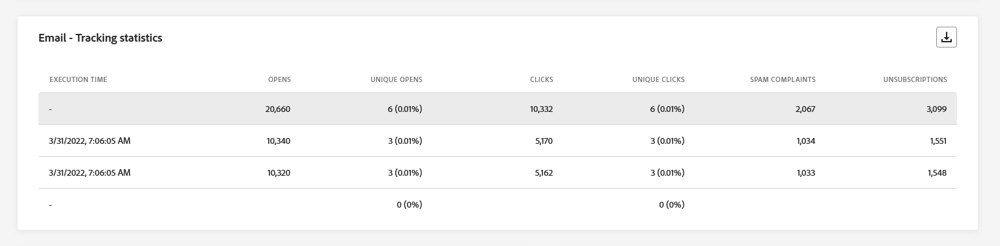

The **[!UICONTROL Email - Tracking statistics]** table offers a detailed account of profile activity related to your email campaigns. This includes metrics on opens, clicks, and other relevant engagement indicators, offering a comprehensive view of how profiles interact with your email content.

+++ Learn more on Email - Tracking statistics metrics

* **[!UICONTROL Opens]**: Number of times the email was opened.

* **[!UICONTROL Unique Opens]**: Percentage of opened emails.

* **[!UICONTROL Open Rate]**: Total number of opened emails compared to the number of delivered emails.

* **[!UICONTROL Clicks]**: Number of times a content was clicked on in your emails.

* **[!UICONTROL Unique Clicks]**: Number of profiles who clicked on a content in an email.

* **[!UICONTROL Unique Click Rate]**: Percentage of users who interacted with your emails.

* **[!UICONTROL Unsubscriptions]**: Number of clicks on the unsubscription link.

* **[!UICONTROL Spam complaints]**: Number of times a message was declared as spam or junk.

+++

### Email - Sending Performance {#sending-performance-email}

>[!CONTEXTUALHELP]
>id="ajo_campaign_global_email_sending_performance"
>title="Email - Sending performance"
>abstract="The Email - Sending performance graph presents comprehensive data regarding sent Emails, offering insights into key metrics like delivered and bounces, allowing for a detailed analysis of the email delivery process."

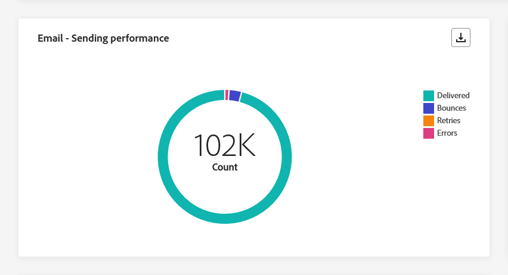

The **[!UICONTROL Email - Sending Performance]** graph provides a comprehensive view of data related to sent emails, offering insights into key metrics such as delivered and bounces. This enables a detailed analysis of the email sending process, providing valuable information on the efficiency and performance of your email campaigns.

+++ Learn more on Email - Sending Performance metrics

* **[!UICONTROL Delivered]**: Number of emails successfully sent, in relation to the total number of sent emails.

* **[!UICONTROL Bounces]**: Total of errors cumulated during the sending process and automatic return processing in relation to the total number of sent emails.

* **[!UICONTROL Retries]**: Number of emails in the queue for retries.

* **[!UICONTROL Errors]**: Total number of errors that occurred during the sending process preventing it from being sent to profiles.

+++

### Email - Bounce reasons and categories {#bounces-email}

>[!CONTEXTUALHELP]
>id="ajo_campaign_global_email_bounce_categories"
>title="Email - Bounce categories"
>abstract="The Email - Bounce categories graphs and table provide data on both temporary and permanent errors."

>[!CONTEXTUALHELP]
>id="ajo_campaign_global_email_bounce_reasons"
>title="Email - Bounces reasons"
>abstract="The Email - Bounces reasons graphs and table contain the data available related to bounced messages."

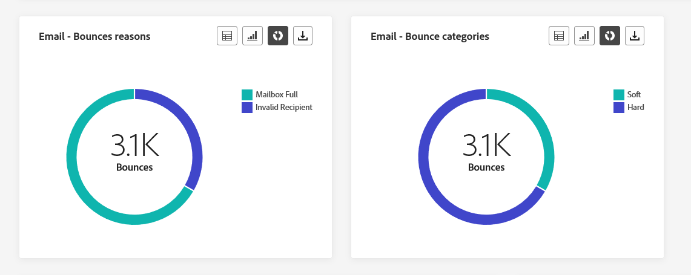

The **[!UICONTROL Email - Bounce Reasons]** and **[!UICONTROL Email - Bounce categories]** widgets compile the available data related to bounced messages, providing detailed insights into the specific reasons and categories behind email bounces.

For more information on bounces, refer to the [Suppression list](../reports/suppression-list.md) page.

+++ Learn more on Email - Bounce categories metrics

* **[!UICONTROL Hard bounce]**: The total number of permanent errors, such as a wrong email address. This involves an error message that explicitly states that the address is invalid, such as Unknown user.

* **[!UICONTROL Soft bounce]**: The total number of temporary errors, such as a a full inbox.

* **[!UICONTROL Ignored]**: The total number of temporary, such as Out of office, or a technical error, for example if the sender type is postmaster.

+++

### Email - Error reasons {#errors-email}

>[!CONTEXTUALHELP]
>id="ajo_campaign_global_email_error_reasons"
>title="Email - Error reasons"
>abstract="The Email - Error reasons graphs and table enable you to identify the specific errors that occurred during the sending process."

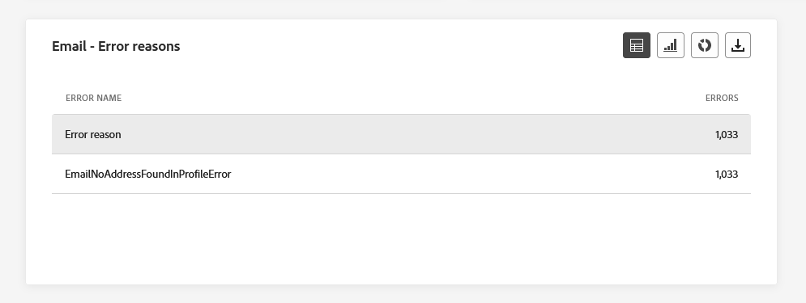

The **[!UICONTROL Error Reasons]** graphs and table offer visibility into the specific errors that occurred during the sending process, providing valuable information on the nature and occurrence of errors.

You can choose to switch from a table, bar chart, or donut.

### Email - Excluded reasons {#excluded-email}

>[!CONTEXTUALHELP]
>id="ajo_campaign_global_email_excluded_reasons"
>title="Email - Excluded reasons"
>abstract="The Excluded Reasons graphs and table illustrate the various factors that led to user profiles, excluded from the targeted audience, not receiving the message."

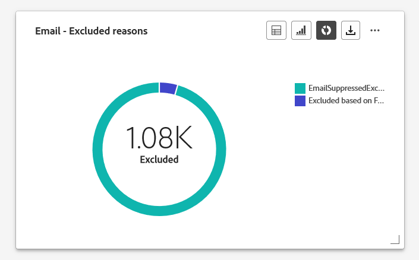

The **[!UICONTROL Excluded reasons]** graphs and table present a comprehensive view of the different factors that resulted in the exclusion of user profiles from the targeted audience, resulting in the message not being received.

Refer to [this page](exclusion-list.md) for the comprehensive list of exclusion reasons.

### Sent & delivered by domains {#sent-domains}

The  **[!UICONTROL Sent & delivered by domains]** table and graph provide a detailed breakdown of emails at the domain level, offering comprehensive insights into the performance of your emails.

+++ Learn more on Sent & delivered by domains metrics

* **[!UICONTROL Sent]**: Total number of sends for your email.

* **[!UICONTROL Delivered]**: Number of emails successfully sent, in relation to the total number of sent emails.

+++

### Bounces & errors by domains {#bounces-domains}

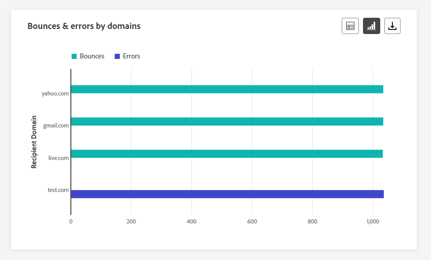

The  **[!UICONTROL Bounces & errors by domains]** graph and table offer a domain-level breakdown of specific errors encountered during the sending process, providing a detailed analysis of issues that occurred.

+++ Learn more on Bounces & errors by domains metrics

* **[!UICONTROL Bounces]**: Total of errors cumulated during the sending process and automatic return processing in relation to the total number of sent emails.

* **[!UICONTROL Errors]**: Total number of errors that occurred during the sending process preventing your email from being sent to profiles.

+++

### Open & clicks by domains {#opens-domains}

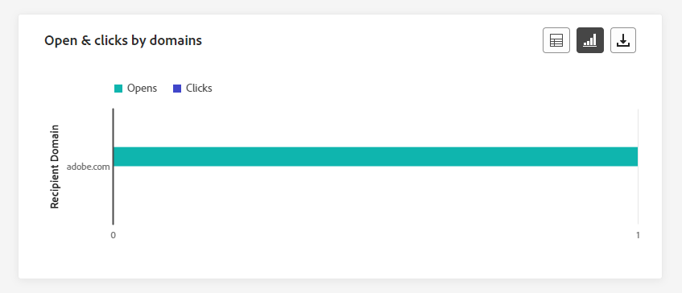

The  **[!UICONTROL Open & clicks by domains]** graph and table showcase a domain-level breakdown of your profiles' engagement with your email, providing valuable insights into how different domains interact with your content.

+++ Learn more on Open & clicks by domains metrics

* **[!UICONTROL Opens]**: Number of times the email was opened.

* **[!UICONTROL Clicks]**: Number of times a content was clicked on in an email.

+++

### Bounce reasons by domain {#bounce-reasons-domains}

The  **[!UICONTROL Bounce reasons by domain]** graph and table offer a domain-level breakdown of data concerning both temporary and permanent errors, providing detailed insights into the reasons behind bounced messages.

+++ Learn more on Bounce reasons by domain metrics

* **[!UICONTROL Opens]**: Number of times the email was opened.

* **[!UICONTROL Clicks]**: Number of times a content was clicked on in an email.

+++

### Email - Top URL {#top-url-email}

>[!CONTEXTUALHELP]
>id="ajo_campaign_global_email_top_url"
>title="Email - Top URL"
>abstract="The Email - Top URL graph and table offer a comprehensive overview of the URLs within your email that receive the highest visitor traffic, allowing you to identify the most popular links."

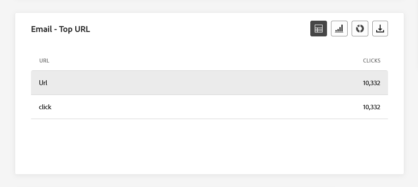

The **[!UICONTROL Email - Top Url]** graph and table provide a comprehensive overview of the URLs within your email that attract the highest visitor traffic. This enables you to identify and prioritize the most popular links, enhancing your understanding of profile engagement with specific content in your emails.

### Email - Best recipient domain {#top-recipient-email}

>[!CONTEXTUALHELP]
>id="ajo_campaign_global_email_best_recipient"
>title="Email - Best recipient domain"
>abstract="The Email - Best recipient domain graph and table provide a detailed breakdown of the domains that recipients most frequently use to open the email, offering valuable insights into recipient behavior."

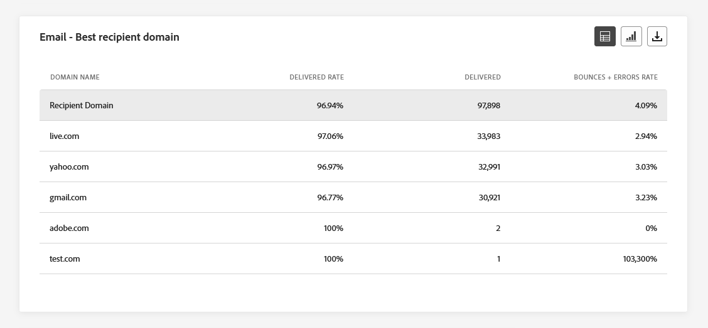

>[!CAUTION]
>
> The **[!UICONTROL Email - Best recipient domain]** widget has an accuracy rate of 99.95%.

The **[!UICONTROL Email - Best recipient domain]** graph and table offer a detailed breakdown of the domains that profiles most frequently use to open your emails. This provides valuable insights into profile behavior, helping you understand preferred platforms.

+++ Learn more on Email - Best recipient domain metrics

* **[!UICONTROL Delivered]**: Number of emails successfully sent, in relation to the total number of sent emails.

* **[!UICONTROL Delivery Rate]**: Percentage of emails successfully sent.

* **[!UICONTROL Bounces + Errors Rate]**: Percentage of emails that bounced compared to emails sent.

+++

### Email - Optimization {#optimized-email}

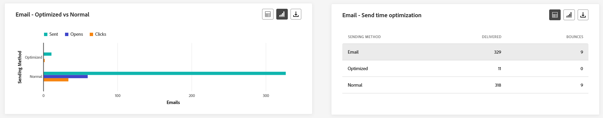

>[!NOTE]
>
>The **[!UICONTROL Optimized vs non optimized]** and **[!UICONTROL Send time optimization]**  widgets are only available if the Send-Time Optimization option is activated for your email. For more information on Send-Time Optimization, refer to [this page](../building-journeys/journeys-message.md#send-time-optimization).

The **[!UICONTROL Optimized vs non optimized]** and **[!UICONTROL Send time optimization]** widgets details the main information relative to your message whether they are optimized or not.

+++ Learn more on Send time optimization metrics

* **[!UICONTROL Sent]**: Total number of sends.

* **[!UICONTROL Opens]**: Number of times the message was opened.

* **[!UICONTROL Clicks]**: Number of times a content was clicked in an email.

* **[!UICONTROL Delivered]**: Number of messages successfully sent, in relation to the total number of sent messages.

* **[!UICONTROL Bounces]**: Total of errors cumulated during the sending process and automatic return processing in relation to the total number of sent messages.

+++

### Email - Offers {#email-offers}

The **[!UICONTROL Offers statistics]**, **[!UICONTROL Offers statistics over time]** and **[!UICONTROL Offers detailed statistic]** widgets measure your offer's success and impact on your targeted audience.

+++ Learn more on Email - Offers metrics

* **[!UICONTROL Offer sent]**: Total number of sends for the offer.

* **[!UICONTROL Offer impression]**: Number of times the offer was opened in your emails.

* **[!UICONTROL Offer clicks]**: Number of times an offer was clicked on in your emails.

* **[!UICONTROL Placement name]**: Name of your placement used to display your offer. For more information on placement, refer to this [page](../offers/offer-library/creating-placements.md).

* **[!UICONTROL Offer name]**: Name of the offer added in the delivery. For more information on placement, refer to this [page](../offers/offer-library/creating-personalized-offers.md).

* **[!UICONTROL Offer sent]**: Total number of sends for the offer.

* **[!UICONTROL Offer impression rate]**: Percentage of opened offers compared to the number of sent offers.

+++

## In-app tab {#inapp-global}

From your Campaign **[!UICONTROL Global report]**, the **[!UICONTROL In-app]** tab details the main information relative to the In-app messages sent in your campaign.

### In-app performance {#in-app-performance}

>[!CONTEXTUALHELP]
>id="ajo_campaign_global_inapp_performance"
>title="In-app performance"
>abstract="The In-app performance KPIs provide essential insights into your visitors' engagement with In-app messages."

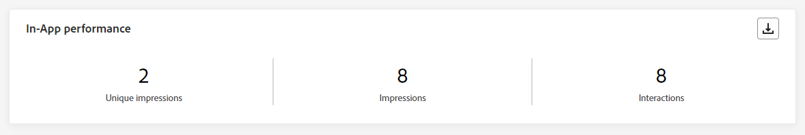

The **[!UICONTROL In-app performance]** KPIs provide essential insights into your visitors' engagement with In-app messages, providing essential metrics to assess the effectiveness and impact of your In-app campaigns.

+++ Learn more on In-app performance metrics

* **[!UICONTROL Unique impressions]**: number of unique users to whom the In-app message was delivered.

* **[!UICONTROL Impressions]**: total number of In-app messages delivered to all users.

* **[!UICONTROL Interactions]**: total number of engagements with your In-app message. This includes any actions taken by the users, such as clicks, dismissals, or any other interactions.

+++

### Interactions by type {#interactions-type}

>[!CONTEXTUALHELP]
>id="ajo_campaign_global_inapp_interactions"
>title="Interactions by type"
>abstract="The Interactions by type graphs and table details how users interacted with your in-app message by tracking any click, dismiss, or interaction."

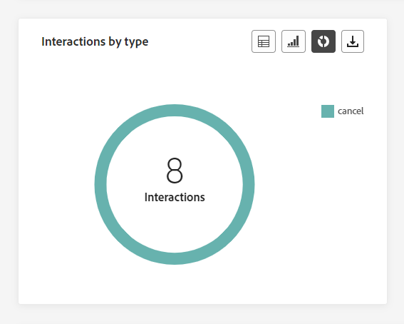

The **[!UICONTROL Interactions by type]** graphs and table provide a detailed account of how profiles interacted with your In-app message, tracking actions such as clicks, dismissals, or any other forms of engagement.

### In-app summary {#in-app-summary}

>[!CONTEXTUALHELP]
>id="ajo_campaign_global_inapp_summary"
>title="In-app summary"
>abstract="The In-app summary graph illustrates the progression of your In-app impressions and interactions over the specified period."

The **[!UICONTROL In-app summary]** graph illustrates the progression of your In-app impressions and interactions over the specified period, providing a comprehensive overview of your In-app messages performance.

+++ Learn more on In-app summary metrics

* **[!UICONTROL Unique impressions]**: number of unique users to whom the In-app message was delivered.

* **[!UICONTROL Impressions]**: total number of In-app messages delivered to all users.

* **[!UICONTROL Interactions]**: total number of engagements with your In-app message. This includes any actions taken by the users, such as clicks, dismissals, or any other interactions.

+++

## Push notification tab {#push-global}

From your Campaign **[!UICONTROL Global report]**, the **[!UICONTROL Push notification]** tab details the main information relative to the push notifications sent in your campaign.

### Push notification - Sending statistics {#push-sending-statistics}

>[!CONTEXTUALHELP]
>id="ajo_campaign_global_push_sending_statistics"
>title="Push notification - Sending statistics"
>abstract="The Push Notification Sending Statistics table summarizes essential data about your push notifications such as Targeted or Delivered messages."

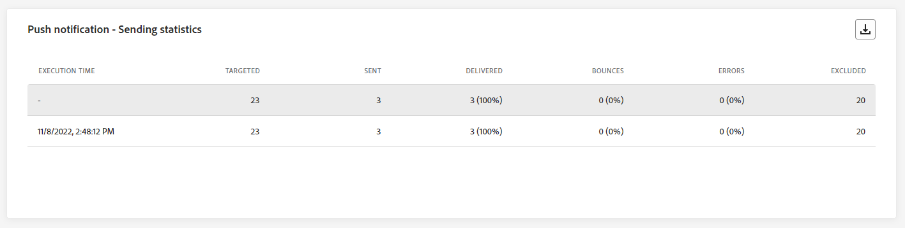

The **[!UICONTROL Push notification - Sending statistics]** table provides a concise summary of essential data related to your push notifications, including key metrics such as the number of targeted messages and number of successfully delivered messages.

+++ Learn more on Push notification - Sending statistics metrics

* **[!UICONTROL Execution time]**: Start time of every execution of your recurring push notification. To target only one or multiple recurring push notifications, select it from the **[!UICONTROL Execution time]** drop-down. 

* **[!UICONTROL Targeted]**: Total number of push notifications processed during the analysis.

* **[!UICONTROL Sent]**: Total number of sends for the push notification.

* **[!UICONTROL Delivered]**: Number of push notifications successfully sent, in relation to the total number of sent push notifications.

* **[!UICONTROL Delivery Rate]**: Percentage of push notifications successfully sent.

* **[!UICONTROL Bounces]**: Total of errors cumulated during the sending process and automatic return processing in relation to the total number of push notifications.

* **[!UICONTROL Bounce Rate]**: Percentage of push notifications that bounced compared to push notifications sent.

* **[!UICONTROL Errors]**: Total number of errors that occurred preventing it from being sent to profiles.

* **[!UICONTROL Error Rate]**: Percentage of errors that occurred during preventing it from being sent compared to push notifications sent.

* **[!UICONTROL Excluded]**: Number of profiles which have been excluded by Adobe Journey Optimizer.

+++

### Push notification - Tracking statistics {#push-tracking-statistics}

>[!CONTEXTUALHELP]
>id="ajo_campaign_global_push_tracking_statistics"
>title="Push notification - Tracking statistics"
>abstract="The Push Tracking Statistics provide data on profile activity for your push notification."

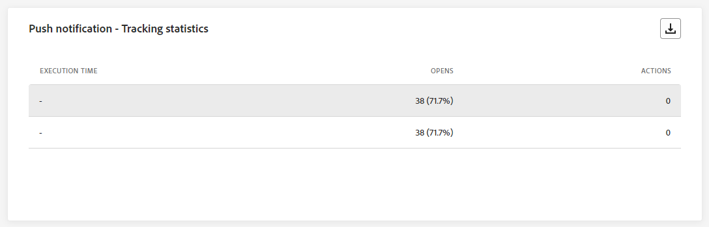

The **[!UICONTROL Push notification- Tracking statistics]** widget offers a detailed snapshot of profile activity tied to your push notifications, providing essential insights into engagement and push notifications effectiveness.

+++ Learn more on Push notification - Tracking statistics metrics

* **[!UICONTROL Execution time]**: Start time of every execution of your recurring push notification. To target only one or multiple recurring push notifications, select it from the **[!UICONTROL Execution time]** drop-down. 

* **[!UICONTROL Opens]**: Number of times your push notification was opened.

* **[!UICONTROL Actions]**: Total number of actions on the push notification delivered, e.g. button click or dismissal.

+++

### Push notification - Sending summary {#push-summary}

>[!CONTEXTUALHELP]
>id="ajo_campaign_global_push_sending_summary"
>title="Push notification - Sending summary"
>abstract="The Push Notification Sending Summary graph displays the data available for sent push notifications."

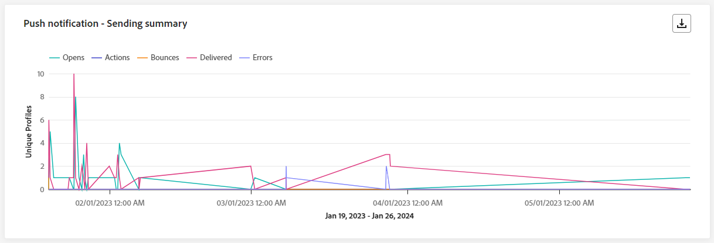

The **[!UICONTROL Push notification - Sending summary]** graph offers a dynamic representation, displaying an analysis of your push notifications activity. This graphical representation provides a comprehensive breakdown of sent push notifications.

+++ Learn more on Push notification - Sending summary metrics

* **[!UICONTROL Opens]**: Number of times your push notification was opened.

* **[!UICONTROL Actions]**: Total number of actions on the push notification delivered, e.g. button click or dismissal.

* **[!UICONTROL Bounces]**: Total of errors cumulated and automatic return processing in relation to the total number of sent push notifications.

* **[!UICONTROL Delivered]**: Number of push notifications successfully sent, in relation to the total number of sent push notifications.

* **[!UICONTROL Errors]**: Total number of errors that occurred preventing it from being sent to profiles.

+++

### Push notification - Optimization {#push-optimized}

>[!NOTE]
>
>The **[!UICONTROL Optimized vs non optimized]** and **[!UICONTROL Send time optimization]**  widgets are only available if the Send-Time Optimization option is activated for your push notification. For more information on Send-Time Optimization, refer to [this page](../building-journeys/journeys-message.md#send-time-optimization).

The **[!UICONTROL Optimized vs non optimized]** and **[!UICONTROL Send time optimization]** widgets details the main information relative to your message whether they are optimized or not.

+++ Learn more on Push notification - Send time optimization metrics

* **[!UICONTROL Delivered]**: Number of push notifications successfully sent, in relation to the total number of sent push notifications.

* **[!UICONTROL Opens]**: Number of times your push notification was opened.

* **[!UICONTROL Actions]**: Total number of actions on the push notification delivered, e.g. button click or dismissal.

* **[!UICONTROL Bounces]**: Total of errors cumulated during the sending process and automatic return processing in relation to the total number of sent push notifications.

+++

### Push notification - Error reasons {#error-reasons-push}

>[!CONTEXTUALHELP]
>id="ajo_campaign_global_push_error_reasons"
>title="Push notification - Error reasons"
>abstract="The Error Reasons graphs and table enable you to identify the specific errors that occurred during the sending process."

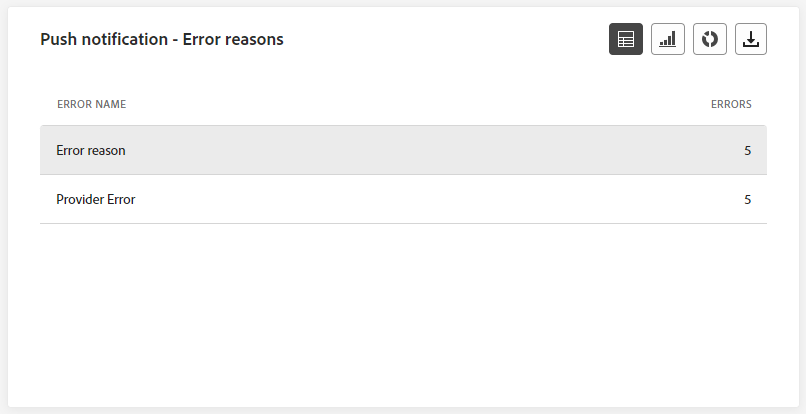

The **[!UICONTROL Error Reasons]** table and graphs provide you with the capability to identify the specific errors that occurred during the sending process of your push notifications, offering detailed insights into any issues encountered along the way.

### Push notification - Excluded reasons {#excluded-push}

>[!CONTEXTUALHELP]
>id="ajo_campaign_global_push_excluded_reasons"
>title="Push notification - Excluded reasons"
>abstract="The Excluded Reasons graphs and table illustrate the various factors that led to user profiles, excluded from the targeted audience, not receiving the message."

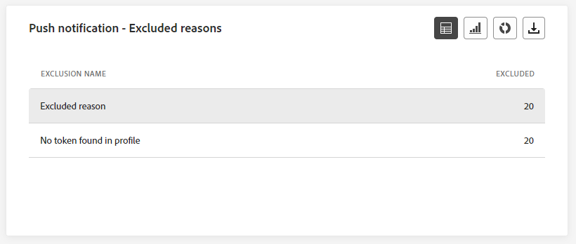

The **[!UICONTROL Excluded reasons]** graphs and table display the different reasons that prevented user profiles, excluded from the targeted profiles, from receiving your push notifications.

Refer to [this page](exclusion-list.md) for the comprehensive list of exclusion reasons.

### Push notification - Breakdown by platform {#breakdown-platform-push}

>[!CONTEXTUALHELP]
>id="ajo_campaign_global_push_breakdown_platform"
>title="Push notification - Breakdown by platform"
>abstract="The Breakdown by Platform graphs and table provide a breakdown of the success of your push notifications based on the profile's operating system."

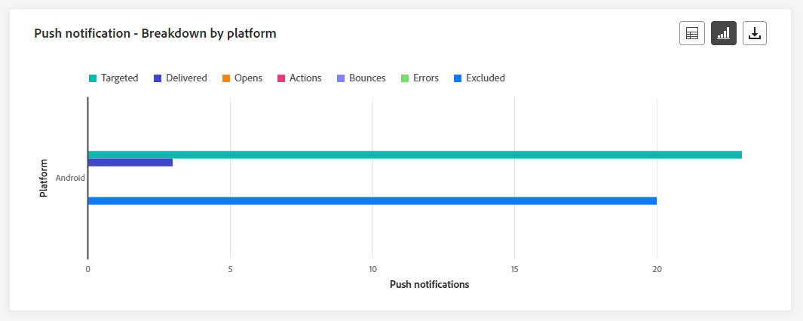

The **[!UICONTROL Push notification - Breakdown by platform]** graph and table provide a detailed analysis of the success of your push notifications, offering insights based on your profile's operating system. This breakdown enhances your understanding of how well your push notifications perform across different platforms.

+++ Learn more on Push notification - Breakdown by platform metrics

* **[!UICONTROL Targeted]**: Total number of push notifications processed during the analysis.

* **[!UICONTROL Delivered]**: Number of push notifications successfully sent, in relation to the total number of sent push notifications.

* **[!UICONTROL Opens]**: Number of times your push notification was opened.

* **[!UICONTROL Actions]**: Total number of actions on the push notification delivered, e.g. button click or dismissal.

* **[!UICONTROL Bounces]**: Total of errors cumulated and automatic return processing in relation to the total number of sent push notifications.

* **[!UICONTROL Errors]**: Total number of errors that occurred preventing it from being sent to profiles.

* **[!UICONTROL Excluded]**: Number of profiles which have been excluded by Adobe Journey Optimizer.

+++

## SMS tab {#sms-global}

From your Campaign **[!UICONTROL Global report]**, the **[!UICONTROL SMS]** tab details the main information relative to the SMS messages sent in your campaign.

### SMS - Sending statistics {#sms-sending-statistics}

>[!CONTEXTUALHELP]
>id="ajo_campaign_global_sms_sending_statistics"
>title="SMS - Sending statistics"
>abstract="The SMS Sending Statistics table summarizes essential data about your SMS messages such as Targeted or Delivered messages."

The **[!UICONTROL SMS - Sending statistics]** table provides a concise summary of essential data related to your SMS messages, encompassing key metrics such as the number of targeted messages and the count of successfully delivered messages.

+++ Learn more on SMS - Sending statistics metrics

* **[!UICONTROL Execution time]**: Start time of every execution of your recurring SMS message. To target only one or multiple recurring SMS messages, select it from the **[!UICONTROL Execution time]** drop-down. 

* **[!UICONTROL Targeted]**: Number of user profiles who qualify as target profiles.

* **[!UICONTROL Excluded]**: Number of user profiles, excluded from the targeted profiles, who did not receive the message.

* **[!UICONTROL Sent]**: Total number of sends for your SMS messages.

* **[!UICONTROL Bounces]**: Total of errors cumulated during the sending process and automatic return processing in relation to the total number of sent SMS messages.

* **[!UICONTROL Errors]**: Total number of errors that occurred preventing it from being sent to profiles.

+++

### SMS - Tracking statistics {#sms-tracking-statistics}

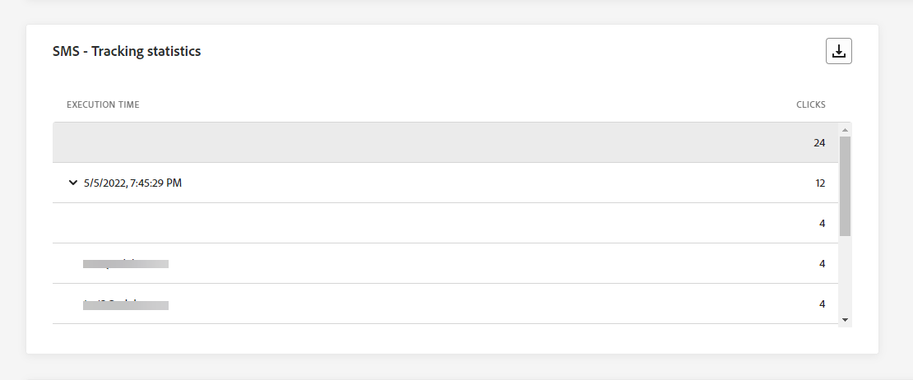

The **[!UICONTROL SMS - Tracking statistics]** widget provides a detailed overview of key information related to your visitors' engagement with your URLs, offering insights into the effectiveness of your SMS messages.

+++ Learn more on SMS - Tracking statistics metrics

* **[!UICONTROL Execution time]**: Start time of every execution of your recurring SMS. To target only one or multiple recurring SMS, select it from the **[!UICONTROL Execution time]** drop-down. 

* **[!UICONTROL Clicks]**: Number of times a content was clicked in an SMS message.

+++

### SMS - Performance by date {#sms-perfomance-date}

>[!CONTEXTUALHELP]
>id="ajo_campaign_global_sms_performance"
>title="SMS - Performance by date"
>abstract="The SMS Performance by Date widget provides key information about your messages through a graphical representation."

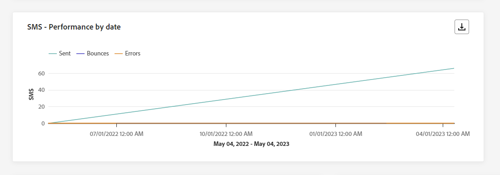

The **[!UICONTROL SMS Performance by date]** widget offers a detailed overview of key information related to your messages, presented through a graph, providing insights into the performance trends over specific time periods.

+++ Learn more on SMS - Performance by date metrics

* **[!UICONTROL Sent]**: Total number of sends for your SMS messages.

* **[!UICONTROL Bounces]**: Total of errors cumulated during the sending process and automatic return processing in relation to the total number of sent SMS messages.

* **[!UICONTROL Errors]**: Total number of errors that occurred preventing it from being sent to profiles.

+++

### SMS - Error reasons {#sms-error}

>[!CONTEXTUALHELP]
>id="ajo_campaign_global_sms_error_reasons"
>title="SMS - Error reasons"
>abstract="The SMS - Error Reasons graphs and table enable you to identify the specific errors that occurred during the sending process."

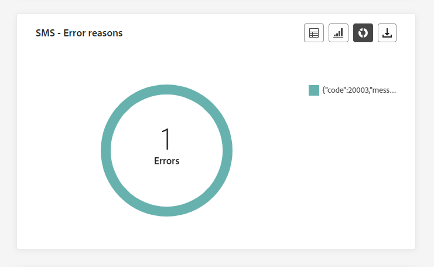

The **[!UICONTROL Error Reasons]** graphs and table allow you to identify the specific errors that occurred during the sending process of your SMS messages, facilitating a thorough analysis of any issues encountered.

### SMS - Excluded reasons {#sms-excluded-reasons}

>[!CONTEXTUALHELP]
>id="ajo_campaign_global_sms_excluded_reasons"
>title="SMS - Excluded reasons"
>abstract="The Excluded Reasons graphs and table illustrate the various factors that led to user profiles, excluded from the targeted audience, not receiving the message."

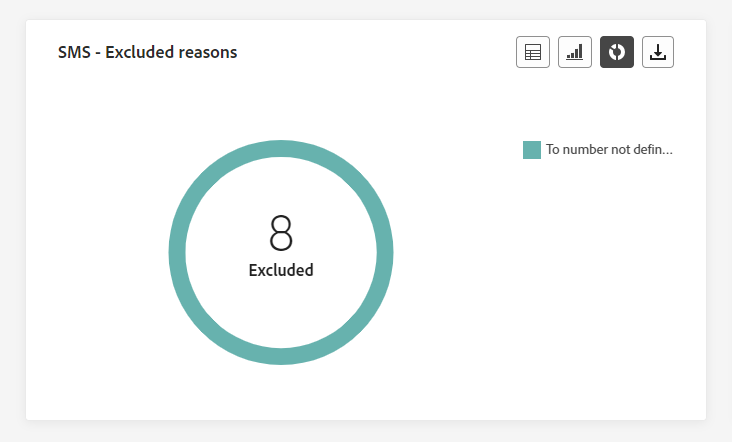

The **[!UICONTROL Excludes Reasons]** graphs and table visually depict the diverse factors that led to the exclusion of user profiles from the targeted audience, preventing them from receiving your SMS messages.

Refer to [this page](exclusion-list.md) for the comprehensive list of exclusion reasons.

### SMS - Bounces reasons {#sms-bounces-reasons}

>[!CONTEXTUALHELP]
>id="ajo_campaign_global_sms_bounces_reasons"
>title="SMS - Bounces reasons"
>abstract="The Bounces Reasons graphs and table contain the data available related to bounced messages."

The **[!UICONTROL Bounces Reasons]** graphs and table provide a comprehensive overview of data related to bounced SMS messages, delivering valuable insights into the specific reasons behind instances of SMS message bounces.

### SMS - Clicks by links {#sms-clicks-links}

>[!CONTEXTUALHELP]
>id="ajo_campaign_global_sms_clicks_links"
>title="SMS - Clicks by links"
>abstract="The SMS - Clicks by Links widget provides essential insights into your visitors' engagement with the URLs in your messages"

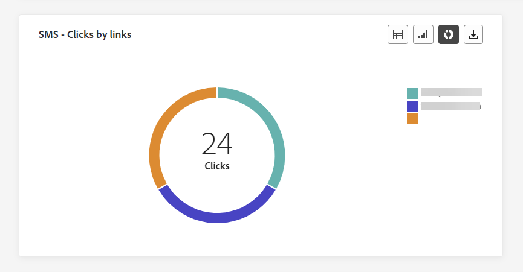

The **[!UICONTROL SMS - Clicks by links]** widget offers essential insights into your visitors' engagement with the URLs included in your messages, providing valuable information about which links attract the most interaction.

## Web tab {#web-tab}

From your Campaign **[!UICONTROL Global report]**, the **[!UICONTROL Web]** tab details the main information relative to your Web pages.

### Web performance {#web-performance}

>[!CONTEXTUALHELP]
>id="ajo_campaign_global_web_performance"
>title="Web performance"
>abstract="The Web Performance KPIs provide comprehensive information about your visitors' engagement with your web experiences."

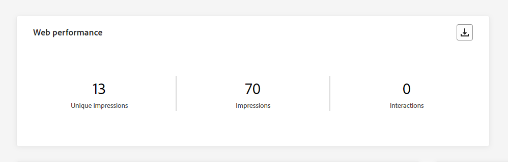

The **[!UICONTROL Web performance]** KPIs offer comprehensive insights into your visitors' engagement with your web pages, encompassing key metrics such as Impressions and Interactions.

+++ Learn more on Web performance metrics

* **[!UICONTROL Unique impressions]**: number of unique users to whom the web experience was delivered.

* **[!UICONTROL Impressions]**: total number of web experiences delivered to all users.

* **[!UICONTROL Interaction rate]**: percentage of engagements with your Web page. This includes any actions taken by the users, such as clicks or any other interactions.

+++

### Web summary {#web-summary}

>[!CONTEXTUALHELP]
>id="ajo_campaign_global_web_summary"
>title="Web summary"
>abstract="The Web Summary graph illustrates the progression of your web experiences, including impressions, unique impressions, and interactions, over the specified period."

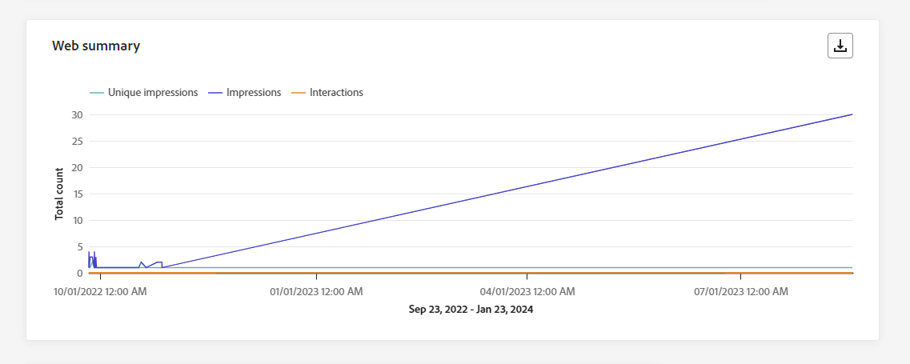

The **[!UICONTROL Web summary]** graph shows the evolution of your web experiences (impressions, unique impressions and interactions) for the concerned period.

+++ Learn more on Web summary metrics

* **[!UICONTROL Unique impressions]**: number of unique users to whom the web experience was delivered.

* **[!UICONTROL Impressions]**: total number of web experiences delivered to all users.

* **[!UICONTROL Interaction]**: total number of engagements with your Web page. This includes any actions taken by the users, such as clicks or any other interactions.

+++

### Interactions by element {#web-interactions}

>[!CONTEXTUALHELP]
>id="ajo_campaign_global_web_interactions"
>title="Interactions by element"
>abstract="The Interactions by Element table provides key information regarding your visitors' engagement with different elements on your web pages."

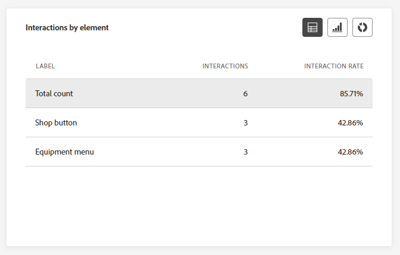

The **[!UICONTROL Interactions by element]** table presents comprehensive information regarding your visitors' engagement with the various elements on your web pages, offering valuable insights into user interactions and preferences.

+++ Learn more on Interactions by element metrics

* **[!UICONTROL Interaction]**: total number of engagements with your Web page. This includes any actions taken by the users, such as clicks or any other interactions.

* **[!UICONTROL Interaction rate]**: percentage of engagements with your Web page. This includes any actions taken by the users, such as clicks or any other interactions.

+++

## Direct mail tab {#direct-mail-global}

From your Campaign **[!UICONTROL Global report]**, the **[!UICONTROL Direct mail]** tab details the main information relative to your Direct mail messages.

### Direct Mail - Sending statistics {#direct-mail-sending-statistics}

>[!CONTEXTUALHELP]
>id="ajo_campaign_global_direct_sending_statistics"
>title="Direct Mail - Sending statistics"
>abstract="The Direct Mail Sending Statistics table summarizes essential data about your Direct Mail messages such as Targeted or Delivered messages."

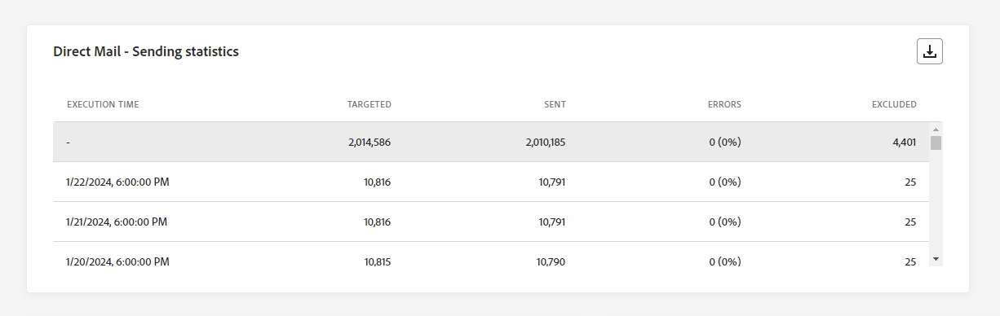

The **[!UICONTROL Direct Mail - Sending statistics]** table provides a concise summary of essential data related to your Direct Mail messages, encompassing key metrics such as the number of targeted messages and the count of successfully delivered messages.

+++ Learn more on Direct Mail - Sending statistics metrics

* **[!UICONTROL Execution time]**: Start time of every execution of your recurring Direct mail. To target only one or multiple recurring Direct mail, select it from the **[!UICONTROL Execution time]** drop-down. 

* **[!UICONTROL Targeted]**: Number of user profiles who qualify as target profiles for your direct mail messages.

* **[!UICONTROL Sent]**: Total number of sends for your direct mail messages.

* **[!UICONTROL Errors]**: Total number of errors that occurred during the sending process preventing it from being sent to profiles.

* **[!UICONTROL Excluded]**: Number of user profiles, excluded from the targeted profiles, who did not receive your direct mail messages.

+++

### Direct Mail - Error reasons {#direct-mail-error}

>[!CONTEXTUALHELP]
>id="ajo_campaign_global_direct_error_reasons"
>title="Direct Mail - Error reasons"
>abstract="The Direct Mail - Error Reasons graphs and table enable you to identify the specific errors that occurred during the sending process."

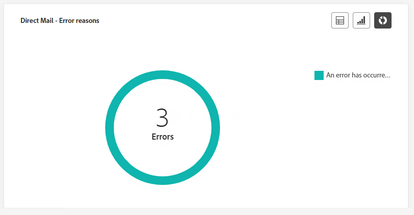

The **[!UICONTROL Direct Mail - Error reasons]** graphs and table provide the means to identify specific errors that occurred during the sending process of your direct mail messages, allowing for a detailed analysis of any issues encountered.

### Direct Mail - Excluded reasons {#direct-mail-excluded}

>[!CONTEXTUALHELP]
>id="ajo_campaign_global_direct_excluded_reasons"
>title="Direct Mail - Excluded reasons"
>abstract="The Direct Mail Excluded Reasons graphs and table illustrate the various factors that led to user profiles, excluded from the targeted audience, not receiving the message."

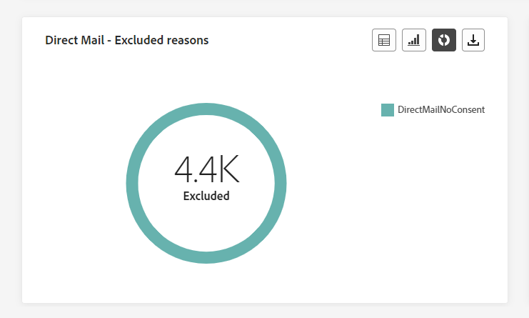

The **[!UICONTROL Direct Mail - Excluded reasons]** graphs and table visually illustrate the various factors that resulted in the exclusion of user profiles from the targeted audience, preventing them from receiving your direct mail messages.

Refer to [this page](exclusion-list.md) for the comprehensive list of exclusion reasons.

## Additional resources

* [Get started with campaigns](../campaigns/get-started-with-campaigns.md)
* [Create a campaign](../campaigns/create-campaign.md)
* [Create API-triggered campaigns](../campaigns/api-triggered-campaigns.md)
* [Modify or stop a campaign](../campaigns/modify-stop-campaign.md)
* [Campaign live report](campaign-live-report.md)
