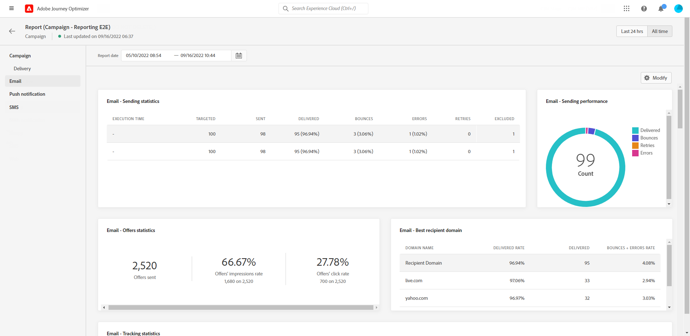
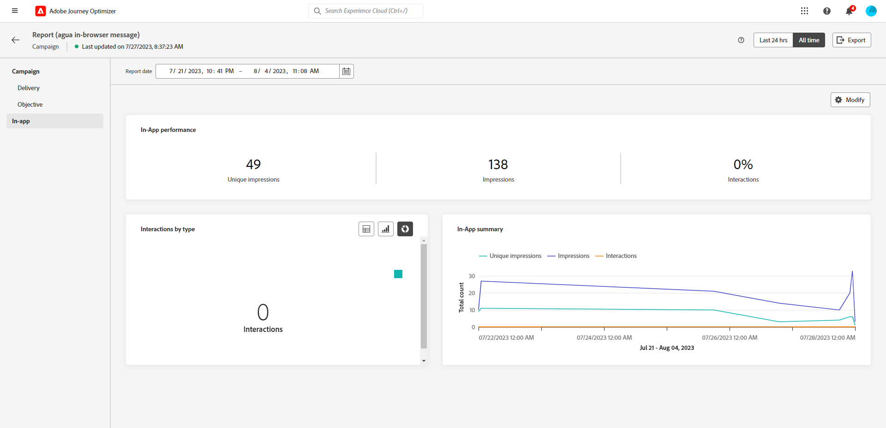
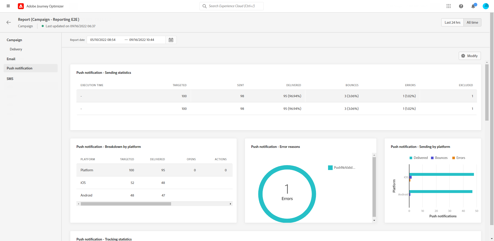
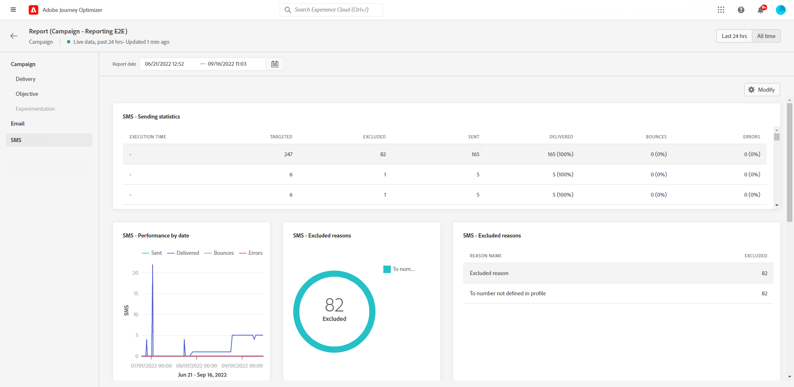
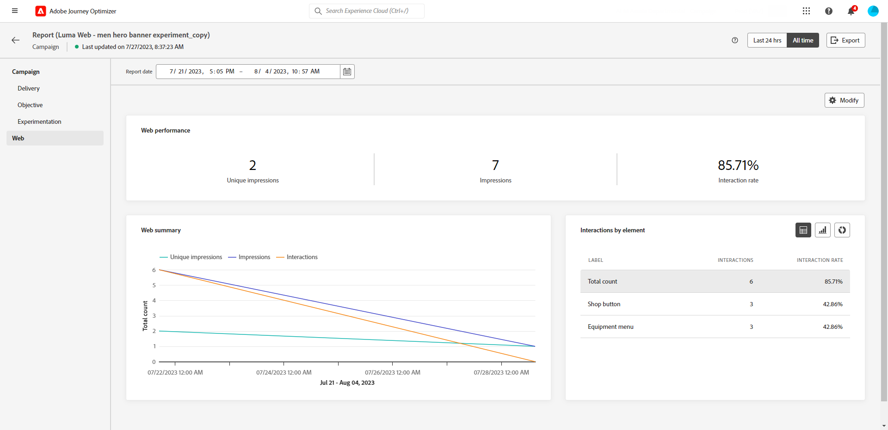

# Campaign global report {#campaign-global-report}

>[!CONTEXTUALHELP]
>id="ajo_campaign_global_report"
>title="Campaign global report"
>abstract="The Campaign global report allows to measure the impact of your campaigns over a selected time period. Your report is divided into different widgets detailing your campaign's success and errors. Each reporting dashboard can be modified by resizing or removing widgets."

Global reports, accessible from the **All time** tab, display events that occurred at least two hours ago and cover events over a selected time period. In comparison, Live reports focus on events that took place within the past 24 hours, with a minimum time interval of two minutes from the event occurrence. 

Campaign global report can be accessed directly from your Campaign with the **[!UICONTROL View report]** button.

The Campaign **[!UICONTROL Global report]** page will be displayed with the following tabs:

* [Campaign](#campaign-global)
* [Email](#email-global)
* [In-app](#inapp-global)
* [Push](#push-global)
* [SMS](#sms-global)
* [Web](#web-tab)
* [Direct mail](#direct-mail-global)

The Campaign **[!UICONTROL Global report]** is divided into different widgets detailing your campaign's success and errors. Each widget can be resized and deleted if needed. For more information on this, refer to this [section](../reports/global-report.md#modify-dashboard).

For a detailed list of every metric available in Adobe Journey Optimizer, refer to [this page](global-report.md#list-of-components-global.md)

## Campaign tab {#campaign-global}

### Delivery {#delivery-global}

>[!CONTEXTUALHELP]
>id="ajo_campaign_delivery_global"
>title="Campaign's statistics"
>abstract="The Campaign's Statistics widget details the main information relative to your campaign such as Entered profiles and Actions delivered."

The **[!UICONTROL Campaign's Statistics]** widget details the main information relative to your campaign:

* **[!UICONTROL Entered profiles]**: Number of profiles who started the journey.

* **[!UICONTROL Actions delivered]**: Total number of unique times an action in the journey has been delivered.

* **[!UICONTROL Actions failed in %]**: Total number of unique times an action failed in the journey compared to the total number of unique times an action has been delivered.

<!--
### Objectives report {#objectives-global}

The **[!UICONTROL Objectives]** tab allows you to better fine-tune your deliveries' reports by targeting one specific metric.

The **[!UICONTROL Objectives]** listed are linked to **[!UICONTROL Datasets]** that define a connection to a system in order to retrieve additional information. A list of built-in **[!UICONTROL Objectives]** is available but you can add your own by adding new **[!UICONTROL Dataset]**. For the detailed procedure, refer to this [section](../campaigns/reporting-configuration.md).

After selecting the Objectives you want to target on, the two **[!UICONTROL Performance overview]** and **[!UICONTROL Campaign objective]** widgets will provide a detailed summary of your delivery performance. 

With the **[!UICONTROL Campaign objective]** widget, you can also choose to compare your main objective with another metric.
-->

### Experimentation report {#experimentation-global}

>[!CONTEXTUALHELP]
>id="ajo_campaigns_content_experiment_click"
>title="Success metric"
>abstract="The total value of the Success metric, previously selected when creating your Experiments, divided by the number of profiles."

The **[!UICONTROL Experimentation]** tab provides key insights into the performance of each variant, and identifies the most successful one.

Note that defining the best performer might take some time, it will be represented by this icon .

+++Learn more on the different metrics and widgets available for the Experimentation report.

The **[!UICONTROL Experiment result]** widget details the performance of each variant. You can change your baseline by selecting one of the treatment from the **[!UICONTROL Baseline]** the drop-down. The best treatment will be represented with a star icon.

The table presents the following metrics:

* **[!UICONTROL Lift over baseline]**: Measure of the percentage improvement in conversion rate of a given treatment over the baseline.

* **[!UICONTROL Confidence]**: Evidence that a given treatment is the same as the baseline treatment. [Learn more](../campaigns/experiment-calculations.md#understand-confidence)

* **[!UICONTROL Unique outbound clicks]**: Total count of clicks across outbound channels.

* **[!UICONTROL Profiles]**: Number of profiles targeted for this treatment.

* **[!UICONTROL Unique outbound clicks/profiles]**: Total value of the Success metric, previously selected when creating your Experiments, divided by the number of profiles.

The **[!UICONTROL Confidence interval]** graph measures uncertainty around improvement. It details the percentage difference in performance between the baseline and the best performing treatment. [Learn more](../campaigns/experiment-calculations.md#confidence-intervals). 

The last widget provides data related to the **[!UICONTROL Success metric]** you previously selected for your Treatments. You have the option to select a different targeted metric from the **[!UICONTROL Metric]** drop-down menu to track alternative data.
    
>[!CAUTION]
>
>When working with experimentation filtered metrics, please note that changing the Metric selection from the drop-down on the comparison page for experimentation will not retain the filter value. For example, switching from "Clicks" to "Unique clicks" will lead to the loss of the applied filter, rendering the comparison inaccurate or invalid.

+++

For a deep-dive in these results and how to interpret them, refer to [this page](../campaigns/get-started-experiment.md#interpret-results).

## Email tab {#email-global}

From your Campaign **[!UICONTROL Global report]**, the **[!UICONTROL Email]** tab details the main information relative to the email deliveries sent in your Campaign.

+++Learn more on the different metrics and widgets available for the Email report.

The **[!UICONTROL Email Sending Statistics]** graph details the success of your delivery:

* **[!UICONTROL Targeted]**: Total number of messages processed during the delivery analysis.

* **[!UICONTROL Sent]**: Total number of sends for the delivery.

* **[!UICONTROL Delivered]**: Number of messages successfully sent, in relation to the total number of sent messages.

* **[!UICONTROL Delivery Rate]**: Percentage of messages successfully sent.

* **[!UICONTROL Bounces]**: Total of errors cumulated during delivery and automatic return processing in relation to the total number of sent messages.

* **[!UICONTROL Bounce Rate]**: Percentage of emails that bounced compared to emails sent.

* **[!UICONTROL Errors]**: Total number of errors that occurred during a delivery preventing it from being sent to profiles.

* **[!UICONTROL Error Rate]**: Percentage of errors that occurred during a delivery preventing it from being sent compared to emails sent.

* **[!UICONTROL Retries]**: Number of emails in the queue for retries.

* **[!UICONTROL Excluded]**: Number of profiles which have been excluded by Adobe Journey Optimizer.

The **[!UICONTROL Email - Tracking statistics]** widget contains the available data for recipient activity for your delivery:

* **[!UICONTROL Opens]**: Number of times the email was opened.

* **[!UICONTROL Unique Opens]**: Percentage of opened emails.

* **[!UICONTROL Open Rate]**: Total number of opened emails compared to the number of delivered emails.

* **[!UICONTROL Clicks]**: Number of times a content was clicked in an email.

* **[!UICONTROL Unique Clicks]**:Number of recipients who clicked on a content in an email.

* **[!UICONTROL Unique Click Rate]**: Percentage of users who interacted with the delivery.

* **[!UICONTROL Unsubscriptions]**: Number of clicks on the unsubscription link.

* **[!UICONTROL Spam complaints]**: Number of times a message was declared as spam or junk.

The **[!UICONTROL Sending Statistics]** graph contains the data available for sent emails, such as:

* **[!UICONTROL Delivered]**: Number of messages successfully sent, in relation to the total number of sent messages.

* **[!UICONTROL Bounces]**: Total of errors cumulated during delivery and automatic return processing in relation to the total number of sent messages.

* **[!UICONTROL Retries]**: Number of emails in the queue for retries.

* **[!UICONTROL Errors]**: Total number of errors that occurred during a delivery preventing it from being sent to profiles.

The **[!UICONTROL Bounce Reasons]** and **[!UICONTROL Bounce categories]** widgets contain the data available related to bounced messages, such as:

* **[!UICONTROL Hard bounce]**: The total number of permanent errors, such as a wrong email address. This involves an error message that explicitly states that the address is invalid, such as Unknown user.

* **[!UICONTROL Soft bounce]**: The total number of temporary errors, such as a a full inbox.

* **[!UICONTROL Ignored]**: The total number of temporary, such as Out of office, or a technical error, for example if the sender type is postmaster.

For more information on bounces, refer to the [Suppression list](../reports/suppression-list.md) page.

The **[!UICONTROL Error Reasons]** graph and table allow you to see which error occurred during your delivery.

The **[!UICONTROL Excluded reasons]** graph and table display the different reasons that prevented user profiles, excluded from the targeted profiles, from receiving the message.

The **[!UICONTROL Email - Top Url]** graph and table details which URLs from your delivery are the most visited.

The **[!UICONTROL Email - Top recipient domain]** graph and table details which domains are the most used by recipients to open the email.

>[!NOTE]
>
>The **[!UICONTROL Optimized vs non optimized]** and **[!UICONTROL Send time optimization]**  widgets are only available if the Send-Time Optimization option is activated for your delivery. For more information on Send-Time Optimization, refer to [this page](../building-journeys/journeys-message.md#send-time-optimization).

The **[!UICONTROL Optimized vs non optimized]** graph details the main information relative to your message whether they are optimized or not:

* **[!UICONTROL Sent]**: Total number of sends for the delivery.

* **[!UICONTROL Opens]**: Number of times the message was opened.

* **[!UICONTROL Clicks]**: Number of times a content was clicked in an email.

The **[!UICONTROL Send time optimization]** details the success of your delivery depending on the sending method: optimized or normal.

* **[!UICONTROL Delivered]**: Number of messages successfully sent, in relation to the total number of sent messages.
* **[!UICONTROL Bounces]**: Total of errors cumulated during delivery and automatic return processing in relation to the total number of sent messages.
+++

## In-app tab {#inapp-global}

>[!CONTEXTUALHELP]
>id="ajo_campaign_global_inapp_performance"
>title="In-app performance"
>abstract="The In-app performance KPIs provide essential insights into your visitors' engagement with In-app messages."

>[!CONTEXTUALHELP]
>id="ajo_campaign_global_inapp_interactions"
>title="Interactions by type"
>abstract="The Interactions by type graphs and table details how users interacted with your in-app message by tracking any click, dismiss, or interaction."

>[!CONTEXTUALHELP]
>id="ajo_campaign_global_inapp_summary"
>title="In-app summary"
>abstract="The In-app summary graph illustrates the progression of your In-app impressions and interactions over the specified period."

From your Campaign **[!UICONTROL Global report]**, the **[!UICONTROL In-app]** tab details the main information relative to the In-app deliveries sent in your campaign.

+++Learn more on the different metrics and widgets available for the In-app report.

The **[!UICONTROL In-app performance]** KPIs detail the main information relative to your visitors' engagement with your In-app messages, such as:

* **[!UICONTROL Unique impressions]**: number of unique users to whom the In-app message was delivered.

* **[!UICONTROL Impressions]**: total number of In-app messages delivered to all users.

* **[!UICONTROL Interactions rate]**: percentage of engagements with your In-app message. This includes any actions taken by the users, such as clicks, dismissals, or any other interactions.

The **[!UICONTROL Interactions by type]** graphs and table details how users interacted with your in-app message by tracking any click, dismiss, or interaction.

The **[!UICONTROL In-app summary]** graph shows the evolution of your In-app impressions and interactions for the concerned period.
+++

## Push notification tab {#push-global}

>[!CONTEXTUALHELP]
>id="ajo_campaign_global_push_sending_statistics"
>title="Push notification - Sending statistics"
>abstract="The Push Notification Sending Statistics table summarizes essential data about your push notifications such as Targeted or Delivered messages."

>[!CONTEXTUALHELP]
>id="ajo_campaign_global_push_tracking_statistics"
>title="Push notification - Tracking statistics"
>abstract="The Push Tracking Statistics provide data on recipient activity for your delivery."

>[!CONTEXTUALHELP]
>id="ajo_campaign_global_push_sending_summary"
>title="Push notification - Sending summary"
>abstract="The Push Notification Sending Summary graph displays the data available for sent push notifications."

>[!CONTEXTUALHELP]
>id="ajo_campaign_global_push_excluded_reasons"
>title="Push notification - Excluded reasons"
>abstract="The Excluded Reasons graphs and table illustrate the various factors that led to user profiles, excluded from the targeted audience, not receiving the message."

>[!CONTEXTUALHELP]
>id="ajo_campaign_global_push_error_reasons"
>title="Push notification - Error reasons"
>abstract="The Error Reasons graphs and table enable you to identify the specific errors that occurred during your delivery."

>[!CONTEXTUALHELP]
>id="ajo_campaign_global_push_breakdown_platform"
>title="Push notification - Breakdown by platform"
>abstract="The Breakdown by Platform graphs and table provide a breakdown of the success of your push notifications based on the recipient's operating system."

From your Campaign **[!UICONTROL Global report]**, the **[!UICONTROL Push notification]** tab details the main information relative to the push deliveries sent in your campaign.

The In-app performance KPIs detail the main information relative to your visitors' engagement with your In-app messages.

+++Learn more on the different metrics and widgets available for the Push report.

The **[!UICONTROL Push notification - Sending statistics]** table details the main information relative to your push notifications

* **[!UICONTROL Targeted]**: Total number of messages processed during the delivery analysis.

* **[!UICONTROL Sent]**: Total number of sends for the delivery.

* **[!UICONTROL Delivered]**: Number of messages successfully sent, in relation to the total number of sent messages.

* **[!UICONTROL Delivery Rate]**: Percentage of messages successfully sent.

* **[!UICONTROL Bounces]**: Total of errors cumulated during delivery and automatic return processing in relation to the total number of sent messages.

* **[!UICONTROL Bounce Rate]**: Percentage of push notifications that bounced compared to push notifications sent.

* **[!UICONTROL Errors]**: Total number of errors that occurred during a delivery preventing it from being sent to profiles.

* **[!UICONTROL Error Rate]**: Percentage of errors that occurred during a delivery preventing it from being sent compared to push notifications sent.

* **[!UICONTROL Excluded]**: Number of profiles which have been excluded by Adobe Journey Optimizer.

The **[!UICONTROL Push - Tracking statistics]** contains the available data for recipient activity for your delivery:

* **[!UICONTROL Opens]**: Number of times a message was opened in a delivery.

* **[!UICONTROL Open Rate]**: Percentage of opened push notifications.

* **[!UICONTROL Actions]**: Total number of actions on the push notification delivered, e.g. button click or dismissal.

* **[!UICONTROL Engagements]**: Total number of opens and actions for this push notification, i.e. if the profile opened the push or if a button was clicked on.

* **[!UICONTROL Engagement Rate]**: Percentage of opens and actions for this push notification, i.e. if the profile opened the push or if a button was clicked on.

The **[!UICONTROL Push notification summary]** graph contains the data available for sent push notifications, such as:

* **[!UICONTROL Opens]**: Number of times a message was opened in a delivery.

* **[!UICONTROL Actions]**: Total number of actions on the push notification delivered, e.g. button click or dismissal.

* **[!UICONTROL Bounces]**: Total of errors cumulated during delivery and automatic return processing in relation to the total number of sent messages.

* **[!UICONTROL Delivered]**: Number of messages successfully sent, in relation to the total number of sent messages.

* **[!UICONTROL Errors]**: Total number of errors that occurred during a delivery preventing it from being sent to profiles.

>[!NOTE]
>
>The **[!UICONTROL Optimized vs non optimized]** and **[!UICONTROL Send time optimization]**  widgets are only available if the Send-Time Optimization option is activated for your delivery. For more information on Send-Time Optimization, refer to [this page](../building-journeys/journeys-message.md#send-time-optimization).

The **[!UICONTROL Optimized vs non optimized]** graph details the main information relative to your message whether they are optimized or not:

* **[!UICONTROL Delivered]**: Number of messages successfully sent, in relation to the total number of sent messages.
* **[!UICONTROL Opens]**: Number of times the delivery was opened in a delivery.
* **[!UICONTROL Actions]**: Total number of actions on the push notification delivered, e.g. button click or dismissal.

The **[!UICONTROL Send time optimization]** details the success of your delivery depending on the sending method: optimized or normal.

* **[!UICONTROL Delivered]**: Number of messages successfully sent, in relation to the total number of sent messages.
* **[!UICONTROL Bounces]**: Total of errors cumulated during delivery and automatic return processing in relation to the total number of sent messages.

The **[!UICONTROL Error Reasons]** graphs and table allow you to see which error occurred during your delivery.

The **[!UICONTROL Excluded reasons]** graphs and table display the different reasons that prevented user profiles, excluded from the targeted profiles, from receiving the message.

The **[!UICONTROL Breakdown by platform]** graph and table detail the success of your push notification depending on your recipient's operating system.
+++

## SMS tab {#sms-global}

>[!CONTEXTUALHELP]
>id="ajo_campaign_global_sms_sending_statistics"
>title="SMS - Sending statistics"
>abstract="The SMS Sending Statistics table summarizes essential data about your SMS messages such as Targeted or Delivered messages."

>[!CONTEXTUALHELP]
>id="ajo_campaign_global_sms_error_reasons"
>title="SMS - Error reasons"
>abstract="The SMS - Error Reasons graphs and table enable you to identify the specific errors that occurred during your delivery."

>[!CONTEXTUALHELP]
>id="ajo_campaign_global_sms_performance"
>title="SMS - Performance by date"
>abstract="The SMS Performance by Date widget provides key information about your messages through a graphical representation."

>[!CONTEXTUALHELP]
>id="ajo_campaign_global_sms_excluded_reasons"
>title="SMS - Excluded reasons"
>abstract="The Excluded Reasons graphs and table illustrate the various factors that led to user profiles, excluded from the targeted audience, not receiving the message."

>[!CONTEXTUALHELP]
>id="ajo_campaign_global_sms_bounces_reasons"
>title="SMS - Bounces reasons"
>abstract="The Bounces Reasons graphs and table contain the data available related to bounced messages."

>[!CONTEXTUALHELP]
>id="ajo_campaign_global_sms_clicks_links"
>title="SMS - Clicks by links"
>abstract="The SMS - Clicks by Links widget provides essential insights into your visitors' engagement with the URLs in your messages"

From your Campaign **[!UICONTROL Global report]**, the **[!UICONTROL SMS]** tab details the main information relative to the SMS deliveries sent in your campaign.

+++Learn more on the different metrics and widgets available for the SMS report.

The **[!UICONTROL SMS - Sending statistics]** table details the success of your delivery:

* **[!UICONTROL Targeted]**: Number of user profiles who qualify as target profiles for this delivery.

* **[!UICONTROL Excluded]**: Number of user profiles, excluded from the targeted profiles, who did not receive the message.

* **[!UICONTROL Sent]**: Total number of sends for the delivery.

* **[!UICONTROL Bounces]**: Total of errors cumulated during delivery and automatic return processing in relation to the total number of sent messages.

* **[!UICONTROL Errors]**: Total number of errors that occurred during a delivery preventing it from being sent to profiles.

The **[!UICONTROL SMS Performance by date]** widget details the main information relative to your message with a graph:

* **[!UICONTROL Sent]**: Total number of sends for the delivery.

* **[!UICONTROL Bounces]**: Total of errors cumulated during delivery and automatic return processing in relation to the total number of sent messages.

* **[!UICONTROL Errors]**: Total number of errors that occurred during a delivery preventing it from being sent to profiles.

The **[!UICONTROL Exclude Reasons]** and **[!UICONTROL Bounces Reasons]** and **[!UICONTROL Error Reasons]** graphs and tables allow you to see which error and exclusions occurred during your delivery.

The **[!UICONTROL SMS - Clicks by links]** widgets details the main information relative to your visitors' engagement with your URLs.

+++

## Web tab {#web-tab}

>[!CONTEXTUALHELP]
>id="ajo_campaign_global_web_performance"
>title="Web performance"
>abstract="The Web Performance KPIs provide comprehensive information about your visitors' engagement with your web experiences."

>[!CONTEXTUALHELP]
>id="ajo_campaign_global_web_summary"
>title="Web summary"
>abstract="The Web Summary graph illustrates the progression of your web experiences, including impressions, unique impressions, and interactions, over the specified period."

>[!CONTEXTUALHELP]
>id="ajo_campaign_global_web_interactions"
>title="Interactions by element"
>abstract="The Interactions by Element table provides key information regarding your visitors' engagement with different elements on your web pages."

From your Campaign **[!UICONTROL Global report]**, the **[!UICONTROL Web]** tab details the main information relative to your Web pages.

+++Learn more on the different metrics and widgets available for the Web report.

The **[!UICONTROL Web performance]** KPIs detail the main information relative to your visitors' engagement with your web experiences, such as:

* **[!UICONTROL Unique impressions]**: number of unique users to whom the web experience was delivered.

* **[!UICONTROL Impressions]**: total number of web experiences delivered to all users.

* **[!UICONTROL Interaction rate]**: percentage of engagements with your Web page. This includes any actions taken by the users, such as clicks or any other interactions.

The **[!UICONTROL Web summary]** graph shows the evolution of your web experiences (impressions, unique impressions and interactions) for the concerned period.

The **[!UICONTROL Interactions by element]** table details the main information relative to your visitors' engagement with the various elements on your web pages.
+++

## Direct mail tab {#direct-mail-global}

>[!CONTEXTUALHELP]
>id="ajo_campaign_global_direct_sending_statistics"
>title="Direct Mail - Sending statistics"
>abstract="The Direct Mail Sending Statistics table summarizes essential data about your Direct Mail messages such as Targeted or Delivered messages."

>[!CONTEXTUALHELP]
>id="ajo_campaign_global_direct_error_reasons"
>title="Direct Mail - Error reasons"
>abstract="The Direct Mail - Error Reasons graphs and table enable you to identify the specific errors that occurred during your delivery."

>[!CONTEXTUALHELP]
>id="ajo_campaign_global_direct_excluded_reasons"
>title="Direct Mail - Excluded reasons"
>abstract="The Direct Mail Excluded Reasons graphs and table illustrate the various factors that led to user profiles, excluded from the targeted audience, not receiving the message."

From your Campaign **[!UICONTROL Global report]**, the **[!UICONTROL Direct mail]** tab details the main information relative to your Direct mail deliveries.

+++Learn more on the different metrics and widgets available for the Direct mail report.

The **[!UICONTROL Direct Mail - Sending statistics]** table details the success of your delivery:

* **[!UICONTROL Targeted]**: Number of user profiles who qualify as target profiles for this delivery.

* **[!UICONTROL Sent]**: Total number of sends for the delivery.

* **[!UICONTROL Errors]**: Total number of errors that occurred during a delivery preventing it from being sent to profiles.

* **[!UICONTROL Excluded]**: Number of user profiles, excluded from the targeted profiles, who did not receive the delivery.

The **[!UICONTROL Direct Mail - Excluded reasons]** and **[!UICONTROL Direct Mail - Error reasons]** graphs and tables allow you to see which error and exclusions occurred during your delivery.
+++

## Additional resources

* [Get started with campaigns](../campaigns/get-started-with-campaigns.md)
* [Create a campaign](../campaigns/create-campaign.md)
* [Create API-triggered campaigns](../campaigns/api-triggered-campaigns.md)
* [Modify or stop a campaign](../campaigns/modify-stop-campaign.md)
* [Campaign live report](campaign-live-report.md)
