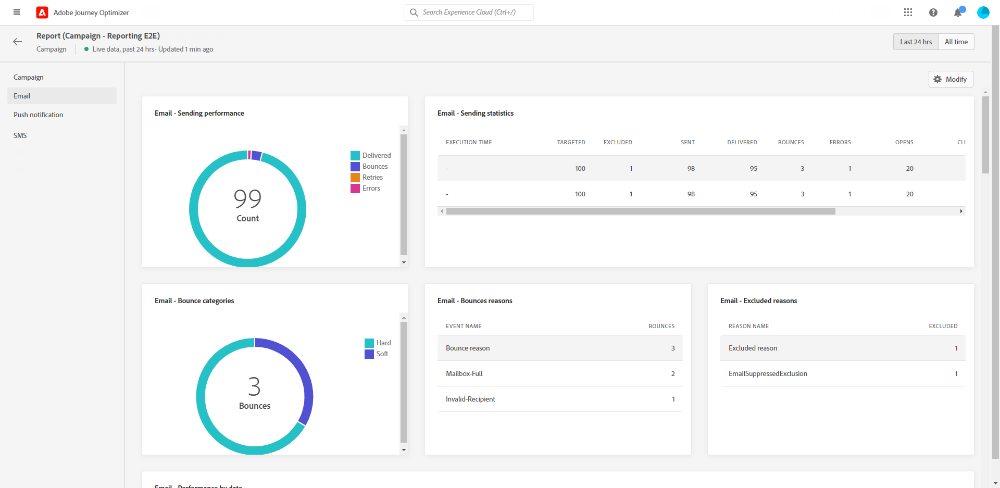
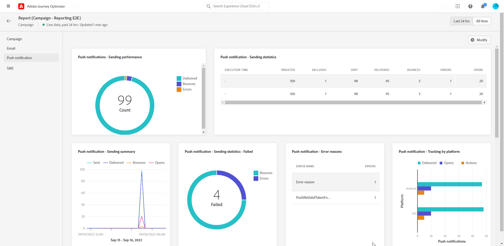
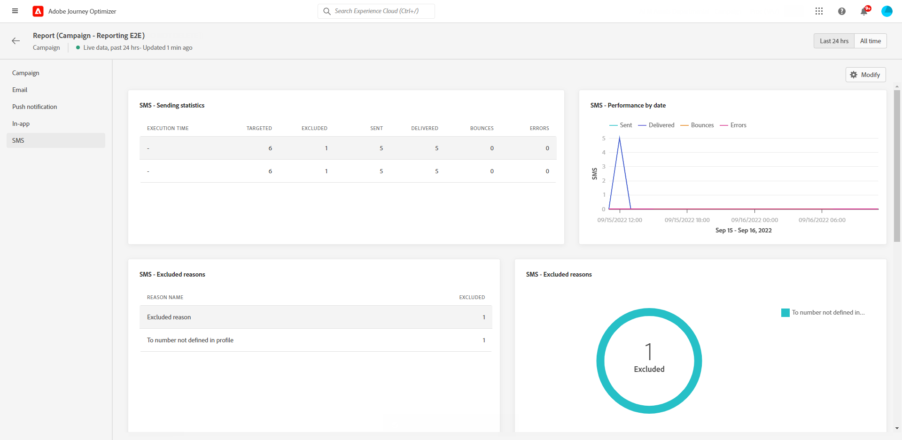

# Campaign live report {#campaign-live-report}

>[!CONTEXTUALHELP]
>id="ajo_campaign_live_report"
>title="Campaign live report"
>abstract="The Campaign live report allows you to measure and visualize in real-time the impact and performances of your campaigns only over the last 24 hours. Your report is divided into different widgets detailing your campaign's success and errors. Each reporting dashboard can be modified by resizing or removing widgets."

Campaign live report can be accessed directly from your campaign with the **[!UICONTROL Live view]** button. 

The Campaign **[!UICONTROL Live report]** page will be displayed with the following tabs:

* [Campaign](#campaign-live)
* [Email](#email-live)
* [Push](#push-live)
* [SMS](#sms-live)

The Campaign **[!UICONTROL Live report]** is divided into different widgets detailing your campaign's success and errors. Each widget can be resized and deleted if needed. For more information on this, refer to this [section](../reports/live-report.md#modify-dashboard).

For a detailed list of every metric available in Adobe Journey Optimizer, refer to [this page](live-report.md#list-of-components-live).

## Campaign tab {#campaign-global}

### Delivery {#delivery-global}

The **[!UICONTROL Campaign Statistics]** widget details the main information relative to your campaign:

* **[!UICONTROL Entered profiles]**: Number of profiles who started the journey.

<!--
### Experimentation tab (#experimentation-live)

From your Campaign **[!UICONTROL Live report]**, the **[!UICONTROL Experimentation]** tab details the main information relative to how each variant is performing and if there is was winner during the test.
-->

## Email tab {#email-live}

From your Campaign **[!UICONTROL Live report]**, the **[!UICONTROL Email]** tab details the main information relative to the email deliveries sent in your campaign.

+++Learn more on the different metrics and widgets available for the Email report.

The **[!UICONTROL Email Sending Statistics]** widget details the main information relative to your message:

* **[!UICONTROL Delivered]**: Number of messages successfully sent.

* **[!UICONTROL Bounces]**: Total of errors cumulated during delivery and automatic return processing.

* **[!UICONTROL Errors]**: Total number of errors that occurred during a delivery preventing it from being sent to profiles.

The **[!UICONTROL Sending metrics by Email]** table and **[!UICONTROL Email Summary]** graph details the success of your delivery:

* **[!UICONTROL Sent]**: Total number of sends for the delivery.

* **[!UICONTROL Delivered]**: Number of messages successfully sent.

* **[!UICONTROL Bounces]**: Total of errors cumulated during delivery and automatic return processing.

* **[!UICONTROL Errors]**: Total number of errors that occurred during a delivery preventing it from being sent to profiles.

* **[!UICONTROL Opens]**: Number of times a message was opened in a delivery.

* **[!UICONTROL Clicks]**: Number of times a content was clicked in a delivery.

* **[!UICONTROL Unsubscribe]**: Number of clicks on the unsubscription link.

* **[!UICONTROL Spam complaints]**: Number of times a message was declared as spam or junk.

The **[!UICONTROL Bounce Reasons]**, **[!UICONTROL Bounce categories]** and **[!UICONTROL Hard and bounce - by Email]** widgets contain the data available related to bounced messages, such as:

* **[!UICONTROL Hard bounce]**: The total number of permanent errors, such as a wrong email address. This involves an error message that explicitly states that the address is invalid, such as Unknown user.

* **[!UICONTROL Soft bounce]**: The total number of temporary errors, such as a a full inbox.

* **[!UICONTROL Ignored]**: The total number of temporary, such as Out of office, or a technical error, for example if the sender type is postmaster.

The **[!UICONTROL Error Reasons]** and **[!UICONTROL Exclude Reasons]** graphs and tables allow you to see which error and exclusions occurred during your delivery.

The **[!UICONTROL Email - Top recipient domain]** graph and table details which domains are the most used by recipients to open the email.
+++

## Push notification tab {#push-live}

From your Campaign **[!UICONTROL Live report]**, the **[!UICONTROL Push notification]** tab details the main information relative to the push deliveries sent in your campaign.

+++Learn more on the different metrics and widgets available for the Push report.

**[!UICONTROL Push notification sending performance]**, **[!UICONTROL Push notification summary]** and **[!UICONTROL Sending metrics - by Push]** widgets details the main information relative to your message:

* **[!UICONTROL Sent]**: Total number of sends for the delivery.

* **[!UICONTROL Delivered]**: Number of messages successfully sent.

* **[!UICONTROL Bounces]**: Total of errors cumulated during delivery and automatic return processing.

* **[!UICONTROL Errors]**: Total number of errors that occurred during a delivery preventing it from being sent to profiles.

* **[!UICONTROL Opens]**: Number of times a message was opened in a delivery.

* **[!UICONTROL Actions]**: Total number of actions on the push notification delivered, e.g. button click or dismissal.

* **[!UICONTROL Engagements]**: Total number of opens and actions for this push notification, i.e. if the profile opened the push or if a button was clicked on.

The **[!UICONTROL Error Reasons]** and **[!UICONTROL Exclude Reasons]** graphs and tables allow you to see which error and exclusions occurred during your delivery.

The **[!UICONTROL Sending statistics - Failed]** widget allows you to see how many errors and bounces occurred.

The **[!UICONTROL Tracking by platform]**, **[!UICONTROL Sending by platform]** and **[!UICONTROL Breakdown by platform]** graphs and tables details the success of your push notification depending on the operational system.
+++

## SMS tab {#sms-live}

From your Campaign **[!UICONTROL Live report]**, the **[!UICONTROL SMS]** tab details the main information relative to the SMS deliveries sent in your campaign.

+++Learn more on the different metrics and widgets available for the SMS report.

The **[!UICONTROL SMS - Sending statistics]** table details the success of your delivery:

* **[!UICONTROL Targeted]**: Number of user profiles who qualify as target profiles for this delivery.

* **[!UICONTROL Excluded]**: Number of user profiles, excluded from the targeted profiles, who did not receive the message.

* **[!UICONTROL Sent]**: Total number of sends for the delivery.

* **[!UICONTROL Delivered]**: Number of messages successfully sent.

* **[!UICONTROL Bounces]**: Total of errors cumulated during delivery and automatic return processing.

* **[!UICONTROL Errors]**: Total number of errors that occurred during a delivery preventing it from being sent to profiles.

The **[!UICONTROL SMS Performance by date]** widget details the main information relative to your message with a graph:

* **[!UICONTROL Sent]**: Total number of sends for the delivery.

* **[!UICONTROL Delivered]**: Number of messages successfully sent.

* **[!UICONTROL Bounces]**: Total of errors cumulated during delivery and automatic return processing.

* **[!UICONTROL Errors]**: Total number of errors that occurred during a delivery preventing it from being sent to profiles.

The **[!UICONTROL Exclude Reasons]**, **[!UICONTROL Bounces Reasons]** and **[!UICONTROL Error Reasons]** graphs and tables allow you to see which error and exclusions occurred during your delivery.
+++

## Additional resources

* [Get started with campaigns](../campaigns/get-started-with-campaigns.md)
* [Create a campaign](../campaigns/create-campaign.md)
* [Create API-triggered campaigns](../campaigns/api-triggered-campaigns.md)
* [Modify or stop a campaign](../campaigns/modify-stop-campaign.md)
* [Campaign global report](campaign-global-report.md)
