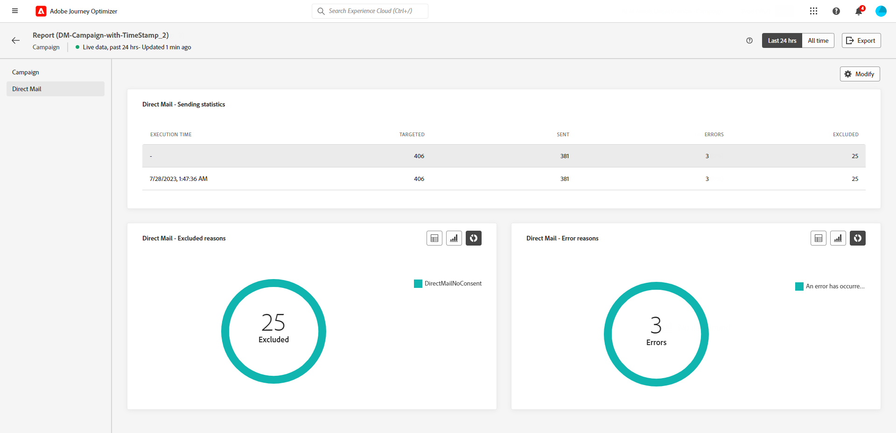

# Campaign live report {#campaign-live-report}

>[!CONTEXTUALHELP]
>id="ajo_campaign_live_report"
>title="Campaign live report"
>abstract="The Campaign live report allows you to measure and visualize in real-time the impact and performances of your campaigns only over the last 24 hours. Your report is divided into different widgets detailing your campaign's success and errors. Each reporting dashboard can be modified by resizing or removing widgets."

Live reports, accessible from the Last 24 hrs tab, display events that took place within the past 24 hours, with a minimum time interval of two minutes from the event occurrence. In comparison, Global reports focus on events that occurred at least two hours ago and cover events over a selected time period. 

Campaign live report can be accessed directly from your campaign with the **[!UICONTROL Live view]** button. 

The Campaign **[!UICONTROL Live report]** page will be displayed with the following tabs:

* [Campaign](#campaign-live)
* [Email](#email-live)
* [In-app](#inapp-live)
* [Push](#push-live)
* [SMS](#sms-live)
* [Web](#web-tab)
* [Direct mail](#direct-mail-tab)

The Campaign **[!UICONTROL Live report]** is divided into different widgets detailing your campaign's success and errors. Each widget can be resized and deleted if needed. For more information on this, refer to this [section](../reports/live-report.md#modify-dashboard).

For a detailed list of every metric available in Adobe Journey Optimizer, refer to [this page](live-report.md#list-of-components-live).

## Campaign tab {#campaign-live}

### Delivery {#delivery-live}

The **[!UICONTROL Campaign Statistics]** widget details the main information relative to your campaign:

* **[!UICONTROL Entered profiles]**: Number of profiles who started the journey.

<!--
### Experimentation tab (#experimentation-live)

From your Campaign **[!UICONTROL Live report]**, the **[!UICONTROL Experimentation]** tab details the main information relative to how each variant is performing and if there is was winner during the test.
-->

## Email tab {#email-live}

>[!CONTEXTUALHELP]
>id="ajo_campaign_live_email_sending_statistics"
>title="Email - Sending statistics"
>abstract="The Email - Sending statistics graph summarizes essential data about your email such as Targeted or Delivered from the last 24 hours."

>[!CONTEXTUALHELP]
>id="ajo_campaign_live_email_statistics"
>title="Email - Statistics"
>abstract="The Email - Statistics table provides data on profile activity for your email from the last 24 hours."

>[!CONTEXTUALHELP]
>id="ajo_campaign_live_email_bounce_categories"
>title="Email - Bounce categories"
>abstract="The Email - Bounce categories graphs and table provide data on both temporary and permanent errors from the last 24 hours."

>[!CONTEXTUALHELP]
>id="ajo_campaign_live_email_performance_bydate"
>title="Email - Performance by date"
>abstract="The Email - Performance by date graph presents comprehensive data from the last 24 hours regarding sent emails, offering insights into key metrics like deliveries and bounces, allowing for a detailed analysis of the email delivery process."

>[!CONTEXTUALHELP]
>id="ajo_campaign_live_email_bounce_reasons"
>title="Email - Bounces reasons"
>abstract="The Email - Bounces reasons graphs and table contain the data available related to bounced messages from the last 24 hours."

>[!CONTEXTUALHELP]
>id="ajo_campaign_live_email_error_reasons"
>title="Email - Error reasons"
>abstract="The Email - Error reasons graphs and table enable you to identify the specific errors that occurred during the sending process in the last 24 hours."

>[!CONTEXTUALHELP]
>id="ajo_campaign_live_email_excluded_reasons"
>title="Email - Excluded reasons"
>abstract="The Excluded Reasons graphs and table illustrate the various factors that led to user profiles, excluded from the targeted audience, not receiving the message in the last 24 hours."

>[!CONTEXTUALHELP]
>id="ajo_campaign_live_email_best_recipient"
>title="Email - Best recipient domain"
>abstract="The Email - Best recipient domain graph and table provide a detailed breakdown of the domains that recipients most frequently use to open the email, offering valuable insights into recipient behavior from the last 24 hours."

From your Campaign **[!UICONTROL Live report]**, the **[!UICONTROL Email]** tab details the main information relative to the email sent in your campaign.

+++Learn more on the different metrics and widgets available for the Email report.

The **[!UICONTROL Email Sending Statistics]** widget details the main information relative to your message:

* **[!UICONTROL Delivered]**: Number of messages successfully sent.

* **[!UICONTROL Bounces]**: Total of errors cumulated during the sending process and automatic return processing.

* **[!UICONTROL Errors]**: Total number of errors that occurredduring the sending process preventing it from being sent to profiles.

The **[!UICONTROL Sending metrics by Email]** table and **[!UICONTROL Email Summary]** graph details the success of your email:

* **[!UICONTROL Sent]**: Total number of sends.

* **[!UICONTROL Delivered]**: Number of messages successfully sent.

* **[!UICONTROL Bounces]**: Total of errors cumulatedduring the sending process and automatic return processing.

* **[!UICONTROL Errors]**: Total number of errors that occurredduring the sending process preventing it from being sent to profiles.

* **[!UICONTROL Opens]**: Number of times a message was opened.

* **[!UICONTROL Clicks]**: Number of times a content was clicked on.

* **[!UICONTROL Unsubscribe]**: Number of clicks on the unsubscription link.

* **[!UICONTROL Spam complaints]**: Number of times a message was declared as spam or junk.

The **[!UICONTROL Bounce Reasons]** and **[!UICONTROL Bounce categories]** widgets contain the data available related to bounced messages, such as:

* **[!UICONTROL Hard bounce]**: The total number of permanent errors, such as a wrong email address. This involves an error message that explicitly states that the address is invalid, such as Unknown user.

* **[!UICONTROL Soft bounce]**: The total number of temporary errors, such as a a full inbox.

* **[!UICONTROL Ignored]**: The total number of temporary, such as Out of office, or a technical error, for example if the sender type is postmaster.

The **[!UICONTROL Error Reasons]** and **[!UICONTROL Exclude Reasons]** graphs and tables allow you to see which error and exclusions occurredduring the sending process.

The **[!UICONTROL Email - Best recipient domain]** graph and table details which domains are the most used by recipients to open the email.
+++

## In-app tab {#inapp-live}

>[!CONTEXTUALHELP]
>id="ajo_campaign_live_inapp_performance"
>title="In-app performance"
>abstract="The In-app performance KPIs provide essential insights into your visitors' engagement with In-app messages in the last 24 hours."

>[!CONTEXTUALHELP]
>id="ajo_campaign_live_inapp_interactions"
>title="Interactions by type"
>abstract="The Interactions by type graphs and table details how users interacted with your in-app message by tracking any click, dismiss, or interaction from the last 24 hours."

>[!CONTEXTUALHELP]
>id="ajo_campaign_live_inapp_summary"
>title="In-app summary"
>abstract="The In-app summary graph illustrates the progression of your In-app impressions and interactions over the last 24 hours."

From your Campaign **[!UICONTROL Live report]**, the **[!UICONTROL In-app]** tab details the main information relative to the In-app messages sent in your campaign.

+++Learn more on the different metrics and widgets available for the In-app report.

The **[!UICONTROL In-app performance]** KPIs detail the main information relative to your visitors' engagement with your In-app messages, such as:

* **[!UICONTROL Impressions]**: total number of In-app messages sent to all users.

* **[!UICONTROL Interactions]**:  total number of engagements with your In-app message. This includes any actions taken by the users, such as clicks, dismissals, or any other interactions.

The **[!UICONTROL In-app summary]** graph shows the evolution of your In-app impressions and interactions for the concerned period.

The **[!UICONTROL Interactions by type]** graphs and table details how users interacted with your in-app message by tracking any click, dismiss, or interaction.

+++

## Push notification tab {#push-live}

>[!CONTEXTUALHELP]
>id="ajo_campaign_live_push_sending_performance"
>title="Push notification - Sending performance"
>abstract="The Push Notification Sending Performance graph summarizes essential data about your push notification such as Errors or Delivered messages from the last 24 hours."

>[!CONTEXTUALHELP]
>id="ajo_campaign_live_push_statistics"
>title="Push notification - Statistics"
>abstract="The Push Statistics table provides data on recipient activity for your push notification from the last 24 hours."

>[!CONTEXTUALHELP]
>id="ajo_campaign_live_push_sending_summary"
>title="Push notification - Sending summary"
>abstract="The Push Notification Sending Summary graph displays the data available for sent push notifications from the last 24 hours."

>[!CONTEXTUALHELP]
>id="ajo_campaign_live_push_excluded_reasons"
>title="Push notification - Excluded reasons"
>abstract="The Excluded Reasons graphs and table illustrate the various factors that led to user profiles, excluded from the targeted audience, not receiving the message in the last 24 hours."

>[!CONTEXTUALHELP]
>id="ajo_campaign_live_push_error_reasons"
>title="Push notification - Error reasons"
>abstract="The Error Reasons graphs and table enable you to identify the specific errors that occurred the last 24 hours during the sending process."

>[!CONTEXTUALHELP]
>id="ajo_campaign_live_push_breakdown_platform"
>title="Push notification - Breakdown by platform"
>abstract="The Breakdown by Platform graphs and table provide a breakdown of the success of your push notifications in the last 24 hours based on the recipient's operating system."

From your Campaign **[!UICONTROL Live report]**, the **[!UICONTROL Push notification]** tab details the main information relative to the push notification sent in your campaign.

+++Learn more on the different metrics and widgets available for the Push report.

**[!UICONTROL Push notification sending performance]**, **[!UICONTROL Push notification summary]** and **[!UICONTROL Push notification - Statistics]** widgets details the main information relative to your message:

* **[!UICONTROL Sent]**: Total number of sends.

* **[!UICONTROL Delivered]**: Number of messages successfully sent.

* **[!UICONTROL Bounces]**: Total of errors cumulated during the sending process  and automatic return processing.

* **[!UICONTROL Errors]**: Total number of errors that occurred during the sending process preventing it from being sent to profiles.

* **[!UICONTROL Opens]**: Number of times a message was opened.

* **[!UICONTROL Actions]**: Total number of actions on the push notification delivered, e.g. button click or dismissal.

* **[!UICONTROL Engagements]**: Total number of opens and actions for this push notification, i.e. if the profile opened the push or if a button was clicked on.

The **[!UICONTROL Error Reasons]** and **[!UICONTROL Exclude Reasons]** graphs and tables allow you to see which error and exclusions occurred during the sending process .

The **[!UICONTROL Sending statistics - Failed]** widget allows you to see how many errors and bounces occurred.

The **[!UICONTROL Tracking by platform]**, **[!UICONTROL Sending by platform]** and **[!UICONTROL Breakdown by platform]** graphs and tables details the success of your push notification depending on the operational system.
+++

## SMS tab {#sms-live}

>[!CONTEXTUALHELP]
>id="ajo_campaign_live_sms_statistics"
>title="SMS - Statistics"
>abstract="The SMS Sending Statistics table summarizes essential data about your SMS messages such as Targeted or Delivered messages from the last 24 hours."

>[!CONTEXTUALHELP]
>id="ajo_campaign_live_sms_performance"
>title="SMS - Performance by date"
>abstract="The SMS Performance by Date widget provides key information from the last 24 hours about your messages through a graphical representation."

>[!CONTEXTUALHELP]
>id="ajo_campaign_live_sms_error_reasons"
>title="SMS - Error reasons"
>abstract="The SMS - Error Reasons graphs and table enable you to identify the specific errors that occurred in the last 24 hours during the sending process."

>[!CONTEXTUALHELP]
>id="ajo_campaign_live_sms_excluded_reasons"
>title="SMS - Excluded reasons"
>abstract="The Excluded Reasons graphs and table illustrate the various factors that led to user profiles, excluded from the targeted audience, not receiving the message in the last 24 hours."

>[!CONTEXTUALHELP]
>id="ajo_campaign_live_sms_bounces_reasons"
>title="SMS - Bounces reasons"
>abstract="The Bounces Reasons graphs and table contain the data available from the last 24 hours related to bounced messages."

From your Campaign **[!UICONTROL Live report]**, the **[!UICONTROL SMS]** tab details the main information relative to the SMS message sent in your campaign.

+++Learn more on the different metrics and widgets available for the SMS report.

The **[!UICONTROL SMS - Statistics]** table details the success of your SMS message:

* **[!UICONTROL Targeted]**: Number of user profiles who qualify as target profiles.

* **[!UICONTROL Excluded]**: Number of user profiles, excluded from the targeted profiles, who did not receive the message.

* **[!UICONTROL Sent]**: Total number of sends.

* **[!UICONTROL Bounces]**: Total of errors cumulated during the sending process and automatic return processing.

* **[!UICONTROL Errors]**: Total number of errors that occurredduring the sending process preventing it from being sent to profiles.

* **[!UICONTROL Clicks]**: Total number of URL visits.

The **[!UICONTROL SMS Performance by date]** widget details the main information relative to your message with a graph:

* **[!UICONTROL Sent]**: Total number of sends.

* **[!UICONTROL Bounces]**: Total of errors cumulated during the sending process and automatic return processing.

* **[!UICONTROL Errors]**: Total number of errors that occurred during the sending process preventing it from being sent to profiles.

The **[!UICONTROL Exclude Reasons]**, **[!UICONTROL Bounces Reasons]** and **[!UICONTROL Error Reasons]** graphs and tables allow you to see which error and exclusions occurred during the sending process.
+++

## Web tab {#web-tab}

>[!CONTEXTUALHELP]
>id="ajo_campaign_live_web_performance"
>title="Web performance"
>abstract="The Web Performance KPIs provide comprehensive information about your visitors' engagement with your web experiences from the last 24 hours."

>[!CONTEXTUALHELP]
>id="ajo_campaign_live_web_summary"
>title="Web summary"
>abstract="The Web Summary graph illustrates the progression of your web experiences, including impressions, unique impressions, and interactions, from the last 24 hours."

>[!CONTEXTUALHELP]
>id="ajo_campaign_live_web_interactions"
>title="Interactions by element"
>abstract="The Interactions by Element table provides key information regarding your visitors' engagement with different elements on your web pages in the last 24 hours."

From your Campaign **[!UICONTROL Live report]**, the **[!UICONTROL Web]** tab details the main information relative to your Web pages.

+++Learn more on the different metrics and widgets available for the Web report.

The **[!UICONTROL Web performance]** KPIs detail the main information relative to your visitors' engagement with your web experiences, such as:

* **[!UICONTROL Impressions]**: total number of web experiences delivered to all users.

* **[!UICONTROL Interactions]**:  total number of engagements with your Web page. This includes any actions taken by the users, such as clicks or any other interactions.

The **[!UICONTROL Web summary]** graph shows the evolution of your web experiences (impressions, unique impressions and interactions) for the last 24 hours.

The **[!UICONTROL Interactions by element]** table details the main information relative to your visitors' engagement with the various elements on your web pages.
+++

## Direct mail tab {#direct-mail-tab}

>[!CONTEXTUALHELP]
>id="ajo_campaign_live_direct_sending_statistics"
>title="Direct Mail - Sending statistics"
>abstract="The Direct Mail Sending Statistics table summarizes essential data from the last 24 hours about your Direct Mail messages such as Targeted or Delivered messages."

>[!CONTEXTUALHELP]
>id="ajo_campaign_live_direct_error_reasons"
>title="Direct Mail - Error reasons"
>abstract="The Direct Mail - Error Reasons graphs and table enable you to identify the specific errors that occurred in the last 24 hours."

>[!CONTEXTUALHELP]
>id="ajo_campaign_live_direct_excluded_reasons"
>title="Direct Mail - Excluded reasons"
>abstract="The Direct Mail Excluded Reasons graphs and table illustrate the various factors that led to user profiles, excluded from the targeted audience, not receiving the message in the last 24 hours."

From your Campaign **[!UICONTROL Live report]**, the **[!UICONTROL Direct mail]** tab details the main information relative to your Direct mail.

+++Learn more on the different metrics and widgets available for the Direct mail report.

The **[!UICONTROL Direct Mail - Sending statistics]** table details the success of your Direct mail:

* **[!UICONTROL Targeted]**: Number of user profiles who qualify as target profiles.

* **[!UICONTROL Sent]**: Total number of sends.

* **[!UICONTROL Errors]**: Total number of errors that occurred during the sending process preventing it from being sent to profiles.

* **[!UICONTROL Excluded]**: Number of user profiles, excluded from the targeted profiles, who did not receive your Direct mail.

The **[!UICONTROL Direct Mail - Excluded reasons]** and **[!UICONTROL Direct Mail - Error reasons]** graphs and tables allow you to see which error and exclusions occurredduring the sending process.
+++

## Additional resources

* [Get started with campaigns](../campaigns/get-started-with-campaigns.md)
* [Create a campaign](../campaigns/create-campaign.md)
* [Create API-triggered campaigns](../campaigns/api-triggered-campaigns.md)
* [Modify or stop a campaign](../campaigns/modify-stop-campaign.md)
* [Campaign global report](campaign-global-report.md)
